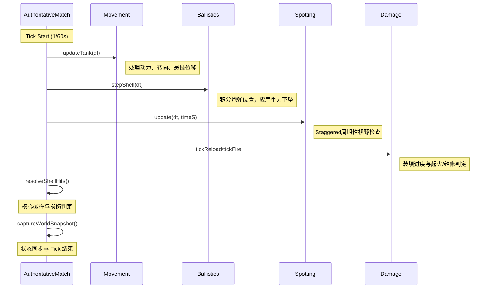
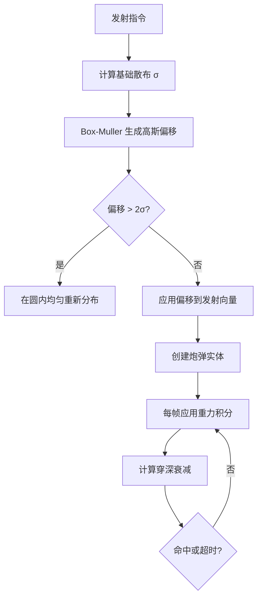
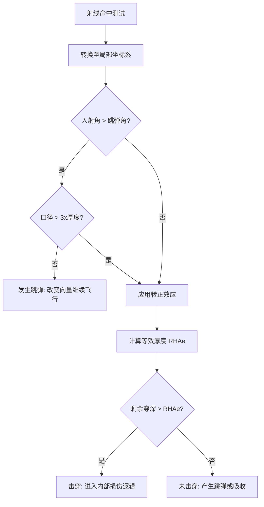
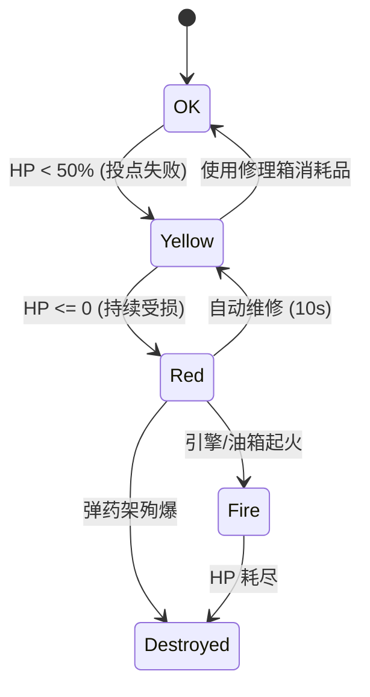
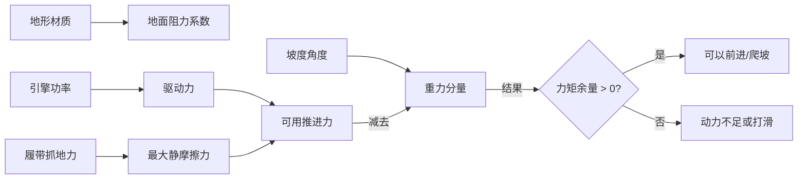

# 仿真引擎深度解析

## 目录
1. [引言](#引言)
2. [模块概览](#模块概览)
3. [确定性仿真架构](#确定性仿真架构)
4. [弹道学与飞行物理](#弹道学与飞行物理)
5. [装甲建模与穿深计算](#装甲建模与穿深计算)
6. [损伤系统与模块化破坏](#损伤系统与模块化破坏)
7. [视野与隐蔽机制](#视野与隐蔽机制)
8. [地形移动与物理约束](#地形移动与物理约束)
9. [核心组件](#核心组件)
10. [文件参考](#文件参考)

## 引言

仿真引擎是 *Claude of Tanks* 的技术核心，负责处理坦克战斗中所有复杂的物理交互和逻辑判定。为了确保多人对战的公平性和录像回放的一致性，该引擎被设计为一个 **60Hz 确定性仿真系统**。它不依赖于任何特定的渲染后端，而是通过纯逻辑的数学模型来驱动游戏世界。

该引擎的设计哲学是将现实世界的物理规律与游戏性的随机因素有机结合。它不仅模拟了宏观的坦克移动和炮弹飞行，还深入到了微观的装甲等效计算、内部模块损坏逻辑以及复杂的视野隐蔽模型。在 *Claude of Tanks* 中，每一次击穿、每一次跳弹、甚至每一次被发现，背后都有严密的数学公式支撑，这为硬核玩家提供了极深的研究空间。

## 模块概览

根据对 `src/sim` 目录的系统性探索，该模块是整个项目的逻辑中枢。它包含了一系列相互协作的子系统，每个子系统都专注于特定的物理或逻辑领域。

*   **文件规模**：该目录下包含约 15 个核心逻辑文件（`.ts`）以及配套的自测文件（`.selftest.mjs`）。总代码行数超过 5000 行，涵盖了从基础数学到复杂业务逻辑的各个层次。
*   **子模块结构**：
    *   **运动与动力学** (`movement.ts`, `terrainMobility.ts`, `tankBodyContacts.ts`)：处理坦克的履带物理、悬挂弹簧、地形阻力以及坦克间的碰撞挤压。
    *   **弹道与火控** (`ballistics.ts`, `ammunition.ts`)：模拟炮弹的 3D 飞行轨迹、重力补偿、炮管散布以及弹药库管理。
    *   **装甲与损伤解析** (`armor.ts`, `damage.ts`, `moduleCatalog.ts`)：这是仿真引擎最复杂的部分，负责多级坐标系下的射线追踪、装甲物理特性计算以及内部精密模块的损坏判定。
    *   **感知系统** (`spotting.ts`)：基于射线检测和伪随机 cadance 的视野发现机制，包含了复杂的隐蔽公式和“第六感”逻辑。
    *   **对战调度** (`authoritativeMatch.ts`, `matchModes.ts`)：作为权威仿真环境的入口，协调上述所有子系统的运行。

## 确定性仿真架构

仿真引擎运行在固定的 60Hz 步长（`SIM_DT = 1/60`）下。确定性（Determinism）是其设计的首要目标：这意味着只要初始状态和输入序列相同，无论在什么设备上运行，仿真结果都必须完全一致。

### 权威匹配 (Authoritative Match)
`authoritativeMatch.ts` 是仿真的核心入口。它采用了“无头”（Headless）设计，不引用任何 Three.js 的场景对象或 DOM 状态。这种设计使得相同的仿真代码既可以在玩家的浏览器中运行（用于预测和流畅体验），也可以在 Node.js 服务器上作为权威仲裁器运行。

### 随机性管理
为了实现确定性，所有的随机因素（如穿深波动、散布偏移）都通过注入的 `rng`（伪随机数生成器）函数处理。在录像回放时，只要种子一致，所有的随机结果都会复现。

以下图表展示了单帧仿真的执行流和各系统间的协作关系：



在每一帧的末尾，`resolveShellHits` 会检测炮弹在当前步长内划过的线段是否与坦克装甲模型相交。如果发生碰撞，则会触发复杂的损伤解析流程。

**Diagram sources**: 
- [authoritativeMatch.ts:L300-L500](src/sim/authoritativeMatch.ts)
- [movement.ts:L400-L600](src/sim/movement.ts)

## 弹道学与飞行物理

弹道系统 (`ballistics.ts`) 模拟了炮弹从离开炮口到命中目标的全物理过程。

### 物理模型与重力
炮弹在飞行过程中受重力影响产生弧形轨迹。系统使用显式欧拉积分更新位置：
*   **重力加速度**：默认使用 $9.81 m/s^2$。对于导弹类武器，可以通过 `gravityScale` 设置为 0 实现平直飞行。
*   **初速与阻力**：炮弹拥有初始速度 `velocityMps`。虽然系统没有直接模拟空气阻力对速度的减损，但通过**穿深随距离衰减**（Penetration Falloff）模型完美模拟了动能损失的效果。

### 穿深衰减模型
穿深根据飞行距离进行分段线性插值。系统支持定义 100m、1000m 甚至 2000m 的穿深锚点，这允许现代 APFSDS 弹药拥有与二战弹药完全不同的能量保持特性。

### 炮口散布 (Dispersion)
为了模拟火控系统的精度，炮弹在发射时会产生微小的角度偏移。系统采用了 Box-Muller 变换生成二维高斯分布。特别的是，它实现了一个“WoT 风格”的重roll规则：如果随机点落在 2 倍标准差（2σ）之外，则在圆内均匀重置，这既保证了炮弹大多倾向于中心，又避免了极端的“离谱”飞弹。



对于制导武器（如 ATGM），系统还提供了 `guideShellToward` 函数，允许炮弹在飞行过程中以限定的转向率（`turnRateRadS`）向瞄准点修正航向。

**Section sources**:
- [ballistics.ts](src/sim/ballistics.ts)

## 装甲建模与穿深计算

这是仿真引擎中最精密的数学模块。它将坦克的复杂几何体抽象为多层坐标系下的碰撞模型。

### 多级坐标系 (Coordinate Frames)
为了处理移动中的坦克及其旋转的炮塔和俯仰的火炮，系统维护了四个层级的矩阵变换：
1.  **底盘坐标系 (Hull Local)**：以地面接触中心为原点。
2.  **炮塔坐标系 (Turret Local)**：相对于底盘旋转。
3.  **火炮坐标系 (Gun-follow)**：随火炮俯仰旋转。
4.  **炮管坐标系 (Barrel)**：专门用于炮管这一细长几何体的特殊判定。

### 装甲等效厚度 (RHAe) 计算
当炮弹击中一个装甲面时，系统会根据入射角和弹药特性计算等效厚度。公式如下：

$$EffMm = \frac{BaseMm}{\cos(ImpactAngle - Norm)^{SlopeExp}}$$

*   **转正效应 (Normalization)**：炮弹命中时会向法线方向偏转一定角度（`normDeg`）。AP 弹通常有 5°，而 HEAT 为 0°。
*   **斜率指数 (SlopeExp)**：用于模拟不同弹药对倾斜装甲的敏感度。二战钢芯弹为 1.4（极大地奖励了倾斜装甲），而现代长杆弹（APFSDS）为 1.0（几乎只看物理路径长度）。

### 碾压与跳弹规则
*   **跳弹 (Ricochet)**：如果入射角超过阈值（如 AP 弹 70°，HEAT 85°），则判定为跳弹。
*   **三倍口径碾压**：如果炮弹口径 > 3倍装甲物理厚度，则无视跳弹判定，强制进入穿深检查。
*   **两倍口径碾压**：如果口径 > 2倍厚度，转正角度会获得显著加成，公式为 $Norm \times 1.4 \times (Caliber / Thickness)$。



**Section sources**:
- [armor.ts](src/sim/armor.ts)
- [damage.ts](src/sim/damage.ts)

## 损伤系统与模块化破坏

一旦炮弹击穿主装甲，系统会启动“内部扫描”程序。炮弹会沿着路径继续行进一段距离（通常为口径的 10 倍），并检测与内部模块的碰撞。

### 模块化解剖 (Internal Anatomy)
坦克内部不再是一个单一的 HP 池，而是由多个具有特定功能的模块组成：
*   **核心模块**：引擎（动力）、弹药架（致命）、油箱（起火）、电台（信号）、观测设备（视野）。
*   **乘员系统**：车长、炮手、驾驶员、装填手。

### 损伤判定流程
每个模块被击中时，都会进行一次“救赎投点”（Saving Throw）。例如，弹药架被击中时有 45% 的概率不受伤。如果投点失败，模块会根据炮弹的 `moduleDmg` 扣除 HP。

模块状态分为三个等级：
1.  **OK (绿色)**：功能正常。
2.  **Yellow (受损)**：功能减半。例如装填手受伤或弹药架受损会导致装填速度变慢 50%。
3.  **Red (摧毁)**：功能丧失。引擎红字会导致坦克瘫痪，弹药架红字则会直接引发**殉爆**，瞬间摧毁坦克。

### 火灾与维修
*   **起火逻辑**：引擎或油箱受损可能引发火灾。火灾每 0.5 秒造成一次伤害，并持续损耗内部模块的 HP。
*   **自动维修**：红字模块在经过固定时间（如 10 秒）后会自动修复到“黄字”状态，恢复部分功能。



**Section sources**:
- [damage.ts](src/sim/damage.ts)
- [moduleCatalog.ts](src/sim/moduleCatalog.ts)

## 视野与隐蔽机制

视野系统 (`spotting.ts`) 模拟了战场上的信息迷雾。它决定了一个坦克是否能被敌方看见并瞄准。

### 发现距离公式
系统采用经典的视野方程来计算两个坦克间的发现距离：
$$SpotRange = ViewRange - (ViewRange - 50) \times Camo$$

其中 `Camo` 是目标的总隐蔽值，范围在 [0, 1] 之间。这意味着隐蔽值越高，被发现的距离就越近。

### 隐蔽值的构成
*   **基础隐蔽**：由坦克型号决定（轻型坦克移动不掉隐蔽，重型坦克隐蔽极差）。
*   **植被遮挡**：坦克与观测者之间的草丛提供额外的隐蔽加成（最高 0.5）。
*   **开火惩罚与 15 米规则**：坦克开火时，其自身隐蔽会瞬间大幅下降。同时，坦克周围 15 米内的草丛会暂时变得“透明”，这模拟了炮口火光照亮周围环境的效果。

### 检查频率与 staggered 执行
为了节省 CPU，视野检查并不是每帧运行，而是根据坦克间的距离采用不同的频率：
*   **近距离 (<120m)**：每 0.5 秒检查一次。
*   **中距离 (<280m)**：每 1.0 秒检查一次。
*   **远距离**：每 2.0 秒检查一次。
这种交错执行（staggered）的方式保证了在大量坦克同时对战时，性能依然平稳。

### 第六感 (Sixth Sense)
当玩家被敌方发现时，系统并不会立即在 HUD 上显示。而是有一个固定的 **3 秒延迟**。这模拟了车长意识到被威胁的反应时间，也为潜入作战提供了战术空间。

**Section sources**:
- [spotting.ts](src/sim/spotting.ts)

## 地形移动与物理约束

地形移动系统决定了坦克在复杂地貌上的通过能力。它不仅是一个速度限制器，更是一个基于物理的动力学模型。

### 地形阻力与加速
不同类型的地面（硬地、中等地面、软地）拥有不同的阻力系数。
$$Accel = \frac{Power}{Mass \times Resistance}$$
在泥泞的软地上，坦克的加速感会明显变得迟钝。

### 爬坡物理
系统会实时计算坦克的“力矩余量”（Force Margin）。爬坡能力受两个因素限制：
1.  **引擎动力**：引擎是否有足够的扭矩克服重力分量。
2.  **履带抓地力**：履带与地面间的摩擦力是否足以支撑坦克不下滑。
在陡峭的斜坡上，即使引擎动力充足，如果抓地力不足，坦克也会发生打滑或无法前进。

### AI 路径权重
AI 路径规划器 (`botRoutePlanner.ts`) 会调用移动系统的 `terrainTravelCostFactor` 来计算路径权重。这确保了 AI 会倾向于走平坦、坚硬的道路，而避开那些可能导致翻车或动力不足的险峻地形。



**Section sources**:
- [terrainMobility.ts](src/sim/terrainMobility.ts)
- [movement.ts](src/sim/movement.ts)

## 核心组件

### 1. 穿深判定入口 (`resolveShellHit`)
这是仿真引擎中最繁忙的函数，它完整体现了从碰撞到损伤的逻辑链条。

```typescript
export function resolveShellHit(
  shell: DamageShell,
  target: DamageTarget,
  hits: ArmorHit[],
  rng: Rng,
): HitEvent {
  // 确保炮弹拥有本次判定的随机波动值
  ensurePenRoll(shell, rng);
  
  let pen = shell.remainingPenMm;
  let hullPen = false;

  for (const hit of hits) {
    // 1. 跳弹检查
    if (!hullPen && wouldRicochet(shell.spec, hit.impactAngleDeg, hit.plate)) {
      deflectShell(shell, hit); // 炮弹反弹并改变轨迹
      return createRicochetEvent(shell, hit);
    }

    // 2. 计算有效厚度 (考虑转正和斜率指数)
    const { effMm } = effectiveThickness(shell.spec, hit.plate, hit.impactAngleDeg);

    // 3. 穿深扣除
    if (pen >= effMm) {
      if (!hullPen && hit.plate.kind === 'main') {
        hullPen = true;
        // 击穿主装甲，扣除坦克 HP
        applyHullDamage(target, shell.dmgRoll);
      }
      pen -= effMm; 
    } else {
      // 穿深耗尽，未击穿
      shell.dead = true;
      break;
    }
  }
  // ... 后续处理内部模块扫描与损坏判定
}
```

### 2. 视野发现逻辑 (`canSpot`)
展示了如何综合各种复杂的环境因素来判断目标的可见性。

```typescript
function canSpot(spotter: SpottingTank, target: SpottingTank, timeS: number): boolean {
  const dist = getDistance(spotter, target);
  
  // 50米强制发现规则 (Proximity Spotting)
  if (dist <= 50) return true; 
  
  // 超过 445 米最大发现距离则绝对不可见
  if (dist > 445) return false;

  const camo = calculateTotalCamo(target, timeS);
  const vr = effectiveViewRangeM(spotter);
  
  // 应用核心视野公式
  const maxSpotDist = vr - (vr - 50) * camo;
  
  if (dist > maxSpotDist) {
    // 检查是否因为开火产生的炮口火光被发现 (Muzzle Flash Reveal)
    if (!checkMuzzleFlashReveal(target, spotter, dist)) return false;
  }
  
  // 最后进行物理射线检测，确认没有地形或掩体阻挡
  return hardLos(spotter, target);
}
```

## 文件参考

以下是本章节涉及的核心源文件，建议在深入研究时参考：

*   [src/sim/authoritativeMatch.ts](src/sim/authoritativeMatch.ts)：仿真引擎的权威入口与多系统调度。
*   [src/sim/ballistics.ts](src/sim/ballistics.ts)：炮弹积分物理、散布模型与穿深衰减。
*   [src/sim/armor.ts](src/sim/armor.ts)：多级坐标系转换与装甲几何碰撞检测。
*   [src/sim/damage.ts](src/sim/damage.ts)：穿深判定算法、模块损坏逻辑与火灾模拟。
*   [src/sim/spotting.ts](src/sim/spotting.ts)：隐蔽公式、动态视野与 staggered 检查系统。
*   [src/sim/terrainMobility.ts](src/sim/terrainMobility.ts)：基于物理的地形阻力与爬坡能力计算。
*   [src/sim/movement.ts](src/sim/movement.ts)：坦克动力学、转向模型与悬挂系统实现。
*   [src/sim/ammunition.ts](src/sim/ammunition.ts)：弹药库存状态管理。
*   [src/sim/moduleCatalog.ts](src/sim/moduleCatalog.ts)：全坦克内部模块定义与属性表。
*   [src/sim/botRoutePlanner.ts](src/sim/botRoutePlanner.ts)：基于地形通过性的 AI 路径规划逻辑。
