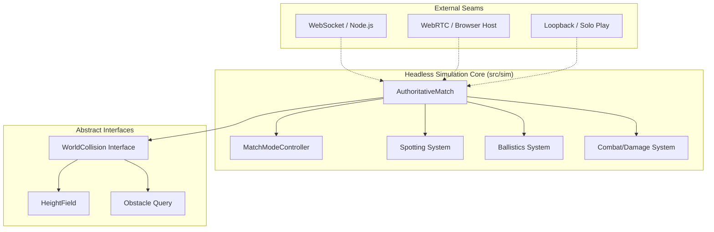
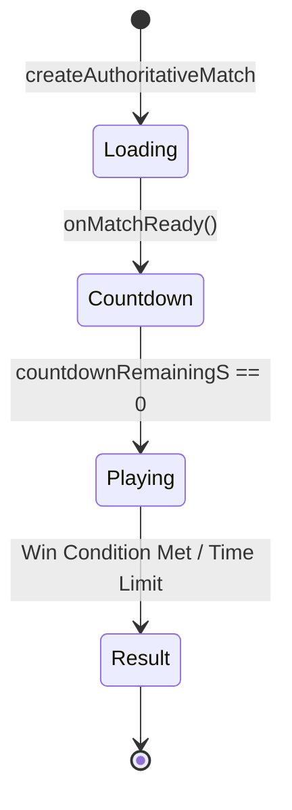
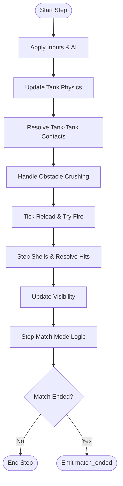
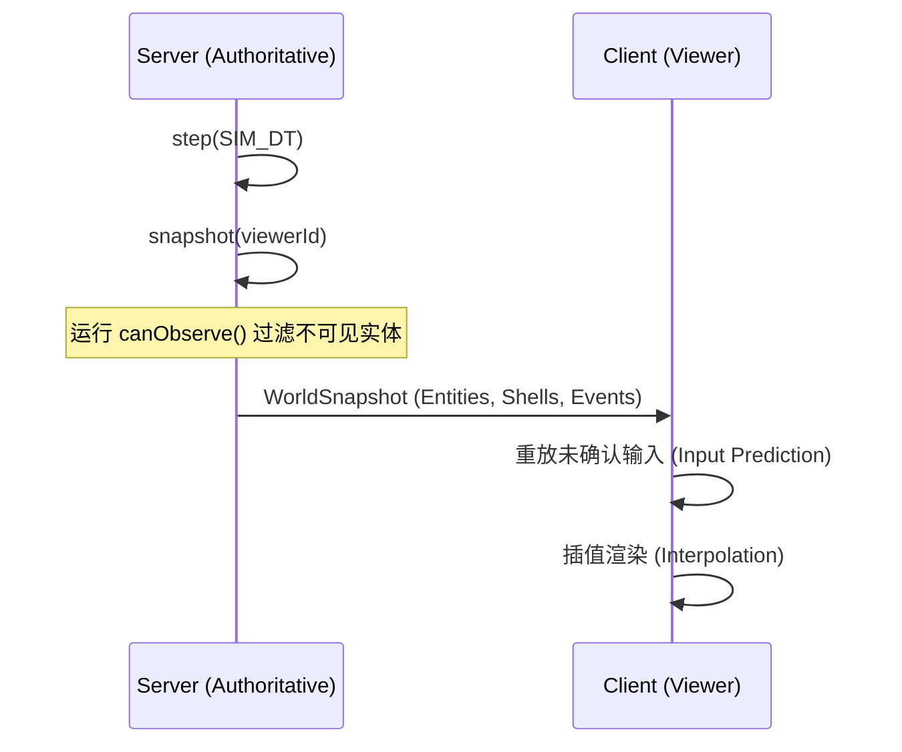
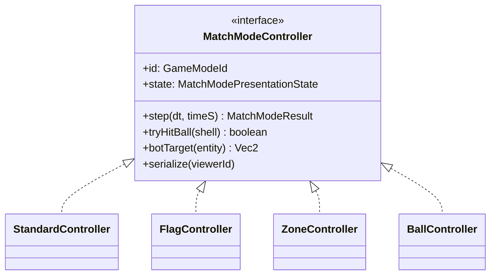
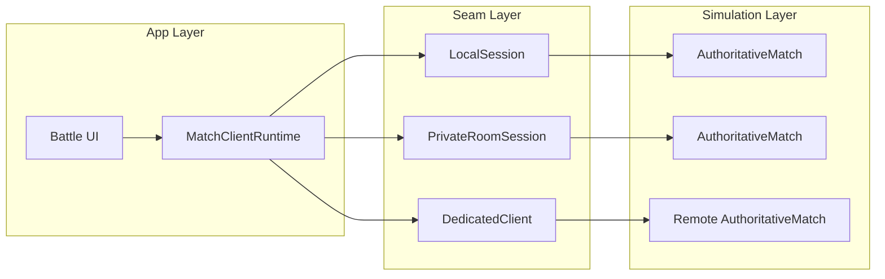

# 仿真编排与比赛逻辑

## 目录
1. [模块概览](#模块概览)
2. [Headless 仿真架构：脱离渲染的纯逻辑核心](#headless-仿真架构脱离渲染的纯逻辑核心)
3. [比赛生命周期：从加载到结算的确定性演进](#比赛生命周期从加载到结算的确定性演进)
4. [权威主循环：单一事实来源的深度解析](#权威主循环单一事实来源的深度解析)
5. [状态快照与网络同步：可见性过滤与序列化策略](#状态快照与网络同步可见性过滤与序列化策略)
6. [游戏模式扩展机制：插件化规则定义](#游戏模式扩展机制插件化规则定义)
7. [权威服务器 Seam：WebRTC 与 WebSocket 的统一抽象](#权威服务器-seamwebrtc-与-websocket-的统一抽象)
8. [确定性保证：RNG 与固定时间步长](#确定性保证rng-与-固定时间步长)
9. [关键文件参考](#关键文件参考)

## 模块概览

本模块负责 Claude-of-Tanks 的核心仿真编排与比赛逻辑。它将底层的物理、战斗、侦查等子系统整合为一个完整的、确定性的比赛实例。

**范围评估**：
- **核心文件数**：约 30 个（位于 `src/sim/` 目录下）。
- **主要子模块**：
  - `authoritativeMatch.ts`：权威仿真核心，负责主循环和状态管理。
  - `matchModes.ts`：游戏模式控制器，定义不同比赛规则。
  - `movement.ts`, `damage.ts`, `ballistics.ts`：底层的物理与战斗子系统（本章侧重于它们的编排）。
  - `src/net/snapshot.ts`：状态快照捕获与序列化逻辑。
- **覆盖深度**：全面覆盖 Headless 架构、生命周期管理、主循环逻辑、快照策略以及多模式扩展。

## Headless 仿真架构：脱离渲染的纯逻辑核心

`authoritativeMatch.ts` 是整个游戏世界的“单一事实来源”（Single Source of Truth）。它被设计为 **Headless（无头）** 架构，这意味着它完全脱离了 Three.js 的渲染循环、DOM 操作、音频输出或任何浏览器特有的 API。

### 设计初衷与优势
在多人在线游戏中，确保所有参与者看到的世界状态是一致的至关重要。传统的“客户端权威”模式容易导致作弊和同步冲突。Claude-of-Tanks 采用的 Headless 架构将逻辑与表现层（Presentation Layer）彻底分离：

1.  **确定性 (Determinism)**：相同的输入序列在任何环境下（浏览器私有房间、Node.js 专用服务器、本地回环）都会产生完全相同的仿真结果。这是通过使用固定的时间步长和种子化的随机数生成器实现的。
2.  **可移植性 (Portability)**：同一套代码既可以运行在客户端作为预测模拟，也可以运行在专用服务器作为权威判定。这极大地减少了维护两套不同逻辑的成本。
3.  **测试友好 (Testability)**：可以在 Node.js 环境下进行大规模的自动化自测试（如 `authoritativeMatch.selftest.mjs`），而无需启动浏览器或 GPU。这对于验证物理引擎的边界情况和战斗数值的平衡性非常有效。

### 核心解耦机制
在代码实现上，`createAuthoritativeMatch` 并不直接引用 Three.js 的 `Scene` 或 `Mesh`。相反，它接收一个 `AuthoritativeWorldCollision` 接口，该接口抽象了地形高度图查询（`getHeightAt`）和射线检测（`raycast`）。

如上图所示，`AuthoritativeMatch` 处于架构的中心，通过一系列抽象接口与外部环境隔离。它不关心底层是 WebRTC 还是 WebSocket 传输，也不关心地形是如何渲染的，只专注于逻辑状态的演进。

**Section sources**:
- [authoritativeMatch.ts](src/sim/authoritativeMatch.ts)
- [movement.ts](src/sim/movement.ts)

## 比赛生命周期：从加载到结算的确定性演进

一场比赛从创建到结束经历了一个清晰的状态流转过程。`AuthoritativeMatch` 通过 `MatchPhase` 维护这一生命周期，确保所有玩家在同一时刻进入相同的比赛阶段。

### 生命周期阶段详解
1.  **Loading (加载中)**：
    - 仿真实例已创建，但尚未开始计时。
    - 等待所有必要玩家（`requiredPeerIds`）加入并准备就绪。
    - 此时会根据配置的玩家列表分配生成点（Spawn Points）。`spawnFor` 函数负责计算初始位置和偏航角，确保两队坦克面对面排列。
2.  **Countdown (倒计时)**：
    - 比赛开始前的准备阶段，通常持续 5 秒。
    - 玩家的输入被锁定（油门为 0，刹车开启），坦克无法移动。
    - 侦查系统开始运行，玩家可以看到队友的位置。
3.  **Playing (进行中)**：
    - 核心仿真阶段，处理所有玩家的实时输入。
    - 物理引擎、战斗逻辑、炮弹飞行和 AI 行为全部激活。
    - 比赛时间（`timeS`）开始累加，直到达到 `battleLimitS` 或满足胜负条件。
4.  **Result (结算)**：
    - 判定胜负。胜负条件由 `determineResult` 函数判定，可以是消灭所有对手（Elimination）、占领目标（Mode-specific）或时间耗尽（Time Limit）。
    - 发送 `match_ended` 事件，包含获胜队伍和结束原因。

在 `Loading` 阶段，`authoritativeMatch.ts` 会预先为每个实体运行 30 步（约 0.5 秒）的物理更新，以确保坦克在生成时已经平稳地落在地面上，避免了生成瞬间的物理抖动。

**Section sources**:
- [authoritativeMatch.ts:L101-L102](src/sim/authoritativeMatch.ts#L101-L102)
- [authoritativeMatch.ts:L633-L676](src/sim/authoritativeMatch.ts#L633-L676)
- [authoritativeMatch.ts:L1337-L1376](src/sim/authoritativeMatch.ts#L1337-L1376)

## 权威主循环：单一事实来源的深度解析

`step(options: AuthoritativeStepOptions)` 函数是权威仿真的心脏。它要求使用固定的时间步长 `SIM_DT`（1/60 秒），以保证跨平台的确定性。如果传入的 `dt` 不符合要求，系统会抛出错误以防止同步漂移。

### 主循环逻辑顺序
权威主循环的执行顺序是严格定义的，这对于处理物理碰撞和伤害判定至关重要：

1.  **输入应用与 AI 决策**：
    - 将网络接收到的玩家输入（油门、转向、开火意图、消耗品使用）映射到实体状态。
    - 如果实体是 Bot，则运行其 AI 控制器（`aiCtl.update`）来生成本帧的输入。
2.  **消耗品与特殊动作**：
    - 处理修理包、急救箱、灭火器等消耗品的使用逻辑。
    - 触发坦克的特殊能力（如烟雾弹、加力燃烧室）。
3.  **坦克物理更新**：
    - 调用 `updateTank` 处理移动、悬挂系统模拟、地形跟随。
    - 此时会执行初步的边界碰撞检测（`collideFor`），防止坦克穿出地图边界或进入不可进入的障碍物。
4.  **坦克间碰撞解决 (Tank-Tank Contacts)**：
    - 调用 `resolveTankBodyContacts` 处理坦克之间的挤压和重叠。
    - 碰撞会产生 `pendingRams`（待处理撞击），在后续阶段转化为伤害。
5.  **环境破坏 (Obstacle Crushing)**：
    - 如果坦克以足够的速度撞击可破坏物体（如树木、围栏），则触发 `destroyObstacle`。这会更新 `destructibleRevision`，以便通知客户端更新环境。
6.  **战斗逻辑与装填计时**：
    - 处理所有武器频道的装填（`tickReload`）。
    - `tryFire` 检查开火条件（弹药充足、炮管状态良好、非装填中）。
7.  **炮弹飞行与击中判定 (Ballistics)**：
    - `stepShells` 模拟炮弹在空中的轨迹。
    - 进行射线检测以判定是否击中地形、障碍物或敌方坦克。
    - 如果击中坦克，调用 `resolveShellHit` 或 `resolveHeBurst` 计算装甲穿透和伤害。
8.  **可见性更新 (Spotting)**：
    - 运行侦查系统，根据坦克的视野范围、掩体遮挡和隐蔽系数确定可见性。
9.  **模式逻辑与胜负判定**：
    - 调用 `MatchModeController.step()` 处理特定模式的得分（如占领进度、球的物理运动）。
    - 最终调用 `determineResult` 检查比赛是否结束。

这种严格的顺序执行确保了物理系统与战斗系统的无缝衔接。例如，撞击伤害是在物理碰撞解决后立即计算的，这保证了伤害数值与碰撞强度（相对速度）的准确对应。

**Section sources**:
- [authoritativeMatch.ts:L1362-L1470](src/sim/authoritativeMatch.ts#L1362-L1470)
- [movement.ts:L18](src/sim/movement.ts#L18)

## 状态快照与网络同步：可见性过滤与序列化策略

为了让远程客户端能够渲染比赛，权威服务器必须定期生成**状态快照 (Snapshot)**。快照不仅包含了所有坦克的位置和姿态，还包含了关键的战斗事件。

### 可见性过滤 (Visibility Culling)
快照通过 `snapshot()` 方法生成，其核心是 `captureWorldSnapshot` 函数。为了优化带宽并防止作弊（Map Hack），快照采用了严格的可见性过滤：
-   **实体过滤 (`canObserve`)**：只有被当前观察者队伍侦察到的敌方坦克才会被包含在快照中。如果敌方坦克处于隐蔽状态且未被发现，客户端将完全收不到该实体的数据。
-   **事件过滤 (`canObserveEvent`)**：某些事件（如模块损坏、弹药库爆炸）只发送给相关的队伍或能看到该事件发生的队伍。
-   **炮弹过滤**：客户端只能看到由已知实体发射的炮弹，或者在视野范围内的炮弹路径。

### 序列化内容
快照包含以下关键部分：
1.  **Entities**：坦克的 ID、位置、偏航角、炮塔/炮管角度、生命值、毁坏状态、被侦察状态。
2.  **Shells**：飞行中炮弹的位置、速度、类型。
3.  **Events**：本帧发生的即时事件（如 `shell_fired`, `tank_ram`, `module_state`）。
4.  **Meta**：比赛阶段、剩余时间、当前得分、环境破坏版本号（`destructibleRevision`）。

快照中还包含了一个 `ackInputSeq`。当客户端收到快照时，它会知道服务器已经处理到了哪一个输入序列号。客户端随后会丢弃已确认的旧输入，并基于服务器的权威状态重新预测未确认的本地输入，从而实现平滑的**客户端预测与回滚 (Client-side Prediction & Rollback)**。

**Section sources**:
- [authoritativeMatch.ts:L1472-L1530](src/sim/authoritativeMatch.ts#L1472-L1530)
- [src/net/snapshot.ts](src/net/snapshot.ts)

## 游戏模式扩展机制：插件化规则定义

`MatchModeController` 提供了一种插件式的机制来扩展基础的坦克战斗规则。通过 `matchModes.ts` 定义的控制器，系统可以支持多种玩法而无需修改核心物理循环。

### 核心模式逻辑实现
-   **Capture The Flag (夺旗模式)**：
    - 维护旗帜的三个状态：`home`（在基地）、`carried`（被携带）、`dropped`（掉落在地）。
    - 处理复杂的拾取逻辑：队友拾取掉落的旗帜会使其立即归位，而敌人拾取则会开始携带。
    - 胜利条件：率先将敌方旗帜带回本方基地达到指定次数（通常为 3 次）。
-   **Zone Control (占领模式)**：
    - 定义三个战略区域。占领进度（`control`）是一个从 -1（Bravo 占领）到 1（Alpha 占领）的浮点数。
    - 占领速度取决于区域内坦克的数量：`1 + (count - 1) * 0.35`。
    - 多个队伍同时在场时，区域进入 `contested`（争夺中）状态，进度停止增长。
-   **Turbo Ball (坦克足球)**：
    - 引入了一个具有物理属性的球实体（`BallState`）。
    - 球受重力、空气阻力和地面摩擦力影响。
    - 坦克可以通过碰撞（`stepBall`）或射击（`tryHitBall`）来驱动球。射击会对球产生更强的冲量。
-   **Endless Horde (无尽模式)**：
    - PVE 模式，处理 AI 坦克的波次生成。
    - 每波结束后生成补给包（`PickupState`），玩家拾取后可恢复生命值或弹药。

每个模式控制器都实现了 `botTarget` 方法，这为 AI 提供了目标引导。这种设计实现了逻辑与策略的完美解耦，使得 AI 能够根据当前模式自动调整战术行为。

**Section sources**:
- [matchModes.ts](src/sim/matchModes.ts)
- [matchModes.ts:L264-L792](src/sim/matchModes.ts#L264-L792)

## 权威服务器 Seam：WebRTC 与 WebSocket 的统一抽象

为了支持不同的运行环境，项目定义了一系列 **Seams (接缝)**，将 `AuthoritativeMatch` 包装在不同的网络会话中。这使得同一套仿真逻辑可以无缝运行在不同的网络拓扑结构下。

### 核心 Seam 实现分析
1.  **Local Session (本地会话)**：
    - 使用 `loopbackTransport.ts`，在同一个进程内运行权威端和客户端。
    - 所有的网络调用都被模拟为微任务（`Promise.resolve()`），以保持异步行为的一致性。
    - 适用于单人模式、新手教程或开发调试。
2.  **Private Room (私有房间)**：
    - 基于 WebRTC 的 P2P 架构。其中一个玩家的浏览器被选为“主机”（Host），运行 `AuthoritativeMatch`。
    - 使用 `webrtcPeer.ts` 管理连接，通过信令服务器交换 ICE 候选者。
    - 它实现了复杂的连接恢复逻辑（`replacePeer`），以应对移动网络下的连接抖动。
3.  **Dedicated Server (专用服务器)**：
    - 基于 WebSocket 的客户端-服务器架构。
    - 运行在 Node.js 环境下的独立进程，通常用于排位赛或大规模多人比赛。
    - `dedicatedClient.ts` 负责身份验证（`match_auth`）和与远程权威实例的同步。

这种架构的精妙之处在于 `MatchClientRuntime`。它只与 `MatchTransport` 接口交互，完全不关心数据是通过 WebRTC 还是 WebSocket 传输的。这为系统提供了极高的灵活性和可扩展性。

**Section sources**:
- [localSession.ts](src/net/localSession.ts)
- [privateRoomSession.ts](src/net/privateRoomSession.ts)
- [dedicatedClient.ts](src/net/dedicatedClient.ts)

## 确定性保证：RNG 与固定时间步长

为了确保跨平台的确定性，`AuthoritativeMatch` 采用了以下关键技术：

### 1. 种子化随机数生成器 (Mulberry32)
系统放弃了内置的 `Math.random()`，因为它在不同浏览器引擎（V8, JavaScriptCore, Spidermonkey）中的实现可能存在微小差异。相反，它使用了一个简单的 32 位伪随机数生成器 `mulberry32`。
-   在比赛开始时，通过 `seed` 参数初始化 RNG。
-   所有的随机行为（如炮弹散布、伤害波动、AI 决策）都使用这个统一的 RNG 实例。

### 2. 固定步长物理 (Fixed Timestep)
`SIM_DT` 被硬编码为 `1/60`。这意味着无论客户端的帧率是 30fps 还是 144fps，仿真逻辑始终以 60Hz 的频率推进。
-   如果实际时间流逝超过了 `SIM_DT`，系统会运行多次 `step()`。
-   这种做法消除了“帧率影响物理”的问题（例如，高帧率下坦克爬坡更快），保证了竞技的公平性。

### 3. 浮点数一致性
虽然 JavaScript 使用 IEEE 754 双精度浮点数，但在极端情况下不同架构可能会有微小差异。Claude-of-Tanks 通过在关键计算（如伤害、得分）中使用 `Math.round()` 或整数运算，进一步降低了漂移风险。

**Section sources**:
- [authoritativeMatch.ts:L348-L357](src/sim/authoritativeMatch.ts#L348-L357)
- [authoritativeMatch.ts:L1364-L1366](src/sim/authoritativeMatch.ts#L1364-L1366)

## 关键文件参考

以下是实现仿真编排与比赛逻辑的核心源文件：

- `src/sim/authoritativeMatch.ts`：权威仿真核心实现，包含主循环和状态管理。
- `src/sim/matchModes.ts`：游戏模式控制器定义与逻辑。
- `src/sim/movement.ts`：坦克物理更新与确定性步进参数。
- `src/sim/damage.ts`：战斗伤害判定与模块损坏逻辑。
- `src/net/snapshot.ts`：世界状态快照的捕获与序列化。
- `src/net/localSession.ts`：本地回环模式的 Seam 实现。
- `src/net/privateRoomSession.ts`：WebRTC 私有房间模式的 Seam 实现。
- `src/net/dedicatedClient.ts`：WebSocket 专用服务器模式的 Seam 实现。
