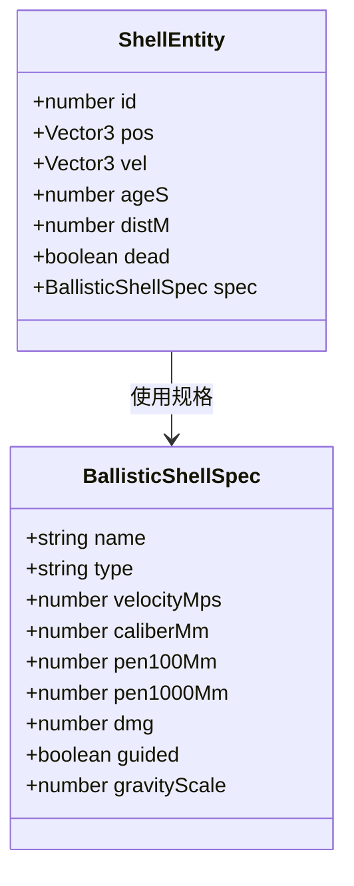
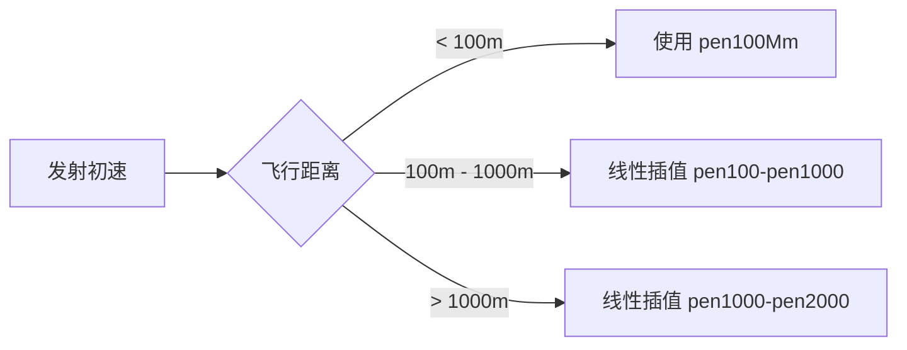
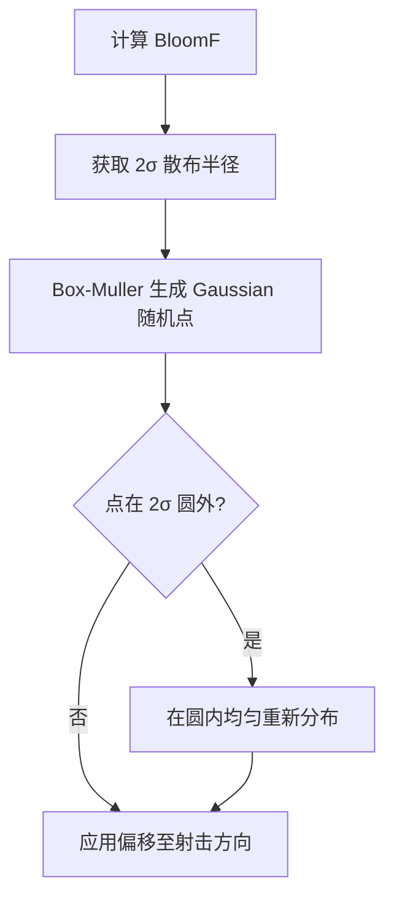
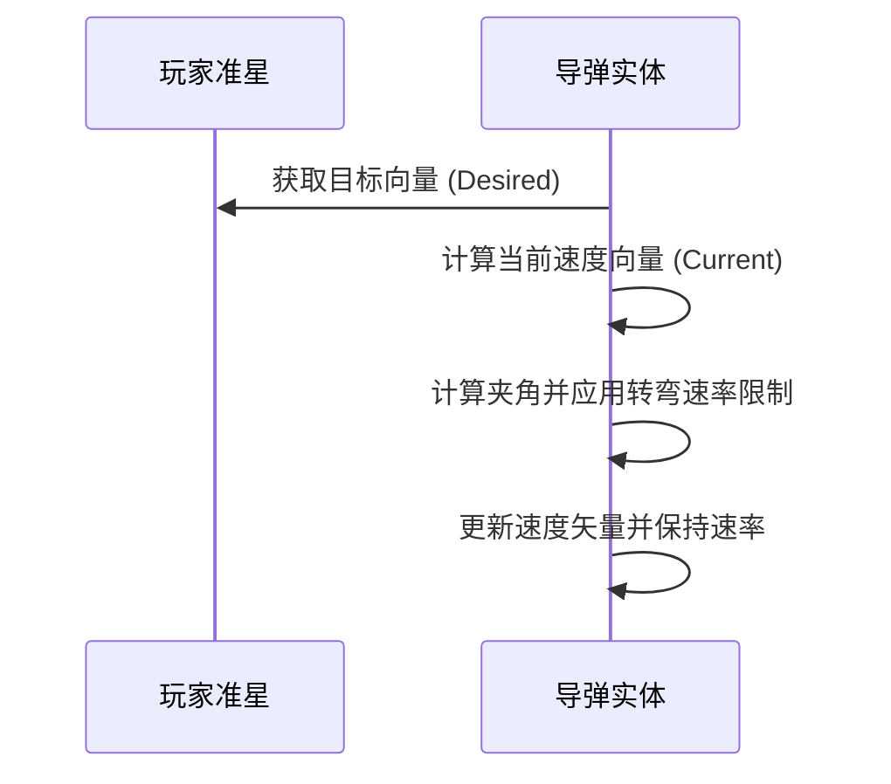
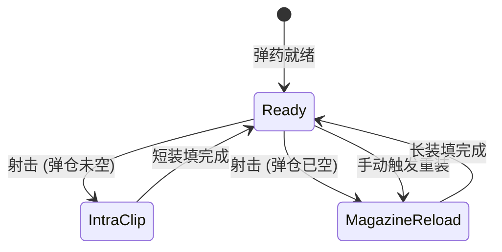

# 弹道学与飞行物理

## 目录
1. [模块概览](#模块概览)
2. [引言](#引言)
3. [炮弹类型与物理特性](#炮弹类型与物理特性)
4. [外部弹道学物理模型](#外部弹道学物理模型)
5. [散布与射击精度机制](#散布与射击精度机制)
6. [导弹制导逻辑](#导弹制导逻辑)
7. [弹药管理与装填系统](#弹药管理与装填系统)
8. [核心组件](#核心组件)
9. [文件引用](#文件引用)

## 模块概览

本模块负责坦克炮弹的物理模拟、飞行轨迹计算、射击精度散布以及弹药库存管理。它是游戏战斗系统的核心组成部分，确保了射击体验的真实性与平衡性。

- **总文件数**：本模块涉及约 4 个核心逻辑文件及多个相关测试文件。
- **涵盖范围**：
    - `src/sim/ballistics.ts`: 弹道物理积分、穿深衰减、精度采样。
    - `src/sim/ammunition.ts`: 弹药库存状态、消耗与补充逻辑。
    - `src/sim/movement.ts`: 计算射击散布（Bloom）的动态变化。
    - `src/sim/damage.ts`: 自动装弹机与弹仓逻辑（部分涉及）。
- **测试覆盖**：通过 `ammunition.selftest.mjs` 和 `autoloader.selftest.mjs` 验证逻辑正确性。

## 引言

在《Claude of Tanks》中，弹道学不仅仅是简单的直线射击。系统模拟了重力对炮弹轨迹的影响、随距离增加而产生的穿透力衰减，以及由于车辆移动和转动带来的射击精度变化。该模块的设计目标是提供一个高性能、确定性且符合物理直觉的战斗模拟环境。

## 炮弹类型与物理特性

系统定义了多种具有物理差异的炮弹类型，每种炮弹在初速、重力影响、穿深特性和制导能力上都有所不同。

### 核心炮弹类型
1. **AP (穿甲弹)**：包括 APCR、APFSDS 等。具有极高的初速，受重力影响小，但穿透力随距离增加而线性衰减。
2. **HE (高爆弹)**：初速较低，弹道弯曲，主要依靠爆炸产生伤害，穿透力通常不随距离衰减。
3. **HEAT (破甲弹)**：初速中等，穿透力在任何距离下保持恒定。
4. **ATGM (反坦克导弹)**：受玩家准星控制（制导），飞行速度较慢，但具有极高的机动性和精确打击能力。

下面的类图展示了弹药规格的结构定义：



该图展示了 `BallisticShellSpec` 如何定义炮弹的静态属性，而 `ShellEntity` 则代表了在世界中飞行的实时动态实体。

**Section sources**:
- [ballistics.ts](src/sim/ballistics.ts)
- [ammunition.ts](src/sim/ammunition.ts)

## 外部弹道学物理模型

外部弹道学处理炮弹离开炮口后的物理行为。系统采用显式欧拉积分来更新炮弹位置，并模拟重力加速。

### 弹道积分数学描述
炮弹的状态更新在 `stepShell` 函数中完成。每一帧（`dt`），炮弹的位置和速度按照以下逻辑更新：

1. **位置更新**：基于当前速度和重力加速度计算位移。
   $$ \vec{P}_{new} = \vec{P}_{old} + \vec{V} \cdot dt - \frac{1}{2} \vec{g} \cdot dt^2 $$
2. **速度更新**：重力仅影响垂直分量。
   $$ V_y = V_y - g \cdot dt $$
3. **距离累加**：用于计算穿深衰减。

### 穿深随距离衰减
穿透力（Penetration）不是恒定的。系统通过 `penAtDistanceMm` 函数计算特定飞行距离下的平均穿深。对于现代 APFSDS 弹药，支持从 100m 到 2000m 的多段线性插值。



该流程图描述了穿透力如何根据飞行距离动态计算。这种设计确保了远程射击的难度和平衡性。

**Section sources**:
- [ballistics.ts:L196-L205](src/sim/ballistics.ts#L196-L205)
- [ballistics.ts:L259-L266](src/sim/ballistics.ts#L259-L266)

## 散布与射击精度机制

射击精度由“散布”（Dispersion）决定。散布圆的半径随车辆状态动态变化，这个现象被称为“扩圈”（Bloom）。

### 散布半径计算
`computeDispersionRadM` 函数计算 100 米处的散布半径（2σ）：
$$ R = Accuracy_{base} \cdot \frac{Dist}{100} \cdot BloomF $$

其中 `BloomF`（扩圈系数）受以下因素影响：
- **车辆移动**：速度越高，扩圈越大。
- **车体转动**：原地转向会增加扩圈。
- **炮塔转动**：炮塔瞄准移动会增加扩圈。
- **射击后**：连续射击会瞬间产生巨大的扩圈。

### 散布采样逻辑
在实际射击时，系统使用 **Box-Muller** 变换生成符合高斯分布的随机偏移。如果随机点落在 2σ 之外（即扩圈圆之外），则会在圆内均匀重新分布，以模拟类似《坦克世界》的中心偏向分布。



该决策流展示了如何从动态的扩圈系数最终转化为一次具体的射击偏移。

**Section sources**:
- [movement.ts:L1391-L1406](src/sim/movement.ts#L1391-L1406)
- [ballistics.ts:L301-L340](src/sim/ballistics.ts#L301-L340)

## 导弹制导逻辑

反坦克导弹（ATGM）具有独特的制导逻辑。通过 `guideShellToward` 函数，导弹会不断调整飞行矢量以对准玩家的瞄准点。

### 实现细节
1. **转弯速率限制**：导弹不能瞬间转向，而是受 `guidanceTurnRateRadS`（弧度/秒）限制。这使得导弹的飞行轨迹显得平滑且可预测。
2. **保持恒定速率**：转向时，导弹会重新归一化速度矢量，确保其飞行速率始终保持在规格定义的 `velocityMps`。
3. **重力补偿**：制导导弹在飞行中通常不受重力影响（`gravityScale = 0`），因为其发动机和控制翼面会持续补偿下坠。



该序列图描述了导弹在每一帧如何根据准星位置修正自己的飞行轨迹。

**Section sources**:
- [ballistics.ts:L214-L244](src/sim/ballistics.ts#L214-L244)

## 弹药管理与装填系统

弹药管理涵盖了从库存计数到自动装弹机的复杂逻辑。

### 弹药库存 (AmmunitionState)
每个坦克拥有多个弹药槽。`ammunition.ts` 负责管理这些槽位的余量。
- **消耗**：每次开火前调用 `consumeAmmunition`。
- **补给**：通过 `replenishAmmunition` 恢复弹药，通常在拾取补给箱时触发。补给逻辑确保即使是稀有的导弹，每次补给也至少能获得一发。

### 弹仓与自动装弹机 (Autoloader)
现代坦克通常配备弹仓系统。
- **Intra-clip Reload**：弹仓内炮弹之间的装填时间。
- **Full Reload**：整个弹仓耗尽后的长装填时间。
- **手动重新装填**：玩家可以随时触发重新装填，但这会舍弃当前弹仓内剩余的炮弹。



该状态机展示了自动装弹机在不同射击状态下的转换逻辑。

**Section sources**:
- [ammunition.ts](src/sim/ammunition.ts)
- [damage.ts](src/sim/damage.ts) (通过 `autoloader.selftest.mjs` 验证)

## 核心组件

### 关键接口与函数

| 接口/函数 | 说明 | 来源 |
| :--- | :--- | :--- |
| `BallisticShellSpec` | 定义炮弹的物理和穿透规格。 | `ballistics.ts` |
| `stepShell(shell, dt)` | 每一帧更新炮弹位置和速度的核心物理积分函数。 | `ballistics.ts` |
| `applyDispersion(dir, sigma, rng)` | 应用高斯分布的射击散布偏转。 | `ballistics.ts` |
| `computeDispersionRadM(...)` | 计算当前动态环境下的散布圆半径。 | `movement.ts` |
| `replenishAmmunition(...)` | 按比例补给弹药，确保非满载通道至少获得一发。 | `ammunition.ts` |

### 代码示例：穿深衰减计算
```typescript
export function penAtDistanceMm(shellSpec: PenetrationSpec, distM: number) {
  // 支持 2000m 的现代 APFSDS 规格
  if (distM > 1000 && (shellSpec.pen2000Mm || 0) > 0) {
    const f2 = Math.min(1, (distM - 1000) / 1000);
    return shellSpec.pen1000Mm + ((shellSpec.pen2000Mm || 0) - shellSpec.pen1000Mm) * f2;
  }
  // 常规 100m-1000m 线性衰减
  const f = Math.min(1, Math.max(0, (distM - 100) / 900));
  return shellSpec.pen100Mm + (shellSpec.pen1000Mm - shellSpec.pen100Mm) * f;
}
```

## 文件引用

本章节内容基于以下源文件分析生成：

- [src/sim/ballistics.ts](src/sim/ballistics.ts)
- [src/sim/ammunition.ts](src/sim/ammunition.ts)
- [src/sim/movement.ts](src/sim/movement.ts)
- [src/sim/ammunition.selftest.mjs](src/sim/ammunition.selftest.mjs)
- [src/sim/autoloader.selftest.mjs](src/sim/autoloader.selftest.mjs)
