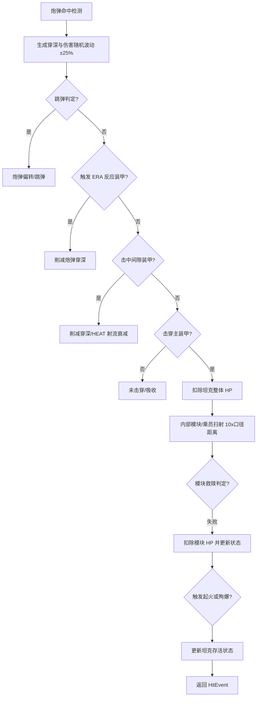
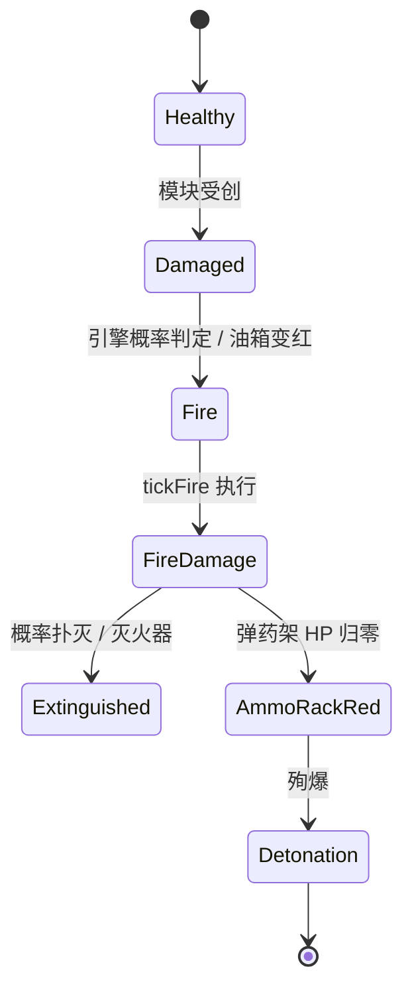
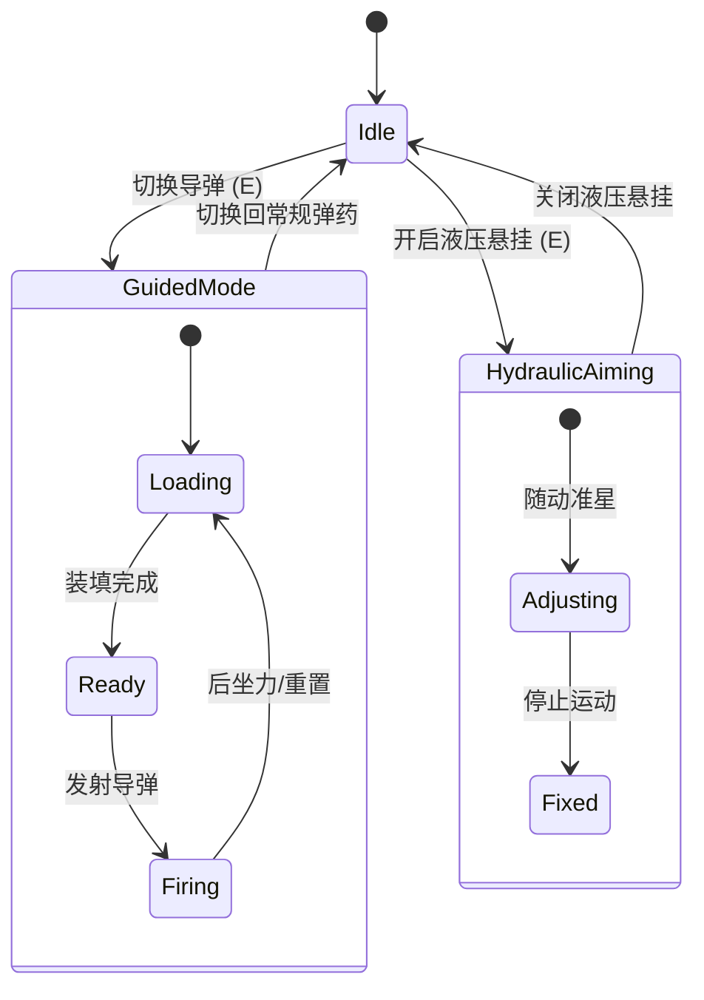

# 损伤模型与模块化破坏

## 目录
1. [模块概览](#模块概览)
2. [核心组件与数据模型](#核心组件与数据模型)
3. [损伤判定流程 (resolveShellHit)](#损伤判定流程-resolveshellhit)
4. [内部模块布局与逻辑定义](#内部模块布局与逻辑定义)
5. [模块损坏状态与性能影响](#模块损坏状态与性能影响)
6. [起火与殉爆机制](#起火与殉爆机制)
7. [模块修复逻辑 (tickModuleRepairs)](#模块修复逻辑-tickmodulerepairs)
8. [特殊行动状态机](#特殊行动状态机)
9. [文件引用](#文件引用)

## 模块概览

本章节深入解析《Claude of Tanks》模拟系统中的损伤模型与模块化破坏机制。该系统不仅计算坦克的整体生命值（HP），还模拟了坦克内部复杂的组件结构，包括引擎、弹药架、油箱、乘员以及各种观测与传动设备。通过精细的物理碰撞检测和概率判定，系统能够真实地还原坦克在受损后的性能衰减、起火甚至殉爆等动态行为。

在代码实现层面，损伤模型主要集中在 `src/sim` 目录下。经过初步的 Scope Assessment 评估，该目录共包含 29 个源文件（涵盖 `.ts` 和 `.selftest.mjs`），属于标准复杂度的核心模块。

**涵盖的子模块与重点文件：**
- **损伤判定核心**：`damage.ts` —— 负责处理炮弹命中、穿深计算、跳弹判定以及内部模块扫射的完整逻辑。
- **模块目录定义**：`moduleCatalog.ts` —— 定义了所有可破坏模块的属性，如初始生命值、受损概率（Save Chance）等。
- **特殊行动逻辑**：`specialActions.ts` 与 `specialActionPolicy.ts` —— 驱动导弹引导、液压悬挂切换等高级状态的逻辑。
- **物理与运动关联**：`movement.ts` —— 接收损伤状态并将其转化为具体的性能减益（如机动性下降、精度降低）。

本章节将重点围绕 `damage.ts` 中的 `resolveShellHit` 函数，结合 Mermaid 流程图和代码级分析，为开发者展示从炮弹触碰装甲到内部组件被破坏的完整生命周期。

**Section sources**:
- [src/sim/damage.ts](src/sim/damage.ts)
- [src/sim/moduleCatalog.ts](src/sim/moduleCatalog.ts)

## 核心组件与数据模型

在深入逻辑之前，必须理解系统如何描述一个坦克的“健康状态”。`CombatState` 是损伤模型的核心数据结构，它记录了坦克当前的 HP、所有内部模块的状态、乘员的存活情况以及是否正在起火。

### 关键接口定义

```typescript
// src/sim/damage.ts

export interface CombatModuleState {
  hp: number;        // 当前模块生命值
  maxHp: number;     // 最大生命值
  state: 'ok' | 'yellow' | 'red'; // 模块状态：正常、受损、瘫痪
  repairT: number;   // 修复进度计时器
}

export interface CombatState {
  hp: number;        // 坦克整体 HP
  maxHp: number;
  destroyed: boolean; // 是否已摧毁
  modules: Partial<Record<ModuleId, CombatModuleState>>; // 内部模块集合
  crew: Record<string, boolean>; // 乘员存活状态 (true=存活)
  fire: { burning: boolean; tickTimer: number; ticksLeft: number }; // 起火状态
  reload: ReloadState; // 装填状态
  // ... 其他字段如弹药库存、设备增益等
}
```

### 模块定义 (ModuleDefinition)

每个模块在 `moduleCatalog.ts` 中都有其独特的物理属性定义。例如，弹药架（`ammoRack`）虽然生命值较高，但其 `saveChance` 较低，意味着一旦被命中，更容易受到实质性伤害。

```typescript
// src/sim/moduleCatalog.ts

export const MODULE_DEFS = Object.freeze({
  gun: { label: 'Gun', hp: 150, saveChance: 0.33 },
  engine: { label: 'Engine', hp: 160, saveChance: 0.45 },
  ammoRack: { label: 'Ammo Rack', hp: 150, saveChance: 0.27 },
  trackL: { label: 'Track L', hp: 100, saveChance: 1.0 }, // 履带总是受损
  // ...
});
```

`saveChance` 是系统中的一个关键参数，它代表了模块在被炮弹轨迹扫过时“发生损坏”的概率。如果随机数大于该值，则该模块即便在轨迹上也会因为“未直接击中核心部件”而免受伤害。

**Section sources**:
- [src/sim/damage.ts:L101-L132](src/sim/damage.ts#L101-L132)
- [src/sim/moduleCatalog.ts:L11-L26](src/sim/moduleCatalog.ts#L11-L26)

## 损伤判定流程 (resolveShellHit)

`resolveShellHit` 是整个损伤模型的心脏。它负责处理炮弹从击中装甲表面到在坦克内部飞行的全过程。该过程是高度确定性的，严格遵循 RNG（随机数生成器）的消耗顺序，以确保回放的一致性。

以下图表展示了炮弹命中的完整处理逻辑：



该流程的设计体现了现代坦克战的物理特性。炮弹在穿透每一层结构（ERA、间隙装甲、主装甲）时都会损失剩余穿深。只有当穿深大于该位置的等效厚度（`effMm`）时，炮弹才能继续飞行。

在击穿主装甲后，炮弹会进入“内部扫射”阶段。系统会沿着炮弹的飞行矢量，在等于 **10 倍炮弹口径** 的距离内，搜索所有相交的模块和乘员碰撞盒。

**代码级分析 (`resolveShellHit`)：**

```typescript
// src/sim/damage.ts

export function resolveShellHit(shell, target, hits, rng) {
  // 1. 确保穿深和伤害随机滚动 (±25%)
  ensurePenRoll(shell, rng);
  
  for (const hit of hits) {
    // 2. 跳弹判定：基于入射角和3倍口径压制规则
    if (!hullPen && wouldRicochet(spec, angle, plate)) {
      deflectShell(shell, hit); // 偏转炮弹
      return buildRicochetEvent();
    }

    // 3. 间隙装甲与 HEAT 射流衰减
    if (plate.kind === 'spaced') {
      pen -= effMm;
      if (spec.type === 'HEAT') pen *= heatGapDecay(gapM);
    }

    // 4. 主装甲击穿判定
    if (pen >= effMm) {
      hullPen = true;
      combat.hp -= dmgRoll; // 扣除坦克 HP
      // 5. 触发内部模块扫射
      flushInternalModules(ctx, straddlers);
    }
  }
}
```

在 `resolveShellHit` 的实现中，特别值得注意的是“跨越式碰撞盒”（Straddling Boxes）的处理。某些模块（如引擎或侧面弹药架）可能紧贴装甲内壁。如果炮弹在击穿装甲的一瞬间就命中了这些模块，系统会通过 `straddlers` 数组确保它们在正确的 RNG 顺序下被结算，避免了物理引擎在微小位移下的漏检。

**Section sources**:
- [src/sim/damage.ts:L849-L1212](src/sim/damage.ts#L849-L1212)

## 内部模块布局与逻辑定义

坦克的内部模块并非随意的点位，而是基于 `ArmorModel` 定义的逻辑碰撞区域。这些区域在逻辑上被划分为核心模块（Core Modules）和辅助模块。

### 模块逻辑位置定义

虽然具体的 3D 坐标定义在车辆资源文件中，但 `damage.ts` 通过 `traceTank` 获取的相交信息来识别模块。常见的模块布局逻辑如下：
- **引擎 (Engine)**：通常位于车体后部，占据较大空间，是起火的主要源头。
- **弹药架 (Ammo Rack)**：分布在车体侧面或炮塔尾舱。虽然体积较小，但一旦被击毁会导致瞬时死亡。
- **燃油箱 (Fuel Tank)**：通常分布在引擎周围或车体前部两侧，损坏会导致持续起火。
- **乘员 (Crew)**：包括车长、炮手、驾驶员和装填手。他们的位置决定了被击中后的特定功能丧失。

### 模块救赎 (Saving Throw) 机制

并不是每一次炮弹扫过模块都会造成伤害。系统引入了 `rollModuleDamage` 函数来处理这一概率过程：

```typescript
function rollModuleDamage(ctx, moduleName) {
  const m = ctx.combat.modules[moduleName];
  const save = ctx.rng(); // 消耗一次随机数
  const chance = MODULE_DEFS[moduleName].saveChance;
  
  // 如果随机数大于救赎概率，模块“躲过一劫”
  if (save >= chance || m.hp <= 0) return res;

  // 否则，扣除模块 HP
  const moduleDmg = rollUniform(ctx.rng, ctx.shellSpec.caliberMm);
  m.hp -= moduleDmg;
  refreshModuleState(m); // 更新黄/红状态
}
```

这种机制模拟了坦克内部空间的空隙——炮弹可能穿过了弹药架的架子，但没有击中真正的炮弹底火。

**Section sources**:
- [src/sim/damage.ts:L522-L566](src/sim/damage.ts#L522-L566)
- [src/sim/moduleCatalog.ts:L11-L35](src/sim/moduleCatalog.ts#L11-L35)

## 模块损坏状态与性能影响

当模块 HP 下降时，其状态会发生迁移。系统定义了三级损坏状态，每种状态都会对坦克的战斗表现产生直接影响。

### 状态迁移逻辑

模块的状态由 `refreshModuleState` 函数控制：
- **正常 (OK)**：HP > 50%。
- **受损 (Yellow)**：50% >= HP > 0%。性能部分下降，通常可以继续使用但效率降低。
- **瘫痪 (Red)**：HP <= 0%。功能完全丧失，触发自动修复流程。
- **彻底破坏 (Black)**：在某些逻辑中，被视为无法修复的损毁（如殉爆后的弹药架）。

### 性能减益矩阵

损伤状态通过 `MovementDebuffs`（在 `movement.ts` 中计算）和 `reloadMultiplier`（在 `damage.ts` 中计算）对坦克产生影响：

| 模块 | 状态 | 具体影响 |
| :--- | :--- | :--- |
| **引擎** | 黄色 | 功率下降 50% (`ENGINE_YELLOW_POWER_MULT = 0.5`) |
| **引擎** | 红色 | 坦克无法移动 (`immobile = true`)，高概率起火 |
| **弹药架** | 黄色 | 装填时间延长 50% (`AMMORACK_RELOAD_MULT = 1.5`) |
| **弹药架** | 红色 | **殉爆**：坦克立即摧毁，HP 归零 |
| **炮塔吊篮** | 红色 | 炮塔转速降低至 20% |
| **火炮** | 黄色 | 基础精度大幅下降，扩圈惩罚增加 |
| **装填手 (乘员)** | 阵亡 | 装填时间延长 50% |
| **驾驶员 (乘员)** | 阵亡 | 加速度与转向速度降低 30% |

这种设计强迫玩家根据受损情况调整战术。例如，当弹药架受损（黄色）时，玩家必须意识到自己的火力持续性已大幅削弱，可能需要暂时撤退等待修复。

**Section sources**:
- [src/sim/damage.ts:L506-L512](src/sim/damage.ts#L506-L512)
- [src/sim/movement.ts:L865-L939](src/sim/movement.ts#L865-L939)

## 起火与殉爆机制

起火和殉爆是损伤模型中最具戏剧性的部分，它们由 `rollModuleDamage` 触发，并由 `tickFire` 在游戏主循环中持续处理。

### 起火判定逻辑

系统中有两种主要的起火源：
1. **引擎起火**：每次引擎受损（无论是黄色还是红色），都会进行一次 15% 概率（`ENGINE_FIRE_CHANCE`）的起火判定。
2. **油箱起火**：油箱在黄色状态下不会起火，但一旦进入红色状态（HP 归零），则 **100% 触发起火**。

### 持续伤害与殉爆

一旦坦克进入 `burning` 状态，`tickFire` 函数每 0.5 秒执行一次：
- **整体伤害**：扣除坦克最大 HP 的 0.5%。
- **模块伤害**：引擎、油箱、弹药架每跳损失 10 点 HP。
- **殉爆风险**：如果起火导致弹药架 HP 归零并转为红色，坦克会立即殉爆。



灭火器（Equipment）可以显著降低起火风险。自动灭火器不仅能减少起火的持续时间（`ticksLeft`），还能翻倍每跳的自愈概率（`FIRE_EXTINGUISH_CHANCE`）。

**Section sources**:
- [src/sim/damage.ts:L543-L565](src/sim/damage.ts#L543-L565)
- [src/sim/damage.ts:L1773-L1804](src/sim/damage.ts#L1773-L1804)

## 模块修复逻辑 (tickModuleRepairs)

当模块进入红色（瘫痪）状态后，坦克并不会永远丧失该功能。系统会自动启动修复流程，将模块从“红色”恢复到“黄色”。

### 修复流程详解

修复逻辑由 `tickModuleRepairs` 函数驱动。这是一个“累加计数”过程：
1. **触发**：模块 HP 归零，状态变为 `red`，`repairT` 重置为 0。
2. **累加**：每帧根据 `dt` 增加 `repairT`。
3. **加速**：如果乘员拥有修复技能或安装了工具箱（Equipment），累加速度会乘以 `rate` 增益。
4. **完成**：当 `repairT` 达到 `REPAIR_S`（基准 10 秒）时，模块 HP 恢复至最大值的 50%，状态转为 `yellow`。

```typescript
export function tickModuleRepairs(combat, dt) {
  const rate = equipMult(combat, 'repair'); // 获取修复速率增益
  for (const name of Object.keys(combat.modules)) {
    const m = combat.modules[name];
    if (m.state !== 'red') continue;
    
    m.repairT += dt * rate; // 累加修复时间
    if (m.repairT >= REPAIR_S) {
      m.hp = m.maxHp * 0.5; // 恢复 50% HP
      refreshModuleState(m); // 状态回转为 'yellow'
    }
  }
}
```

值得注意的是，修复只能将模块带回“黄色”状态。如果玩家想要完全恢复模块到“OK”状态，必须使用“大修理箱”等消耗品，这会调用 `repairAllModules` 函数，瞬间将所有模块 HP 补满。

**Section sources**:
- [src/sim/damage.ts:L1822-L1839](src/sim/damage.ts#L1822-L1839)
- [src/sim/damage.ts:L276](src/sim/damage.ts#L276)

## 特殊行动状态机

除了被动受损，坦克还可以主动切换一些特殊状态，这些状态通过 `SpecialActionState` 进行管理，并受到损伤状态的限制。

### 状态切换逻辑

`specialActions.ts` 负责处理玩家的特殊指令（通常映射到键盘的 `E` 键）：
- **液压悬挂 (Hydropneumatic Aim)**：在瑞典 Strv 103 等坦克上，开启后 hull 会根据准星高度自动调整俯仰角。
- **导弹引导模式 (Guided Missile)**：切换到导弹槽位。系统会记住玩家之前的常规弹药槽位，以便快速切换回动能弹。
- **弹药架重装 (Magazine Reload)**：对于弹夹车，手动触发长装填以补满弹夹。

### 损伤对特殊行动的限制

特殊行动的可用性与坦克的健康状况紧密相连：
- **摧毁限制**：如果 `combat.destroyed` 为真，所有特殊行动立即失效。
- **装填限制**：如果弹药架被毁或装填手阵亡，导弹的切换和弹夹的重装时间会按比例延长。
- **引导限制**：导弹引导要求坦克未被摧毁。如果导弹发射架（`missileRack`）受损，导弹的装填速度会受到严重惩罚（黄色 ×1.4，红色 ×1.8）。



特殊行动的设计体现了“一键多能”的原则。系统通过 `specialActionKind` 函数根据车辆的 `spec` 自动决定 `E` 键的功能优先级：液压悬挂 > 导弹切换 > 弹夹重装。

**Section sources**:
- [src/sim/specialActions.ts:L67-L136](src/sim/specialActions.ts#L67-L136)
- [src/sim/specialActionPolicy.ts:L69-L79](src/sim/specialActionPolicy.ts#L69-L79)

## 文件引用

以下是本章节涉及的核心源代码文件列表，所有路径均相对于项目根目录：

- `src/sim/damage.ts`：损伤判定、起火、修复与装填逻辑的核心实现。
- `src/sim/moduleCatalog.ts`：内部模块的静态属性定义。
- `src/sim/specialActions.ts`：特殊行动的触发与执行逻辑。
- `src/sim/specialActionPolicy.ts`：特殊行动的类型定义与策略选择。
- `src/sim/movement.ts`：损伤状态对物理运动和火控精度的影响实现。
- `src/sim/armor.ts`：装甲碰撞检测与模块相交计算的基础模块。

**Section sources**:
- [src/sim/damage.ts](src/sim/damage.ts)
- [src/sim/moduleCatalog.ts](src/sim/moduleCatalog.ts)
- [src/sim/specialActions.ts](src/sim/specialActions.ts)
- [src/sim/specialActionPolicy.ts](src/sim/specialActionPolicy.ts)
- [src/sim/movement.ts](src/sim/movement.ts)
