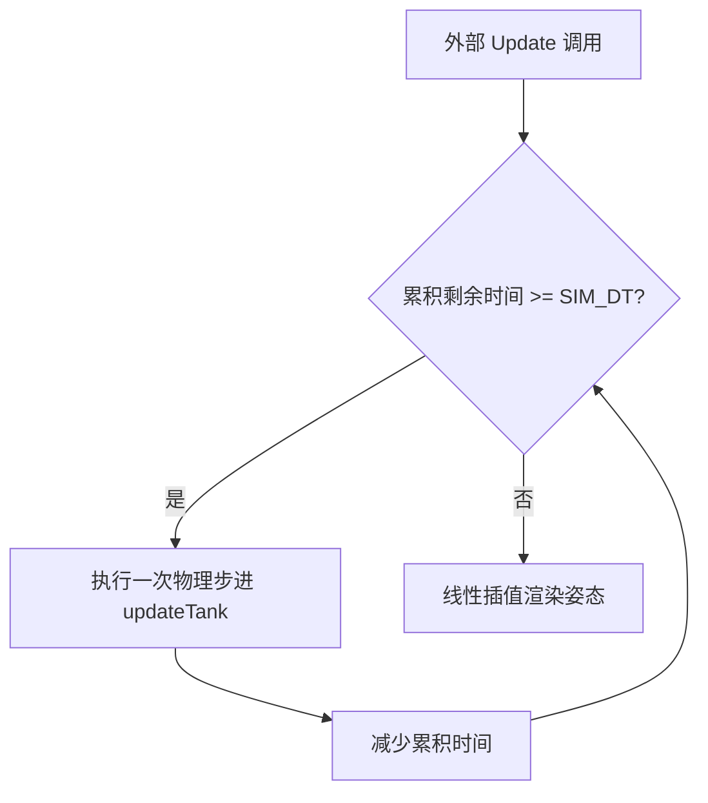
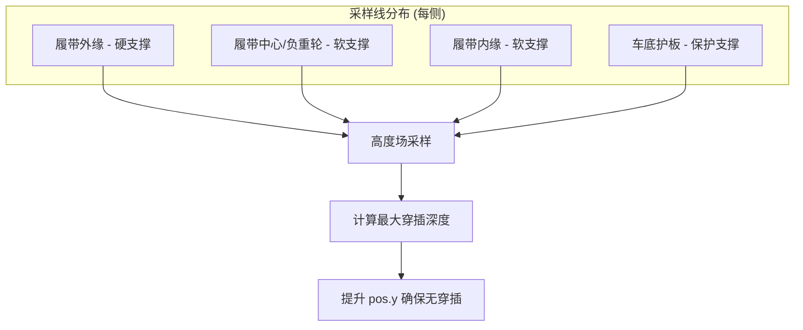
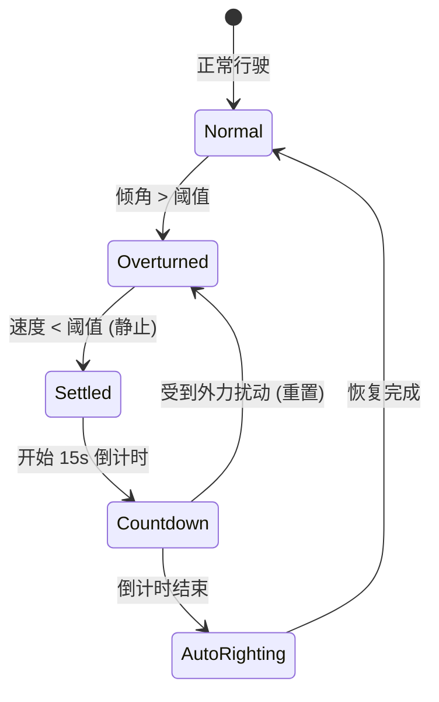

# 确定性物理与地形移动

## 目录

1. [模块概览](#模块概览)
2. [确定性物理引擎基础](#确定性物理引擎基础)
   - [固定步长积分 (60Hz)](#固定步长积分-60hz)
   - [无分配 (Allocation-free) 设计](#无分配-allocation-free-设计)
3. [动力传动与地形移动模型](#动力传动与地形移动模型)
   - [引擎功率与扭矩积聚 (Spool)](#引擎功率与扭矩积聚-spool)
   - [地形阻力与履带抓地力 (Grip)](#地形阻力与履带抓地力-grip)
4. [悬挂物理与地形接触](#悬挂物理与地形接触)
   - [多点支撑采样扇面 (Support Fan)](#多点支撑采样扇面-support-fan)
   - [地形拟合与姿态弹簧](#地形拟合与姿态弹簧)
   - [垂直运动与离地状态 (Ballistics)](#垂直运动与离地状态-ballistics)
5. [翻车检测与碰撞解决](#翻车检测与碰撞解决)
   - [翻车生命周期管理](#翻车生命周期管理)
   - [坦克堆叠与挤压处理](#坦克堆叠与挤压处理)
6. [确定性验证与测试](#确定性验证与测试)
7. [关键源文件引用](#关键源文件引用)

## 模块概览

本章节深入解析 Claude of Tanks 核心物理引擎的实现细节。该引擎是一个 **60Hz 确定性 (Deterministic)** 物理系统，负责处理坦克移动、地形交互、悬挂动态以及复杂的碰撞解决。

**核心统计数据**：
- **涉及文件总数**：约 16 个核心 `.ts` 文件。
- **核心子模块**：
  - `movement.ts`：主物理步进逻辑、姿态弹簧、炮控运动学。
  - `terrainMobility.ts`：地形阻力、抓地力与爬坡能力的数学模型。
  - `rollover.ts`：翻车状态检测与自动翻正逻辑。
  - `tankBodyContacts.ts`：坦克间的垂直堆叠与挤压碰撞解决。
  - `tankContactShape.ts`：基于碰撞点云的精确包围盒计算。

该模块不仅为本地玩家提供流畅的物理反馈，更重要的是通过确定性计算，保证了服务器与所有客户端在相同输入下产生完全一致的物理轨迹，这是实现大规模多人同步的基础。

## 确定性物理引擎基础

### 固定步长积分 (60Hz)

为了消除跨平台浮点数计算的微小差异以及变动帧率带来的不确定性，引擎强制使用固定的时间步长 `SIM_DT = 1/60` 秒进行积分。



物理步进的生命周期严格遵循以下顺序，确保状态演进的顺序性：
1. **输入读取与减益应用**：读取油门、转向输入，并根据模块受损情况（引擎、传动装置）应用倍率。
2. **水平运动积分**：计算理想速度，处理地形阻力和转向损耗。
3. **地形接触采样**：在当前位置对高度场进行多点采样。
4. **姿态弹簧更新**：根据地形拟合平面更新车体俯仰 (Pitch) 和横滚 (Roll)。
5. **垂直运动更新**：处理悬挂 heave 动态及空中的重力积分。
6. **炮控与扩圈**：更新炮塔指向及主炮扩散系数。

### 无分配 (Allocation-free) 设计

为了将垃圾回收 (GC) 压力降至最低，物理引擎在热路径（Hot Loop）中实现了完全的“无分配”设计。所有步进过程中需要的临时向量、欧拉角、四元数等对象均在模块作用域内预先分配。

```typescript
// movement.ts: 模块作用域内的刮擦变量 (Scratchpad)
const _push = new Vector3();
const _aimLocal = new Vector3();
const _gunOriginWorld = new Vector3();
const _hullEuler = new Euler(0, 0, 0, 'YXZ');
const _hullQuat = new Quaternion();
const _driveStep: DriveStep = { /* ... 预分配字段 ... */ };
```

这种设计确保了在每秒 60 次的物理更新中，不会因为频繁创建小对象而导致内存抖动，从而在低配设备上也能保持稳定的帧率。

**Section sources**:
- [movement.ts](src/sim/movement.ts)

## 动力传动与地形移动模型

### 引擎功率与扭矩积聚 (Spool)

引擎的动力输出并非瞬间达到最大值，而是通过一个二次方的 **Spool (扭矩积聚)** 模型来模拟涡轮增压或传动系统挂钩的过程。

```mermaid
flowchart LR
    Throttle[油门输入] --> SpoolLogic{Spool 逻辑}
    SpoolLogic -->|增加| SpoolValue[Spool 0..1]
    SpoolValue -->|二次方影响| FinalForce[最终驱动力]
    
    subgraph "驱动力计算"
    FinalForce = BaseAccel * Spool^2 * ResistanceFactor
    end
```

- **SPOOL_S (1.2s)**：从静止到满扭矩所需的上升时间。
- **SPOOL_FLOOR (0.22)**：油门踩下瞬间立即可用的扭矩比例。
- **二次方曲线**：使得起步阶段感觉沉重且真实，履带需要先“咬住”地面，随后动力涌现。

### 地形阻力与履带抓地力 (Grip)

地形移动受 `terrainMobility.ts` 中定义的数学模型约束，核心逻辑在于判断“驱动力”与“重力分量”之间的博弈。

1. **地形阻力 (Resistance)**：根据地形类型（硬地、中等、软地）缩放加速度和最高速度。
2. **抓地力极限 (Grip Margin)**：
   - 履带与地面的摩擦力限制了最大可传递的加速度。
   - 在陡坡上，如果 `gravityShare > gripCoefficient`，坦克将无法爬坡并发生下滑。
3. **转向损耗**：在高速转向时，引擎功率会被部分分流到转向机构，导致纵向速度下降 (`TURN_POWER_DIVERT = 0.5`)。

**Section sources**:
- [terrainMobility.ts](src/sim/terrainMobility.ts)
- [movement.ts:L332-L412](src/sim/movement.ts#L332-L412)

## 悬挂物理与地形接触

### 多点支撑采样扇面 (Support Fan)

传统的单点或四点采样无法解决坦克履带在复杂地形（如山脊、壕沟）下的穿插问题。本引擎采用了 **支撑扇面 (Support Fan)** 采样技术。



- **采样密度**：根据车长动态计算采样点数量，最高支持每条线 24 个采样点。
- **扇面宽度**：覆盖从中心线到履带外缘的完整区域，确保坦克不会在尖锐的山脊上“漏下去”。
- **软支撑 (Fan Yield)**：模拟负重轮的行程，允许地形在一定范围内挤压进入履带内侧，只要不穿透车体底盘。

### 地形拟合与姿态弹簧

引擎不直接将坦克姿态“贴”在地形上，而是通过 **最小二乘法 (Least-squares fit)** 拟合采样点的平面，并将其作为姿态弹簧的目标。

- **SPRING_OMEGA (3Hz)**：车体俯仰和横滚的自然频率。
- **PERCH 机制**：当坦克平衡在单个接触点（如山顶）时，系统会自动增加弹簧刚度并变为临界阻尼，防止车体在山脊上发生无休止的简谐振动。

### 垂直运动与离地状态 (Ballistics)

坦克拥有独立的垂直 heave 动态（1.8Hz），允许车体在通过起伏地形时有一定的浮动。

当地形高度迅速下降，超过履带最大下垂极限 (`RIDE_DROOP_M = 0.18m`) 时，坦克进入 **离地状态 (Airborne)**：
- 停止地形耦合。
- 沿切线方向保留垂直速度。
- 开启重力积分。
- 角动量守恒：在空中保持发射时的旋转惯性，直到再次接触地面。

**Section sources**:
- [movement.ts:L433-L592](src/sim/movement.ts#L433-L592)
- [movement.ts:L1661-L2160](src/sim/movement.ts#L1661-L2160)

## 翻车检测与碰撞解决

### 翻车生命周期管理

`rollover.ts` 负责监控坦克的状态，防止坦克在翻倒后立即“瞬移”回正，而是提供一个可感知的恢复过程。



### 坦克堆叠与挤压处理

`tankBodyContacts.ts` 解决了确定性物理中极难处理的“坦克叠罗汉”问题。

- **垂直偏好检测**：通过 `prefersVerticalTankContact` 判断两个坦克是应该发生水平碰撞还是垂直堆叠。
- **质量加权位移**：当坦克堆叠时，下方的坦克如果处于接地状态，则上方坦克承担全部位移补偿；如果双方都在空中，则按质量比分配位移。
- **角冲量传递**：坦克落在另一个坦克顶部时，会根据落点偏移产生偏航和翻滚的冲量，模拟真实的物理倾覆感。

**Section sources**:
- [rollover.ts](src/sim/rollover.ts)
- [tankBodyContacts.ts](src/sim/tankBodyContacts.ts)

## 确定性验证与测试

物理引擎的确定性通过 `movement.selftest.mjs` 中的严苛测试集进行验证。这些测试涵盖了：
1. **平地静止测试**：验证接触边距 (1.7cm) 是否正确。
2. **正弦波地形测试**：在不同波长 (2m-8m) 的起伏地形上全速行驶，验证履带穿插深度是否保持在容差范围内。
3. **弹道跳跃测试**：验证坦克从悬崖冲出后的抛物线轨迹及重力加速度的准确性。
4. **确定性回归**：确保在不同的执行环境下，相同的输入序列产生相同的 `pos` 和 `visualPitch` 结果。

> 💡 **提示**：`movement.selftest.mjs` 在 CI/CD 流程中运行，任何导致物理表现漂移的代码更改都会触发构建失败，从而保护了多人游戏的同步逻辑。

## 关键源文件引用

本章节涉及的核心逻辑分布在以下文件中：

- [movement.ts](src/sim/movement.ts)：物理引擎主入口，包含 60Hz 步进、姿态弹簧、支撑采样逻辑。
- [terrainMobility.ts](src/sim/terrainMobility.ts)：地形阻力、抓地力系数及爬坡 margin 计算。
- [rollover.ts](src/sim/rollover.ts)：坦克翻倒状态检测与 15 秒自动翻正逻辑。
- [tankBodyContacts.ts](src/sim/tankBodyContacts.ts)：坦克间垂直碰撞解决、堆叠处理及质量加权位移。
- [tankContactShape.ts](src/sim/tankContactShape.ts)：基于点云的精确碰撞形状计算。
- [movement.selftest.mjs](src/sim/movement.selftest.mjs)：物理确定性与地形接触的单元测试集。

**Diagram sources**:
- [movement.ts:L327-L407](src/sim/movement.ts#L327-L407)
- [movement.ts:L454-L523](src/sim/movement.ts#L454-L523)
- [rollover.ts:L10-L65](src/sim/rollover.ts#L10-L65)
- [tankBodyContacts.ts:L232-L378](src/sim/tankBodyContacts.ts#L232-L378)
