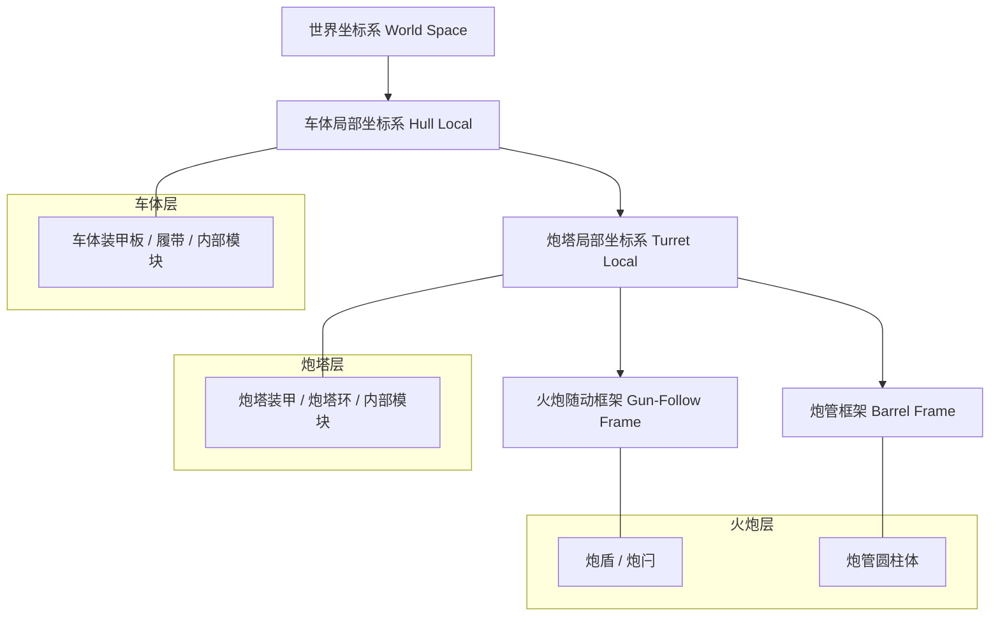
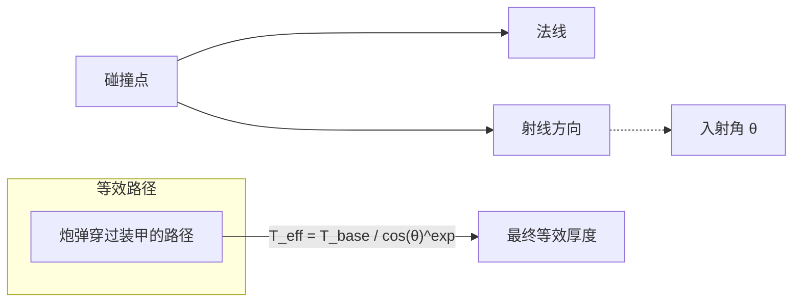
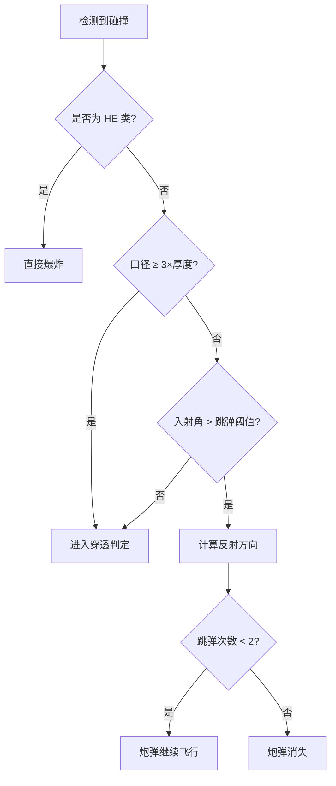

# 装甲等效与穿深计算

## 目录
1. [模块概览](#模块概览)
2. [引言](#引言)
3. [坐标系与射线检测](#坐标系与射线检测)
4. [等效厚度计算原理](#等效厚度计算原理)
5. [跳弹与转正逻辑](#跳弹与转正逻辑)
6. [穿深衰减与随机散布](#穿深衰减与随机散布)
7. [特殊装甲类型判定](#特殊装甲类型判定)
8. [HE 爆炸与溅射判定](#he-爆炸与溅射判定)
9. [核心组件](#核心组件)
10. [文件参考](#文件参考)

## 模块概览

在对 `src/sim` 目录进行深度探索后，本章节详细记录了坦克模拟系统中的装甲防护与穿透判定逻辑。该模块是战斗模拟的核心，负责处理从炮弹击中坦克到最终伤害结算的完整物理与几何过程。

**统计数据：**
- **涉及文件总数**：约 16 个核心逻辑文件及多个测试文件。
- **重点覆盖子模块**：
    - `armor.ts`: 负责射线检测、碰撞盒定义及坐标变换。
    - `damage.ts`: 负责穿透判定、跳弹逻辑、伤害结算及 HE 爆炸处理。
    - `ballistics.ts`: 负责穿深随距离衰减的计算及炮弹飞行轨迹。
- **子模块覆盖深度**：
    - **深度覆盖**：装甲等效计算、跳弹判定算法、间隙装甲与 ERA 处理、HE 溅射模型。
    - **简要提及**：坦克模块损坏逻辑、乘员受伤判定（这些内容将在伤害系统章节详细展开）。

通过对这些文件的分析，我们可以清晰地理解系统如何将复杂的几何碰撞转化为精确的战斗数值。

## 引言

装甲等效与穿深计算模块是《Claude of Tanks》模拟真实坦克战斗的基石。不同于简单的血条扣减，本系统基于真实物理反馈，计算炮弹与装甲在碰撞瞬间的几何关系。其核心目的在于模拟倾斜装甲的防御优势、间隙装甲对破甲弹（HEAT）的削弱作用，以及动能弹在远距离上的穿深衰减。

该模块采用了多层级、多坐标系的检测机制，能够精确区分坦克的主装甲、间隙装甲、外置挂件（如履带、工具箱）以及爆炸反应装甲（ERA）。每一发炮弹的结算都涉及复杂的几何投影、随机数滚动以及基于弹种特性的物理修正。

## 坐标系与射线检测

为了实现精确的碰撞检测，系统将坦克分解为四个独立的坐标框架（Frames）。这种设计允许炮塔转动、火炮俯仰以及坦克的动态姿态（如翻滚或俯仰）实时反映在碰撞判定中。

### 坐标框架层级

下图展示了坦克碰撞检测所依赖的坐标框架层级结构：



**图表说明**：
该层级结构描述了射线检测在不同空间中的转换过程。首先，世界坐标系下的炮弹轨迹段被转换到车体局部坐标系中。如果碰撞发生在炮塔上，则进一步转换到炮塔坐标系。火炮随动框架处理随火炮俯仰的炮盾等部件，而炮管框架则专门用于判定细长的炮管碰撞。这种分层处理确保了无论坦克处于何种姿态，碰撞检测都能保持极高的精度。

### 射线局部化与追踪过程

在 `armor.ts` 中，`traceTank` 函数是射线检测的入口。它首先调用 `buildFrames` 根据坦克当前状态（位置、偏航角、视觉俯仰/翻滚、炮塔偏航、火炮俯仰）构建变换矩阵。接着，通过 `localizeSegment` 将世界空间的射线段投影到上述四个局部坐标系中。

系统使用 `intersectQuad` 对四边形装甲板进行检测，并使用 `intersectConvexCell` 对封闭的凸包单元（Convex Cells）进行检测。封闭单元的设计是为了防止射线从装甲板缝隙中漏过，确保了主装甲的完整性。

**模块源码引用**:
- [armor.ts:L342-L375](src/sim/armor.ts#L342-L375) — `buildFrames` 实现。
- [armor.ts:L888-L972](src/sim/armor.ts#L888-L972) — `traceTank` 核心追踪流程。

## 等效厚度计算原理

等效厚度（Effective Thickness）是判定炮弹能否击穿的关键。系统不仅考虑装甲的物理厚度，还应用了余弦定理和弹种特有的倾斜修正系数。

### 几何原理

当炮弹以一定角度击中倾斜装甲时，其经过的实际路径长度会增加。基础的等效厚度计算公式为：
$T_{eff} = T_{physical} / \cos(\theta)$
其中 $\theta$ 是入射角。然而，在实际模拟中，不同弹种对倾斜装甲的敏感度不同，因此引入了 `slopeExp`（倾斜指数）。



**逻辑说明**：
在 `damage.ts` 的 `effectiveThickness` 函数中，系统根据弹种特性应用不同的修正。例如，传统的穿甲弹（AP/APCR）具有较高的 `slopeExp`（1.4），这意味着倾斜角度对它们的防御收益非常明显。而现代的尾翼稳定脱壳穿甲弹（APFSDS）和破甲弹（HEAT）的 `slopeExp` 为 1.0，它们更倾向于直接观察视线厚度（Line-of-Sight thickness）。

### 转正效应 (Normalization)
在计算最终角度前，系统会应用“转正”逻辑。转正模拟了炮弹在击中装甲瞬间，由于弹头形状或转矩作用向法线方向转动的现象，这会减小入射角，从而降低等效厚度。

**等效厚度计算代码示例**：
```typescript
function effectiveThickness(
  shellSpec: DamageShellSpec,
  plate: DamageArmorPlate,
  impactAngleDeg: number,
): { effMm: number, effAngleDeg: number } {
  const b = behaviorOf(shellSpec.type);
  let norm = b.normDeg;
  const T = plate.physicalMm;
  const omCal = overmatchCaliberMm(shellSpec);
  
  // 2倍径压制转正加成
  if (b.kindClass === 'KE' && T > 0 && omCal >= 2.0 * T) {
    norm = norm * 1.4 * (omCal / T);
  }
  
  const effAngleDeg = Math.max(0, impactAngleDeg - norm);
  const clampedDeg = Math.min(effAngleDeg, 89);
  const base = b.kindClass === 'KE' ? plate.keMm : plate.ceMm;
  
  // 应用倾斜指数公式
  const effMm = base / Math.cos(clampedDeg * DEG_TO_RAD) ** b.slopeExp;
  return { effMm, effAngleDeg };
}
```

**模块源码引用**:
- [damage.ts:L452-L469](src/sim/damage.ts#L452-L469) — `effectiveThickness` 实现。
- [damage.ts:L223-L230](src/sim/damage.ts#L223-L230) — `SHELL_BEHAVIOR` 弹种特性定义。

## 跳弹与转正逻辑

跳弹（Ricochet）是指炮弹因入射角过大而无法正常进入装甲，从而被弹开的现象。系统通过严格的角度阈值和压制规则来判定跳弹。

### 跳弹判定规则
1.  **角度阈值**：每个弹种都有固定的 `ricochetDeg`。例如 AP 为 70°，HEAT 为 85°。如果入射角超过此值，则可能发生跳弹。
2.  **强制跳弹**：对于大多数弹种，超过阈值即判定为跳弹。但 HE 类弹药永远不会跳弹，它们会在表面直接爆炸。
3.  **3倍径压制 (3-Caliber Rule)**：如果动能弹的口径达到装甲物理厚度的 3 倍及以上，系统将强制取消跳弹判定，模拟炮弹直接撕裂薄装甲的情况。

### 跳弹后的处理
发生跳弹后，炮弹不会消失，而是根据反射定律改变速度方向并继续飞行。系统允许炮弹最多发生 2 次跳弹，这为“跳弹击中另一辆坦克”或“跳弹击穿炮塔顶部”提供了可能。



**逻辑总结**：
跳弹逻辑在 `wouldRicochet` 函数中实现。该逻辑确保了轻型坦克在面对大口径火炮时，即便角度再好也难以通过跳弹幸存，同时也赋予了破甲弹更强的极端角度着弹能力。

**模块源码引用**:
- [damage.ts:L481-L495](src/sim/damage.ts#L481-L495) — `wouldRicochet` 实现。
- [damage.ts:L772-L779](src/sim/damage.ts#L772-L779) — `deflectShell` 反射处理。

## 穿深衰减与随机散布

炮弹的穿透力并非恒定，它受到飞行距离和随机波动的双重影响。

### 距离衰减 (Penetration Decay)
动能弹（KE）在飞行过程中会因为空气阻力损失动能，从而降低穿深。系统在 `ballistics.ts` 中通过 `penAtDistanceMm` 函数实现线性插值计算。
- 系统定义了 100m、1000m 和 2000m 三个关键距离的穿深锚点。
- 在这些锚点之间进行线性插值，超出范围则进行钳位（Clamping）。
- 化学能弹（CE，如 HEAT）的穿深通常不随距离衰减，因此其锚点值相同。

### 随机散布 (±25% Rolls)
为了模拟战场的不确定性，每一发炮弹在发射时都会滚动两个随机数：
1.  **穿深滚动**：最终穿深会在平均值的 75% 到 125% 之间波动。
2.  **伤害滚动**：最终伤害同样会在平均值的 75% 到 125% 之间波动。

这两次滚动在炮弹第一次发生有效碰撞时完成，并被缓存在炮弹实体中。如果炮弹发生跳弹或穿过间隙装甲，后续判定将复用同一次滚动的数值。

**模块源码引用**:
- [ballistics.ts:L259-L266](src/sim/ballistics.ts#L259-L266) — `penAtDistanceMm` 实现。
- [damage.ts:L790-L802](src/sim/damage.ts#L790-L802) — `ensurePenRoll` 随机数缓存逻辑。

## 特殊装甲类型判定

系统支持多种复杂装甲结构，每种结构都有独特的判定逻辑。

### 间隙装甲与外部挂件 (Spaced & External Armor)
间隙装甲（如侧裙板、履带）不直接保护坦克血量，但会消耗炮弹的穿深。
- **穿深消耗**：炮弹通过间隙装甲时，剩余穿深会减去该层的等效厚度。
- **HEAT 衰减**：破甲弹在穿过间隙后，金属射流会在空气间隙中发散。系统模拟了每 10cm 空气间隙损失 5% 穿深的衰减逻辑。
- **履带判定**：履带被视为一种特殊的外部装甲，击中履带会触发履带模块的损坏判定，同时消耗炮弹穿深。

### 爆炸反应装甲 (ERA)
ERA 是一种主动防御措施，在被击中时会发生爆炸以干扰炮弹。
- **判定逻辑**：ERA 瓷砖被击中后会立即标记为 `eraSpent`（已耗尽），并根据弹种减少穿深。
- **弹种差异**：KE 弹药按比例减少（如 -25%），CE 弹药按固定数值减少（如 -600mm）。
- **串联战斗部 (Tandem)**：如果炮弹具有串联战斗部特性，它会消耗掉 ERA 瓷砖但不损失主弹头的穿深，从而模拟先导装药诱爆 ERA 的过程。

### 炮管装甲
炮管被视为一种特殊的间隙装甲层。炮弹穿过炮管圆柱体时，会根据炮管半径计算一个等效的钢层厚度（通常在 30-60mm 之间）。这使得炮管可以作为最后一道防线挡住某些致命射击。

**模块源码引用**:
- [damage.ts:L990-L1019](src/sim/damage.ts#L990-L1019) — 间隙装甲处理逻辑。
- [damage.ts:L968-L983](src/sim/damage.ts#L968-L983) — ERA 判定逻辑。

## HE 爆炸与溅射判定

高爆弹（HE）的判定逻辑与动能弹完全不同。它不追求单点穿透，而是通过爆炸产生的冲击波和碎片造成范围伤害。

### 直接命中与表面爆破
当 HE 弹命中装甲时，系统首先尝试进行“全穿透”判定（使用视线厚度，无转正）。如果失败，则转入“表面爆破”流程。
- **伤害公式**：`0.5 * 基础伤害 * (1 - 距离/半径) - 1.1 * 装甲物理厚度`。
- **装甲吸收**：HE 伤害会受到路径上所有装甲厚度的叠加吸收。这意味着侧裙板能极大地削弱 HE 的溅射伤害。

### 溅射范围检测 (Splash Sweep)
HE 爆炸后，系统会扫描爆炸半径内的所有潜在目标。为了提高精度，系统采用了**最近点近似（Nearest-point Approximation）**。


**逻辑说明**：
在 `nearestPointTrace` 函数中，系统将爆炸点投影到目标的 AABB 包围盒上，找到表面最近的点。然后从爆炸点向该点发射一条射线，以确定爆炸威力是从哪个装甲面进入的。这种方法比简单的“爆炸点到中心点”连线更准确，能够正确处理爆炸发生在坦克后方角落时的溅射情况。

**模块源码引用**:
- [damage.ts:L1424-L1514](src/sim/damage.ts#L1424-L1514) — `heDirectHit` 实现。
- [damage.ts:L1561-L1606](src/sim/damage.ts#L1561-L1606) — `nearestPointTrace` 核心逻辑。

## 核心组件

以下是实现装甲与穿透判定的关键类和接口：

### ArmorModel (装甲模型)
定义了坦克的几何结构，包括炮塔转轴、火炮转轴、装甲板顶点、碰撞单元以及内部模块体积。
```typescript
export interface ArmorModel {
  turretPivot?: Vec3Tuple;
  gunPivot?: Vec3Tuple;
  hullPlates?: ArmorPlate[];
  turretPlates?: ArmorPlate[];
  collisionShells?: {
    hull?: ArmorCollisionCell[];
    turret?: ArmorCollisionCell[];
  };
  trackShapes?: TrackPrismShape[];
  modules?: ArmorModuleVolume[];
  crew?: ArmorCrewVolume[];
}
```

### ArmorIntersection (碰撞交点)
描述了射线与坦克碰撞的详细信息，用于后续的穿透和伤害计算。
```typescript
export interface ArmorPlateIntersection extends IntersectionBase {
  kind: 'plate';
  plate: ArmorPlate;
  impactAngleDeg: number;
  normal: Vector3;
}
```

### ShellBehavior (弹种行为)
定义了不同弹种在物理层面的差异化参数。
```typescript
const SHELL_BEHAVIOR = {
  AP: { kindClass: 'KE', normDeg: 5, ricochetDeg: 70, slopeExp: 1.4 },
  APFSDS: { kindClass: 'KE', normDeg: 2, ricochetDeg: 78, slopeExp: 1.0 },
  HEAT: { kindClass: 'CE', normDeg: 0, ricochetDeg: 85, slopeExp: 1.0 },
  HE: { kindClass: 'HE', normDeg: 0, ricochetDeg: Infinity, slopeExp: 1.0 },
};
```

## 文件参考

本章节内容基于对以下源代码文件的深度分析：

- [src/sim/armor.ts](src/sim/armor.ts) — 射线检测、坐标变换、几何碰撞核心逻辑。
- [src/sim/damage.ts](src/sim/damage.ts) — 穿透判定、跳弹逻辑、HE 爆炸及伤害结算。
- [src/sim/ballistics.ts](src/sim/ballistics.ts) — 穿深衰减、弹道积分及随机散布算法。
- [src/sim/combat.selftest.mjs](src/sim/combat.selftest.mjs) — 包含大量边界情况的战斗系统自动化测试用例。
- [src/sim/moduleCatalog.ts](src/sim/moduleCatalog.ts) — 内部模块与乘员的定义及基础属性。
