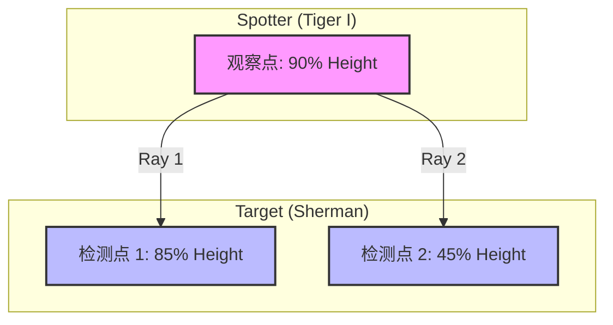
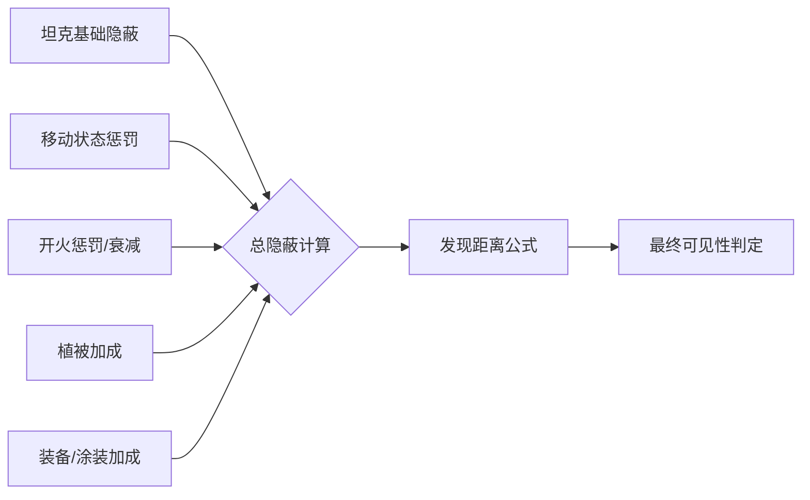
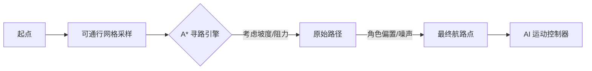
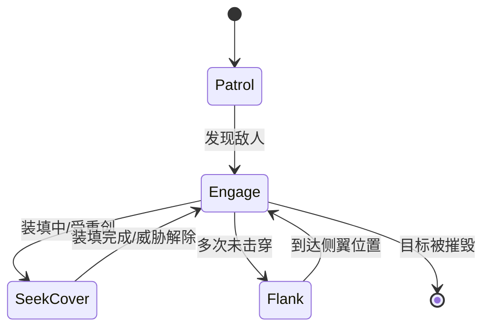

# 视野、隐蔽与 AI 逻辑

## 目录
1. [模块概览](#模块概览)
2. [视野检测机制 (Spotting System)](#视野检测机制-spotting-system)
   - [射线检测几何分布](#射线检测几何分布)
   - [分帧检测与性能优化](#分帧检测与性能优化)
3. [隐蔽系数与战争迷雾 (Stealth & Fog of War)](#隐蔽系数与战争迷雾-stealth-fog-of-war)
   - [隐蔽计算公式](#隐蔽计算公式)
   - [动态隐蔽惩罚：开火与移动](#动态隐蔽惩罚开火与移动)
   - [植被掩护与 15 米规则](#植被掩护与-15-米规则)
4. [AI 决策逻辑与行为树 (AI Decision Logic)](#ai-决策逻辑与行为树-ai-decision-logic)
   - [目标选择优先级](#目标选择优先级)
   - [基于难度的行为差异](#基于难度的行为差异)
   - [战术角色与行为模式](#战术角色与行为模式)
5. [路径规划与导航系统 (Pathfinding & Navigation)](#路径规划与导航系统-pathfinding--navigation)
   - [可通行网格 (Traversability Grid)](#可通行网格-traversability-grid)
   - [A* 寻路算法与成本函数](#a-寻路算法与成本函数)
   - [角色偏置与路径多样性](#角色偏置与路径多样性)
6. [团队协作与生存决策 (Collaboration & Survival)](#团队协作与生存决策-collaboration--survival)
   - [视野共享与无线电范围](#视野共享与无线电范围)
   - [地形掩护与生存决策](#地形掩护与生存决策)
7. [核心组件](#核心组件)
8. [文件参考](#文件参考)

## 模块概览

本模块解析了《Claude of Tanks》中的核心模拟系统，重点涵盖了战场的“战争迷雾”机制以及驱动非玩家坦克（Bot）的 AI 决策系统。这些系统共同协作，创造了一个充满策略性且符合坦克战斗逻辑的虚拟战场。

根据对 `src/sim` 和 `src/game` 目录的扫描，该功能块涉及约 10 个核心逻辑文件及相关的自测脚本（selftests）。其中，`spotting.ts` 负责视野与隐蔽的物理模拟，`botRoutePlanner.ts` 处理全局路径规划，而 `ai.ts` 则是整个 AI 行为的大脑，负责将视野信息转化为战术决策。

**模块规模与范围：**
- **核心文件数**：约 8-10 个。
- **子模块覆盖**：
    - `src/sim/spotting.ts`：视野检测算法、隐蔽系数计算、植被交互。
    - `src/sim/botRoutePlanner.ts`：A* 寻路、地形代价评估、可通行网格生成。
    - `src/game/ai.ts`：AI 状态机、目标选择、射击门限、掩体寻找逻辑。
    - 辅助文件：`src/sim/terrainMobility.ts`（地形阻力）、`src/sim/ballistics.ts`（弹道解算）。

该系统不仅模拟了物理层面的可见性，还通过复杂的 AI 逻辑模拟了人类玩家的心理行为，如“第六感”延迟、对威胁的优先级排序以及利用地形进行掩护的生存本能。

## 视野检测机制 (Spotting System)

视野检测是战场的眼睛。系统通过模拟坦克乘员的观察过程，决定哪些敌方单位应该在小地图和 3D 世界中被标记。

### 射线检测几何分布

视野检测并非简单的距离判断，而是基于物理射线检测（Raycast）的可见性测试。系统在坦克模型上定义了特定的检测点，以模拟观察者从舱盖观测以及目标暴露部分的过程。

在 `src/sim/spotting.ts` 中，视野检测遵循以下几何逻辑：
- **观察点 (Eye Point)**：位于坦克高度的 90% 处，模拟车长观察塔的位置。
- **目标检测点 (Target Points)**：
    - **炮塔顶部 (Turret Top)**：坦克高度的 85% 处。
    - **车体中心 (Hull Center)**：坦克高度的 45% 处。

只要观察点到目标的任意一个检测点之间没有硬质掩体（如地形或建筑物）遮挡，且目标在视野范围内，即视为“发现”。

上图展示了视野检测的射线分布。观察者从高位向下探测目标的两个关键高度点。这种设计允许坦克利用“卖头”（Hull-down）战术，仅露出炮塔顶部来观察敌人，同时减少自身被发现的概率。

**Diagram sources**:
- [spotting.ts:L564-L585](src/sim/spotting.ts#L564-L585)

### 分帧检测与性能优化

为了平衡模拟精度与性能，视野检测并非每一帧都对所有坦克进行计算。系统采用了**分帧（Staggered）检测**机制：
1. **动态频率**：检测间隔根据坦克间的距离动态调整。近距离（<120m）每 0.5s 检测一次；中距离每 1.0s；远距离（>280m）每 2.0s。
2. **强制重检**：当坦克开火时，系统会立即触发该坦克的视野重检，确保开火瞬间的隐蔽惩罚能立刻生效。
3. **点对点 staggered**：每个坦克对每个目标的检测计时器是独立的，避免了在同一帧内突发大量的射线检测调用。

这种优化使得在拥有数十辆坦克的战场上，CPU 负载依然保持平稳，同时不会让玩家感觉到视野更新有明显的滞后。

**Section sources**:
- [spotting.ts:L447-L451](src/sim/spotting.ts#L447-L451)
- [spotting.ts:L709-L719](src/sim/spotting.ts#L709-L719)

## 隐蔽系数与战争迷雾 (Stealth & Fog of War)

隐蔽系统决定了坦克在被发现之前的“安全距离”。它结合了坦克的静态属性、动态行为以及环境因素。

### 隐蔽计算公式

隐蔽系数是一个 0 到 1 之间的浮点数。最终的发现距离（Spot Range）由以下公式计算：

`spotRange = viewRange - (viewRange - 50) * targetCamo`

其中：
- `viewRange` 是观察者的有效视野（受模块损坏和设备影响）。
- `targetCamo` 是目标的总隐蔽值。
- `50` 是强制发现距离（Proximity Spotting），在此距离内，即使有掩体也会被发现。

### 动态隐蔽惩罚：开火与移动

坦克的隐蔽值不是固定不变的。
- **移动惩罚**：坦克移动时，其基础隐蔽值会显著下降（轻型坦克除外，它们在移动中保持全额隐蔽）。
- **开火惩罚 (Firing Bloom)**：坦克开火时，其自身隐蔽值会瞬间大幅损失（通常损失 80% 以上），然后随时间指数级恢复。损失的比例与火炮口径成正比：大口径火炮开火时的“光亮”和烟尘更明显，更容易暴露。

### 植被掩护与 15 米规则

植被（草丛和树木）是提升隐蔽的主要手段。
- **静态加成**：视线穿过的每一层植被都会累加隐蔽加成，最高可达 `MAX_BUSH_BONUS` (0.5)。
- **15 米透明规则**：当坦克在草丛中开火时，其周围 15 米范围内的植被会暂时变得“透明”（失去隐蔽效果）。这意味着如果你躲在草丛边缘射击，你会立刻暴露；但如果你退后到草丛 15 米开外射击，前方的草丛依然能为你提供掩护。

隐蔽计算流程图展示了各种因素如何汇聚成最终的可见性判定。每个因素的权重都经过精心调优，以确保不同类型的坦克（如脆皮狙击型与重装甲突破型）在战场上有截然不同的生存策略。

**Section sources**:
- [spotting.ts:L425-L445](src/sim/spotting.ts#L425-L445)
- [spotting.ts:L460-L492](src/sim/spotting.ts#L460-L492)

## AI 决策逻辑与行为树 (AI Decision Logic)

AI 控制器（`src/game/ai.ts`）模拟了坦克手的决策过程。它通过读取战场状态，驱动坦克的移动、瞄准和开火。

### 目标选择优先级

AI 不会盲目攻击最近的敌人，而是根据一套复杂的优先级算法选择目标：
1. **威胁度评估**：优先攻击距离近、血量低的目标。
2. **玩家偏好**：AI 会对玩家表现出更高的攻击性（通过 `playerDistMult` 降低玩家的感知距离，使其看起来更“近”）。
3. **团队聚焦**：AI 会观察队友正在攻击谁，倾向于集火同一个目标以快速造成减员，但也存在一定的随机性以避免过度拥挤。
4. **报复机制**：如果 AI 被某个敌人击中，它会将该敌人标记为 `underFire` 目标，并在短时间内赋予极高的攻击优先级。

### 基于难度的行为差异

系统提供了三种难度级别（Easy, Normal, Hard），主要影响以下参数：
- **射击门限**：高难度 AI 会在炮弹散布更小时才开火，确保命中率。
- **反应时间**：从发现目标到开始瞄准的延迟。
- **瞄准误差**：低难度 AI 的瞄准点会带有随机偏移，而高难度 AI 会尝试寻找弱点（如首下装甲、炮塔侧面）。

### 战术角色与行为模式

AI 的行为受其坦克角色的驱动：
- **侦察兵 (Scout)**：保持距离，利用机动性进行环绕观察，避免近战。
- **狙击手 (Sniper)**：寻找远距离视线点，开火后会执行“打一炮换一个地方”（Shoot-and-scoot）的策略。
- **突破手 (Brawler)**：带领冲锋，在装填间隙寻找掩体，并利用装甲角度抵挡伤害。
- **侧翼包抄者 (Flanker)**：寻找宽阔的侧翼路径，利用机动性攻击敌方侧后。

**Section sources**:
- [ai.ts:L263-L274](src/game/ai.ts#L263-L274)
- [ai.ts:L311-L321](src/game/ai.ts#L311-L321)
- [ai.ts:L1303-L1310](src/game/ai.ts#L1303-L1310)

## 路径规划与导航系统 (Pathfinding & Navigation)

Bot 的移动由 `botRoutePlanner.ts` 负责，它将复杂的 3D 地形简化为可计算的导航网格。

### 可通行网格 (Traversability Grid)

系统在比赛开始前会生成一个 25 米分辨率的全局网格。
- **高度场采样**：从 `heightField` 读取地形高度。
- **障碍物标记**：将不可破坏的建筑物、大石块标记为阻塞点。
- **地形属性**：记录地面类型（硬地、中等、软地），这会直接影响坦克的移动成本。

### A* 寻路算法与成本函数

寻路器使用 A* 算法在网格上寻找从起点到目标的最佳路径。其成本函数（Cost Function）考虑了：
- **几何距离**：基础的欧几里得距离。
- **地形阻力**：软地（如沼泽）的通过成本远高于硬地。
- **坡度代价**：坦克爬坡时速度变慢，成本增加；超过坦克爬坡极限的陡坡被视为不可通行。
- **噪声变率**：加入微小的随机噪声，使不同 Bot 的路径略有差异，避免它们排成死板的一字纵队。

### 角色偏置与路径多样性

为了让战术更加多样化，不同角色的 AI 会在寻路时加入 lateral offset（侧向偏置）：
- 狙击手会选择更远离中心线的路径以寻找侧射机会。
- 侦察兵会选择更激进的侧翼路径。
- 这种偏置确保了 Bot 在开局时会自然地分散到地图的不同区域，而不是全部挤在最短路径上。

路径规划流程展示了从原始地形数据到 Bot 最终执行的航路点的转化过程。这种层次化的设计使得 AI 既能遵守物理法则，又能表现出战术意图。

**Section sources**:
- [botRoutePlanner.ts:L161-L199](src/sim/botRoutePlanner.ts#L161-L199)
- [botRoutePlanner.ts:L254-L313](src/sim/botRoutePlanner.ts#L254-L313)

## 团队协作与生存决策 (Collaboration & Survival)

AI 不仅仅是孤立的个体，它们通过信息共享和环境感知表现出一定的团队协作能力。

### 视野共享与无线电范围

在 `spotting.ts` 中，发现的敌人信息通过无线电在团队内共享。
- **共享逻辑**：如果队友 A 发现了敌人，且队友 B 在 A 的无线电信号范围内，则 B 也能在小地图上看到该敌人。
- **模块影响**：如果坦克的无线电模块损坏，其信号共享范围会减半。这意味着受损的侦察兵可能无法将前线情报传回后方的狙击手。

### 地形掩护与生存决策

AI 在战斗中会不断评估自身的生存状态。
- **寻找掩体 (findCrest)**：当 AI 处于装填状态或受到多方集火时，它会启动 `seekCover` 模式。它会沿着远离敌人的射线搜索地形高度变化，寻找能够遮挡自身车体（Hull-down）甚至完全遮挡整个坦克的“棱线”（Crest）。
- **动态撤退**：如果血量低于特定阈值（如 40%），AI 会尝试向后方的队友靠拢，寻求交叉火力保护。
- **卡死恢复**：如果 AI 发现自己长时间没有位移（被障碍物卡住），它会触发 `unstick` 逻辑，尝试倒车或大角度转向以摆脱困境。

AI 状态机图示展示了 Bot 如何根据战场形势在不同战术模式间切换。这种状态切换是 AI 表现出“智能”的关键，使其能够根据装填状态和自身受损情况做出合理的生存决策。

**Section sources**:
- [ai.ts:L1515-L1539](src/game/ai.ts#L1515-L1539)
- [ai.ts:L3391-L3404](src/game/ai.ts#L3391-L3404)
- [spotting.ts:L299-L303](src/sim/spotting.ts#L299-L303)

## 核心组件

以下是视野与 AI 系统中的核心类和接口，定义了系统的交互契约。

### `SpottingSystem` (src/sim/spotting.ts)
视野模拟的核心引擎，负责维护所有坦克的隐蔽状态和团队间的可见性矩阵。
- `update(dt, timeS)`: 推进模拟，执行 staggered 检测。
- `notifyFired(id, timeS)`: 触发开火惩罚和即时重检。
- `isSpotted(id, team, receiver)`: 查询特定坦克对特定团队的可见性，支持无线电范围校验。

### `BotRoutePlanner` (src/sim/botRoutePlanner.ts)
全局路径规划器，为 AI 提供可通行的航路点序列。
- `createBotNavigationGrid(options)`: 生成静态可通行网格。
- `planBotRoute(options)`: 执行 A* 寻路并应用角色偏置。

### `AIController` (src/game/ai.ts)
Bot 的逻辑大脑，将输入信号转化为坦克操作指令。
- `update(dt, timeS)`: 每帧调用的主决策循环。
- `notifyUnderFire(shooter)`: 受到攻击时的反应回调。
- `debugInfo()`: 提供详细的 AI 内部状态快照，用于调试和性能分析。

## 文件参考

本章节内容基于以下源文件分析生成：

- [src/sim/spotting.ts](src/sim/spotting.ts): 视野检测与隐蔽系数核心逻辑。
- [src/sim/botRoutePlanner.ts](src/sim/botRoutePlanner.ts): 导航网格与 A* 寻路实现。
- [src/game/ai.ts](src/game/ai.ts): AI 决策树、目标选择与战术行为。
- [src/sim/terrainMobility.ts](src/sim/terrainMobility.ts): 地形阻力与通过性计算。
- [src/sim/spotting.selftest.mjs](src/sim/spotting.selftest.mjs): 视野系统功能验证脚本。
- [src/sim/botRoutePlanner.selftest.mjs](src/sim/botRoutePlanner.selftest.mjs): 寻路系统验证脚本。
- [src/game/SKILL.md](src/game/SKILL.md): AI 技能与行为设计文档。
