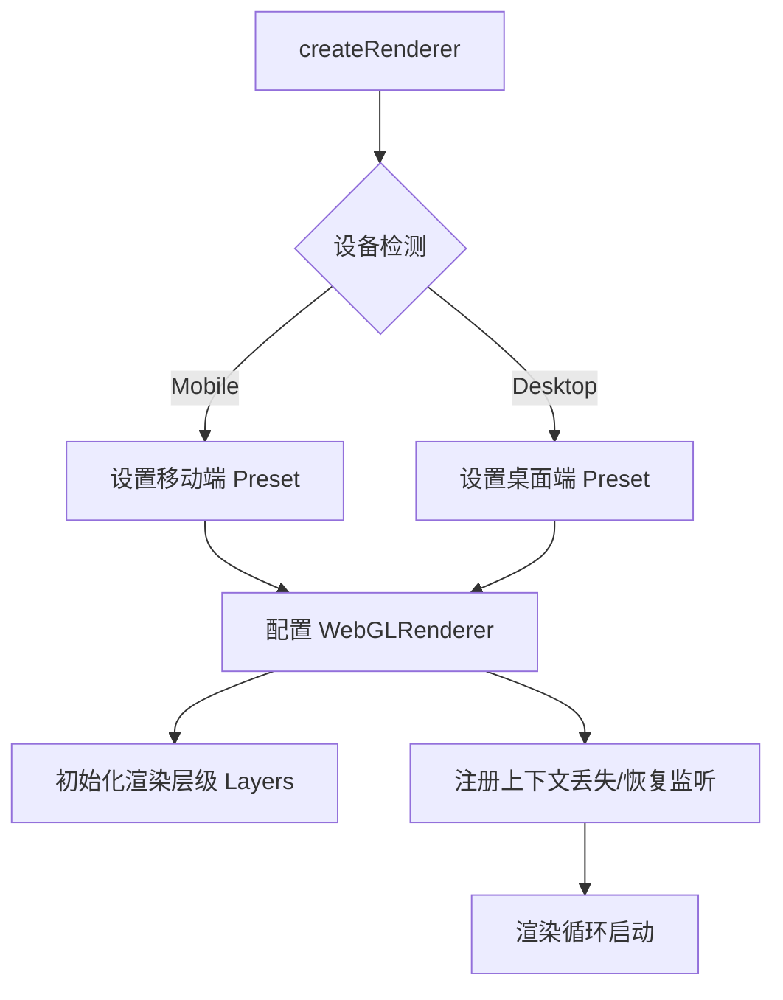
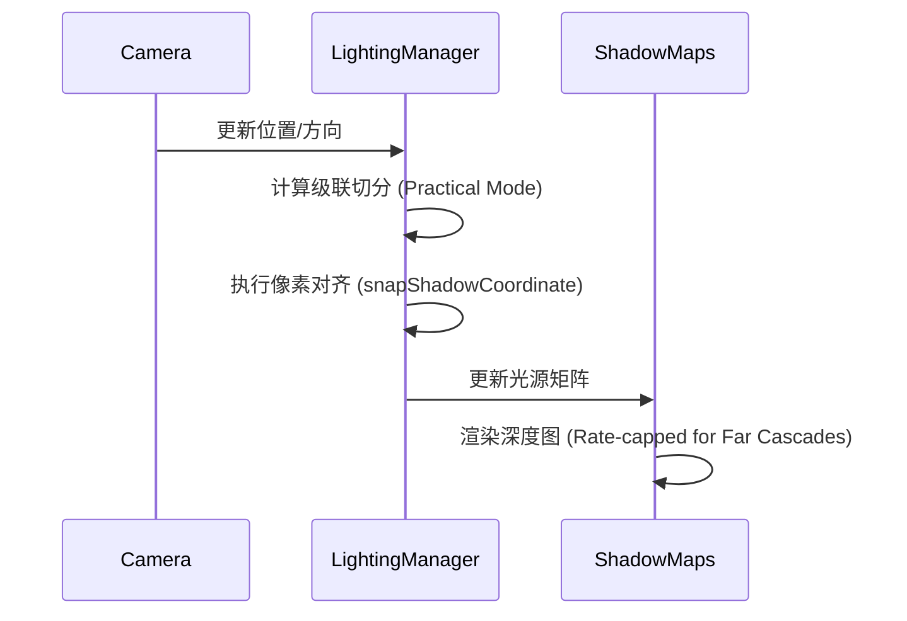
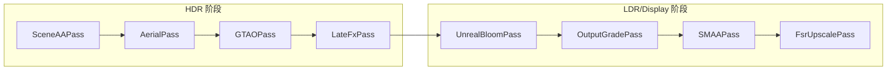
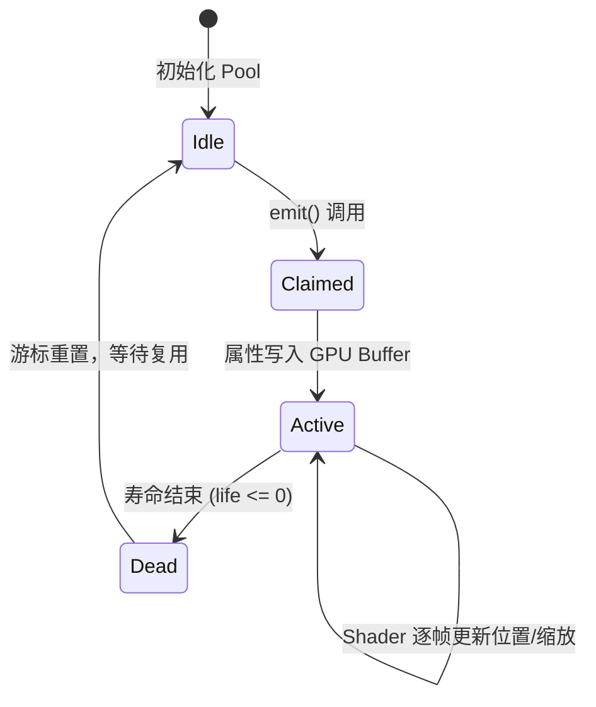
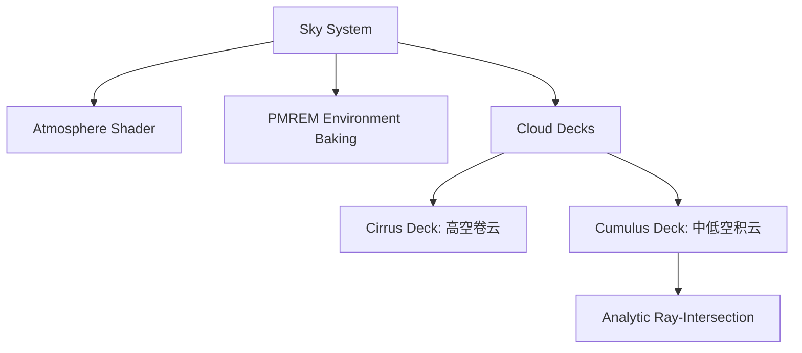
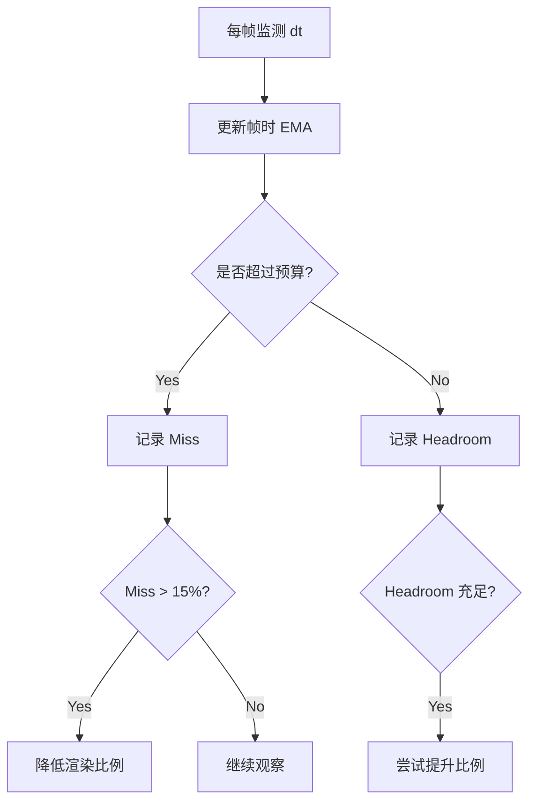

# 图形渲染与视觉效果

## 目录
1. [模块概览](#模块概览)
2. [渲染器核心与生命周期](#渲染器核心与生命周期)
3. [光照系统与级联阴影 (CSM)](#光照系统与级联阴影-csm)
4. [后处理管线与视觉增强](#后处理管线与视觉增强)
5. [Shader 注入与自定义材质逻辑](#shader-注入与自定义材质逻辑)
6. [视觉特效与 GPU 粒子系统](#视觉特效与-gpu-粒子系统)
7. [天空、大气与云层渲染](#天空大气与云层渲染)
8. [自适应画质与性能策略](#自适应画质与性能策略)
9. [核心组件](#核心组件)
10. [文件参考](#文件参考)

## 模块概览

图形渲染与视觉效果模块是《Claude of Tanks》的视觉基石，负责将复杂的战场状态转化为高质量的实时图像。该模块基于 Three.js 构建，但通过深度定制 Shader 和渲染管线，实现了超越标准 WebGL 引擎的视觉表现力。

本模块涵盖了从底层渲染器配置到高级后处理特效的全过程，其核心目标是在保证 60 FPS（移动端）或 120 FPS（桌面端）流畅度的前提下，提供具有电影感的战场氛围。为了实现这一目标，引擎在 `src/engine` 中构建了一套高度模块化的渲染框架，而在 `src/fx` 中则实现了一套与物理引擎紧密耦合的特效系统。

**主要覆盖范围：**
- **渲染管线管理**：协调从场景渲染、阴影生成到后处理合成的完整流程。
- **高级光照与阴影**：实现大场景级联阴影（CSM）及基于物理的阴影着色修正。
- **大气散射与环境**：模拟真实的天空散射、高度雾以及动态云层。
- **高性能粒子系统**：利用 GPU 实例化技术实现大规模爆炸、烟雾与尘土效果。
- **动态画质调度**：基于帧时预算的自适应分辨率与特效降级策略。

**统计信息：**
- 涉及核心文件：约 40 个 TypeScript 文件。
- 主要子模块：`src/engine`（核心渲染逻辑）与 `src/fx`（视觉特效）。
- 关键技术：CSM, GTAO, FSR 1.0, GPU Instancing, Procedural Texturing, ACES Tone Mapping.

## 渲染器核心与生命周期

渲染器核心负责 WebGL 上下文的初始化、基础渲染状态配置以及与浏览器显示表面的交互。在 `renderer.ts` 中，引擎采用了非典型的配置方案，以支持复杂的后处理链。

### 渲染器配置原则

引擎禁用了 WebGLRenderer 的原生抗锯齿（`antialias: false`），因为场景并非直接呈现在默认帧缓冲区，而是渲染到 HDR 目标中进行多阶段处理。抗锯齿由管线末端的 SMAA 和 FSR 负责。这种做法避免了在每个后处理阶段都支付 MSAA 的带宽开销，显著提升了性能。



上述流程展示了渲染器的初始化顺序。特别值得注意的是上下文恢复机制：在移动端，当系统内存压力过大回收 GPU 资源时，引擎会捕获 `webglcontextlost` 事件。为了防止玩家在激战中因崩溃而丢失进度，引擎通过 `showContextLossOverlay` 展示品牌化的恢复界面，并在后台利用 `onRestored` 钩子重新加载纹理和着色器程序，确保战斗能够平滑继续。

### 颜色空间与色调映射

为了达到 AAA 级的视觉效果，引擎强制使用 sRGB 输出颜色空间和 ACES Filmic 色调映射。ACES 映射提供了极佳的对比度控制和高光滚降，使得坦克表面的金属质感和爆炸的高光更加真实。

```typescript
// src/engine/renderer.ts
renderer.outputColorSpace = THREE.SRGBColorSpace;
renderer.toneMapping = THREE.ACESFilmicToneMapping;
renderer.toneMappingExposure = 1.16; // 经过校准的曝光度，确保中性色调在 HDR 转换后保持稳定
```

**Section sources**:
- [renderer.ts](src/engine/renderer.ts)
- [quality.ts](src/engine/quality.ts)
- [resolutionPolicy.ts](src/engine/resolutionPolicy.ts)

## 光照系统与级联阴影 (CSM)

在广阔的坦克战场中，传统的单一阴影贴图无法同时兼顾近处的精细接触阴影和远处的建筑投影。`lighting.ts` 通过实现级联阴影贴图（CSM）解决了这一问题。

### CSM 架构与稳定性优化

引擎将视锥体划分为 4 个级联（移动端为 3 个），每个级联拥有独立的投影矩阵和阴影贴图。为了消除相机移动时的阴影抖动（Shimmering），引擎实现了像素级的投影对齐（Snapping）。



通过 `prepareStableCascades` 函数，引擎确保阴影投影的边缘始终落在阴影贴图的纹理像素边界上。此外，引擎还引入了级联间的平滑过渡（Fade），避免了玩家在移动过程中看到明显的阴影质量跳变。

### 阴影着色修正 (Shadow Density & Tint)

引擎通过修补 Three.js 的 `ShaderChunk`，引入了自定义的阴影环境光衰减（Shadow Ambient Dimming）。在现实中，阴影内部并非全黑，而是受天空散射光的影响呈现冷色调。

```glsl
// 阴影环境光修正逻辑
vec3 cotAmbDim = mix( vec3(0.8, 0.88, 1.0), vec3( 1.0 ), cotSunVis );
irradiance *= cotAmbDim; // 阴影内部的环境光会变暗且变蓝，模拟天空散射效果
```

这种处理确保了在强烈的阳光下，阴影内部依然保持细节可见，并且具有冷暖对比的艺术感。此外，引擎还为阴影贴图渲染实现了 per-instance culling，大幅减少了植被阴影渲染时的 Draw Call 数量。

**Section sources**:
- [lighting.ts](src/engine/lighting.ts)
- [shadowStability.ts](src/engine/shadowStability.ts)
- [shadowRefresh.ts](src/engine/shadowRefresh.ts)

## 后处理管线与视觉增强

后处理管线是视觉效果的“冲印室”，在 `post.ts` 中定义了一套严密的 HDR 处理链。这套管线不仅提升了画面表现力，还承担了重要的抗锯齿和重建任务。

### 后处理执行顺序

引擎采用 `EffectComposer` 组织管线，其顺序经过严格优化以避免深度伪影。



1.  **SceneAAPass**：在 HalfFloat HDR 目标中进行渲染。它利用了硬件 MSAA 的解析过程，为后续阶段提供高质量的颜色和深度缓冲。
2.  **AerialPass**：应用基于深度的空气透视。它模拟了光线穿过大气时的吸收和散射，使得远处的物体看起来更蓝、更模糊。
3.  **GTAOPass**：实现地面真实环境光遮蔽（GTAO）。相比传统的 SSAO，GTAO 提供了更准确的接触遮蔽，能有效增强坦克履带与地面、建筑墙角的空间感。
4.  **LateFxPass**：专门用于合成透明的战斗烟雾。通过在不透明世界处理完成后再渲染特效，解决了烟雾被错误地应用雾效或 AO 的问题。
5.  **OutputGradePass**：融合了色调映射、S 曲线对比度调整、冷暖分色（Split-toning）以及狙击镜边缘模糊。

### 时间轴重投影与降噪

对于 GTAO 这种高开销的 Pass，引擎采用了半分辨率渲染结合时间轴重投影（Temporal Reprojection）的技术。通过在 Shader 中对比当前帧与历史帧的深度值，引擎能够有效地累积遮蔽信息，消除由于采样不足导致的“噪点闪烁”（Boiling）。

**Section sources**:
- [post.ts](src/engine/post.ts)
- [temporalAoPolicy.ts](src/engine/temporalAoPolicy.ts)
- [renderScalePolicy.ts](src/engine/renderScalePolicy.ts)

## Shader 注入与自定义材质逻辑

为了实现特定的视觉特性（如植被随风摆动、地形多层混合），引擎大量使用了 Shader 注入技术。这避免了编写完全自定义的 Shader 素材，同时保留了 Three.js 标准光照模型的优势。

### 材质钩子机制

在 `lighting.ts` 的 `setupShadowMaterial` 中，引擎展示了如何将自定义逻辑注入到标准材质中。

```typescript
// src/engine/lighting.ts
export function setupShadowMaterial(mat: THREE.Material, extraHook: Function | null = null) {
  csm.setupMaterial(mat); // CSM 注入基础阴影逻辑
  if (extraHook) {
    const csmHook = mat.onBeforeCompile;
    mat.onBeforeCompile = (shader, rdr) => {
      csmHook(shader, rdr);
      extraHook(shader, rdr); // 注入额外的业务逻辑，如风力摆动
    };
  }
  return mat;
}
```

### 覆盖率保持的 Mipmaps

对于带有 Alpha 测试的植被纹理，引擎实现了一套自定义的 Mipmap 生成算法（`buildCoverageMipmaps`）。传统的 GPU 生成方式会导致远处的草丛因为 Alpha 均值化而消失或变成实心方块。该算法通过调整每一级 Mipmap 的 Alpha 阈值，确保在任何距离下植被的剪影覆盖率保持一致。

**Section sources**:
- [lighting.ts](src/engine/lighting.ts)
- [materials.ts](src/engine/renderer.ts) (部分逻辑)

## 视觉特效与 GPU 粒子系统

战斗中的爆炸、开火和尘土通过 `src/fx` 目录下的系统实现。为了支持成千上万的粒子，引擎采用了基于 GPU 实例化的粒子池。

### 粒子池管理 (Ring-Buffer Pooling)

粒子系统使用循环缓冲区（Ring-Buffer）管理生命周期，避免了频繁的内存分配和垃圾回收。



### 软粒子渲染 (Soft Particles)

为了解决粒子与地面交界处的硬边缘问题，引擎在 `particles.ts` 中实现了软粒子技术。通过在 Shader 中对比当前粒子的深度与 `LateFxPass` 提供的场景深度，实现了平滑的相交过渡。这对于表现贴地的烟雾和尘土至关重要。

```glsl
// 软粒子深度融合逻辑
float sceneZ = readDepth(vUv);
float particleZ = vViewZ;
float fade = clamp((sceneZ - particleZ) * uSoftInvRange, 0.0, 1.0);
gl_FragColor.a *= fade;
```

**Section sources**:
- [particles.ts](src/fx/particles.ts)
- [effects.ts](src/fx/effects.ts)

## 天空、大气与云层渲染

天空模块（`sky.ts`）提供了一个动态的背景系统，支持程序化的散射模拟和云层渲染。

### 云层几何体优化

传统的云层通常使用巨大的球壳，但这会导致地平线处的云层看起来被拉伸。引擎采用了“地平线扁平化圆顶”（Horizon-flattened Domes），结合解析射线相交算法，实现了物理上更准确的云层透视。



云层纹理通过多层噪声滚动（Decorrelation Offset）实现动态流动，并根据太阳方位进行相位着色，营造出真实的明暗变化。PMREM（Prefiltered Mipmapped Radiance Environment Map）技术则确保了场景中的坦克能够准确反射天空的颜色和亮度。

**Section sources**:
- [sky.ts](src/engine/sky.ts)

## 自适应画质与性能策略

为了在各种硬件上保持稳定的帧率，引擎实现了一套复杂的自适应画质策略。这套系统在 `adaptiveQualityPolicy.ts` 中定义，能够实时响应性能波动。

### 动态分辨率调度 (Dynamic Resolution Governor)

调度器监控每一帧的渲染耗时（EMA 均值），并根据预设的帧时预算（如 16.6ms）动态调整渲染比例。

1.  **预算评估**：识别当前显示的刷新率（60/120Hz），设定目标预算。
2.  **触发降级**：如果连续多帧超过预算的 15%，步进降低 `dynScale`。这会直接改变 `EffectComposer` 的渲染分辨率。
3.  **性能修剪 (Trim)**：如果降低分辨率仍不足以维持帧率，则开始关闭高耗能特效（如 GTAO）。
4.  **回升保护**：只有当性能有充足余量且持续一段时间后，才会尝试回升画质，防止帧率剧烈波动（Flapping）。



### FSR 1.0 上采样

当系统为了性能降低分辨率时，`FsrUpscalePass` 会介入。它实现了 AMD FSR 1.0 的 EASU（Edge Adaptive Spatial Upsampling）和 RCAS（Robust Contrast Adaptive Sharpening）算法，能够在低分辨率输入下重建出接近原生画质的清晰图像，特别是在保护坦克边缘细节方面效果显著。

**Section sources**:
- [quality.ts](src/engine/quality.ts)
- [adaptiveQualityPolicy.ts](src/engine/adaptiveQualityPolicy.ts)
- [resolutionPolicy.ts](src/engine/resolutionPolicy.ts)

## 核心组件

### WebGLRenderer 工厂
负责创建并配置基础渲染器，处理移动端 DPR 适配和上下文丢失逻辑。它还配置了 ACES 色调映射和统一的曝光参数。
- **位置**: `src/engine/renderer.ts`

### CSM 阴影管理器
驱动级联阴影的计算、对齐和 Shader 注入。它拥有独立的阴影刷新调度器，能够根据级联距离动态调整刷新频率。
- **位置**: `src/engine/lighting.ts`

### EffectComposer 管线
组织 HDR 渲染序列，管理各级后处理 Pass 的生命周期。它是整个渲染流程的指挥中心。
- **位置**: `src/engine/post.ts`

### GPU 粒子引擎
基于实例化的粒子池，负责特效的发射、模拟与渲染。通过自定义 Shader 实现了软粒子和光照交互。
- **位置**: `src/fx/particles.ts`

### 画质调度器
基于性能反馈的闭环控制系统，动态调整渲染参数。它包含了分辨率缩放逻辑和特效裁剪阶梯。
- **位置**: `src/engine/adaptiveQualityPolicy.ts`

## 文件参考

| 文件路径 | 描述 |
| :--- | :--- |
| `src/engine/renderer.ts` | 渲染器初始化与 WebGL 上下文管理。 |
| `src/engine/lighting.ts` | CSM 阴影系统与光照平衡逻辑。 |
| `src/engine/post.ts` | 后处理管线（HDR, GTAO, Bloom, SMAA）。 |
| `src/engine/quality.ts` | 画质预设与设备分级定义。 |
| `src/engine/sky.ts` | 程序化天空与云层渲染。 |
| `src/fx/particles.ts` | GPU 加速粒子系统实现。 |
| `src/fx/effects.ts` | 战斗视觉效果编排（开火、爆炸）。 |
| `src/engine/adaptiveQualityPolicy.ts` | 自适应画质决策引擎。 |
| `src/engine/shadowStability.ts` | 阴影像素对齐与稳定性算法。 |
| `src/engine/renderLayers.ts` | 渲染层级定义（阴影层、特效层）。 |
| `src/engine/resolutionPolicy.ts` | 输出分辨率预算与像素比策略。 |
| `src/engine/temporalAoPolicy.ts` | 时间轴 AO 重投影与降噪策略。 |
