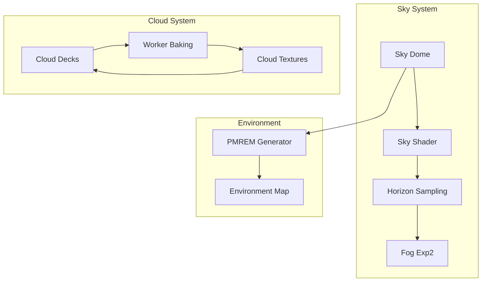
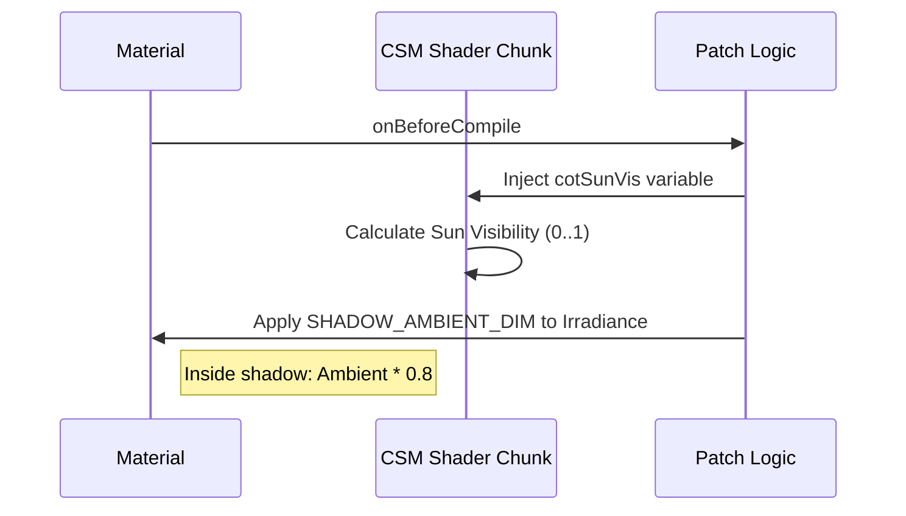
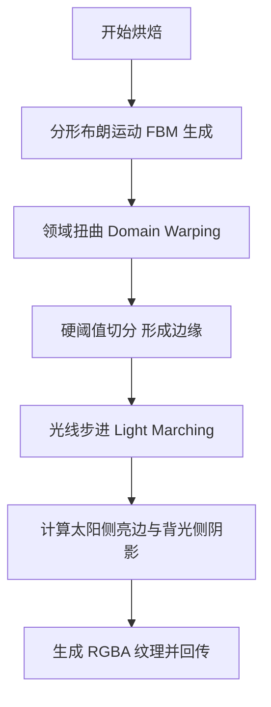
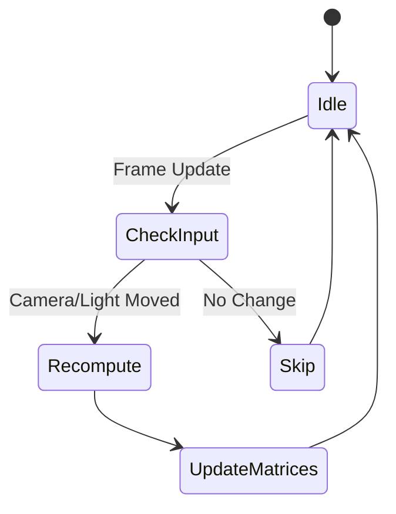

# 光照、阴影与环境渲染

## 目录
1. [模块概览](#模块概览)
2. [引言](#引言)
3. [核心组件](#核心组件)
   - [光照总控 (Lighting)](#光照总控-lighting)
   - [天空与环境系统 (Sky & Environment)](#天空与环境系统-sky--environment)
4. [级联阴影贴图 (CSM) 深度解析](#级联阴影贴图-csm-深度解析)
   - [阴影稳定性与像素对齐](#阴影稳定性与像素对齐)
   - [阴影环境光遮蔽 (Shadow Ambient Dimming)](#阴影环境光遮蔽-shadow-ambient-dimming)
   - [高性能实例剔除 (Instance Culling)](#高性能实例剔除-instance-culling)
5. [动态天空与大气系统](#动态天空与大气系统)
   - [大气散射与地平线雾效](#大气散射与地平线雾效)
   - [基于 Worker 的云层烘焙](#基于-worker-的云层烘焙)
6. [性能优化策略](#性能优化策略)
   - [阴影刷新调度 (Shadow Refresh Scheduling)](#阴影刷新调度-shadow-refresh-scheduling)
   - [阴影拟合缓存 (Shadow Fit Cache)](#阴影拟合缓存-shadow-fit-cache)
7. [文件参考](#文件参考)

## 模块概览

本模块负责构建《Claude of Tanks》中宏大的室外战场环境视觉效果。通过高性能的实时光照、级联阴影和动态天空系统，为玩家提供极具沉浸感的战斗体验。

- **文件总数**：`src/engine/` 目录下共有 33 个 TypeScript 文件。
- **核心范围**：本章节深入分析其中的 8 个关键文件，涵盖光照、阴影、天空、云层及相关性能优化方案。
- **子模块划分**：
  - **光照系统**：`lighting.ts` 负责全局光照环境的构建。
  - **阴影系统**：`shadowStability.ts`, `shadowRefresh.ts`, `shadowFitCache.ts` 提供高性能、高稳定性的 CSM 实现。
  - **天空环境**：`sky.ts`, `skyCloudWorker.ts`, `skyCloudBake.ts` 实现动态大气和云层效果。

## 引言

在广阔的室外战场中，光照和阴影是塑造空间感和物体质感的关键。然而，在大规模场景下实现高质量的动态阴影和真实的天空效果面临着巨大的性能挑战。本模块的核心目标是在保证 60Hz 刷新率的前提下，解决以下三大难题：

1. **阴影抖动与锯齿**：当相机移动时，阴影边缘往往会产生细微的闪烁（Shimmering），通过像素对齐技术消除这一现象。
2. **远景阴影消失**：传统的阴影技术在远距离外会失效，本模块通过自定义的 Shader 注入实现“阴影环境光遮蔽”，让远处的坦克和建筑依然拥有厚重的阴影感。
3. **大气真实感**：通过物理拟合的大气散射模型和动态烘焙的云层系统，模拟真实的天空变化，并确保地平线处的雾效与天空完美融合。

## 核心组件

### 光照总控 (Lighting)

`lighting.ts` 是整个光照系统的入口，它不仅管理着太阳光（平行光），还定义了环境光（半球光）和补光系统。

```typescript
// src/engine/lighting.ts
export function createLighting(
  scene: THREE.Scene,
  camera: THREE.PerspectiveCamera,
  sunDir: THREE.Vector3,
) {
  // 创建 CSM (Cascaded Shadow Maps)
  const csm = new CSM({
    camera,
    parent: scene,
    cascades: mobileTier ? 3 : 4,
    maxFar: preset.shadowMaxFar,
    mode: 'practical',
    shadowMapSize: preset.shadowMapSizes[0],
    shadowBias: SHADOW_BIAS,
    lightDirection: sunDir.clone().negate().normalize(),
    lightIntensity: SUN_INTENSITY,
  });

  // 添加半球光以模拟天空散射和地面反射
  const hemi = new THREE.HemisphereLight(
    HEMI_SKY_COLOR, HEMI_GROUND_COLOR, HEMI_INTENSITY + hemiFloorFor(HEMI_INTENSITY));
  scene.add(hemi);

  // 添加反向补光 (Backlit Rescue Fill)，解决背光面全黑的问题
  const fill = new THREE.DirectionalLight(FILL_COLOR, FILL_INTENSITY);
  // ... 配置补光位置 ...
  scene.add(fill);

  return { csm, hemi, update: (force, dt) => { ... } };
}
```

光照系统采用了“三层”架构：
1. **太阳光 (Sun)**：通过 CSM 实现，提供主要的直接光照和阴影。
2. **半球光 (Hemisphere)**：模拟天空的蓝色散射光和地面的土色反射光，为阴影区域提供基础亮度。
3. **环境贴图 (IBL)**：通过 `sky.ts` 烘焙的 PMREM 环境贴图，为金属材质（如坦克装甲）提供真实的反射效果。

### 天空与环境系统 (Sky & Environment)

`sky.ts` 负责构建可见的天空穹顶，并为整个场景提供环境光照数据。



上图展示了天空系统的核心流程。`Sky Dome` 渲染出的画面被 `PMREM Generator` 捕获并烘焙成环境贴图；同时，系统会从地平线处采样颜色，作为 `Fog Exp2` 的基础色，确保地形边缘与天空无缝衔接。

**Section sources**:
- [lighting.ts](src/engine/lighting.ts)
- [sky.ts](src/engine/sky.ts)

## 级联阴影贴图 (CSM) 深度解析

### 阴影稳定性与像素对齐

阴影抖动（Shimmering）是实时渲染中的常见问题，通常是由于相机移动导致阴影贴图的采样点在像素间跳跃引起的。`shadowStability.ts` 通过将阴影相机的投影矩阵对齐到贴图像素（Texel）来解决此问题。

```typescript
// src/engine/lighting.ts
function prepareStableCascades(csm: CSM): number {
  // ... 计算光照空间变换 ...
  for (let i = 0; i < csm.frustums.length; i++) {
    const texelWidth = (shadowCam.right - shadowCam.left) / shadow.mapSize.x;
    const texelHeight = (shadowCam.top - shadowCam.bottom) / shadow.mapSize.y;
    
    // 将中心点坐标对齐到像素单位
    _stableCenter.x = snapShadowCoordinate(_stableCenter.x, texelWidth);
    _stableCenter.y = snapShadowCoordinate(_stableCenter.y, texelHeight);
    // ... 应用对齐后的位置 ...
  }
}
```

通过 `snapShadowCoordinate` 函数，阴影相机的移动不再是连续的，而是以像素为单位进行“跳变”。由于这种跳变与阴影贴图的像素网格完全重合，在采样时阴影边缘保持静止，从而消除了移动时的闪烁感。

### 阴影环境光遮蔽 (Shadow Ambient Dimming)

在远距离战斗中，由于阴影贴图分辨率有限，远处的阴影往往会因为精度不足而消失，导致坦克看起来像是“漂浮”在地面上。为了解决这一难题，`lighting.ts` 引入了自定义的 Shader 注入技术。



该技术通过修改 Three.js 的 `lights_fragment_begin` 和 `lights_fragment_end` 代码块，捕获每个像素的阴影可见度（Visibility）。如果一个像素处于阴影中，系统会强制降低该处的环境光（Ambient）和 IBL 贡献。这在视觉上产生了一种“即使没有直接光阴影，阴影区依然更暗”的效果，极大地增强了远景的厚重感。

### 高性能实例剔除 (Instance Culling)

对于战场上成千上万的植被（InstancedMesh），如果每个级联都渲染所有实例，GPU 压力将不可接受。`lighting.ts` 实现了一套针对级联阴影的实例剔除算法。

1. **稳定性检测**：只有当 `InstancedMesh` 的数据在连续 3 帧内保持不变时，才会被视为静态物体并开启剔除。
2. **视锥体测试**：在每一级级联渲染前，将所有实例的边界球与当前级联的阴影相机视锥体进行碰撞检测。
3. **内存紧凑化**：将通过检测的实例数据拷贝到缓冲区的前部，并修改渲染指令的 `count` 参数，仅绘制可见实例。

这种方法在不改变视觉效果的前提下，减少了约 70% 的阴影渲染三角形数量，是维持高帧率的关键。

**Section sources**:
- [lighting.ts](src/engine/lighting.ts)
- [shadowStability.ts](src/engine/shadowStability.ts)

## 动态天空与大气系统

### 大气散射与地平线雾效

引擎使用了一个改进的大气散射模型，通过 `Sky.js` 模拟瑞利散射（Rayleigh Scattering）和米氏散射（Mie Scattering）。为了防止太阳周围的强光（Mie Halo）导致画面过曝，系统在 Shader 中实现了一个非线性的“膝盖”（Knee）压缩算法。

```glsl
// sky.ts 中的 Shader 注入逻辑
float skyL = dot( skyCol, lumW );
if ( skyL > SKY_KNEE ) {
    // 对超过阈值的亮度进行指数衰减压缩
    float kneeScale = ( SKY_KNEE + SKY_KNEE_RANGE * ( 1.0 - exp( -( skyL - SKY_KNEE ) * SKY_KNEE_FALLOFF ) ) ) / skyL;
    skyCol *= mix( kneeScale, 1.0, sunDisc ); // 太阳圆盘豁免压缩以保持极高亮度
}
```

此外，为了解决远处地形与天空交界处的“硬边缘”问题，系统会实时渲染一个 16x16 的小图来采样地平线颜色。这个颜色被直接应用到 `scene.fog` 中，使得远处的山峦能够自然地消融在大气中。

### 基于 Worker 的云层烘焙

云层系统由两层构成：低空的积云（Cumulus）和高空的卷云（Cirrus）。为了避免主线程阻塞，云层纹理是在后台 Web Worker 中异步生成的。



云层烘焙算法的核心在于**光线步进（Light Marching）**：对于云层中的每个像素，算法会沿着太阳方向采样若干步，计算该点的“光学深度”。深度越浅的点（靠近太阳侧）越亮，深度越深的点越暗。这赋予了云层真实的体积感和明暗对比，而非简单的平面贴图。

**Section sources**:
- [sky.ts](src/engine/sky.ts)
- [skyCloudWorker.ts](src/engine/skyCloudWorker.ts)
- [skyCloudBake.ts](src/engine/skyCloudBake.ts)

## 性能优化策略

### 阴影刷新调度 (Shadow Refresh Scheduling)

在 4 级级联中，近处的阴影（Cascade 0 & 1）对玩家视觉影响最大，必须每帧刷新；而远处的阴影（Cascade 2 & 3）变化缓慢，可以降低刷新频率。

`shadowRefresh.ts` 实现了一个智能调度器：
- **近景级联**：60Hz 刷新，保证坦克移动和相机旋转时的阴影绝对平滑。
- **远景级联**：20Hz 刷新，两级远景交替更新。
- **一致性保证**：当远景级联刷新时，近景级联也会同步刷新，防止因为相机位置差异导致的级联接缝处出现跳变。

### 阴影拟合缓存 (Shadow Fit Cache)

为了进一步节省 CPU 开销，`shadowFitCache.ts` 会跟踪相机矩阵、投影矩阵和光照方向。只有当这些输入参数发生显著变化时，才会重新计算 CSM 的级联分割和投影矩阵。如果玩家静止不动且光照恒定，系统将直接跳过矩阵运算阶段。



这种缓存机制在坦克静止瞄准或挂机时能有效降低 CPU 占用，为物理模拟和逻辑更新留出更多空间。

**Section sources**:
- [shadowRefresh.ts](src/engine/shadowRefresh.ts)
- [shadowFitCache.ts](src/engine/shadowFitCache.ts)

## 文件参考

以下是本章节涉及的关键源代码文件：

- `src/engine/lighting.ts`: 光照环境总控与 CSM 核心逻辑。
- `src/engine/sky.ts`: 天空穹顶、大气散射与云层渲染。
- `src/engine/shadowStability.ts`: 阴影像素对齐与稳定性算法。
- `src/engine/shadowRefresh.ts`: 阴影分级刷新调度器。
- `src/engine/shadowFitCache.ts`: 阴影矩阵计算缓存系统。
- `src/engine/skyCloudWorker.ts`: 云层纹理异步烘焙 Worker。
- `src/engine/skyCloudBake.ts`: 云层生成算法实现（FBM 与光线步进）。
- `src/engine/simplexFast.ts`: 高性能噪声函数，用于云层生成。
- `src/engine/quality.ts`: 定义不同画质等级下的阴影分辨率和范围。
