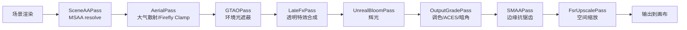
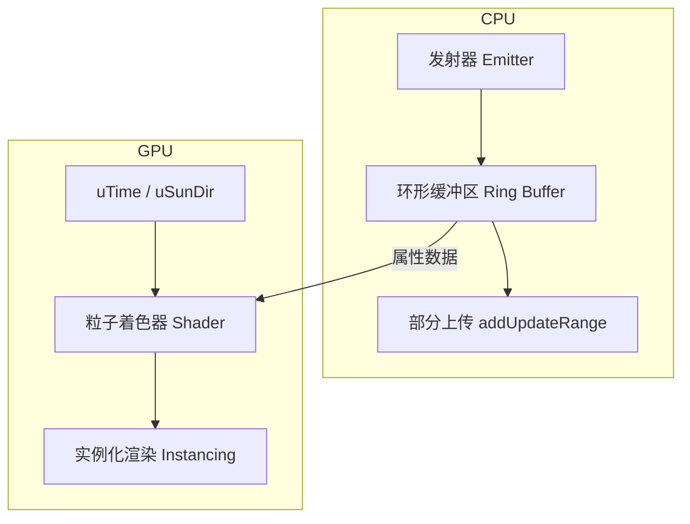
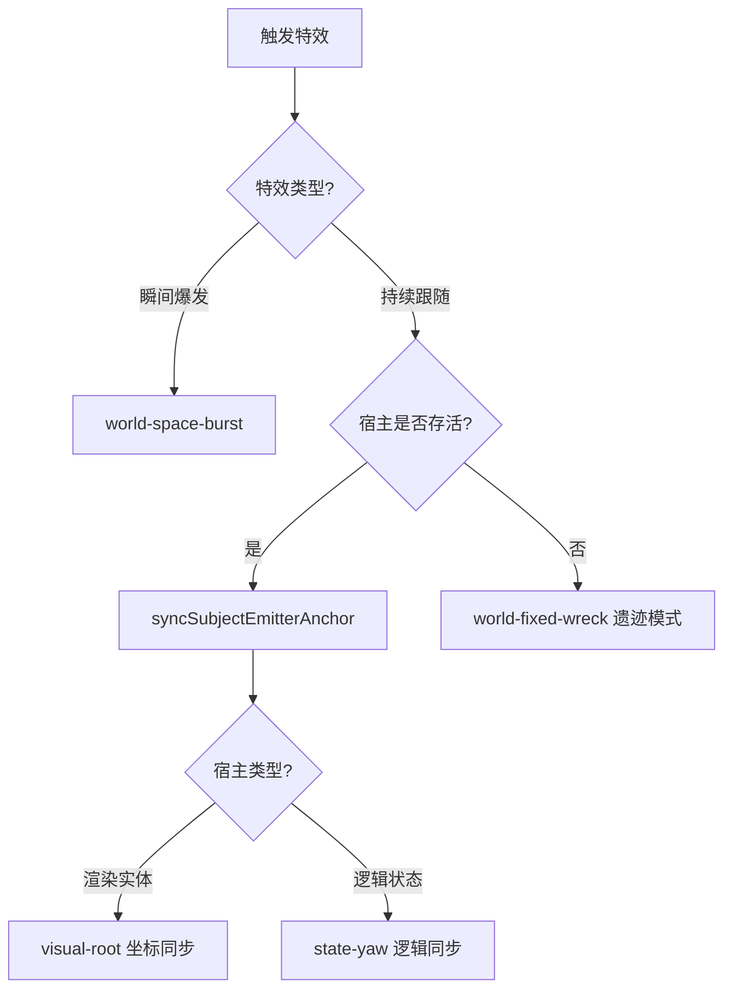

# 后处理与视觉特效系统

## 目录
1. [模块概览](#模块概览)
2. [引言](#引言)
3. [后处理管线 (Post-processing Pipeline)](#后处理管线-post-processing-pipeline)
   - [管线架构与执行顺序](#管线架构与执行顺序)
   - [关键后处理阶段解析](#关键后处理阶段解析)
4. [GPU 粒子系统 (Particle Engine)](#gpu-粒子系统-particle-engine)
   - [核心机制：GPU 实例化与环形缓冲区](#核心机制gpu-实例化与环形缓冲区)
   - [粒子类型与着色器逻辑](#粒子类型与着色器逻辑)
5. [打击反馈与贴花系统 (Impact Decals)](#打击反馈与贴花系统-impact-decals)
6. [特效生命周期与同步 (FX Lifecycle & Sync)](#特效生命周期与同步-fx-lifecycle--sync)
   - [特效挂载策略](#特效挂载策略)
   - [共享时钟与确定性](#共享时钟与确定性)
7. [性能优化与自适应质量控制](#性能优化与自适应质量控制)
   - [动态分辨率缩放 (Dynamic Resolution)](#动态分辨率缩放-dynamic-resolution)
   - [渲染层级与软粒子](#渲染层级与软粒子)
8. [开发指南：添加新型特效](#开发指南添加新型特效)
9. [文件参考](#文件参考)

## 模块概览

本模块负责游戏的视觉增强层，包括电影级的后处理管线和高性能的 GPU 粒子特效系统。通过这些技术，游戏实现了真实的战场氛围、打击反馈以及高效的渲染性能。

- **总文件数**: 约 10 个 TypeScript 文件。
- **核心目录**:
  - `src/engine/post.ts`: 后处理管线的核心实现。
  - `src/fx/`: 特效系统的完整目录，包含粒子、贴花、时钟管理等。
- **主要子模块**:
  - **后处理链**: 涵盖从 MSAA 解析到 FSR1 缩放的完整流程。
  - **粒子引擎**: 基于 GPU 实例化的成千上万个粒子的渲染与动画。
  - **贴花系统**: 处理坦克装甲上的弹孔和烧灼痕迹。
  - **自适应质量**: 根据帧率动态调整渲染分辨率和特效等级。

## 引言

视觉特效（VFX）和后处理是提升游戏沉浸感的关键。在《Claude of Tanks》中，该系统不仅追求视觉上的华丽，更注重在各种硬件设备上的性能表现。通过将复杂的粒子计算移至 GPU，并采用分层渲染策略，系统能够在保持高帧率的同时，呈现出爆炸、烟雾、火花等高负载视觉效果。后处理管线则通过色调映射（Tone Mapping）、辉光（Bloom）和抗锯齿（SMAA/MSAA）等技术，将原始渲染画面转化为具有电影质感的最终图像。

## 后处理管线 (Post-processing Pipeline)

后处理管线是渲染流程的最后一步，它对场景颜色进行一系列滤镜处理。

### 管线架构与执行顺序

游戏的后处理链采用了高度优化的顺序，以确保视觉质量和带宽效率的平衡。

下面的流程图展示了从场景渲染到最终输出的完整后处理步骤：

整个流程从 `SceneAAPass` 开始，它负责将多重采样（MSAA）的 HDR 目标解析为单采样的缓冲区，从而避免后续的全屏 Pass 支付昂贵的 MSAA 带宽代价。随后是大气透视（Aerial Perspective）、环境光遮蔽（GTAO）和透明特效的合成。最后阶段包括辉光、色彩分级（Color Grading）、SMAA 抗锯齿以及 AMD FSR1 空间缩放。

### 关键后处理阶段解析

1.  **大气透视 (Aerial Perspective)**:
    通过 `AerialShader` 实现，根据深度缓冲区为像素添加距离相关的色彩偏移。它模拟了光线在空气中散射的效果，使远处的物体看起来更蓝、更淡，增强了战场的空间深度感。此外，它还包含一个 "Firefly Clamp" 逻辑，用于抑制亚像素级别的 HDR 高亮闪烁。

2.  **GTAO (Ground Truth Ambient Occlusion)**:
    相比传统的 SSAO，GTAO 提供了更准确的遮蔽效果，能够更好地表现坦克与地面、建筑基座之间的接触阴影（Contact Shadow），增强物体的体积感。

3.  **色彩分级与 ACES 映射 (OutputGradePass)**:
    这是决定游戏视觉风格的核心步骤。它将 HDR 线性空间映射到显示设备的 sRGB 空间，并应用 ACES 电影级色调映射。同时，它还实现了冷暖对比的调色逻辑：高光偏暖，阴影偏冷，营造出经典的 3A 坦克游戏氛围。

4.  **FSR1 缩放 (FsrUpscalePass)**:
    集成 AMD FidelityFX Super Resolution 1.0，包含 EASU（边缘自适应空间上采样）和 RCAS（对比度自适应锐化）。这允许游戏在较低的分辨率下渲染 3D 场景，然后高质量地放大到原生分辨率，显著提升了移动端和低端 PC 的帧率。

**Section sources**:
- [post.ts](src/engine/post.ts)
- [layers.ts](src/fx/layers.ts)

## GPU 粒子系统 (Particle Engine)

粒子系统负责爆炸、烟雾、尘土和火花等动态效果。

### 核心机制：GPU 实例化与环形缓冲区

为了在每一帧处理成千上万个粒子，系统采用了 `THREE.InstancedBufferGeometry`。CPU 只负责在粒子出生时将属性（位置、速度、寿命、颜色等）写入内存缓冲区，而粒子的动画逻辑（位移、缩放、颜色演变、消亡）完全在 GPU 着色器中通过 `uTime` 统一驱动。

下面的架构图展示了粒子引擎的内部结构：

粒子池（Pool）具有固定的容量（如烟雾 2048、火灾 1024），采用环形缓冲区管理。当新粒子产生时，它会覆盖池中最旧的粒子。这种设计消除了运行时的内存分配和垃圾回收压力。

### 粒子类型与着色器逻辑

系统定义了多种专门的粒子类型，每种都有独特的着色器行为：

-   **Puff (烟/火/尘)**: 使用序列帧贴图（Flipbook Texture），在粒子寿命期间循环播放。着色器支持受光计算（模拟体积感）和侵蚀消失（Erosion Dissolve）效果。
-   **Streak (火花/跳弹)**: 沿速度方向拉伸的广告牌，模拟高速运动的视觉残留。
-   **Jet (喷流)**: 专门用于坦克炮口制退器排出的锥形火光，具有特定的轴向对齐逻辑。
-   **Debris (碎片)**: 实例化的 3D 几何体，具有随机的形状和旋转，模拟坦克爆炸后飞散的装甲碎片。

**Section sources**:
- [particles.ts](src/fx/particles.ts)

## 打击反馈与贴花系统 (Impact Decals)

打击反馈是坦克战斗的核心体验。`impactDecals.ts` 负责在坦克装甲和地面生成持久的视觉痕迹。

该系统通过以下方式优化性能：
1.  **纹理图集 (Atlas)**: 在启动时将各种弹孔（穿透、未穿透、碎裂等）烘焙到一个大的画布纹理中。
2.  **分层管理**: 每个坦克都有自己的贴花环（Decal Ring），确保贴花能够随坦克移动和旋转。
3.  **批处理渲染**: 所有的打击痕迹都合并到少数几个渲染调用中，避免了为每个弹孔创建独立对象的开销。

**Section sources**:
- [impactDecals.ts](src/fx/impactDecals.ts)

## 特效生命周期与同步 (FX Lifecycle & Sync)

特效的生命周期管理对于系统的稳定性至关重要。

### 特效挂载策略

在 `effectAttachments.ts` 中定义了多种挂载策略（Policy），决定了特效如何跟随其宿主（如坦克）：

-   `world-space-burst`: 瞬间触发的特效，在世界空间生成后即与宿主脱离（如爆炸）。
-   `subject-local-emitter`: 持续性的发射器，其源点跟随宿主，但已产生的粒子保留在世界空间（如坦克着火）。
-   `caller-refreshed-emitter`: 由调用者每帧更新位置的特效（如履带扬尘）。

下面的决策树展示了系统如何选择挂载模式：

### 共享时钟与确定性

`clock.ts` 提供了一个全局的 `fxNow()` 时钟。这个时钟是“可重基的”（Re-base Immune），这意味着在截图或慢动作回放时，可以手动锁定或步进特效时间，而不会导致粒子系统崩溃或时间错乱。这对于录制高质量的宣传片和调试复杂的战斗逻辑非常重要。

**Section sources**:
- [effectAttachments.ts](src/fx/effectAttachments.ts)
- [clock.ts](src/fx/clock.ts)
- [effects.ts](src/fx/effects.ts)

## 性能优化与自适应质量控制

为了确保在不同设备上都能流畅运行，系统包含了一套复杂的自适应机制。

### 动态分辨率缩放 (Dynamic Resolution)

`post.ts` 中的 `dynGovern` 函数是一个性能监控器。它跟踪每一帧的渲染耗时（EMA 均值），并根据设定的预算（如目标 60fps 对应 16.7ms）动态调整 `dynScale`。

-   如果帧率持续低于预算，系统会步进降低渲染分辨率（最低可降至原生的 60% 左右）。
-   如果性能恢复并保持稳定，系统会缓慢步进恢复分辨率。
-   这种缩放只影响 3D 场景，UI 和 HUD 始终保持原生清晰度。

### 渲染层级与软粒子

为了解决粒子与地形硬切的问题，系统采用了“软粒子”（Soft Particles）技术：

1.  **深度复制**: `LateFxPass` 在渲染特效前，先将已完成的场景深度复制一份。
2.  **深度相交测试**: 粒子着色器在渲染每个像素时，对比当前深度与复制的场景深度。如果两者接近，则淡化粒子透明度。
3.  **层级隔离**: 特效渲染在独立的 `LATE_FX_LAYER` (层级 30)，确保它们在后处理链的正确位置插入，既能受到雾气影响，又不会干扰 GTAO 的计算。

**Section sources**:
- [post.ts](src/engine/post.ts)
- [particles.ts](src/fx/particles.ts)

## 开发指南：添加新型特效

若要向游戏中添加一种新的特效（例如一种新型导弹的尾焰），请遵循以下步骤：

1.  **定义粒子池**: 如果现有的池（smoke, fire 等）不适用，在 `particles.ts` 的 `POOL_SIZES` 中定义新池。
2.  **创建特效配方**: 在 `effects.ts` 中编写一个新的 `spawn` 函数。该函数负责调用 `particles.emit` 并设置初始参数（位置、初速、颜色抖动等）。
3.  **配置挂载策略**: 在 `effectAttachments.ts` 的 `EFFECT_ATTACHMENT_POLICY` 中添加新特效的挂载方式。
4.  **注册事件监听**: 在 `effects.ts` 的 `createFx` 初始化逻辑中，将新特效绑定到相应的游戏事件（如导弹发射事件）。

> 💡 **提示**: 优先复用现有的粒子池。通过调整 `emit` 时的 `col0/col1` 和 `size0/size1` 参数，通常可以实现截然不同的视觉效果。

## 文件参考

本模块涉及的关键源文件如下：

-   `src/engine/post.ts`: 后处理管线核心逻辑，包含所有 Pass 的配置和动态分辨率管理。
-   `src/fx/effects.ts`: 特效系统的总入口，负责监听游戏事件并分发特效。
-   `src/fx/particles.ts`: GPU 粒子引擎实现，包含着色器代码和粒子池管理。
-   `src/fx/impactDecals.ts`: 打击贴花系统，处理装甲损伤视觉效果。
-   `src/fx/effectAttachments.ts`: 特效挂载策略和坐标同步逻辑。
-   `src/fx/clock.ts`: 特效专用共享时钟。
-   `src/fx/layers.ts`: 渲染层级定义。
-   `src/engine/quality.ts`: 质量预设定义，影响后处理参数。
-   `src/engine/renderScalePolicy.ts`: 渲染缩放策略配置。
