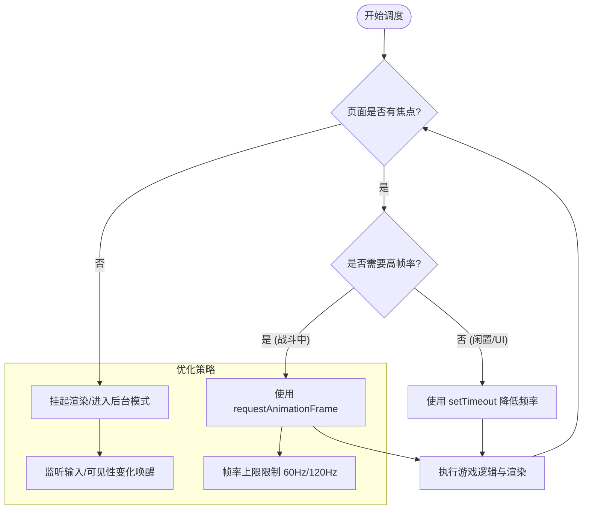
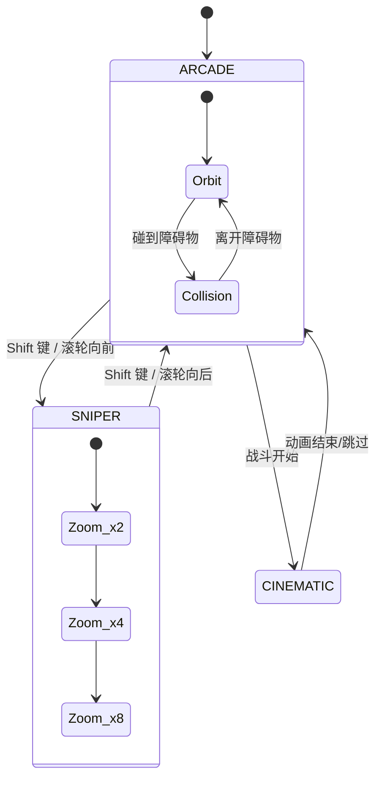
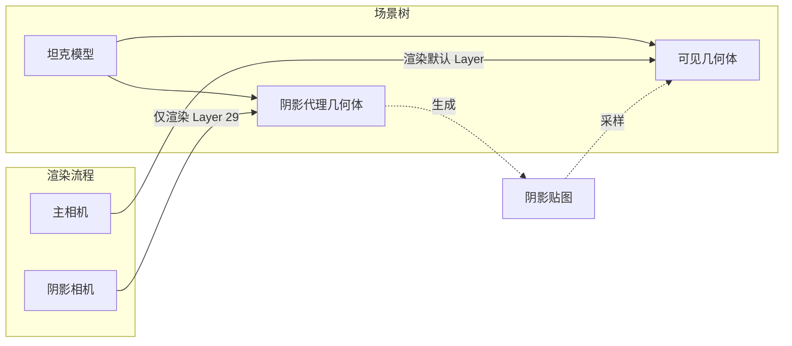

# 渲染器核心与生命周期

## 目录
1. [模块概览](#模块概览)
2. [渲染引擎简介](#渲染引擎简介)
3. [核心架构与组件](#核心架构与组件)
   - [GameRenderer：Three.js 集成](#gamerendererthreejs-集成)
   - [FrameLoopScheduler：帧循环调度](#frameloopscheduler帧循环调度)
   - [CameraRig：相机控制系统](#camerarig相机控制系统)
4. [引擎启动生命周期](#引擎启动生命周期)
5. [帧调度与性能优化机制](#帧调度与性能优化机制)
6. [GPU 资源管理与回收](#gpu-资源管理与回收)
7. [相机系统与视角切换](#相机系统与视角切换)
8. [渲染层级与阴影优化](#渲染层级与阴影优化)
9. [文件参考](#文件参考)

## 模块概览

`src/engine/` 目录是 Claude of Tanks 的图形与运行核心，负责从引擎启动到每一帧渲染的完整生命周期。该模块共包含 **33** 个 TypeScript 源文件，涵盖了渲染器配置、帧调度、相机逻辑、资源管理以及各种图形策略（如自适应质量、阴影管理、天空盒烘焙等）。

本页面将重点解析以下核心子模块：
- **核心渲染逻辑**：`renderer.ts`, `renderLayers.ts`, `viewportRuntime.ts`
- **生命周期与调度**：`bootLifecycle.ts`, `frameLoopScheduler.ts`
- **资源与相机系统**：`resourceLifetime.ts`, `cameraRig.ts`

其他辅助模块（如 `lighting.ts`, `post.ts`, `quality.ts`）将在后续章节中详细讨论，但在本章中会提及它们与核心引擎的集成方式。

## 渲染引擎简介

Claude of Tanks 的渲染引擎基于 **Three.js** 构建，但针对高性能 Web 游戏进行了深度定制。它不仅是一个简单的渲染封装，而是一个集成了资源生命周期管理、多级调度机制和复杂相机行为的完整运行环境。

引擎的设计目标是在保持视觉效果（AAA 级光影、ACES 色调映射、SMAA 抗锯齿）的同时，确保在移动端和低端设备上的流畅度。为此，引擎引入了以下关键特性：
- **确定性启动序列**：通过 `bootLifecycle` 确保资源加载、着色器预热和场景初始化按序进行。
- **智能帧调度**：`frameLoopScheduler` 能够根据页面可见性和用户活动自动切换渲染频率，减少后台功耗。
- **严格的资源回收**：针对移动端 GPU 内存敏感的特性，通过 `resourceLifetime` 强制执行资源预算和清理。
- **分层渲染优化**：利用 `renderLayers` 区分阴影代理几何体和可见物体，大幅降低 Draw Call。

## 核心架构与组件

渲染引擎的核心由几个关键类和接口组成，它们协同工作以驱动整个游戏的运行。

### GameRenderer：Three.js 集成

`GameRenderer` 是对 `THREE.WebGLRenderer` 的扩展，它配置了引擎所需的全局图形状态。

```typescript
// src/engine/renderer.ts
export function createRenderer(container: HTMLElement): GameRenderer {
  const renderer = new THREE.WebGLRenderer({
    antialias: false, // 抗锯齿由 post.ts 中的 MSAA/SMAA 处理
    powerPreference: 'high-performance',
    stencil: false,
  }) as GameRenderer;

  // 配置色彩空间与色调映射
  renderer.outputColorSpace = THREE.SRGBColorSpace;
  renderer.toneMapping = THREE.ACESFilmicToneMapping;
  renderer.toneMappingExposure = 1.16;
  
  // 开启阴影映射
  renderer.shadowMap.enabled = true;
  renderer.shadowMap.type = THREE.PCFShadowMap;

  container.appendChild(renderer.domElement);
  return renderer;
}
```

**关键点分析**：
- **抗锯齿策略**：禁用了 WebGL 默认的抗锯齿，转而使用后处理管线中的 MSAA 目标和 SMAA 算法，以便更好地控制渲染质量。
- **上下文恢复**：实现了 `webglcontextlost` 监听器，在移动端系统回收内存时提供品牌化的恢复界面。

### FrameLoopScheduler：帧循环调度

调度器负责驱动 `requestAnimationFrame` 循环，它是引擎的心跳。

```typescript
// src/engine/frameLoopScheduler.ts
export function createFrameLoopScheduler(options: FrameLoopSchedulerOptions): FrameLoopScheduler {
  // ...
  const scheduleAnimation = () => {
    if (disposed || frameQueued) return;
    if (isBackgrounded()) {
      // 页面不可见时挂起渲染
      return;
    }
    frameQueued = true;
    frameId = requestFrame((timestampMs) => {
      // 执行 tick 回调
      runTick(timestampMs);
      // ...
    });
  };
  // ...
}
```

### CameraRig：相机控制系统

`CameraRig` 实现了复杂的第三人称坦克视角（Arcade）和第一人称开镜视角（Sniper）。它不仅管理位置，还处理碰撞检测、地形跟随以及射击带来的视觉抖动。

**Section sources**:
- [renderer.ts](src/engine/renderer.ts)
- [frameLoopScheduler.ts](src/engine/frameLoopScheduler.ts)
- [cameraRig.ts](src/engine/cameraRig.ts)

## 引擎启动生命周期

引擎的启动是一个复杂的多阶段过程，由 `bootLifecycle.ts` 统一协调。它确保在进入首帧渲染之前，所有必要的资源（纹理、几何体、着色器）都已就绪。

下图展示了从 `createBootLifecycle` 到首帧渲染的典型生命周期流：

```mermaid
sequenceDiagram
    participant App as 应用程序主入口
    participant Boot as BootLifecycle
    participant Res as 资源加载器
    participant GPU as WebGLRenderer
    participant Loop as FrameLoopScheduler

    App->>Boot: createBootLifecycle()
    App->>Boot: run("imports", loading...)
    Boot->>Res: 加载核心资源
    Res-->>Boot: 资源就绪
    App->>Boot: run("renderer", createRenderer)
    Boot->>GPU: 初始化 WebGL 上下文
    App->>Boot: run("warmup", shaderWarmup)
    Boot->>GPU: 编译着色器/预热 GPU
    App->>Boot: run("scene", initScene)
    App->>Loop: start()
    Loop->>App: tick(timestamp)
    App->>GPU: render()
```

`BootLifecycle` 的核心设计在于它对“重型阶段”（Heavy Stage）的处理。如果一个初始化任务耗时超过 `heavyStageMs`（默认 20ms），它会自动通过 `yieldFrame()` 让出主线程，确保浏览器有机会更新 UI 或处理输入，防止启动过程中页面卡死。

**Diagram sources**: 
- [bootLifecycle.ts:L61-L78](src/engine/bootLifecycle.ts#L61-L78)
- [renderer.ts:L60-L150](src/engine/renderer.ts#L60-L150)

## 帧调度与性能优化机制

`FrameLoopScheduler` 不仅仅是一个简单的 `requestAnimationFrame` 封装，它包含了一套精密的策略来平衡性能与功耗。

该调度器维护了一个内部状态机，根据页面的焦点状态、可见性以及当前的游戏阶段（如车库 vs 战斗）来决定调度策略。



**关键优化点**：
1. **后台挂起**：当用户切换标签页或最小化窗口时，调度器会完全停止渲染循环，节省 CPU/GPU 资源。
2. **输入唤醒**：即使在低频“闲置”模式下，一旦检测到鼠标或触摸输入，调度器会立即触发一次渲染并尝试恢复高频循环。
3. **帧率平滑**：通过 `animationToleranceMs` 处理浏览器 rAF 触发时间的不稳定性，防止在 120Hz 屏幕上出现微小的卡顿感。

**Section sources**:
- [frameLoopScheduler.ts](src/engine/frameLoopScheduler.ts)

## GPU 资源管理与回收

在 Web 环境中，显存泄露是导致浏览器崩溃的主要原因。`resourceLifetime.ts` 提供了一套确定性的资源销毁机制。

与 Three.js 默认的垃圾回收不同，Claude of Tanks 显式追踪每一个 `BufferGeometry`、`Material` 和 `Texture`。

```typescript
// src/engine/resourceLifetime.ts 示例
export function disposeObject3DResources(
  root: Object3D,
  { preserveRoots = [] }: ResourceDisposalOptions = {},
): ResourceDisposalReceipt {
  const owned: ResourceBag = { geometries: new Set(), materials: new Set(), textures: new Set() };
  
  // 遍历场景树，收集所有 GPU 资源
  root.traverse((object) => {
    if (object.geometry) owned.geometries.add(object.geometry);
    // ... 收集材质和纹理
  });

  // 显式调用 dispose() 释放 WebGL 显存
  for (const geometry of owned.geometries) geometry.dispose();
  for (const material of owned.materials) material.dispose();
  for (const texture of owned.textures) texture.dispose();
  
  return receipt;
}
```

**资源预算策略**：
引擎根据设备等级（Desktop vs Mobile）定义了资源上限。例如，在移动端，引擎只允许保留 1 个世界场景和 2 个坦克预览模型。一旦超过此限制，最旧的资源将被强制销毁。这种策略确保了游戏在 2GB RAM 的旧款手机上也能稳定运行。

**Section sources**:
- [resourceLifetime.ts](src/engine/resourceLifetime.ts)

## 相机系统与视角切换

`CameraRig` 是引擎中最复杂的逻辑组件之一。它管理着玩家的“眼睛”，并确保视角切换平滑且符合直觉。

相机系统主要在两种模式间切换：
1. **ARCADE (第三人称)**：用于移动和观察战场，具有复杂的碰撞检测，防止相机穿透墙壁。
2. **SNIPER (第一人称开镜)**：用于精确瞄准，相机位于炮盾位置，视野（FOV）随倍率缩小。



**相机平滑处理**：
- **位置插值**：使用临界阻尼（Critically Damped）算法处理相机跟随，既没有延迟感也不会产生过冲。
- **视角对齐**：在开镜切换瞬间，引擎会通过射线检测（Raycast）保持准星瞄准的世界坐标不变，防止由于相机位置跳变导致准星“乱跳”。
- **动态高度**：在爬坡时，相机具备“上坡辅助”逻辑，会自动抬高视角以防止地面遮挡视野。

**Section sources**:
- [cameraRig.ts](src/engine/cameraRig.ts)

## 渲染层级与阴影优化

为了最大化渲染效率，引擎利用了 Three.js 的 `Layers` 机制。

**SHADOW_ONLY_LAYER (Layer 29)**：
这是一个特殊的层级，专门用于存放“阴影代理”几何体。这些几何体在最终画面中是不可见的，但它们会被投射到阴影贴图中。



通过这种方式，我们可以为复杂的坦克模型创建简化的低模（Proxy Hulls）专门用于阴影生成。这大大减少了阴影渲染阶段的顶点处理压力，同时保证了阴影轮廓的准确性。

**Section sources**:
- [renderLayers.ts](src/engine/renderLayers.ts)

## 文件参考

以下是本章涉及的核心源文件：

| 文件路径 | 核心职责 |
| :--- | :--- |
| `src/engine/renderer.ts` | WebGLRenderer 初始化、色彩空间、色调映射与上下文管理。 |
| `src/engine/bootLifecycle.ts` | 引擎启动序列协调、耗时任务调度与性能埋点。 |
| `src/engine/frameLoopScheduler.ts` | 60Hz 渲染循环、后台挂起逻辑与闲置功耗优化。 |
| `src/engine/resourceLifetime.ts` | GPU 资源（几何体/材质/纹理）的强制回收与预算管理。 |
| `src/engine/cameraRig.ts` | 坦克相机逻辑、碰撞检测、视角切换与开火抖动。 |
| `src/engine/renderLayers.ts` | 渲染层级定义与阴影渲染优化路由。 |
| `src/engine/viewportRuntime.ts` | 视口尺寸同步、窗口缩放监听与启动布局恢复。 |
| `src/engine/resolutionPolicy.ts` | 像素比例（DPR）管理与动态分辨率策略。 |

**Section sources**:
- [src/engine/](src/engine/)
