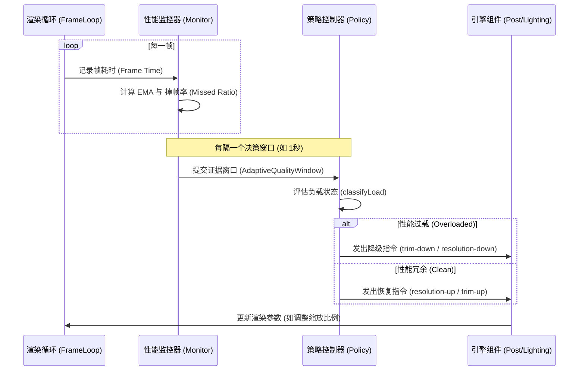
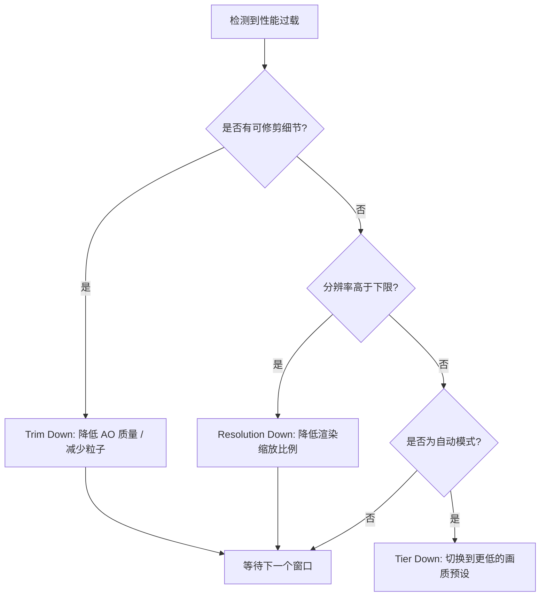
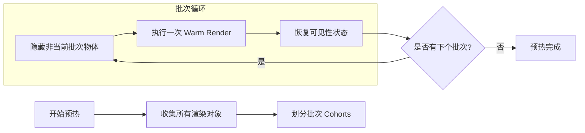
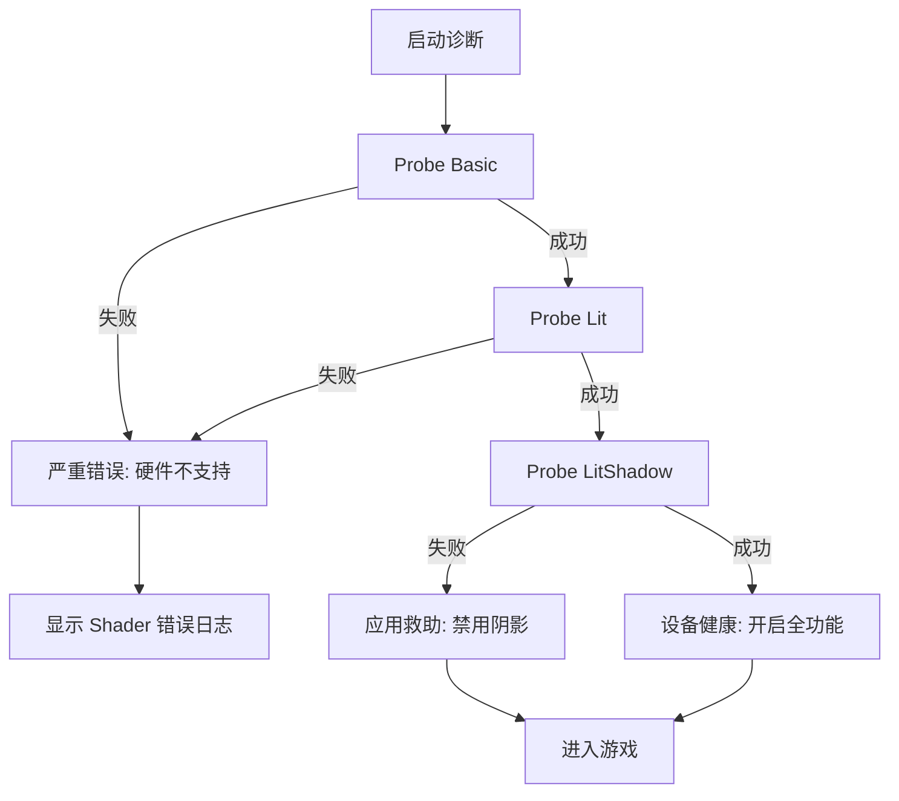

# 自适应画质与性能优化策略

## 目录
1. [模块概览](#模块概览)
2. [引言](#引言)
3. [核心组件](#核心组件)
   - [QualityPreset 画质配置](#qualitypreset-画质配置)
   - [AdaptiveQualityPolicy 自适应策略控制器](#adaptivequalitypolicy-自适应策略控制器)
   - [DeploymentWarm GPU 预热器](#deploymentwarm-gpu-预热器)
4. [架构概览：性能监控与反馈回路](#架构概览性能监控与反馈回路)
5. [画质分级与参数矩阵](#画质分级与参数矩阵)
6. [自适应调整逻辑：降级与恢复阶梯](#自适应调整逻辑降级与恢复阶梯)
   - [性能修剪 (Performance Trim)](#性能修剪-performance-trim)
   - [动态分辨率缩放 (DRS)](#动态分辨率缩放-drs)
   - [自动预设降级 (Auto Tier Down)](#自动预设降级-auto-tier-down)
7. [GPU 预热与首帧流畅度优化](#gpu-预热与首帧流畅度优化)
8. [设备诊断与兼容性“救助”机制](#设备诊断与兼容性救助机制)
   - [启动探针与静态救助](#启动探针与静态救助)
   - [黑色场景监视器 (Watchdog)](#黑色场景监视器-watchdog)
9. [动态分辨率缩放 (DRS) 与图像重建算法](#动态分辨率缩放-drs-与图像重建算法)
10. [文件引用](#文件引用)

## 模块概览

本模块是 Claude of Tanks 引擎的核心性能保障层，负责在多样化的硬件环境（从高端桌面 GPU 到受限的移动端设备）中维持稳定的 60FPS 游戏体验。通过对 `src/engine/` 目录下相关文件的探索，我们识别出以下关键组成部分：

*   **总文件数**：约 22 个 TypeScript 及测试文件，涵盖了从静态配置到动态反馈的全链路逻辑。
*   **核心子模块**：
    *   **画质定义 (`quality.ts`)**：定义了从 Low 到 Ultra 的多级预设，以及移动端专用预设。它不仅管理渲染参数，还负责初始的硬件分级（Device Tiering）。
    *   **自适应策略 (`adaptiveQualityPolicy.ts`, `renderScalePolicy.ts`)**：这是系统的“大脑”，基于实时的帧率反馈决定何时降低或提高画质。
    *   **GPU 预热 (`deploymentWarm.ts`)**：通过预编译 Shader 和预上传纹理消除 WebGL 环境中常见的运行时卡顿（Jank）。
    *   **设备诊断 (`deviceDiag.ts`)**：启动时的硬件能力探测与故障自动修复机制，确保游戏在异常驱动环境下仍能运行。

本章节将深入探讨这些子模块如何协同工作，构建起一套高度自动化且具备容错能力的性能防御体系。

## 引言

在 Web 平台开发高性能 3D 游戏，开发者面临的最严峻挑战是硬件能力的极度碎片化。从配备 RTX 4090 的桌面工作站到内存仅 4GB 的入门级智能手机，Claude of Tanks 必须在这些设备上都能提供一致的、至少达到 60FPS 的流畅体验。为了实现这一目标，引擎放弃了传统的“固定画质”方案，转而采用一套深度集成的自适应性能管理系统。

该系统的设计哲学是：**主动感知，优雅降级**。它不仅在启动时通过启发式算法（如检查 GPU 渲染器字符串、核心数、内存容量）为用户推荐最佳初始设置，更在运行过程中持续监控每一帧的渲染耗时。当检测到瞬时或持续的性能瓶颈时，系统会按照预设的“降级阶梯”逐步释放 GPU 压力。此外，针对 WebGL 特有的 Shader 编译微卡顿问题，系统引入了详尽的 GPU 预热流程，确保玩家进入战斗的第一帧即是丝滑的，极大地提升了游戏的首屏体验和竞技公平性。

## 核心组件

### QualityPreset 画质配置

`quality.ts` 是整个性能预算的“账本”。它不仅定义了不同画质等级的标签，还精确规定了各项昂贵渲染特性的配额。

```typescript
// src/engine/quality.ts
export interface QualityPreset {
  readonly label: string;
  readonly msaaSamples: number;         // 场景 MSAA 采样数，Ultra 为 4x，High/Medium 为 0x
  readonly maxPixelRatio: number;       // 最大像素比例，控制渲染分辨率的上限
  readonly adaptiveBasePixelRatio?: number; // 初始自适应像素比例，允许从低分辨率平滑增长
  readonly dynMin: number;              // 动态分辨率下限，防止画面过分模糊
  readonly aoScale: number;             // GTAO 缓冲区比例，0 表示完全关闭 AO
  readonly bloomScale: number;          // 辉光链缩放比例，影响后处理带宽
  readonly shadowMapSizes: readonly [number, number, number, number]; // CSM 四级级联的阴影图尺寸
  readonly shadowMaxFar: number;        // 阴影渲染的最远裁剪面
  readonly textureScale?: number;       // 移动端专用的纹理缩放因子
}
```

每个预设都代表了一种性能权衡。例如，`High` 预设（系统的默认选项）虽然关闭了硬件 MSAA 以节省带宽，但通过开启 SMAA 和半分辨率 AO，在保持视觉质量的同时，为动态分辨率留出了充足的调整空间。

### AdaptiveQualityPolicy 自适应策略控制器

`AdaptiveQualityPolicy` 类负责执行具体的降级和恢复决策。它是一个“纯逻辑”类，不直接操作 WebGL 状态，而是通过分析 `AdaptiveQualityWindow`（包含帧率、掉帧率、EMA 耗时等数据）来输出调整指令。

```typescript
// src/engine/adaptiveQualityPolicy.ts
export class AdaptiveQualityPolicy {
  // 核心评估函数，每隔一个决策周期调用一次
  evaluate(window: AdaptiveQualityWindow): AdaptiveQualityAction {
    this.resetResolutionBackoffAfterStableMinute(window.clockSeconds);
    const load = classifyLoad(window, this.baselineFps);
    
    // 学习当前的基准 FPS，用于判断性能是否显著下降
    this.baselineFps = nextBaselineFps(this.baselineFps, window.achievedFps, load);
    
    if (load.overloaded) return this.applyRelief(window); // 性能过载，请求减负
    this.trimDownStrikes = 0;
    this.tierDownStrikes = 0;
    return this.applyRecovery(window, load.clean);      // 性能冗余，尝试恢复
  }
}
```

### DeploymentWarm GPU 预热器

为了防止游戏过程中因动态加载模型或材质导致的 Shader 编译卡顿，`deploymentWarm.ts` 提供了一套精细的隔离渲染机制。它会将场景划分为多个小的“批次”（Cohorts），在后台进行不可见的预渲染。这强迫浏览器和驱动程序在真正的战斗开始前，完成所有着色器程序的编译和纹理的上传，从而消除了运行时的“掉帧”现象。

**核心组件来源**:
- [quality.ts](src/engine/quality.ts)
- [adaptiveQualityPolicy.ts](src/engine/adaptiveQualityPolicy.ts)
- [deploymentWarm.ts](src/engine/deploymentWarm.ts)

## 架构概览：性能监控与反馈回路

自适应画质系统的运作依赖于一个闭环的反馈回路。监控器（通常集成在 `post.ts` 的渲染循环中）收集每一帧的耗时，通过指数移动平均（EMA）平滑处理后交给策略器。这种设计能够过滤掉操作系统调度带来的瞬时噪声，仅对持续的负载变化做出反应。

以下图表展示了这一反馈回路的数据流向：



在反馈回路中，`AdaptiveQualityPolicy` 会维护一个“基准 FPS”状态。如果当前达到的 FPS 低于基准的 80%，即使 EMA 耗时仍在预算内，系统也会判定为“负载增加”，从而提前触发降级。这种前瞻性的设计极大地提高了系统在复杂战斗场景下的响应速度。

**架构参考**:
- [adaptiveQualityPolicy.ts:L152-L164](src/engine/adaptiveQualityPolicy.ts#L152-L164)
- [renderScalePolicy.ts:L70-L79](src/engine/renderScalePolicy.ts#L70-L79)

## 画质分级与参数矩阵

Claude of Tanks 预设了四种桌面等级和三种移动端等级。这些等级不仅影响分辨率，还深度影响了阴影的级联精度和后处理链的复杂度。

| 画质等级 | MSAA | 最大像素比例 | AO 比例 | 阴影尺寸 (CSM 1-4) | 适用场景 |
| :--- | :--- | :--- | :--- | :--- | :--- |
| **Ultra** | 4x | 2.0 (Retina) | 1.0 (全分辨率) | 4096, 4096, 4096, 2048 | 高端显卡，追求极致截图效果 |
| **High** | 0x | 1.5 | 0.5 | 2048, 2048, 2048, 1024 | 默认推荐，平衡画面与帧率 |
| **Medium** | 0x | 1.0 | 0.5 | 2048, 2048, 1024, 1024 | 中端设备或集成显卡 |
| **Low** | 0x | 1.0 | 0.0 (关闭) | 2048, 2048, 1024, 1024 | 低端设备，优先保证流畅 |
| **Mobile** | 0x | 1.4 | 0.0 (关闭) | 1024, 768, 512, 512 | 移动端默认，严格限制显存 |

> 💡 **提示**：`High` 等级虽然关闭了 MSAA，但通过开启 SMAA 和 FSR1 的 RCAS 锐化，在 1.5x 采样下依然能获得非常清晰的边缘效果。这种组合在 1080p 屏幕上几乎无法察觉到与原生分辨率的区别，但能节省约 40% 的 GPU 填充率。

**数据来源**:
- [quality.ts:L179-L338](src/engine/quality.ts#L179-L338)

## 自适应调整逻辑：降级与恢复阶梯

当系统检测到性能过载时，它遵循一套精心设计的“减负阶梯”。这套阶梯的原则是：**先牺牲不可见的细节，再牺牲非结构性的清晰度，最后才调整全局预设。** 这种分层策略确保了玩家在激烈的战斗中，即使画质有所下降，也不会因为突然的模糊或卡顿而丢失目标。



### 性能修剪 (Performance Trim)
这是第一道防线。系统会尝试降低 GTAO 的采样数，或者减少非关键特效（如爆炸后的细碎火花）的数量。这些改变在快速移动的战斗中几乎不可察觉，但能为 GPU 争取到宝贵的几毫秒缓冲时间。

### 动态分辨率缩放 (DRS)
如果修剪不足以解决问题，系统会进入第二阶段：降低 `dynamicScale`。例如，从 1.0 逐步降低到 0.75。此时引擎会启用 FSR1 重建技术，通过边缘感知的上采样算法维持画面的锐利度。UI 层（HUD）始终以原生像素比例渲染，确保文字和图标的绝对清晰。

### 自动预设降级 (Auto Tier Down)
如果即使在分辨率下限（如 `dynMin: 0.9`）也无法维持帧率，系统会将整个 `Auto` 预设下调一级（如从 High 降到 Medium）。这是一个“重型”操作，会触发阴影贴图的重新分配、CSM 级联距离的缩短以及纹理预算的全局缩减。

**逻辑参考**:
- [adaptiveQualityPolicy.ts:L176-L187](src/engine/adaptiveQualityPolicy.ts#L176-L187)
- [renderScalePolicy.ts:L70-L79](src/engine/renderScalePolicy.ts#L70-L79)

## GPU 预热与首帧流畅度优化

在 WebGL 中，Shader 的编译通常是延迟发生的（Lazy Compilation）。这意味着当一辆从未见过的坦克模型进入视野时，浏览器才会开始编译对应的 Shader。这会导致游戏瞬间出现 100ms 到 500ms 的停顿。`deploymentWarm.ts` 通过“分批预热”技术彻底解决了这个问题。

1.  **场景深度遍历**：识别场景中所有可能出现的渲染对象（地形块、静态建筑、动态坦克模型）。
2.  **小批次隔离**：将对象划分为每组 3-4 个的小批次。
3.  **影子渲染**：在游戏正式开始前的“黑屏”或“进度条”阶段，引擎会快速切换这些批次的可见性，并调用一次 `warmRender`。这个渲染过程是不可见的，但它强制 GPU 驱动程序完成了管线状态对象（PSO）的创建。
4.  **防抖动处理**：预热过程中会临时禁用阴影图的自动更新，以加快处理速度。

这种机制确保了玩家在进入战场的瞬间，所有必要的资源都已经处于“GPU 就绪”状态，极大地减少了首帧延迟和战斗初期的卡顿感。

**预热流程图**:



**实现参考**:
- [deploymentWarm.ts:L116-L239](src/engine/deploymentWarm.ts#L116-L239)

## 设备诊断与兼容性“救助”机制

为了应对某些特定硬件的驱动 Bug（例如某些旧款 iPhone 在开启阴影时会渲染出黑色的屏幕），`deviceDiag.ts` 在启动时会运行一套“诊断探针”。这套机制是 Claude of Tanks 能够支持大量低端设备的关键。

### 启动探针与静态救助
系统会依次运行三个微型渲染任务：
*   **Basic 探针**：测试基础的无光照材质渲染。
*   **Lit 探针**：测试标准光照材质（MeshStandardMaterial）渲染。
*   **LitShadow 探针**：测试带阴影的完整管线。

如果 `Lit` 探针通过但 `LitShadow` 失败，系统会自动应用“救助（Rescue）”策略：**强制关闭本会话的阴影功能**。这种“平稳降级”确保了玩家虽然看不到阴影，但至少能正常进行游戏，而不是面对一个黑色的屏幕。

### 黑色场景监视器 (Watchdog)
这是一个运行时的安全网。如果在游戏过程中，监视器发现渲染结果的平均亮度异常接近于零（即“黑屏”），它会触发一个阶梯式的救助逻辑：
1.  首先尝试关闭阴影（Shadows-off）。
2.  如果无效，尝试关闭环境贴图（Environment-off）。
3.  如果仍无效，尝试关闭雾效（Fog-off）。
一旦画面恢复亮度，系统会锁定在当前的救助状态，并向控制台记录详细的诊断日志。

**诊断流程图**:



**诊断参考**:
- [deviceDiag.ts:L167-L240](src/engine/deviceDiag.ts#L167-L240)
- [deviceDiag.ts:L434-L558](src/engine/deviceDiag.ts#L434-L558)

## 动态分辨率缩放 (DRS) 与图像重建算法

当自适应策略决定降低分辨率时，引擎使用 `renderScalePolicy.ts` 中定义的重建逻辑。这不仅仅是简单的放大，而是一套基于图像质量权衡的算法链。

*   **渲染比例 (Internal Pixel Ratio)**：最终的渲染分辨率由 `CappedRatio * DynamicScale` 决定。在 Retina 屏幕上，这通常意味着即使缩放比例为 0.75，实际渲染的像素数仍然高于普通 1080p 屏幕。
*   **重建模式 (Reconstruction Mode)**：
    *   **EASU + RCAS (AMD FSR1)**：当缩放比例 > 0.6 时启用。EASU 负责高质量的边缘保留上采样，RCAS 负责在后期处理中恢复因缩放丢失的细部锐度。
    *   **仅 EASU**：当缩放比例在 0.4 到 0.6 之间时，为了节省性能，会关闭开销较大的 RCAS 锐化。
    *   **线性插值 (Linear)**：当缩放比例极低（< 0.4）时，退回到基础的硬件线性过滤，以确保 GPU 能将所有算力集中在维持基本帧率上。

通过这种动态调整重建算法的手段，Claude of Tanks 成功地在性能极度受限的设备上维持了视觉上的“可玩性”。

**算法参考**:
- [renderScalePolicy.ts:L82-L97](src/engine/renderScalePolicy.ts#L82-L97)

## 文件引用

本章节涉及的核心源文件及其职责如下：

*   `src/engine/quality.ts`: 定义了画质预设、设备分级逻辑以及全局纹理缩放杠杆。
*   `src/engine/adaptiveQualityPolicy.ts`: 实现了基于帧率反馈的自适应调整逻辑，包含降级与恢复阶梯。
*   `src/engine/renderScalePolicy.ts`: 规定了动态分辨率缩放的计算公式及 FSR1 重建模式的切换逻辑。
*   `src/engine/deploymentWarm.ts`: 负责场景对象的分批预渲染，以预编译 Shader 和预热 GPU 缓存。
*   `src/engine/deviceDiag.ts`: 包含了启动时的硬件探针逻辑、兼容性救助策略以及运行时的黑屏监控机制。
*   `src/engine/resolutionPolicy.ts`: 管理画布的基础分辨率适配策略，处理不同物理像素比下的显示效果。
*   `src/engine/temporalAoPolicy.ts`: 针对环境光遮蔽（AO）的特定性能调整策略。
*   `src/engine/adaptiveQualityPolicy.selftest.mjs`: 验证自适应策略在各种模拟负载下的正确性。
*   `src/engine/quality.selftest.mjs`: 验证画质预设的解析逻辑及其与本地存储的交互。
*   `src/engine/deviceDiag.selftest.mjs`: 模拟异常硬件环境以验证救助逻辑的有效性。
