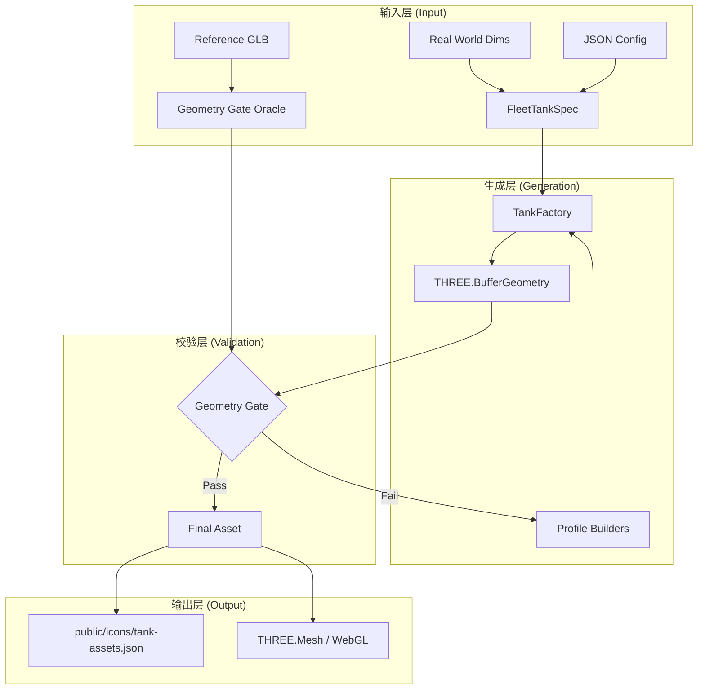
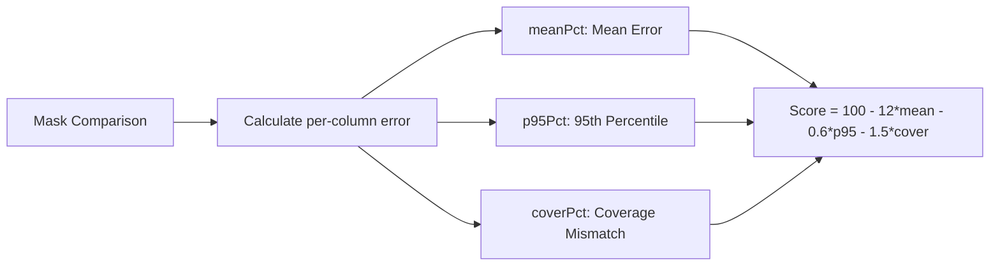
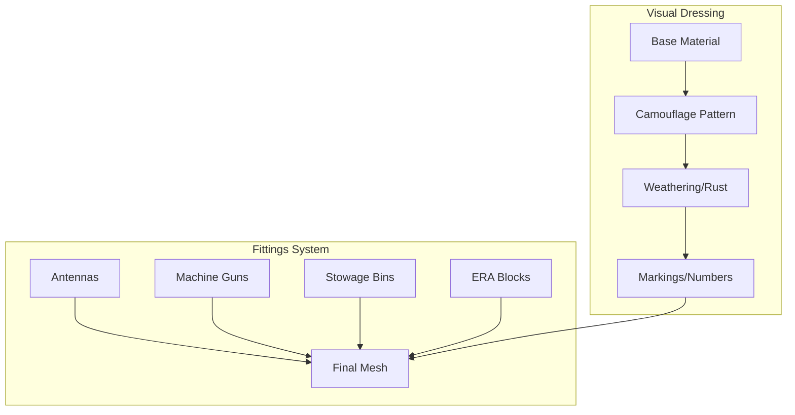

# 坦克资产与程序化生成流水线

## 目录
1. [模块概览](#模块概览)
2. [引言](#引言)
3. [核心组件](#核心组件)
   - [Geometry Gate 几何门禁系统](#geometry-gate-几何门禁系统)
   - [坦克家族与变体系统](#坦克家族与变体系统)
   - [程序化几何引擎](#程序化几何引擎)
4. [资产流水线架构](#资产流水线架构)
5. [数据模型与 JSON 配置](#数据模型与-json-配置)
6. [关键算法与逻辑](#关键算法与逻辑)
   - [几何评分公式](#几何评分公式)
   - [顶点驱动的建模逻辑](#顶点驱动的建模逻辑)
7. [纹理、涂装与装饰规范](#纹理涂装与装饰规范)
8. [扩展指南：如何添加新资产](#扩展指南如何添加新资产)
9. [性能与优化](#性能与优化)
10. [文件参考](#文件参考)

## 模块概览

本模块负责项目中最核心的资产生成逻辑，即如何通过程序化手段（Procedural Generation）从 JSON 配置和 TypeScript 代码中构建复杂的 3D 坦克模型。

在本次调研中，共发现以下关键数据：
- **核心文件总数**：`src/vehicles` 目录下共有 188 个 `.ts` 文件，涵盖了从底层几何基元到高层坦克定义的完整链路。
- **配置资产总数**：`docs/geometry-gate` 目录下共有 124 个 `.json` 评分记录文件，记录了每一辆坦克的几何达标情况。
- **主要子模块**：
  - `profiles/`：包含各坦克家族的程序化建模逻辑（如 `abrams.ts`, `leopard.ts` 等）。
  - `combatAnatomyGroups/`：自动生成的战斗解构数据，用于碰撞检测和伤害模拟。
  - `vehicleMarkingSeatGroups/`：定义涂装、编号和标志的挂载位置。
  - `factoryGeometry.ts` & `tankFactoryCore.ts`：底层的几何构建工厂。

本章节将深入探讨 `Geometry Gate` 评分机制、程序化建模的实现原理以及如何扩展新的车辆资产。

## 引言

《Claude of Tanks》采用了一种独特的“代码即模型”的资产方案。不同于传统游戏依赖外部 DCC 工具（如 Blender 或 Maya）导出的静态模型，本项目的大部分坦克模型是根据真实世界的物理尺寸（Dimensions）和参考几何体（Oracles），通过 TypeScript 代码动态生成的。

这种方案的核心优势在于：
1. **极致的参数化**：可以轻松通过调整参数生成成百上千种变体（Variant），如增加侧裙板、更换炮塔或调整悬挂高度。
2. **几何精确性**：通过 `Geometry Gate` 强制要求程序化生成的模型与真实数据在毫米级精度上匹配。
3. **动态细节**：可以根据性能需求或战斗状态，实时调整模型的复杂度（LOD）或添加动态装饰物（如遮盖网、备用履带）。

## 核心组件

### Geometry Gate 几何门禁系统

`Geometry Gate` 是项目中最严苛的质量控制机制。它通过对比“参考模型”（Oracle）和“程序化模型”的 2D 正交投影掩码，计算两者的重合度。

**核心评分标准**：
- **hullCurves**：车体曲线得分，涵盖侧视、顶视和前视。
- **turretCurves**：炮塔曲线得分，专门剥离炮管后的独立评分。
- **stations**：14 个横截面的宽度和高度误差。
- **dims**：物理尺寸误差（长、宽、高），误差超过 1% 即大幅扣分。
- **floaters**：检查是否存在悬浮的几何孤岛。

> 💡 **注意**：一辆坦克必须在所有组件得分均 ≥ 90 分时，才被视为通过“几何门禁”。

### 坦克家族与变体系统

为了提高开发效率，项目引入了“家族（Family）”和“变体（Variant）”的概念。例如，`afvFamily.ts` 定义了步兵战车家族，通过 `variant` 函数，开发者可以基于一个基础型号（Donor）快速派生出不同国家的变体。

```typescript
// src/vehicles/afvFamily.ts 示例
const AFV_FAMILY_SPECS: Record<string, FleetTankSpec> = {
  bmp3_rok: variant('bmp3_rok', 'bmp2', {
    name: 'BMP-3 (ROK)', 
    nation: 'South Korea',
    dims: { hullLengthM: 7.14, widthM: 3.20, heightM: 2.40 },
    stats: { hp: 1550, enginePowerHp: 500 },
    visual: { scheme: 'digital', base: '#465341' }
  }),
  // ... 更多变体
};
```

### 程序化几何引擎

底层的 `factoryGeometry.ts` 提供了一系列经过优化的几何基元构建函数，这些函数支持圆角、倒角和复杂的放样（Loft）操作。

**常用基元**：
- `box(width, height, depth)`：带圆角的长方体，自动处理细分。
- `cylY(radiusTop, radiusBottom, height)`：圆柱体或圆锥体。
- `slab(...)`：由 8 个顶点定义的自定义六面体，是构建斜甲板的核心。
- `lathe(profile)`：旋转体，用于构建炮管、负重轮等圆形零件。

**核心组件源码参考**:
- [src/vehicles/tankFactory.ts](src/vehicles/tankFactory.ts)
- [src/vehicles/factoryGeometry.ts](src/vehicles/factoryGeometry.ts)
- [src/vehicles/afvFamily.ts](src/vehicles/afvFamily.ts)

## 资产流水线架构

坦克资产的生成遵循从“原始数据”到“运行时网格”的严格转换流程。

下面的流程图展示了一个坦克资产从定义到在游戏中渲染的完整生命周期：



该流程从收集真实世界的物理尺寸和参考 GLB 模型开始。`TankFactory` 调用相应的 `Profile Builder`（如 `abrams.ts`），利用 `factoryGeometry` 中的基元构建出 `BufferGeometry`。随后，`Geometry Gate` 会对生成的几何体进行像素级的对比校验。如果评分未达标，开发者需要回到 Builder 代码中微调顶点坐标或缩放比例。只有通过校验的资产才会被序列化并最终进入 WebGL 渲染管线。

**架构图源码参考**:
- [docs/TANK-ASSET-PIPELINE.md](docs/TANK-ASSET-PIPELINE.md)
- [src/vehicles/tankFactoryCore.ts](src/vehicles/tankFactoryCore.ts)

## 数据模型与 JSON 配置

每个通过门禁的坦克都会在 `docs/geometry-gate/` 下生成一个对应的 JSON 文件，记录其详细的几何表现。

以 `m1a2.json` 为例，关键字段含义如下：

| 字段 | 描述 | 示例值 |
| :--- | :--- | :--- |
| `id` | 坦克的唯一标识符 | `"m1a2"` |
| `geoMin` | 所有组件中的最低得分（决定是否通过门禁） | `76` |
| `components` | 各个评分维度的具体得分 | `{"hullCurves": 93.3, ...}` |
| `curveRows` | 具体的曲线误差数据，包含 `worst`（最差的 12 个采样点） | `{ "side_hull": { "meanPct": 0.45, ... } }` |
| `dimRows` | 物理尺寸对比结果 | `[{"name": "heightM", "actual": 2.44, "published": 2.44}]` |

**JSON 示例片段**：
```json
{
 "id": "m1a2",
 "components": {
  "hullCurves": 93.3,
  "wholeCurves": 76,
  "turretCurves": 84.1,
  "stations": 83.6,
  "dims": 100
 },
 "dimRows": [
  {
   "name": "heightM",
   "actual": 2.44,
   "published": 2.44,
   "pct": 0.19
  }
 ]
}
```

**数据模型源码参考**:
- [docs/geometry-gate/m1a2.json](docs/geometry-gate/m1a2.json)
- [src/vehicles/specContracts.ts](src/vehicles/specContracts.ts)

## 关键算法与逻辑

### 几何评分公式

`Geometry Gate` 使用一种加权误差公式来计算曲线得分，旨在平衡平均误差和局部极端误差。



该公式的设计思路是：
1. **meanPct (12x 权重)**：主导项，要求整体轮廓必须极其贴合（2cm 误差以内）。
2. **p95Pct (0.6x 权重)**：捕捉局部系统性偏差，防止通过“掩盖 5% 的坏区域”来作弊。
3. **coverPct (1.5x 权重)**：惩罚多余或缺失的几何块。

### 顶点驱动的建模逻辑

在 `afvFamily.ts` 等模块中，建模不再是“捏橡皮泥”，而是基于顶点坐标的逻辑计算。

```typescript
// src/vehicles/profiles/kit.ts 逻辑抽象
function buildHull(P: ProfileBuilderPort) {
  const { hullLengthM, widthM } = P.spec.dims;
  // 基于物理尺寸计算甲板高度和倾角
  const deckY = P.spec.armor.roofY;
  const glacisAngle = 30; // 真实数据
  // 使用 slab 构建前装甲
  P.add('hull', slab(
    [-widthM/2, 0, hullLengthM/2], 
    [widthM/2, 0, hullLengthM/2],
    // ... 更多顶点
  ));
}
```

**算法源码参考**:
- [docs/GEOMETRY-GATE.md](docs/GEOMETRY-GATE.md)
- [src/vehicles/profiles/kit.ts](src/vehicles/profiles/kit.ts)

## 纹理、涂装与装饰规范

项目不使用传统的 UV 贴图，而是通过程序化材质和“装饰物（Fittings）”系统来提升视觉丰富度。

**视觉规范要求**：
1. **CONTIGUITY (连续性)**：禁止出现悬浮的装甲板或可见的内部空洞。
2. **DECORATION MINIMUM (装饰下限)**：所有坦克必须配备车顶机枪（Roof MGs），即使参考模型没有。
3. **TRACK CONTAINMENT (履带包含)**：履带严禁穿模车体，必须保留至少 2cm 的物理间隙。



通过 `FITTINGS` 注册表，开发者可以为坦克添加各种预制零件：
- `pintleMG`：车顶机枪。
- `stowageRack`：储物篮。
- `smokeLaunchers`：烟幕发射器。

**装饰规范源码参考**:
- [src/vehicles/profiles/kit.ts](src/vehicles/profiles/kit.ts)
- [src/vehicles/materials.ts](src/vehicles/materials.ts)

## 扩展指南：如何添加新资产

添加一辆新坦克通常涉及以下步骤：

1. **注册 Spec**：在 `src/vehicles/specs.ts` 或相应的家族文件（如 `china.ts`）中添加坦克的性能数据和物理尺寸。
2. **创建 Profile**：在 `src/vehicles/profiles/` 下编写建模逻辑，或在现有家族中添加变体。
3. **配置悬挂与履带**：在 `suspensionPatterns.ts` 中定义轮组间距。
4. **运行门禁校验**：
   ```bash
   node tools/geometry-gate.mjs --ids=my_new_tank
   ```
5. **迭代优化**：根据生成的 JSON 报告中的 `worst` 列提示，调整代码中的顶点坐标。

> ⚠️ **警告**：严禁手动修改 `docs/geometry-gate/ledger.json`，该文件必须由工具自动生成。

## 性能与优化

由于所有几何体都是运行时生成的，项目采取了多项优化措施：
- **几何体合并**：使用 `BufferGeometryUtils.mergeGeometries` 将细碎的零件合并为大网格，减少 Draw Call。
- **共享材质**：所有坦克共享一套 PBR 材质参数，仅涂装颜色不同。
- **按需加载**：玩家车库仅加载当前选中的坦克 Profile，战斗中则使用预生成的解构数据。

## 文件参考

以下是本章节涉及的核心源文件：

- [src/vehicles/tankFactory.ts](src/vehicles/tankFactory.ts)：坦克工厂入口。
- [src/vehicles/factoryGeometry.ts](src/vehicles/factoryGeometry.ts)：基础几何基元库。
- [src/vehicles/profiles/kit.ts](src/vehicles/profiles/kit.ts)：共享的建模工具函数。
- [src/vehicles/afvFamily.ts](src/vehicles/afvFamily.ts)：步兵战车家族定义。
- [docs/GEOMETRY-GATE.md](docs/GEOMETRY-GATE.md)：几何门禁官方文档。
- [docs/TANK-ASSET-PIPELINE.md](docs/TANK-ASSET-PIPELINE.md)：资产流水线说明。
- [docs/geometry-gate/m1a2.json](docs/geometry-gate/m1a2.json)：M1A2 评分示例。
- [src/vehicles/specs.ts](src/vehicles/specs.ts)：全舰队性能规格注册表。
