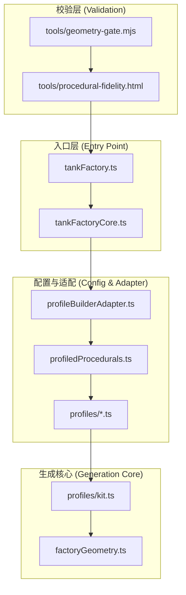
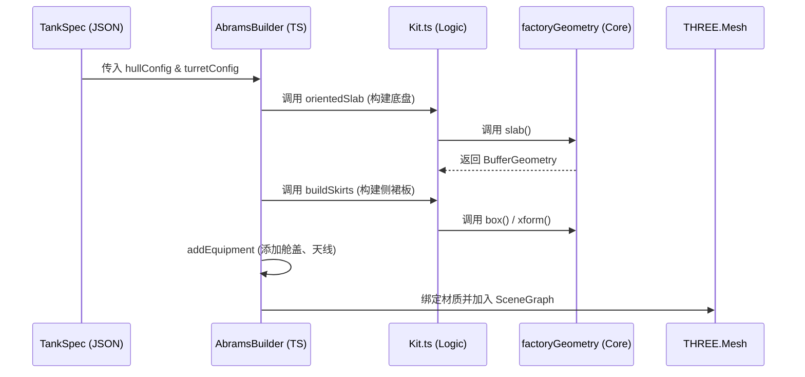
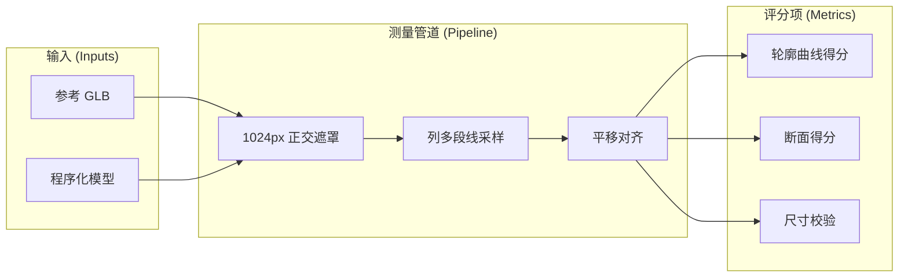
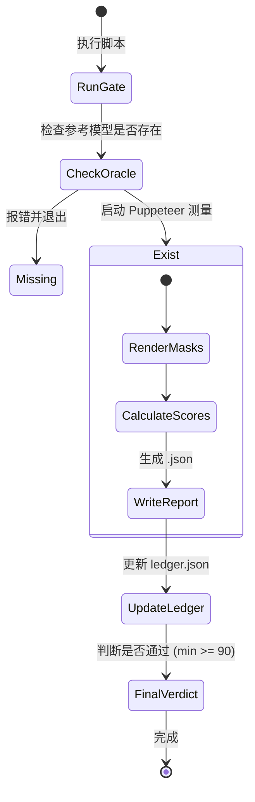

# Geometry Gate 程序化建模引擎

## 目录
1. [模块概览](#模块概览)
2. [引言：Geometry Gate 的使命](#引言geometry-gate-的使命)
3. [程序化建模架构](#程序化建模架构)
   - [核心组件与职责](#核心组件与职责)
   - [几何生成原语 (factoryGeometry.ts)](#几何生成原语-factorygeometryts)
4. [参数化几何体构建逻辑](#参数化几何体构建逻辑)
   - [Hull 与 Turret 的参数化定义](#hull-与-turret-的参数化定义)
   - [组件组装与 Rig 锚点](#组件组装与-rig-锚点)
5. [Geometry Gate 评分机制详解](#geometry-gate-评分机制详解)
   - [测量流水线 (Measurement Pipeline)](#测量流水线-measurement-pipeline)
   - [核心评分维度](#核心评分维度)
   - [数学实现与公式](#数学实现与公式)
6. [视觉校验与设计规范](#视觉校验与设计规范)
   - [Plate Fill Rule (板材填充规则)](#plate-fill-rule-板材填充规则)
   - [核心视觉法律 (Visual Laws)](#核心视觉法律-visual-laws)
7. [验证流水线与 CI/CD 集成](#验证流水线与-cicd-集成)
8. [关键文件参考](#关键文件参考)

## 模块概览

`src/vehicles/` 模块是 Claude of Tanks 的核心，负责所有坦克资产的程序化生成与质量校验。该模块包含约 **140 个** 源文件，涵盖了从基础几何原语到复杂坦克家族配置的所有逻辑。

**子模块分布：**
- `profiles/` (约 85 个文件): 包含各坦克家族（如 Abrams, Leopard, T-90 等）的参数化配置文件及自测脚本。这是内容最丰富的子模块，将被深度覆盖。
- `combatAnatomyGroups/` (约 27 个文件): 自动生成的战斗解剖结构数据，用于碰撞检测和内构模拟。
- `vehicleMarkingSeatGroups/` (约 27 个文件): 自动生成的涂装锚点数据。
- 根目录文件 (约 60 个文件): 包含工厂入口、几何核心、评分逻辑以及各种策略文件。

本文将重点解析 `tankFactory.ts` (组装入口)、`factoryGeometry.ts` (几何核心) 以及 `docs/GEOMETRY-GATE.md` 中定义的评分规范。

## 引言：Geometry Gate 的使命

**Geometry Gate** 是 Claude of Tanks 项目中一套“无情”的自动化评分机制。它的核心目标是确保通过代码动态生成的坦克 3D 模型在几何精度和视觉质量上达到甚至超越手绘参考模型。

在本项目中，一个坦克模型只有同时通过以下两个关卡才能被视为“完成”：
1. **几何关卡 (Geometric Gate)**：通过 `tools/geometry-gate.mjs` 进行测量，所有组件得分必须 ≥ 90。
2. **视觉关卡 (Visual Gate)**：由独立评论员（Critic）对渲染效果进行评分，所有视角得分必须 ≥ 9.0/10。

这种机制彻底改变了资产制作流程：开发者不再是手动建模，而是通过调整 JSON 参数和编写生成逻辑来逼近参考模型，由 Gate 提供精确的修改指令（如：“在 z=+4.36 处，你的车首底部深了 0.58 米”）。

## 程序化建模架构

### 核心组件与职责

程序化建模引擎采用了高度解耦的分层架构，从底层的几何原语到顶层的工厂外观。

下图展示了模块间的主要交互关系：



**架构解析**：
- `tankFactory.ts` 作为外部调用的统一入口，负责配置各种 Builder Pack。
- `profiledProcedurals.ts` 维护了一个巨大的映射表，将坦克 ID 关联到具体的 `profiles/*.ts` 定义。
- `factoryGeometry.ts` 提供了不带业务逻辑的纯几何计算原语，使用 Three.js 作为底层引擎。
- `tools/geometry-gate.mjs` 通过 Puppeteer 驱动浏览器环境，运行 `procedural-fidelity.html` 进行像素级的几何测量。

**Diagram sources**:
- [tankFactory.ts:L50-L60](src/vehicles/tankFactory.ts#L50-L60)
- [profiledProcedurals.ts:L65-L91](src/vehicles/profiledProcedurals.ts#L65-L91)

### 几何生成原语 (factoryGeometry.ts)

`factoryGeometry.ts` 定义了一系列严谨的几何构建函数，旨在通过参数化方式模拟复杂的工业外形。

```typescript
// 示例：factoryGeometry.ts 中的 slab 原语，用于构建倾斜的装甲板
export function slab(
  bottom0: Point3, bottom1: Point3, bottom2: Point3, bottom3: Point3,
  top0: Point3, top1: Point3, top2: Point3, top3: Point3,
): THREE.BufferGeometry {
  const positions: number[] = [];
  const quad = (a: Point3, b: Point3, c: Point3, d: Point3): void => {
    positions.push(...a, ...b, ...c, ...a, ...c, ...d);
  };
  // 构建六面体的 12 个三角形
  quad(bottom0, bottom1, top1, top0);
  // ... 其他面
  return geometryFromTriangles(positions);
}
```

这些原语包括：
- `box`, `cylY`, `sph`: 带有圆角支持的基础形状。
- `lathe`: 旋转体生成，常用于炮管和轮毂。
- `slab`, `frustum`: 任意八顶点六面体，是构建倾斜装甲（如 Abrams 的前装甲）的核心工具。
- `xform`: 链式变换函数，用于精确控制组件的平移、旋转和缩放。

**Section sources**:
- [factoryGeometry.ts](src/vehicles/factoryGeometry.ts)

## 参数化几何体构建逻辑

### Hull 与 Turret 的参数化定义

在 `profiles/` 目录下，每种坦克家族都定义了自己的参数结构。以 Abrams 为例，其 `AbramsHullConfig` 包含了数十个控制车体形状的参数。

下面的序列图展示了从参数到最终 3D 模型的转换流程：



**流程详解**：
1. **参数解析**：`AbramsBuilder` 接收如 `nose` (鼻部高度)、`deck` (甲板轮廓)、`glacisTopZ` (首上装甲顶点) 等参数。
2. **分层构建**：模型被拆分为 `hull` (车体)、`turret` (炮塔)、`gun` (火炮) 和 `tracks` (履带) 四大组件。
3. **CSG 风格模拟**：虽然不直接使用布尔运算，但通过 `slab` 和 `frustum` 的叠加，可以精确模拟出 CSG 风格的复杂截面。
4. **细节填充**：根据 `sepv2` 或 `sepv3` 等标志位，动态添加 ERA 挂装、遥控武器站 (CROWS) 等细节。

**Diagram sources**:
- [profiles/abrams.ts:L89-L227](src/vehicles/profiles/abrams.ts#L89-L227)
- [profiles/kit.ts:L82-L147](src/vehicles/profiles/kit.ts#L82-L147)

### 组件组装与 Rig 锚点

所有的组件都根据 `rig` 锚点进行组装。例如，炮塔的旋转中心由 `spec.armor.turretPivot` 定义。这种基于锚点的组装确保了：
- **解耦性**：车体和炮塔可以独立开发，只要锚点匹配即可。
- **动态性**：火炮的俯仰和炮塔的旋转可以在运行时根据 `rig` 坐标系精确控制。

## Geometry Gate 评分机制详解

### 测量流水线 (Measurement Pipeline)

Geometry Gate 不依赖任何自报数据，而是将参考模型 (Oracle) 和程序化模型 (Build) 放入完全相同的测量环境。



**流水线解析**：
1. **渲染遮罩**：使用 1024 像素的正交相机从顶视、侧视、前视三个方向渲染遮罩。
2. **列采样**：将遮罩沿轴向切分为约 90 个列，每列记录 `[along, top, bottom]` 数据（单位：米）。
3. **对齐 (Registration)**：基于车体轮廓进行纯平移对齐。**注意**：旋转和缩放误差不会被补偿，这意味着错误的比例会导致得分骤降。
4. **双向覆盖**：评分会同时考虑“参考有而模型无”以及“模型有而参考无”的情况，这有效防止了过度建模。

**Diagram sources**:
- [docs/GEOMETRY-GATE.md:L17-L48](docs/GEOMETRY-GATE.md#L17-L48)

### 核心评分维度

| 维度 | 说明 | 达标门槛 |
| :--- | :--- | :--- |
| **hullCurves** | 车体在侧、顶、前三个视角的轮廓吻合度。 | ≥ 90 |
| **turretCurves** | 炮塔轮廓，会自动裁剪掉炮管的影响。 | ≥ 90 |
| **stations** | 14 个横截面的宽度和车顶高度误差，使用修剪平均值 (Trimmed Mean)。 | ≥ 90 |
| **dims** | 关键尺寸（长、宽、高）与真实数据的偏差。 | ≥ 90 |
| **floaters** | 检测在不同炮塔转角和火炮俯仰角下是否存在断裂的几何孤岛。 | 无孤岛 |

### 数学实现与公式

曲线得分的计算公式如下：
`score = 100 − 12·meanPct − 0.6·p95Pct − 1.5·coverPct`

- **meanPct (均值误差)**：主导项。90 分要求平均误差控制在 ≈0.6% 以内（对于 3.3 米高的坦克，误差约为 2 厘米）。
- **p95Pct (95 分位误差)**：捕捉局部系统性偏差，防止通过隐藏坏区域来刷分。
- **coverPct (覆盖率误差)**：惩罚悬挂或长度不匹配导致的几何缺失或冗余。

**Section sources**:
- [docs/GEOMETRY-GATE.md:L50-L62](docs/GEOMETRY-GATE.md#L50-L62)

## 视觉校验与设计规范

在满足几何精度后，模型还必须遵守一系列严格的视觉法律，以确保在游戏中的渲染表现。

### Plate Fill Rule (板材填充规则)

这是为了防止开发者为了凑轮廓得分而使用“空壳”几何体。
- **要求**：任何新增的装甲板、架子或条带在近看时必须表现为**实体结构**。
- **禁止**：禁止出现空背面、漂浮的单面面板或板材与父表面之间的可见缝隙。
- **实现**：必须封闭体积（增加背面和封盖）或将其延伸至与车体接触。

### 核心视觉法律 (Visual Laws)

下表列出了几项关键的视觉强制规范：

| 法律名称 | 适用范围 | 核心要求 |
| :--- | :--- | :--- |
| **M1 Front Slope** | Abrams 家族 | 前上装甲必须呈现极大的倾角，禁止渲染为平坦方块。 |
| **Contiguity** | 全舰船/坦克 | 严禁出现透光的缝隙或漂浮的质量块，所有附加装甲必须有明显的支架或接触阴影。 |
| **Decoration Min** | 全队 | 禁止出现大面积平坦表面。车顶机枪 (MG) 是强制性的，且需添加梯子、缆绳、烟幕发射器等装饰。 |
| **Circularity** | 旋转部件 | 炮塔环、舱盖、轮毂等圆形部件在顶视图中必须表现为真正的圆柱体，严禁出现明显的棱角感。 |

**Section sources**:
- [docs/GEOMETRY-GATE.md:L144-L303](docs/GEOMETRY-GATE.md#L144-L303)

## 验证流水线与 CI/CD 集成

`tools/geometry-gate.mjs` 是确保资产质量的最后一道防线。它不仅在本地开发时提供反馈，也是 CI/CD 流程的一部分。



**验证流程特点**：
- **分类处理**：对于物理上存在缺陷的参考模型（如炮管过短），支持 `oracle-defect caps` 机制，允许在文档记录后对特定维度进行豁免。
- **账本管理 (Ledger)**：`ledger.json` 记录了全舰队的得分情况，是资产进度的唯一真理来源。
- **回归防护**：任何几何改动都会使之前的视觉评分失效，必须重新运行双关卡校验。

**Diagram sources**:
- [tools/geometry-gate.mjs:L85-L135](tools/geometry-gate.mjs#L85-L135)

## 关键文件参考

以下是本模块中最关键的源文件，建议在进行几何调整或添加新坦克时优先查阅：

- [src/vehicles/tankFactory.ts](src/vehicles/tankFactory.ts): 坦克工厂的统一入口和配置中心。
- [src/vehicles/factoryGeometry.ts](src/vehicles/factoryGeometry.ts): 基础几何原语库，定义了所有形状的构建逻辑。
- [src/vehicles/profiles/kit.ts](src/vehicles/profiles/kit.ts): 包含通用的坦克组件构建逻辑（如履带、裙板、舱盖）。
- [src/vehicles/profiles/abrams.ts](src/vehicles/profiles/abrams.ts): Abrams 家族的参数化定义示例。
- [docs/GEOMETRY-GATE.md](docs/GEOMETRY-GATE.md): 权威的评分规范和视觉法律文档。
- [tools/geometry-gate.mjs](tools/geometry-gate.mjs): 几何关卡校验脚本的实现。

**Section sources**:
- [src/vehicles/tankFactory.ts](src/vehicles/tankFactory.ts)
- [src/vehicles/factoryGeometry.ts](src/vehicles/factoryGeometry.ts)
- [docs/GEOMETRY-GATE.md](docs/GEOMETRY-GATE.md)
