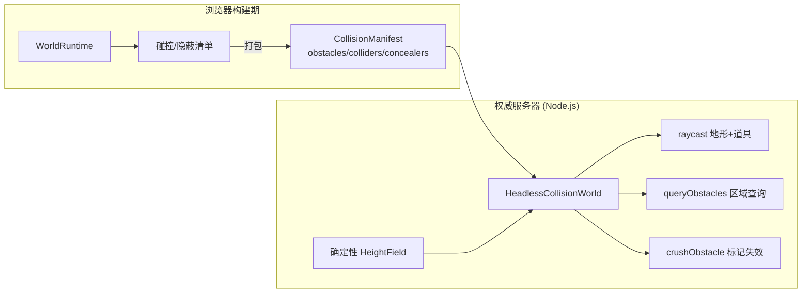
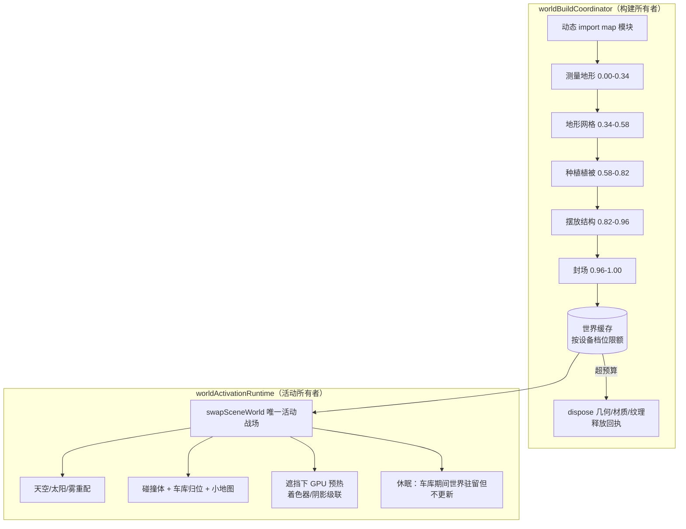

# 地图资产与场景生成

## 目录
1. [模块概览](#模块概览)
2. [引言](#引言)
3. [地图即配置：二十张战场的作者契约](#地图即配置二十张战场的作者契约)
4. [程序化地形：确定性高度场](#程序化地形确定性高度场)
5. [地形网格与分块 LOD 流式加载](#地形网格与分块-lod-流式加载)
6. [场景填充：植被、建筑套件与道具流](#场景填充植被建筑套件与道具流)
7. [碰撞、可破坏物与无头服务器世界](#碰撞可破坏物与无头服务器世界)
8. [构建编排与运行时生命周期](#构建编排与运行时生命周期)
9. [质量门禁与验证工具](#质量门禁与验证工具)
10. [文件参考](#文件参考)

## 模块概览

本章节覆盖 `src/world/` 目录——战场（Battlefield）世界的生成、碰撞、破坏、LOD 与呈现系统。与坦克资产一样，地图也是**代码即资产**：二十张战场全部由 TypeScript 配置驱动、程序化生成，同一份配置同时供浏览器渲染器和 Node.js 权威服务器消费。

**涉及范围**：
- **地形核心**：`src/world/terrain.ts`（高度场与网格）、`terrainLodPolicy.ts`（纯逻辑 LOD 调度）、`liveHeightFieldProxy.ts`（活动世界高度查询门面）。
- **地图配置**：`src/world/maps/`（20 张地图的纯配置模块 + 建筑套件 kits）。
- **场景填充**：`vegetation.ts`、`props.ts`、`propsModelStore.ts`、`wrecks.ts`、`utilityNetwork.ts`、`loosePropPhysics.ts`。
- **碰撞与破坏**：`collision.ts`、`headlessCollisionWorld.ts`、`destructibles.ts`、`topple.ts`、`treeGrounding.ts`。
- **生命周期**：`worldBuildCoordinator.ts`（构建/缓存/驱逐）、`worldActivationRuntime.ts`（唯一活动战场）、`worldFramePresentationRuntime.ts`（逐帧呈现）。
- **审计工具**：`tools/map-environment-audit.mjs`、`tools/terrain-stream-benchmark.mjs`、`tools/bake-minimap-assets.mjs`、`tools/pack-prop-models.mjs`。

**统计信息**：
- **战场数量**：20 张完整战场（4 张经典 + 4 张第二批 + 8 张扩展 + 4 张极端环境）。
- **核心文件数**：`src/world/` 下约 60 个 TypeScript 文件，配套 30 个 `.selftest.mjs`。
- **地图尺寸**：1024 m × 1024 m（x、z ∈ [-512, +512]），高度场网格 257×257（4 m 单元）。

## 引言

坦克的程序化流水线回答的是“一台战车如何由代码长出来”，而世界模块回答的是另一个问题：**战场本身如何由配置长出来**。一张地图不是美术摆放的静态场景，而是一份同时描述地形地貌、生态群系、掩体布局、战术节拍和天空大气的**组合配置（Map Composition Config）**。

这带来三个直接后果：

1. **权威一致**：高度场、地面类型、碰撞体和隐蔽物全部由确定性代码生成，专用服务器无需 WebGL 即可加载同一份世界数据（见 [无头碰撞世界](#碰撞可破坏物与无头服务器世界)）。
2. **可测量**：出生点净空、战术节拍分布、电线杆接地、结构连通性都可以用 Node.js 自测逐张审计，而不是靠肉眼走查。
3. **可流式**：重型数值流（道具模型包、远距 LOD 几何）不进入可执行 chunk，随战斗意图按需传输，开局只构建视野内真正需要的那一级细节。

世界模块与坦克模块共享同一条工程哲学：**视觉几何与仿真几何同源于一份数据**。植被的隐蔽圆盘、建筑的碰撞凸包、坦克残骸的位置，都不是事后补挂的，而是在场景构建时一并产出的。

## 地图即配置：二十张战场的作者契约

### 纯配置注册表

`src/world/maps/catalog.ts` 冻结了全部 20 个地图 ID 与展示名；`maps/index.ts` 将每张地图的纯配置模块汇总为 `CONFIGS`，通过 `getMapConfig(mapId)` 查找（未知 ID 回退到 Verdant）。

```typescript
export const MAP_IDS = Object.freeze([
  'verdant', 'desert', 'winter', 'urban',          // 经典四图
  'coastal', 'autumn', 'steppe', 'railyard',       // 第二批四图
  'frontier', 'fjord', 'delta', 'badlands',        // 扩展八图
  'monsoon', 'alpine', 'caldera', 'foundry',
  'ruinspires', 'blackglass', 'titan_gorge', 'skybridge', // 极端环境四图
] as const);
```

每张地图的配置类型是三个子系统配置的交叉类型（`maps/contracts.ts`）：

```typescript
export type MapCompositionConfig =
  TerrainMapConfig & VegetationMapConfig & PropsMapConfig
  & Record<string, unknown>;
```

- **terrain**：宏观地貌（landforms，每张地图至少 5 个作者手摆地形特征）、出生点、道路、地表 splat 配方。
- **vegetation**：树种（species）、树群与草丛密度、提供隐蔽加成的 concealer 圆盘。
- **props**：可破坏建筑族、战术节拍（tacticalBeats）、墙段、电报线、残骸点、民用车辆等。
- **sky**：太阳高度/方位、雾密度与色调、云层透明度、环境光强度等大气参数。

关键在于：**这些配置模块不导入 Three.js，也不做任何场景构建**。它们是纯数据，浏览器端的 `createMap` 和服务器端的无头世界读的是同一份文件。

### 战术节拍与出生布局

地图配置不只是美术参数，它直接编码玩法结构。质量门禁要求每张地图：

- 拥有 1 个玩家出生点和 **7 个敌方出生点**，且全部位于可玩边界内；
- 定义镜头建立位（`shot.pos` / `shot.look`）供确定性截图使用；
- 恰好包含 **3 个战术节拍点（tactical beats）**，角色分别为 `brawl`（近战缠斗）、`scout`（侦察点亮）、`support`（支援火力），ID 唯一；
- 每个节拍点必须组合至少两层掩体（结构 + 胸墙/露头岩/残骸之一），且引用的建筑族必须在该地图的纹理化结构清单内。

道路与出生走廊还会反向雕刻地形：高度场预计算每张地图所有出生点到村庄的“走廊权重”，走廊内道路被压平、硬化（`getGroundType` 返回 `hard`），保证出生接敌路线可通行。

## 程序化地形：确定性高度场

`terrain.ts` 的 `createHeightField(seed = 1337, config)` 是世界模块的纯逻辑地基，可在 Node.js 中直接运行。

### 地形合成

高度场基于固定种子的 mulberry32 + Simplex 噪声分层叠加：域扭曲脊状噪声（ridge）塑造宏观山体，多级 fBm 细节叠加中低频起伏，高频层补充地表粗糙感。地图配置中的 landforms 在噪声场上叠加作者意图——峡谷、台地、湖盆、冲沟等宏观战术地标。

预计算阶段在 257×257 网格（4 m 单元）上烘焙三张查找表：

- **道路距离/高程表**：每个格点到最近道路的距离与所属路段参数，用于压平路面、铺设硬化地面；
- **走廊权重表**：出生点→村庄路径的平滑权重，保证开进路线坡度可控；
- 村建区、禁植区（`_noVeg`）等掩码同步生成。

高度场对外暴露的接口兼顾实时与创作两种用途：

```typescript
interface HeightField {
  getHeightAt(x, z): number;        // 解析采样：确定性、可重放
  getHeightAtFast(x, z): number;    // 预热的 1 m 缓存：实时表现层使用
  warmFastTilesAround(points): Generator<number>; // 分帧预热缓存
  getNormalAt(x, z): Vector3;
  getGroundType(x, z): 'hard' | 'medium' | 'soft'; // 公路硬地/田野中等/沼泽软地
  getWaterMaskAt(x, z): number;
  readonly size: number; readonly minY: number; readonly maxY: number;
}
```

`liveHeightFieldProxy.ts` 为相机、特效等表现层消费者提供稳定门面：普通实时查询走预热缓存，截图/创作模式可通过 `useExactHeight()` 切换到解析曲面，消费者不需要了解世界生命周期。

### 确定性约束

世界模块沿用全局固定种子约定：**地形 1337、植被 2001、道具 2002**。相同种子必然产出字节一致的高度场，这是录像回放、服务器仲裁和确定性截图的共同前提。地形模块内部不允许 `Math.random()`、`Date.now()` 等非确定性来源。

## 地形网格与分块 LOD 流式加载

`buildTerrainMeshes(heightField, engineCtx, config)` 把高度场变成分块网格，并通过 splat 材质混合草/泥/岩/沙/雪等地表纹理（CC0 来源纹理由 `sourcedTextures.ts` 按地图开关接入）。

### 三级 LOD 与共享索引

地形按距离分为三级（`terrainLodPolicy.ts`，纯逻辑、Node 可测）：

| 级别 | 切换距离 | 用途 |
|---|---|---|
| LOD 0 | < 200 m（带回差迟滞） | 全细节近处地表 |
| LOD 1 | 200–430 m | 中景简化网格 |
| LOD 2 | > 430 m | 远景粗网格 |

位置/法线缓冲是块内私有的，但**相同 LOD 拓扑在每个世界内只保留一份 Uint16 索引属性**，所有同分辨率块共享，避免重复上传索引数据。

### 每帧一个几何任务的流式策略

`terrainLodPolicy.ts` 的调度规则是开场体验的关键：

1. **开局只建可见级别**：`initialTerrainLods(distance)` 对每个块只生成当前距离需要的那一级，不再像旧策略那样为近/中块预建两份不可见缓冲；
2. **每帧至多补一个几何任务**：`chooseTerrainLodBuild` 优先补齐“可见但缺失”的级别（urgent），其次在切换阈值外约一个块宽的位置静默预取下一更细级别；
3. **冻结部署预热**：部署视角等待期间，沿外推方向补齐粗级兜底，保证控制权释放后向外驾驶时不会出现低质帧或几何突现；
4. **资源归属清晰**：树外流式 LOD 几何注册在世界根节点的保留资源生命周期上，缓存驱逐时随世界一起 dispose。

`warmTerrainLookahead(cameraPos, maxJobs)` 供加载/部署阶段批量预热，并有独立基准测试 `tools/terrain-stream-benchmark.mjs`（`npm run perf:terrain-stream`）量化开场驾驶路径上的流式开销。

## 场景填充：植被、建筑套件与道具流

### 植被与隐蔽

`vegetation.ts` 以实例化方式生成草丛与树木，风动在顶点着色器中完成（世界组内无逐帧对象变换）。它同时产出两类仿真数据：

- **树碰撞记录（TreeObstacle）**：每棵树的 2D 碰撞凸包，进入世界碰撞网格；
- **隐蔽圆盘（concealers）**：树群/灌丛的隐蔽加成区域，直接供点亮系统计算 Camo。

树木被撞击时通过 `topple.ts` + `treeGrounding.ts` 完成**不依赖 Three.js 的倾倒数学**：地形接触判定、倾倒姿态与根部贴花都在纯逻辑层计算，再映射到实例矩阵。

### 建筑套件与几何合批

`src/world/maps/` 下的套件（kits）是地图的“积木箱”：

- `villageKit.ts`：农舍、谷仓、教堂、风车、小木屋、阿尔卑斯山居等农庄建筑；
- `urbanKit.ts` / `structureKit.ts`：城镇楼宇与可破坏结构族（16 个可破坏族各自维护完好/破损两套实例池）；
- `railKit.ts`：铁路、站台、天桥等工业构件；
- `exteriorDetailKit.ts` / `inhabitKit.ts` / `civilianVehicleKit.ts`：外立面细节、生活杂物与民用车辆；
- `mapKits.ts`：按地图名注册的特色建造器（如沙漠集市市场）。

建造器不直接产生 Mesh，而是返回尺寸并向**材质桶（material buckets）**写入几何：地标建筑在上传前合并进既有材质桶，重复结构使用 `InstancedMesh`，不为每个摆放点克隆材质。实例色差由 `structureInstanceAppearance.ts` 写入实例属性，完好与破损槽位共享同一稳定色调。

合批前有一道硬门禁：`structureConnectivity.ts` 先验证每个作者摆放的部件在容差内连通（无悬浮、无空洞），不连通则直接拒绝——因为合并之后就再也无法识别悬浮件了。

### 道具模型包：数值流出可执行 chunk

部分精细道具（沙袋、电线杆附件等）的顶点色几何体量较大，采用烘焙数值流方案：

1. 作者源为带属性的 `src/world/props-models.json`；
2. `tools/pack-prop-models.mjs`（`npm run world:props:pack`）将其无损打包为 `props-models.bin.gz`；
3. 运行时 `propsModelStore.ts` 提供带边界检查的紧凑表示，`propsModelFallback.ts` 兜底；
4. `createMapAsync` 在地形/植被构建期间并行启动 `preloadPropModels()` 传输解压，让数据传输与主线程构建重叠——此前这部分 JSON 内嵌在地图 chunk 中，必须先解析完才能开始测量地形。

### 电线杆网、残骸与轻量物理

- **utilityNetwork.ts**：渲染无关的电线杆邻接、铰链姿态、稳定导线实例槽，悬链线采样使用调用方提供的缓冲（零分配）。`propPlacement.ts` 规划杆位时要求杆脚埋入地形支撑面，且双杆组只在地形落差低于 `UTILITY_POLE_PAIR_MAX_RELIEF` 的平地成对保留。
- **wrecks.ts**：确定性烘焙静态坦克残骸与“零额外 Draw Call”的碎片装饰，残骸池按年代（era）选取。
- **loosePropPhysics.ts**：路障、油桶等轻量场景杂物拥有固定 1/60 步长的确定性物理：撞击/炮弹/爆炸冲量、地形支撑、休眠、静态接触与成对响应，让冲撞和炮击有可信的环境反馈而不增加权威负担。
- **destructibles.ts**：FX 层与世界层之间的薄接缝。世界按 mapId 注册可破坏处理器，炮弹扫过/落点通过 effects 侧转发；只有当前活动世界会收到分发。破坏事件经 `emitDestroyed` 汇入事件总线（`prop:destroyed`）供音效等订阅，世界层本身不认识总线。重开比赛时 `resetDestructibles()` 将全部实例复位。

## 碰撞、可破坏物与无头服务器世界

### 类型化碰撞记录

`collision.ts` 使用无分配的类型化碰撞记录，形状为 2D 有向包围盒（OBB）、圆形或凸包：

```typescript
type CollisionShape =
  | { kind: 'obb'; cx; cz; hw; hl; yaw }
  | { kind: 'circle'; cx; cz; r }
  | { kind: 'convex'; cx; cz; points };
```

宽相为 24 m 单元的障碍网格（`createObstacleGrid`），窄相 `rayCollisionRecord` 做射线-形状求交。世界门面（`WorldRuntime`）对外提供 `raycast`（地形射线步进 + 道具求交）、`queryObstacles`（区域查询，供 AI/移动）、`getObstacles`/`getColliders`、`getConcealment` 以及小地图要素（道路、建筑、战术节拍、树群、水域/软地）。

### 无头碰撞世界：服务器不需要 WebGL

`headlessCollisionWorld.ts` 让专用权威服务器在不导入渲染器、不触碰 DOM 的情况下获得完全一致的世界查询能力：



清单用紧凑元组编码形状（`['o', cx,cz,hw,hl,yaw]` OBB、`['c', ...]` 圆、`['v', ...]` 凸包），充气为比赛本地的碰撞门面。地形命中采用“射线步进 + 六次二分”求交点，道具命中走同一套凸包求交；可压碎物（栅栏、树苗）被碾压后在碰撞与渲染两侧同步标记失效。**AI 寻路与战术判断只使用可通行性数据，绝不读取视觉对象**。

## 构建编排与运行时生命周期

世界模块把“构建地图”和“激活地图”拆成两个独立的所有者，这是场景流式化的核心设计。



### 构建协调器（worldBuildCoordinator.ts）

- **在途合并**：并发请求同一张地图共享同一个构建 Promise；后台预取可被前台请求“晋升”并中断其车库等待。
- **分帧让步**：每个子系统内部再切片（fineSlices），进度条穿过子系统爬行而非在子系统间跳变；前台用加载遮罩让步器，后台用帧预算让步器，且后台工作可被战斗意图打断。
- **缓存预算与驱逐**：按设备档位限制驻留世界数，超限时驱逐非活动世界并回收几何/材质/纹理，产出释放回执（objects/geometries/materials/textures 计数）。

### 激活运行时（worldActivationRuntime.ts）

浏览器调用方只允许通过 `ensure` / `switchMap` / `prepareBattleServices` / `setDormant` 操作，不得自行重建激活顺序：

- **场景交换**：同一时刻只有一个战场挂在场景图上；
- **大气重配**：按地图配置切换天空预设、太阳与雾密度；
- **服务就绪**：创建碰撞体、车库归位、队列化小地图；小地图优先加载 `public/minimaps/<map>.webp`（由 `tools/bake-minimap-assets.mjs` 超采样离线烘焙，生产端从不为画 HUD 小地图而遍历战场），失败则回退程序化绘制；
- **遮挡式 GPU 预热**：在加载遮罩后完成着色器编译与阴影级联预热，避免首帧卡顿；
- **休眠语义**：车库期间战场世界保持驻留但休眠——不构建更新循环、不消耗帧预算；`worldFramePresentationRuntime.ts` 逐帧守卫休眠状态，负责狙击镜植被渐隐与追击相机遮挡焦点，且只使用预分配向量。

车库与战场是**互斥的场景驻留**关系：车库使用独立编写的车库专用地形与 7 个连通建筑，只借用生物群系的配色/ relief 语言，绝不导入或构建真实战场的地形、碰撞、可破坏物与动画植被。

## 质量门禁与验证工具

世界模块延续了项目“先自动化、后肉眼”的验证传统：

| 验证项 | 工具 / 自测 | 检查内容 |
|---|---|---|
| 地图目录一致性 | `mapCatalog.selftest.mjs` | 20 个轻量 ID 与完整配置一一对应 |
| 地图质量门禁 | `mapQuality.selftest.mjs` | 出生点边界、7 敌出生、建立镜头、≥5 landforms、3 个角色互异的战术节拍、结构族纹理化、天际线层数 ≤ 3 |
| 结构连通性 | `structureConnectivity.selftest.mjs` | 全部重型/地标建造器在合批前通过支撑图检查 |
| LOD 调度 | `terrainLodPolicy.selftest.mjs` | 开场优先可见级别、每帧单任务、预取边界 |
| 碰撞正确性 | `collision.selftest.mjs` | 宽相/窄相求交、凸包、碾压标记 |
| 构建/激活生命周期 | `worldBuildCoordinator` / `worldActivationRuntime.selftest.mjs` | 在途合并、晋升、驻留、驱逐、预热、休眠与遥测 |
| 全舰队战场审计 | `npm run qa:maps` | 确定性截图 + 采样点走查，`--gate` 可对比基线报告 |
| 地形流式性能 | `npm run perf:terrain-stream` | 开场驾驶路径的 LOD 构建预算 |
| 小地图资产 | `npm run minimap:assets` | 超采样烘焙全部战场战术地图背景 |
| 道具模型包 | `npm run world:props:pack` | 作者 JSON → 无损紧凑包，含边界校验自测 |

此外 `public/maps/*.webp` 存放 20 张战场的原生 4K 宣传图与选择器缩略图，全部由程序化世界经确定性截图生成；地形与建筑使用的 CC0 纹理来源在 `docs/ATTRIBUTION.md` 中逐项登记。

## 文件参考

**地形与配置**：
- [terrain.ts](src/world/terrain.ts)：确定性高度场、splat 材质与分块地形网格。
- [terrainLodPolicy.ts](src/world/terrainLodPolicy.ts)：纯逻辑三级 LOD 调度与每帧单任务流式策略。
- [liveHeightFieldProxy.ts](src/world/liveHeightFieldProxy.ts)：实时缓存/解析曲面切换的高度查询门面。
- [maps/catalog.ts](src/world/maps/catalog.ts) 与 [maps/index.ts](src/world/maps/index.ts)：20 张战场的 ID 注册表与配置查找。
- [maps/contracts.ts](src/world/maps/contracts.ts)：地形/植被/道具组合配置契约。

**场景填充**：
- [vegetation.ts](src/world/vegetation.ts)：实例化草木、风动、隐蔽圆盘与树碰撞。
- [props.ts](src/world/props.ts)：建筑、掩体、残骸点、可破坏族与道具模型加载。
- [propsModelStore.ts](src/world/propsModelStore.ts) / [propsModelFallback.ts](src/world/propsModelFallback.ts)：紧凑道具模型包的运行时表示。
- [structureKit.ts](src/world/maps/structureKit.ts) / [villageKit.ts](src/world/maps/villageKit.ts) / [urbanKit.ts](src/world/maps/urbanKit.ts) / [railKit.ts](src/world/maps/railKit.ts)：地图建筑套件。
- [structureConnectivity.ts](src/world/structureConnectivity.ts)：合批前的结构连通性门禁。
- [utilityNetwork.ts](src/world/utilityNetwork.ts) / [propPlacement.ts](src/world/propPlacement.ts)：电线杆网与地形接地摆放。
- [wrecks.ts](src/world/wrecks.ts) / [loosePropPhysics.ts](src/world/loosePropPhysics.ts)：残骸烘焙与轻量道具物理。

**碰撞与破坏**：
- [collision.ts](src/world/collision.ts)：类型化无分配碰撞记录、宽相网格与射线求交。
- [headlessCollisionWorld.ts](src/world/headlessCollisionWorld.ts)：服务器端无头碰撞门面。
- [destructibles.ts](src/world/destructibles.ts)：炮弹流量、破坏 FX 与事件总线之间的薄接缝。
- [topple.ts](src/world/topple.ts) / [treeGrounding.ts](src/world/treeGrounding.ts)：渲染无关的树木倾倒数学。
- [battlefieldBounds.ts](src/world/battlefieldBounds.ts) / [spawnClearance.ts](src/world/spawnClearance.ts)：可玩边界与出生点净空。

**生命周期与验证**：
- [worldBuildCoordinator.ts](src/world/worldBuildCoordinator.ts)：地图传输、分帧构建、缓存与驱逐。
- [worldActivationRuntime.ts](src/world/worldActivationRuntime.ts)：唯一活动战场、大气重配、服务就绪与 GPU 预热。
- [worldFramePresentationRuntime.ts](src/world/worldFramePresentationRuntime.ts)：狙击植被渐隐与相机遮挡焦点。
- [mapQuality.selftest.mjs](src/world/mapQuality.selftest.mjs)：20 张战场的配置质量门禁。
- [map-environment-audit.mjs](tools/map-environment-audit.mjs)：全舰队战场截图审计（`npm run qa:maps`）。
- [bake-minimap-assets.mjs](tools/bake-minimap-assets.mjs)：小地图超采样烘焙（`npm run minimap:assets`）。
