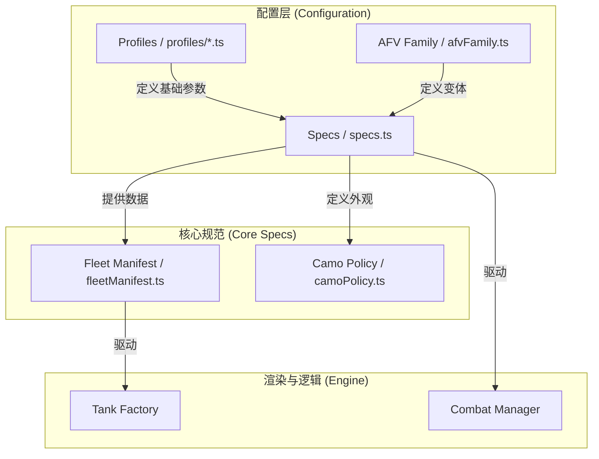
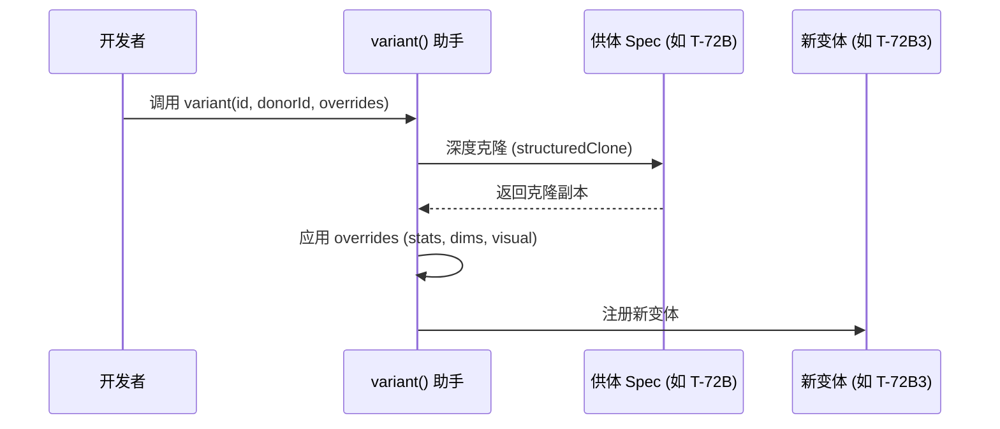
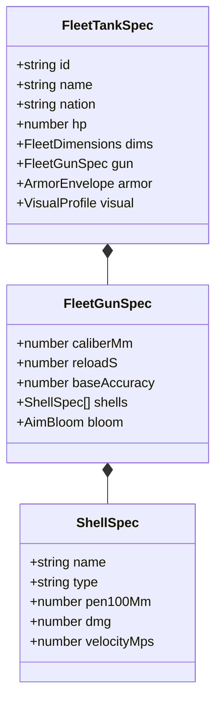
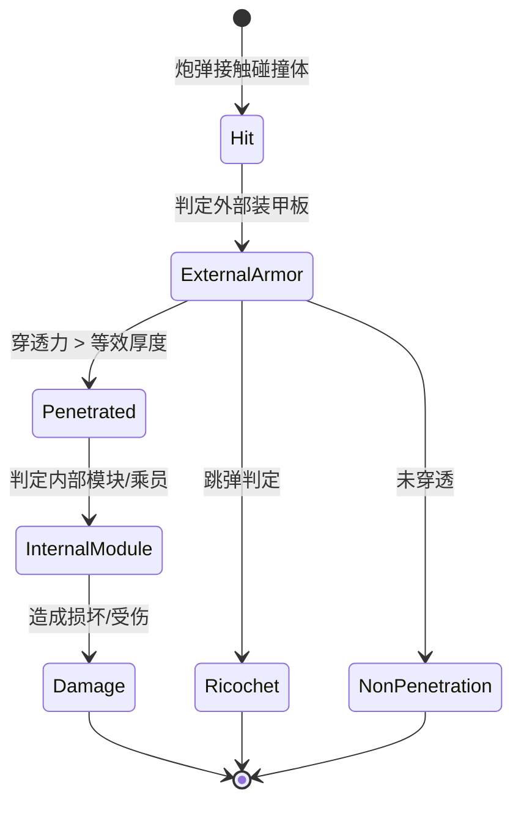
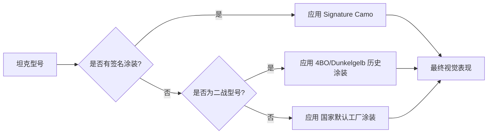

# 坦克配置与家族系统

## 目录
1. [模块概述](#模块概述)
2. [引言](#引言)
3. [坦克 Profile 定义](#坦克-profile-定义)
4. [家族继承机制](#家族继承机制)
5. [战斗性能参数 (Specs)](#战斗性能参数-specs)
6. [装甲与内部构造](#装甲与内部构造)
7. [涂装与标识系统](#涂装与标识系统)
8. [注册与舰队清单](#注册与舰队清单)
9. [核心组件](#核心组件)
10. [文件参考](#文件参考)

## 模块概述

本模块负责定义和管理项目中所有坦克的物理属性、性能参数以及家族层级关系。它是建模引擎的核心数据源，决定了坦克在游戏中的外观、机动性、火力和防御力。

**规模评估**：
- **总文件数**：约 150 个相关文件。
- **核心配置文件**：`src/vehicles/profiles/` 目录下约 34 个 `.ts` 文件，定义了从二战到现代的各类坦克型号。
- **逻辑与注册**：`src/vehicles/` 目录下包含 10 余个核心逻辑文件（如 `specs.ts`, `afvFamily.ts`, `fleetManifest.ts`）。
- **辅助与测试**：包含大量 `.selftest.mjs` 文件，用于验证坦克几何参数和性能平衡。

本页面将深入探讨 `src/vehicles/` 核心逻辑以及 `profiles/` 目录下的典型家族定义，涵盖从基础性能定义到复杂的家族继承机制。

## 引言

在《Claude of Tanks》中，坦克不仅仅是一个 3D 模型，而是一个由大量参数驱动的复杂实体。坦克配置与家族系统（Vehicle Profiles & Family System）的设计目标是实现高度的可扩展性和复用性。

### 核心术语
- **Profile (配置文件)**：定义坦克外形、尺寸、视觉方案和基础性能的 TypeScript 对象。
- **Spec (性能规范)**：详细的战斗参数，包括生命值 (HP)、机动性、火炮精度和装甲分布。
- **Family (家族)**：一组共享基础几何体或设计源的坦克型号（如 Abrams 家族包含 M1A1, M1A2 等）。
- **Donor (供体)**：作为继承基准的坦克型号，变体型号通过克隆供体并覆盖特定参数来创建。

## 坦克 Profile 定义

坦克 Profile 是定义坦克身份的基石。每个 Profile 都是一个符合 `FleetTankSpec` 接口的对象，描述了坦克的物理尺寸、视觉表现和基础属性。

下面的架构图展示了坦克配置系统的核心组件及其相互关系。



坦克配置系统采用分层架构。最底层是位于 `profiles/` 目录下的具体型号定义，这些定义被汇总到 `specs.ts` 中的中央注册表。`fleetManifest.ts` 则负责将这些型号组织成逻辑上的家族，供游戏引擎和车库界面使用。

### 关键字段解析
以 `src/vehicles/profiles/abrams.ts`（典型定义）为例，一个 Profile 包含以下关键部分：

1.  **基础标识**：`id`, `name`, `nation`, `era`, `role`。
2.  **物理尺寸 (Dimensions)**：
    - `hullLengthM`: 车体长度（米）。
    - `overallLengthM`: 全长（含炮管）。
    - `widthM`: 宽度。
    - `heightM`: 高度。
3.  **视觉配置 (Visual)**：
    - `scheme`: 涂装方案（如 `nato`, `digital`, `solid`）。
    - `base`: 基础颜色十六进制码。
    - `trackWidthM`: 履带宽度。
    - `camoScale`: 迷彩缩放比例。

**Section sources**:
- [src/vehicles/specContracts.ts](src/vehicles/specContracts.ts)
- [src/vehicles/profiles/abrams.ts](src/vehicles/profiles/abrams.ts)

## 家族继承机制

为了高效管理庞大的坦克家族，项目引入了变体（Variant）继承机制。通过 `afvFamily.ts` 中的 `variant` 工具函数，开发者可以基于现有的“供体”坦克快速创建新型号。



继承机制的核心在于 `structuredClone`。`variant` 函数首先复制供体的所有属性，然后根据传入的 `AFVVariantOptions` 进行覆盖。这种方式确保了变体型号能自动继承供体的复杂装甲模型和模块分布，同时允许微调性能参数。

### 代码示例：定义变体
在 `src/vehicles/afvFamily.ts` 中，`bmpt_terminator2` 是基于 `t72b3m` 供体创建的：

```typescript
bmpt_terminator2: variant('bmpt_terminator2', 't72b3m', {
  name: 'BMPT Terminator 2',
  nation: 'Russia',
  number: 'BMPT-2',
  // 覆盖视觉参数
  base: '#35452f',
  weather: '#3f4d36',
  patches: ['#243128', '#4d4a37', '#5a523e'],
  // 覆盖尺寸
  dims: { hullLengthM: 7.20, overallLengthM: 7.20, widthM: 3.59, heightM: 3.33 },
  // 覆盖战斗性能
  stats: { hp: 2700, weightTons: 44.0, topSpeedKmh: 60 },
  // 覆盖武器系统
  gun: { 
    caliberMm: 30, 
    reloadS: 0.30, 
    muzzles: [{ x: -0.16, y: 0 }, { x: 0.16, y: 0 }] 
  },
}),
```

这种模式极大地减少了冗余代码，使得像 Abrams 或 T-72 这样拥有数十种变体的家族变得易于维护。

**Section sources**:
- [src/vehicles/afvFamily.ts](src/vehicles/afvFamily.ts)

## 战斗性能参数 (Specs)

战斗性能参数定义在 `src/vehicles/specs.ts` 中，直接影响游戏平衡。

### 核心参数类别
1.  **生存性 (Survivability)**：`hp` (生命值)。
2.  **机动性 (Mobility)**：
    - `enginePowerHp`: 引擎马力。
    - `weightTons`: 重量（吨）。
    - `topSpeedKmh`: 最高前进速度。
    - `reverseSpeedKmh`: 最高倒车速度。
    - `terrainResistance`: 地形阻力（硬/中/软地）。
3.  **火力 (Firepower)**：
    - `caliberMm`: 口径。
    - `reloadS`: 装填时间。
    - `baseAccuracy`: 基础精度（百米偏差）。
    - `aimTimeS`: 瞄准时间。
    - `shells`: 弹药列表，包含穿深 (`pen100Mm`)、伤害 (`dmg`) 和初速 (`velocityMps`)。



类图展示了 `FleetTankSpec` 的层级结构。坦克规范包含武器规范，而武器规范又包含多种弹药规范。这种嵌套结构允许为每辆坦克定义极其详尽的战斗能力。

**Section sources**:
- [src/vehicles/specs.ts](src/vehicles/specs.ts)
- [src/vehicles/specContracts.ts](src/vehicles/specContracts.ts)

## 装甲与内部构造

坦克的防御力由 `ArmorEnvelope` 定义，它不仅包含外部装甲板，还包含内部模块和乘员的碰撞盒。

### 装甲板定义
装甲板通过 `specHelpers.ts` 中的助手函数定义，如 `fr` (前装甲)、`sR` (右侧装甲) 等。现代坦克还支持复合装甲参数：
- `keMm`: 等效动能穿甲厚度 (RHAe)。
- `ceMm`: 等效化学能穿甲厚度 (RHAe)。

### 内部解剖 (Anatomy)
`ArmorEnvelope` 中的 `modules` 和 `crew` 数组定义了关键部件的位置：
- **模块 (Modules)**：`engine`, `fuelTank`, `ammoRack`, `turretRing`, `gun`。
- **乘员 (Crew)**：`driver`, `gunner`, `commander`, `loader`。

下面的状态图描述了炮弹击中坦克后的判定流程。



当炮弹击中坦克时，系统会根据 `ArmorEnvelope` 中定义的装甲板进行穿透判定。如果穿透，炮弹将继续在车体内行进，检测是否碰撞到 `modules` 或 `crew` 中定义的内部盒体，从而计算模块损坏或乘员伤亡。

**Section sources**:
- [src/vehicles/specs.ts](src/vehicles/specs.ts)
- [src/vehicles/specHelpers.ts](src/vehicles/specHelpers.ts)

## 涂装与标识系统

涂装系统由 `camoPolicy.ts` 管理，支持动态迷彩和国家特定的工厂涂装。

### 涂装策略
- **工厂涂装 (Factory)**：每个国家都有默认的工厂涂装（如美国的沙漠色 `service_usa_desert`，俄罗斯的数码绿 `service_t90m`）。
- **签名涂装 (Signature)**：特定型号的标志性外观（如 AbramsX 的原型车涂装）。
- **自定义涂装 (Custom)**：玩家可以调整颜色、模式和缩放。

### 标识 (Markings)
标识定义了编号、国徽或其他图案在坦克上的位置。`visual.marking` 字段决定了使用的标识类型（如 `star`, `cross`, `number`）。



涂装选择逻辑优先考虑“签名”涂装以保持型号辨识度。对于没有签名涂装的型号，系统会根据坦克的年代（Era）和所属国家（Nation）自动匹配最合适的工厂涂装或历史涂装。

**Section sources**:
- [src/vehicles/camoPolicy.ts](src/vehicles/camoPolicy.ts)

## 注册与舰队清单

所有的坦克定义最终都需要在 `fleetManifest.ts` 中进行注册，以便被游戏引擎识别。

### 舰队分组 (Fleet Groups)
`FLEET_GROUP_IDS` 将坦克按家族或类型分组。这不仅用于代码组织，还决定了资源加载的优先级。例如：
- `abrams`: 包含所有 M1 系列变体。
- `t90`: 包含 T-90A, T-90M 等。
- `afv`: 包含步兵战车和防空车。

### 注册流程
1.  在 `profiles/` 中定义几何和基础参数。
2.  在 `specs.ts` 中注册战斗性能。
3.  在 `fleetManifest.ts` 中将 ID 添加到相应的家族数组。
4.  （可选）在 `afvFamily.ts` 中定义基于供体的变体。

**Section sources**:
- [src/vehicles/fleetManifest.ts](src/vehicles/fleetManifest.ts)

## 核心组件

| 组件 | 文件路径 | 职责描述 |
| :--- | :--- | :--- |
| **中央注册表** | `src/vehicles/specs.ts` | 存储所有坦克的 `TANK_SPECS` 数据，定义装甲和性能。 |
| **家族逻辑** | `src/vehicles/afvFamily.ts` | 提供 `variant` 助手函数，管理 AFV/IFV 家族的继承关系。 |
| **舰队清单** | `src/vehicles/fleetManifest.ts` | 定义坦克家族的分组 ID，管理资源加载边界。 |
| **涂装策略** | `src/vehicles/camoPolicy.ts` | 定义迷彩目录、国家默认涂装和签名外观策略。 |
| **分类系统** | `src/vehicles/taxonomy.ts` | 负责坦克的分类标签和元数据处理。 |

## 文件参考

本模块涉及的关键源文件如下：

- [src/vehicles/specs.ts](src/vehicles/specs.ts): 核心性能数据注册表。
- [src/vehicles/afvFamily.ts](src/vehicles/afvFamily.ts): AFV 家族继承与变体逻辑。
- [src/vehicles/fleetManifest.ts](src/vehicles/fleetManifest.ts): 坦克家族分组定义。
- [src/vehicles/camoPolicy.ts](src/vehicles/camoPolicy.ts): 迷彩与视觉策略。
- [src/vehicles/specContracts.ts](src/vehicles/specContracts.ts): 坦克规范的数据接口定义。
- [src/vehicles/specHelpers.ts](src/vehicles/specHelpers.ts): 装甲板和弹药定义的助手函数。
- [src/vehicles/profiles/abrams.ts](src/vehicles/profiles/abrams.ts): Abrams 家族配置示例。
- [src/vehicles/profiles/t72.ts](src/vehicles/profiles/t72.ts): T-72 家族配置示例。
- [src/vehicles/profiles/leopard.ts](src/vehicles/profiles/leopard.ts): Leopard 家族配置示例。
