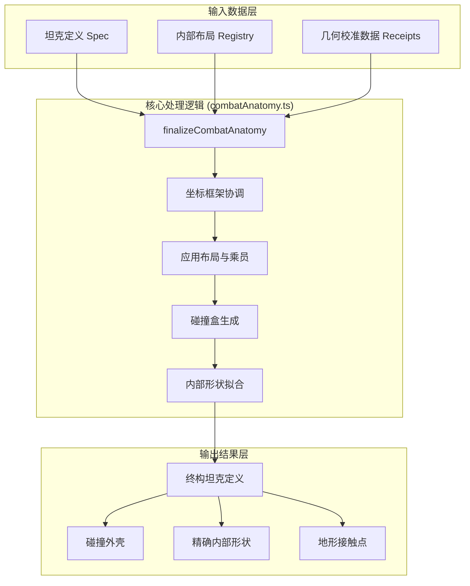
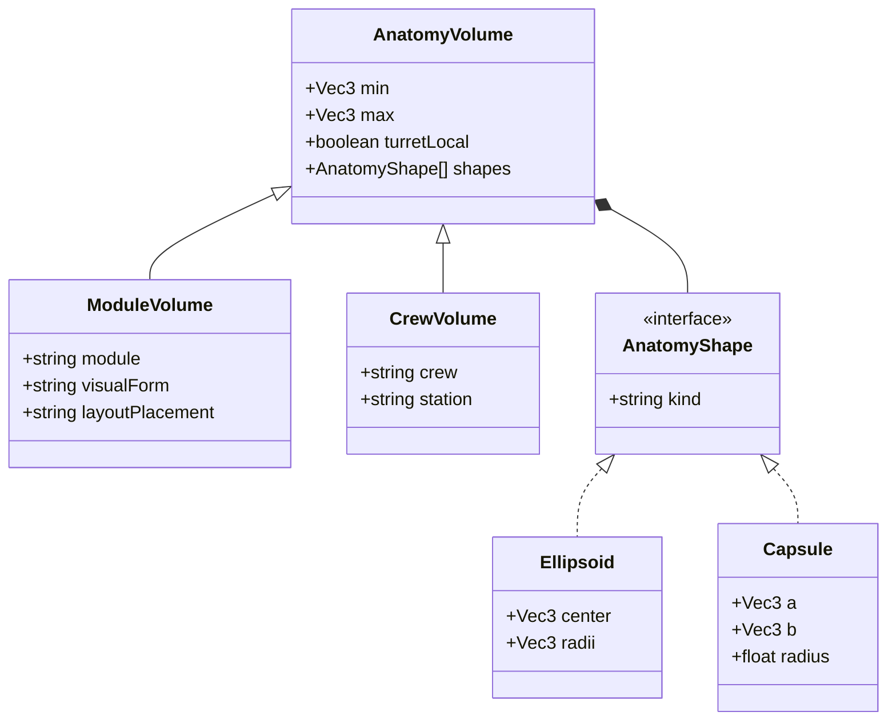
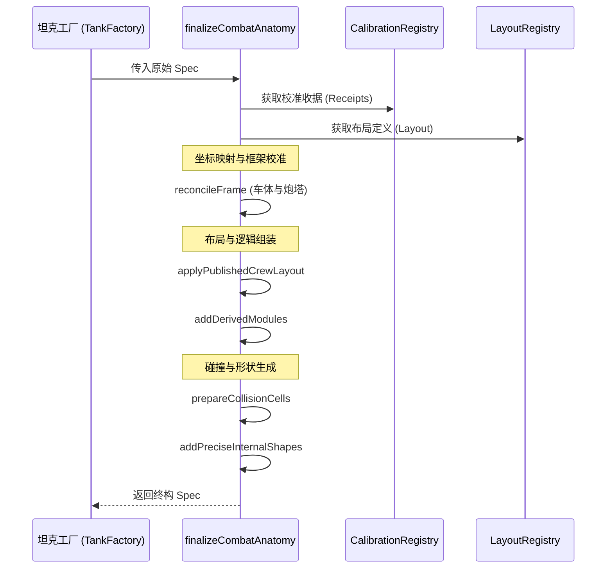
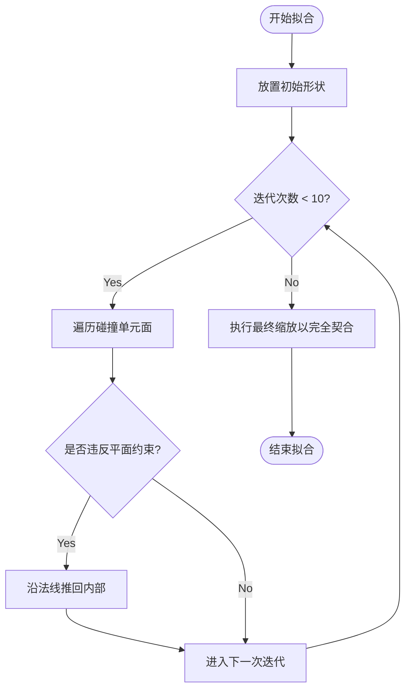
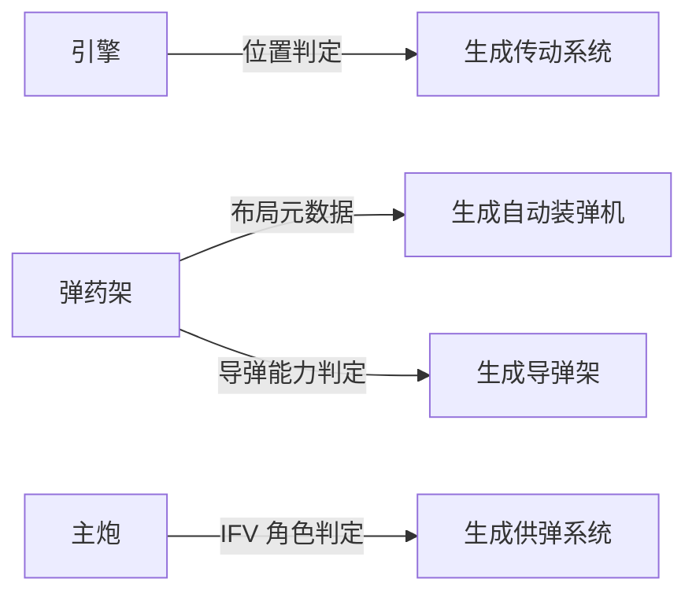
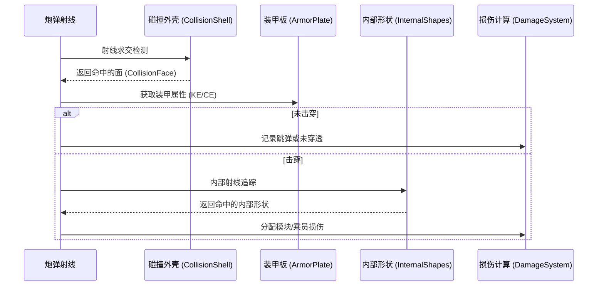

# 战斗解剖学与内部模块

## 目录
1. [模块概览](#模块概览)
2. [引言](#引言)
3. [系统架构](#系统架构)
4. [核心组件与数据模型](#核心组件与数据模型)
   - [装甲建模 (Armor Modeling)](#装甲建模-armor-modeling)
   - [装甲抗性与层类型](#装甲抗性与层类型)
   - [内部布局 (Internal Layouts)](#内部布局-internal-layouts)
   - [碰撞单元 (Collision Cells)](#碰撞单元-collision-cells)
5. [战斗解剖学终构流程 (finalizeCombatAnatomy)](#战斗解剖学终构流程-finalizecombatanatomy)
6. [校准与自动拟合系统](#校准与自动拟合系统)
   - [坐标框架协调 (Frame Reconciliation)](#坐标框架协调-frame-reconciliation)
   - [内部形状的精确拟合 (Shape Fitting)](#内部形状的精确拟合-shape-fitting)
7. [内部布局注册表与模块逻辑](#内部布局注册表与模块逻辑)
   - [多部分模块定义](#多部分模块定义)
   - [派生模块生成](#派生模块生成)
8. [碰撞检测与损伤模拟集成](#碰撞检测与损伤模拟集成)
   - [有序装甲层与穿透判定](#有序装甲层与穿透判定)
   - [穿透后效范围](#穿透后效范围)
   - [HE 与 HESH 爆炸范围](#he-与-hesh-爆炸范围)
9. [关键算法分析](#关键算法分析)
   - [最近装甲板匹配 (nearestPlate)](#最近装甲板匹配-nearestplate)
   - [碰撞点提取 (collisionContactPoints)](#碰撞点提取-collisioncontactpoints)
10. [文件参考](#文件参考)

## 模块概览

本章节深入探讨 `Claude-of-Tanks` 中坦克的“内部世界”——即战斗解剖学（Combat Anatomy）系统。该系统负责定义、生成并校准影响战斗模拟的内部结构，包括装甲、模块和乘员战位。

**涉及范围**：
- **核心逻辑**：`src/vehicles/combatAnatomy.ts`
- **布局定义**：`src/vehicles/internalLayoutRegistry.ts`
- **校准数据**：`src/vehicles/combatAnatomyCalibrationRegistry.ts` 及 `src/vehicles/combatAnatomyGroups/` 下的 27 个生成文件。
- **模块元数据**：`src/sim/moduleCatalog.ts`

**统计信息**：
- **核心文件数**：约 15 个。
- **自动生成文件**：27 个（包含各坦克家族的几何收据）。
- **覆盖范围**：涵盖了从二战到现代的 120 多种坦克型号的内部结构模拟。

本章节将重点讲解 `finalizeCombatAnatomy` 函数的工作流，解释如何将通用的解剖模板自动缩放并拟合到特定型号的几何外壳中，以及如何生成用于精确损伤计算的碰撞盒。

## 引言

在 `Claude-of-Tanks` 的战斗模拟中，仅仅拥有外部几何模型是不够的。为了实现高精度的损伤模型（如弹药架殉爆、乘员伤亡、引擎起火），系统必须理解坦克的内部构造。战斗解剖学系统（Combat Anatomy System）正是为此而设计的。

该系统的核心目标是创建一个与外部视觉模型完美契合的“内部影子模型”。这个模型不仅包含了几何形状，还包含了物理属性（如装甲的等效厚度）和逻辑属性（如模块的生命值）。

系统的设计面临三个主要挑战：
1. **多样性**：游戏支持数百种坦克，每种坦克的内部布局都不同。从二战时期的五人制手动装填坦克到现代的三人制自动装弹坦克，其内部空间排布有着本质的区别。
2. **对齐精度**：内部模块（如引擎）必须精确地位于外部车壳之内，不能穿模，且必须与装甲板的实际位置对应。如果引擎的碰撞盒超出了装甲范围，玩家可能会在没有击穿装甲的情况下损伤引擎。
3. **性能开销**：战斗模拟需要在每一帧处理大量的射线检测。内部解剖结构必须既精确又高效，避免使用复杂的网格碰撞，而是采用凸包和简单的数学形状（椭球、胶囊）。

为了解决这些问题，系统采用了“模板+校准”的方案：开发者定义通用的布局模板，然后通过自动化的几何测量工具生成“收据（Receipts）”，最后在运行时通过校准算法将模板精确地拟合到实际模型中。这种方法保证了在拥有极高灵活性的同时，依然能维持严谨的物理一致性。

## 系统架构

战斗解剖学系统是一个纯数学计算模块，不依赖于任何图形引擎（如 Three.js）。它在坦克初始化阶段运行，将原始的坦克定义（Spec）转化为可以直接用于物理模拟的终构模型。

下面的图表展示了战斗解剖学系统的数据流和处理阶段：



该架构图描绘了从原始配置到物理就绪实体的转化路径。**输入数据层**提供了作者的意图（Spec）、历史参考（Layout）以及通过离线工具测量的几何事实（Calibration）。**核心处理逻辑**位于 `combatAnatomy.ts` 中，它通过一系列有序的转换步骤，将这些异构数据融合在一起。**输出结果层**包含了战斗引擎所需的所有几何收据，包括用于射线检测的凸包集合（CollisionShells）和用于体积检测的平滑形状（InternalShapes）。

在数据模型方面，系统使用了清晰的继承和组合关系来描述内部组件：



这个类图展示了内部体积的组织方式。`AnatomyVolume` 是基类，提供了基础的 AABB 边界和坐标系信息。`ModuleVolume` 和 `CrewVolume` 分别扩展了模块和乘员特有的元数据。每个体积可以包含一个或多个 `AnatomyShape`，这些形状是经过 `fitShapeInsideShell` 算法优化后的精确几何体，用于最终的损伤判定。

**架构参考**:
- [combatAnatomy.ts](src/vehicles/combatAnatomy.ts)
- [internalLayoutRegistry.ts](src/vehicles/internalLayoutRegistry.ts)

## 核心组件与数据模型

战斗解剖学系统依赖于几个关键的数据模型来描述坦克的物理结构。

### 装甲建模 (Armor Modeling)

装甲板是战斗模拟的基础。在 `combatAnatomy.ts` 中，`ArmorPlate` 接口定义了装甲的几何和物理属性。

```typescript
interface ArmorPlate {
  name: string;
  verts: Vec3[];      // 顶点坐标
  physicalMm: number; // 物理厚度 (mm)
  keMm: number;       // 等效动能装甲 (KE)
  ceMm: number;       // 等效化学能装甲 (CE)
  kind?: string;      // 种类 (如 'main', 'external', 'era')
  era?: unknown;      // 反应装甲数据
  moduleLink?: string;// 关联的模块 ID
}
```

装甲被分为不同的种类。`main` 装甲构成坦克的主要防护结构；`spaced` 表示裙板、楔形附加甲和笼式装甲等间隙层；`external` 表示履带、外挂结构等外部层；`era` 则代表具有一次性消耗状态的爆炸反应装甲。射线会将这些表面与内部模块、乘员交点放入同一个有序序列，损伤求解器再按层处理。

### 装甲抗性与层类型

战斗运行时没有单独的 `RHA`、铸钢、高硬度钢、铝合金或复合装甲材质枚举。项目采用“每块装甲板直接标定最终抗性”的方案：

- `physicalMm` 是物理/名义厚度，参与口径压制、跳弹和 HE 吸收等规则。
- `keMm` 是该区域对 AP、APCR、APFSDS 等动能弹的 RHA 等效抗性。
- `ceMm` 是该区域对 HEAT、HE、HESH 等化学能或爆炸弹药的 RHA 等效抗性。

普通均质装甲不提供覆盖值时，`keMm` 和 `ceMm` 都默认等于 `physicalMm`。复合装甲则直接填写不同的 KE/CE 等效值。例如，现代坦克炮塔正面可以具有 `physicalMm: 800`、`keMm: 850`、`ceMm: 1250`，而无需在运行时模拟其陶瓷、NERA 或金属夹层构成。

```typescript
function plate(name, physicalMm, v0, v1, v3, options = {}) {
  return {
    name,
    verts: [v0, v1, deriveFourthVertex(v0, v1, v3), v3],
    physicalMm,
    keMm: options.keMm ?? physicalMm,
    ceMm: options.ceMm ?? physicalMm,
    kind: options.kind || 'main',
    era: options.era || null,
    moduleLink: options.moduleLink || null,
    gunFollow: !!options.gunFollow,
  };
}
```

`kind` 控制装甲层在有序命中链中的行为：

| `kind` | 用途 | 穿透处理 |
|---|---|---|
| `main` | 车体、炮塔和炮盾的主防护 | 使用 KE/CE 等效厚度完成最终穿透判定 |
| `spaced` | 侧裙、楔形附加甲、笼式装甲 | 先扣除自身抗性；HEAT 再按后续空气间隙衰减 |
| `external` | 履带和外挂装甲结构 | 与间隙层相同，并可通过 `moduleLink` 损伤履带等模块 |
| `era` | 爆炸反应装甲块 | 一次性触发；对 KE 按比例削减穿深，对 CE 扣除固定穿深 |

ERA 的保护参数为 `keReduction` 与 `ceFlatMm`。触发后的装甲块名称被记录在 `CombatState.eraSpent` 中，后续射线会跳过该块；串联战斗部可触发前级药柱后让主射流绕过本次削减。

装甲倾斜响应主要由弹种而非材质决定。有效厚度按以下形式计算：

```text
有效厚度 = keMm 或 ceMm / cos(归一化后的入射角) ^ slopeExponent
```

AP/APCR 的斜面指数为 `1.4`，APFSDS、HEAT、HE 和 HESH 为 `1.0`。动能弹还会使用两倍口径归一化增强与三倍口径免跳弹规则；APFSDS 的口径压制使用长杆等效口径，而不是直接使用火炮口径。

这种设计实质上是“按区域保存最终抗性”，而不是“从材质名称推导抗性”。它便于同一套求解器同时覆盖二战均质钢与现代复合装甲，但不会自动模拟铸钢崩落、铝装甲燃烧或不同钢材韧性。

**实现参考**：
- [armor.ts:L48-L63](src/sim/armor.ts#L48-L63)
- [specHelpers.ts:L73-L97](src/vehicles/specHelpers.ts#L73-L97)
- [damage.ts:L218-L229](src/sim/damage.ts#L218-L229)
- [damage.ts:L442-L495](src/sim/damage.ts#L442-L495)

### 内部布局 (Internal Layouts)

内部布局定义了坦克内部组件的逻辑排布。`internalLayoutRegistry.ts` 存储了这些定义。

```typescript
export interface InternalLayoutDefinition {
  readonly confidence: string; // 数据置信度 (如 'documented', 'inferred')
  readonly sources: readonly InternalLayoutSourceId[]; // 参考来源
  readonly crew: readonly InternalCrewStation[]; // 乘员战位
  readonly systems: InternalSystems; // 系统位置 (引擎、弹药架等)
}
```

布局定义使用抽象的“位置标签”（如 `frontCenter`, `rearRight`），而不是绝对坐标。这允许同一个布局模板应用于多种不同尺寸的坦克，具体的坐标由校准系统在运行时计算。例如，`leopard` 布局被应用于从 `Leopard 1` 到 `Leopard 2A7` 的所有变体，尽管它们的尺寸差异巨大，但乘员和模块的相对拓扑结构保持一致。

### 碰撞单元 (Collision Cells)

为了进行高效的损伤计算，系统将坦克的装甲结构分解为多个凸多面体，称为“碰撞单元”（Collision Cells）。

```typescript
interface CollisionCell extends Bounds {
  vertices: Vec3[];
  faces: CollisionFace[];
  structureKind: string | null;
}

interface CollisionFace {
  indices: number[]; // 顶点索引
  normal: Vec3;      // 法线
  constant: number;  // 平面方程常数
  plate: ArmorPlate; // 关联的装甲板
}
```

每个 `CollisionFace` 都直接关联到一个 `ArmorPlate`。当炮弹射线击中某个面时，模拟系统可以立即获取该位置的装甲厚度和材质属性。这种设计避免了在战斗中进行复杂的空间搜索，实现了 O(1) 的装甲属性查询。

**组件参考**:
- [combatAnatomy.ts:L35-L113](src/vehicles/combatAnatomy.ts#L35-L113)
- [internalLayoutRegistry.ts:L194-L199](src/vehicles/internalLayoutRegistry.ts#L194-L199)

## 战斗解剖学终构流程 (finalizeCombatAnatomy)

`finalizeCombatAnatomy` 是本模块的核心入口函数。它的任务是将一个静态的坦克定义转变为一个功能完备的战斗实体。

该函数的工作流程如下：

1. **获取校准数据**：根据坦克 ID 从 `combatAnatomyCalibrationRegistry` 中获取对应的几何收据。
2. **框架协调 (Frame Reconciliation)**：这是最关键的一步。系统会将作者在 Spec 中定义的“理想”坐标（通常是基于设计图的）映射到实际 3D 模型的测量边界上。
3. **应用布局元数据**：从 `internalLayoutRegistry` 获取布局，并更新模块和乘员的视觉形式、位置信息。
4. **生成派生模块**：根据已有的核心模块自动生成关联模块。例如，如果有引擎但没有传动系统，系统会根据引擎位置自动生成一个传动系统模块。
5. **准备碰撞外壳**：调用 `prepareCollisionCells` 将原始的几何数据转化为带有装甲关联的碰撞单元。
6. **生成精确内部形状**：调用 `addPreciseInternalShapes` 为每个模块和乘员生成用于体积检测的数学形状。



这个时序图展示了初始化过程中的严格顺序。`reconcileFrame` 必须在所有布局应用之前运行，因为它建立了基础的坐标映射。`addDerivedModules` 则在最后阶段运行，以确保它能访问到已经校准过的核心模块位置。

**代码实现参考**:
- [combatAnatomy.ts:L1216-L1311](src/vehicles/combatAnatomy.ts#L1216-L1311)

## 校准与自动拟合系统

校准系统是 `Claude-of-Tanks` 能够处理大量坦克型号的秘密所在。它解决了“如何让一套内部组件定义适应不同形状的车壳”的问题。

### 坐标框架协调 (Frame Reconciliation)

`reconcileFrame` 函数负责执行线性插值映射。它将作者定义的坐标点（相对于作者定义的边界）映射到校准收据提供的实际测量边界中。

```typescript
function mapPoint(point: Vec3, from: Bounds, to: AnatomyCalibrationBounds | Bounds): void {
  for (let axis = 0; axis < 3; axis++) {
    const span = from.max[axis] - from.min[axis];
    if (!(span > 1e-5)) continue;
    const t = (point[axis] - from.min[axis]) / span;
    point[axis] = to.min[axis] + t * (to.max[axis] - to.min[axis]);
  }
}
```

这种映射是轴向独立的。如果一个坦克的实际模型比作者预想的长一点，所有的内部组件都会在纵向上被拉伸以适应新的长度。这种方法极大地减轻了美术和策划的工作量，因为他们只需要定义一套“标准”比例的内部结构。

### 内部形状的精确拟合 (Shape Fitting)

仅仅缩放是不够的，内部模块（如弹药架）必须位于装甲内部，且不能与装甲板发生重叠。`fitShapeInsideShell` 函数使用了一种迭代算法来确保形状的完美嵌入。



该流程图描述了 `fitShapeInsideShell` 的核心逻辑。算法首先尝试通过平移来解决穿模问题。如果平移无法解决（例如模块太大，无法放入空间），则通过 `scaleShape` 进行统一缩放。这种“平移优先，缩放保底”的策略最大程度地保留了作者设计的模块体积。

**算法参考**:
- [combatAnatomy.ts:L212-L227](src/vehicles/combatAnatomy.ts#L212-L227) (mapPoint)
- [combatAnatomy.ts:L658-L711](src/vehicles/combatAnatomy.ts#L658-L711) (fitShapeInsideShell)

## 内部布局注册表与模块逻辑

内部布局系统不仅定义了“在哪里”，还定义了“是什么”。

### 多部分模块定义

某些模块（如弹药架）可能由多个不连续的部分组成。系统支持通过 `parts` 属性定义多部分体积。

在 `finalizeCombatAnatomy` 中，如果一个模块有 `parts` 定义，系统会分别为每个部分生成碰撞形状。例如，现代坦克的弹药通常分布在炮塔尾舱和车体内部。通过定义两个 `parts`，损伤系统可以准确识别炮弹是击中了尾舱弹药（可能触发泄压板逻辑）还是击中了车体弹药（可能导致殉爆）。

### 派生模块生成

为了保持 Spec 的简洁，许多次要模块是根据核心模块动态生成的。`addDerivedModules` 函数负责这一逻辑：



- **传动系统 (Transmission)**：如果没有显式定义，系统会根据引擎的位置（前置或后置）在引擎的一侧生成一个较小的传动模块。对于前置引擎坦克（如 `Merkava`），传动系统被放置在引擎前方；对于后置引擎坦克（如 `Abrams`），则放置在后方。
- **自动装弹机 (Autoloader)**：如果布局定义中包含自动装弹机，系统会根据弹药架的位置派生出一个装弹机模块。
- **导弹架 (Missile Rack)**：对于具备导弹发射能力的坦克（如 IFV），系统会自动从主弹药架中分出一部分作为导弹架。

这种派生逻辑保证了战斗模拟的丰富性，而无需在每个坦克的配置文件中手动输入冗余数据。

**逻辑参考**:
- [combatAnatomy.ts:L1125-L1214](src/vehicles/combatAnatomy.ts#L1125-L1214) (addDerivedModules)

## 碰撞检测与损伤模拟集成

生成的碰撞外壳（Collision Shells）是战斗模拟的直接输入。当炮弹射入坦克时，模拟系统执行以下步骤：



这种基于精确数学形状的检测比简单的 AABB 盒检测要准确得多，能够模拟出炮弹擦过乘员头部或从弹药架缝隙穿过的极端情况。

**流程参考**:
- [src/sim/damage.ts](src/sim/damage.ts) (损伤分配逻辑)
- [src/sim/ballistics.ts](src/sim/ballistics.ts) (射线求交逻辑)

### 有序装甲层与穿透判定

`traceTank` 返回沿炮弹线段排序的装甲板、模块和乘员交点。`resolveShellHit` 按固定顺序处理它们：

1. 在每个外表面的原始入射角上检查跳弹。
2. 触发尚未消耗的 ERA，并削减剩余穿深。
3. 扣除 `spaced`、`external` 和炮管等屏障的有效厚度。
4. HEAT 穿过屏障后，按到下一装甲层的空气间隙继续衰减；当前系数是每米损失 50% 穿深。
5. 在第一层 `main` 装甲上完成 KE/CE 有效厚度判定。
6. 穿透后继续沿弹道检查限定范围内的模块与乘员。
7. 若动能弹仍有穿深，则反向检测远端装甲，确认能否穿出车体。

穿深与基础伤害在每发炮弹上各进行一次 `±25%` 均匀随机采样，后续各装甲层共享该发炮弹的剩余穿深，避免同一发炮弹在每一层重新抽取穿深。

### 穿透后效范围

AP、APCR、APFSDS 和 HEAT 穿透主装甲后，内部模块/乘员检测范围固定为弹径的十倍：

```text
postPenRangeM = caliberMm × 10 / 1000
```

| 弹径 | 后效距离 |
|---:|---:|
| 75 mm | 0.75 m |
| 88 mm | 0.88 m |
| 100 mm | 1.00 m |
| 120 mm | 1.20 m |
| 125 mm | 1.25 m |
| 152 mm | 1.52 m |

该后效目前是一条沿炮弹飞行方向的内部射线，而不是具有角度和破片密度的三维破片锥。只有与射线相交、且交点位于限制距离内的模块和乘员才会进入受伤判定。横跨装甲板的体积采用 `t..tExit` 区间记录：只要其体积延伸到穿透点之后，就会从穿透点开始计入，避免贴近侧甲的弹药架或前置发动机因包围体入口位于装甲外而无法受伤。

射线经过模块并不等于必然损坏。模块根据类型执行 saving throw，随后以 `moduleDmg ±25%` 扣减模块 HP；乘员在直接穿透射线上有 33% 受伤概率。模块变黄、变红后分别触发精度、装填、机动和视野等退化，弹药架归零会直接导致殉爆。

动能弹穿过内部、且扣除远端装甲后仍有剩余穿深时，可以从车体另一侧飞出并继续命中第二辆坦克；每发炮弹最多执行一次这种 `carry-through`。HEAT 射流不会穿出目标后继续飞行。

当前模型刻意没有模拟单独破片、破片锥角、破片速度、装甲材质崩落和穿透后弹芯偏航。它以低成本保留了“瞄准内部模块”的战术结果，并保持权威服务器上的确定性执行顺序。

**实现参考**：
- [damage.ts:L262-L265](src/sim/damage.ts#L262-L265)
- [damage.ts:L888-L915](src/sim/damage.ts#L888-L915)
- [damage.ts:L1018-L1058](src/sim/damage.ts#L1018-L1058)
- [damage.ts:L1149-L1205](src/sim/damage.ts#L1149-L1205)
- [combat.selftest.mjs:L620-L660](src/sim/combat.selftest.mjs#L620-L660)

### HE 与 HESH 爆炸范围

HE/HESH 与动能弹的后效路径不同：

- **完全穿透主装甲**：造成完整伤害，并使用同样的“十倍弹径”内部射线检查模块和乘员。
- **未穿透或在附近爆炸**：生成球形爆炸范围，按目标最近装甲表面到爆点的距离计算衰减。

爆炸半径由弹径决定：

```text
blastRadiusM = clamp(0.66 × (caliberMm / 30) ^ 1.3, 1, 8)
```

例如 122 mm HE 的爆炸半径约为 4.09 m。爆炸球内的外部履带、火炮和光学设备使用完整受伤概率与模块伤害；内部模块的概率和伤害减半；乘员使用较低的 10% 受伤概率。间隙装甲会把直到第一层主装甲的物理厚度加入吸收项，并把空气间隙加入距离衰减，因此侧裙可以显著削弱未穿透 HE。

HESH 与 HE 共用爆炸路径，但未穿透后的 through-armor splash 使用 `1.25` 的崩落加成。防崩落内衬只降低未穿透爆炸对内部的影响，不削弱完全穿透后的直接后效。

**实现参考**：
- [damage.ts:L1214-L1285](src/sim/damage.ts#L1214-L1285)
- [damage.ts:L1405-L1508](src/sim/damage.ts#L1405-L1508)
- [damage.ts:L2166-L2176](src/sim/damage.ts#L2166-L2176)
- [combat.selftest.mjs:L593-L618](src/sim/combat.selftest.mjs#L593-L618)

## 关键算法分析

### 最近装甲板匹配 (nearestPlate)

在生成碰撞单元时，系统需要知道每个面对应哪块装甲板。`nearestPlate` 算法通过综合考虑以下因素来选择最佳匹配：

1. **法线对齐度**：面的法线与装甲板法线的夹角。如果夹角很大，说明这两个面方向不一致，不太可能是同一块装甲。
2. **平面距离**：面中心到装甲板所在平面的垂直距离。
3. **边缘距离**：面中心到装甲板边界的距离。

```typescript
const score = planeDistance + edgeDistance * 0.75 + (1 - alignment) * 1.25;
```

这个加权评分公式是经过大量调优的，确保了即使在几何形状非常复杂的区域（如炮盾或车体转角），碰撞面也能正确地继承其物理属性。

### 碰撞点提取 (collisionContactPoints)

为了支持坦克翻滚和复杂的地形接触，系统从碰撞单元中提取了一个去重的点云。

```typescript
function collisionContactPoints(cells: readonly CollisionCell[] | undefined): number[] {
  const points: number[] = [];
  const seen = new Set<string>();
  for (const cell of cells || []) {
    for (const point of cell.vertices || []) {
      const key = `${Math.round(point[0] * 1000)},${Math.round(point[1] * 1000)},${Math.round(point[2] * 1000)}`;
      if (seen.has(key)) continue;
      seen.add(key);
      points.push(point[0], point[1], point[2]);
    }
  }
  return points;
}
```

这些点被用于坦克的物理模拟，确保当坦克底盘朝天时，它能以真实的物理轮廓与地面接触，而不是一个简单的长方体。去重过程使用了毫米级的量化键，这在保证精度的同时，避免了重复点对物理引擎造成的性能压力。

**算法参考**:
- [combatAnatomy.ts:L291-L321](src/vehicles/combatAnatomy.ts#L291-L321) (nearestPlate)
- [combatAnatomy.ts:L403-L418](src/vehicles/combatAnatomy.ts#L403-L418) (collisionContactPoints)

## 文件参考

本章节涉及的关键源文件如下：

- [src/vehicles/combatAnatomy.ts](src/vehicles/combatAnatomy.ts)：核心终构逻辑与几何处理。包含 `finalizeCombatAnatomy` 和所有几何算法。
- [src/vehicles/internalLayoutRegistry.ts](src/vehicles/internalLayoutRegistry.ts)：坦克内部布局的权威注册表。定义了 120 多种坦克的乘员和模块拓扑。
- [src/vehicles/combatAnatomyCalibrationRegistry.ts](src/vehicles/combatAnatomyCalibrationRegistry.ts)：校准数据模型与运行时注册。定义了 `CombatAnatomyCalibration` 接口。
- [src/vehicles/combatAnatomyCalibrations.ts](src/vehicles/combatAnatomyCalibrations.ts)：聚合所有自动生成的校准收据。
- [src/sim/moduleCatalog.ts](src/sim/moduleCatalog.ts)：内部模块的 HP 与逻辑属性定义。
- [src/sim/armor.ts](src/sim/armor.ts)：装甲交点、碰撞外壳、履带棱柱与模块/乘员体积查询。
- [src/sim/damage.ts](src/sim/damage.ts)：跳弹、KE/CE 等效厚度、ERA、间隙装甲、穿透后效与 HE/HESH 爆炸。
- [src/sim/combat.selftest.mjs](src/sim/combat.selftest.mjs)：装甲、后效距离、模块损伤、ERA 和爆炸范围的自测。
- [src/vehicles/combatAnatomyGroups/](src/vehicles/combatAnatomyGroups/)：包含 27 个子文件，存储了全舰队的几何测量数据。
