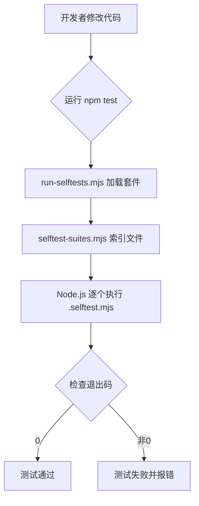
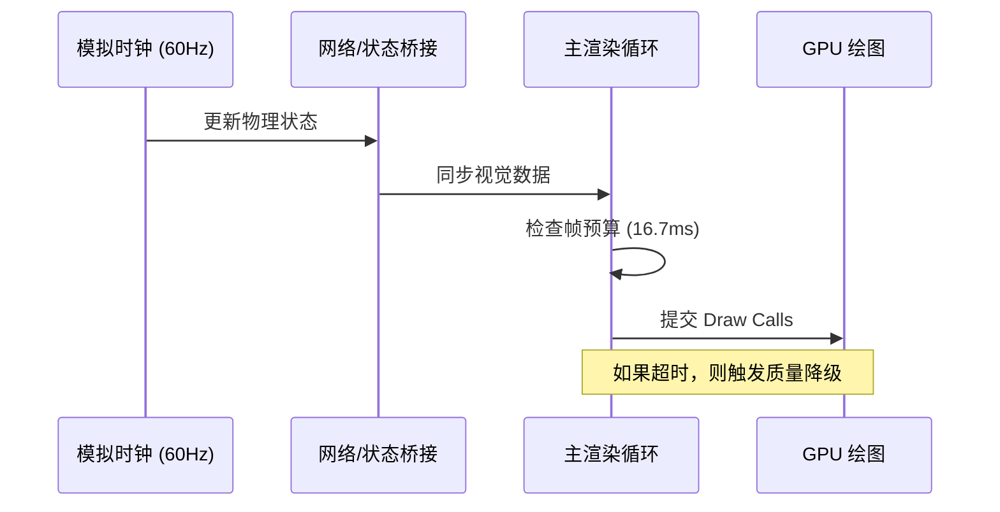

# 开发规范、测试与性能优化

## 目录
1. [模块概览](#模块概览)
2. [自测体系 (Self-test System)](#自测体系-self-test-system)
   - [运行机制](#运行机制)
   - [编写规范与模板](#编写规范与模板)
3. [性能优化架构](#性能优化架构)
   - [60FPS 维持策略](#60fps-维持策略)
   - [内存与 GPU 资源管理](#内存与-gpu-资源管理)
   - [Web Worker 的异步处理](#web-worker-的异步处理)
4. [构建流程与部署规范](#构建流程与部署规范)
   - [Vite 配置与启动优化](#vite-配置与启动优化)
   - [环境变量与生产环境隔离](#环境变量与生产环境隔离)
5. [开发规范与代码风格](#开发规范与代码风格)
   - [Living Rulebook (构建标准)](#living-rulebook-构建标准)
   - [命名与模块组织原则](#命名与模块组织原则)
6. [核心组件](#核心组件)
7. [文件引用](#文件引用)

## 模块概览
本章节汇总了《Claude of Tanks》项目中的工程化实践，涵盖了从代码编写规范到性能极限优化的全过程。项目的核心目标是确保代码的高度可维护性，并指导如何在复杂的 WebGL 环境中维持稳定的 60FPS 帧率。

- **总文件数**：约 350+ 个源文件（包含 200+ 个 `.selftest.mjs` 自测文件）。
- **主要子模块**：
  - `src/engine/`：包含自适应质量策略、帧调度器等性能核心组件。
  - `tools/`：包含自测运行器、资产生成工具及性能审计脚本。
  - `docs/`：存放开发指南 (`DEVELOPMENT.md`)、性能指南 (`PERFORMANCE.md`) 及构建标准 (`BUILD-STANDARD.md`)。
- **覆盖范围**：本章节将深入探讨自测体系的运行机制、性能优化的具体策略以及 Vite 构建流程的细节。

## 自测体系 (Self-test System)
项目采用了一套独特的自测体系，旨在通过轻量级的 Node.js 脚本对核心逻辑进行快速验证。这套体系不依赖大型测试框架，而是利用原生 ESM 模块和简单的断言工具实现。

### 运行机制
自测脚本以 `.selftest.mjs` 为后缀，分布在源代码目录中。这种组织方式使得测试与逻辑紧密耦合，方便开发者在修改代码后立即运行验证。



测试运行器 `tools/run-selftests.mjs` 会根据传入的套件名称（如 `core`），从 `selftest-suites.mjs` 中获取文件列表，并使用 `spawnSync` 逐一启动 Node 进程执行。每个测试脚本都是一个独立的执行单元，这种隔离性确保了测试结果的可靠性。

### 编写规范与模板
编写自测脚本时，应遵循“独立、快速、无副作用”的原则。脚本应包含内联的 Fixture 数据，避免对外部大型资源文件的依赖。

以下是一个典型的自测脚本模板：

```javascript
/**
 * example.selftest.mjs — 模块功能验证
 * 运行方式: node src/example.selftest.mjs
 */
import { Vector3 } from 'three';
import { someLogic } from './example.ts';

let failures = 0;
let checks = 0;

function assert(cond, msg) {
  checks++;
  if (!cond) {
    failures++;
    console.error(`FAIL: ${msg}`);
  }
}

function near(actual, expected, tol, msg) {
  assert(Math.abs(actual - expected) <= tol, `${msg} — 预期 ${expected} ±${tol}, 实际 ${actual}`);
}

// --- 测试用例 ---
{
  const result = someLogic(new Vector3(1, 0, 0));
  near(result.x, 2.0, 0.001, '逻辑计算: X 轴偏移正确');
}

// --- 结果汇总 ---
if (failures > 0) {
  console.error(`example.selftest: ${failures}/${checks} 检查失败`);
  process.exit(1);
}
console.log(`example.selftest: 所有 ${checks} 个检查通过`);
```

**Section sources**:
- [tools/run-selftests.mjs](tools/run-selftests.mjs)
- [src/sim/movement.selftest.mjs](src/sim/movement.selftest.mjs)

## 性能优化架构
为了在浏览器中维持 60FPS，项目在多个层面上实施了严格的性能控制。这不仅关乎渲染速度，更涉及内存抖动、GPU 负载平衡和任务调度。

### 60FPS 维持策略
项目将模拟（Simulation）与呈现（Presentation）解耦。模拟固定在 60Hz 运行，而呈现层则根据设备能力进行缩放。



主循环 `frameScheduler.ts` 监控每一帧的耗时。如果检测到持续的帧率下降，`adaptiveQualityPolicy.ts` 会动态调整渲染分辨率比例、阴影距离或植被密度。这种“宁可降低画质，绝不降低帧率”的策略是确保战斗体验流畅的关键。

### 内存与 GPU 资源管理
内存管理的核心是“零抖动”。在战斗等高频路径中，严禁创建临时对象。项目通过重用数组和实体记录（Entity Records）来减轻垃圾回收（GC）的压力。

GPU 资源的优化则体现在以下几个方面：
1. **相位驻留 (Phase Residency)**：车库（Garage）和战斗（Battle）的场景根节点是互斥的。当进入战斗时，车库的所有几何体和纹理会被从 Three.js 场景中移除并释放，从而腾出显存。
2. **批处理与实例化**：重复的场景道具（如围栏、树木）使用 `InstancedMesh`；车库中的静态零件则通过 `BatchedMesh` 合并渲染，极大地减少了 Draw Call。
3. **阴影调度**：CSM（级联阴影贴图）采用队列更新机制。近处阴影每帧更新，远处阴影则以较低频率（如 20Hz）更新，并共享相同的相机裁剪面以避免闪烁。

### Web Worker 的异步处理
对于耗时的计算任务，如地形高度场生成、天空盒烘焙以及某些复杂的几何体构建，项目使用 Web Worker 将其移出主线程。

```mermaid
graph LR
    subgraph 主线程
        A[渲染引擎] -- 请求烘焙 --> B[Worker 接口]
        B -- 接收结果 --> A
    end
    subgraph Web Worker
        B -- 消息传递 --> C[计算任务]
        C -- 计算完成 --> B
    end
    Note right of C: 不阻塞 60FPS 渲染
```

例如，`skyCloudBake.ts` 会在 Worker 中计算云层纹理，完成后通过 `Transferable Objects` 传回主线程，确保在烘焙期间用户依然可以流畅地操作相机。

**Section sources**:
- [docs/PERFORMANCE.md](docs/PERFORMANCE.md)
- [src/engine/quality.ts](src/engine/quality.ts)
- [src/engine/frameScheduler.ts](src/engine/frameScheduler.ts)

## 构建流程与部署规范
项目基于 Vite 构建，利用其现代化的 ESM 处理能力和插件系统，实现了高效的开发体验和精简的生产包。

### Vite 配置与启动优化
`vite.config.ts` 中包含了一系列针对启动速度的优化。开发环境下，通过 `server.warmup` 预热核心模块，并使用 `transformIndexHtml` 钩子注入 `modulepreload` 标签，将串行的模块加载瀑布流转化为并行的下载波峰。

```typescript
// vite.config.ts 优化片段
export default defineConfig({
  server: {
    warmup: {
      clientFiles: ['./src/main.ts', ...], // 预热核心文件
    },
  },
  plugins: [
    {
      name: 'cot-dev-modulepreload',
      apply: 'serve',
      transformIndexHtml(html) {
        // 注入 modulepreload 标签
        return reachableSrcModules().map(href => ({ tag: 'link', attrs: { rel: 'modulepreload', href } }));
      }
    }
  ]
});
```

### 环境变量与生产环境隔离
项目严格区分公共（Public）与私有（Private）构建：
- **公共构建**：`VITE_PUBLIC_BUILD=1`。此模式下，构建脚本会运行 `tools/strip-nc-assets.mjs`，剔除所有非商业用途的参考资产（如用于对比的第三方模型），确保最终部署包的合法性与精简性。
- **环境变量**：敏感的生产环境配置（如 TURN 服务器凭据）仅在服务器端使用，严禁通过 `VITE_` 前缀暴露给浏览器。

**Section sources**:
- [vite.config.ts](vite.config.ts)
- [docs/DEVELOPMENT.md](docs/DEVELOPMENT.md)

## 开发规范与代码风格
为了维持大规模协作的质量，项目维护了一份“Living Rulebook”——`BUILD-STANDARD.md`，它定义了坦克构建的所有硬性指标。

### Living Rulebook (构建标准)
这份标准是动态更新的，每一轮开发的经验都会沉淀为新的法律。

| 类别 | 核心原则 | 验证工具 |
| :--- | :--- | :--- |
| **几何 (Geometry)** | 严禁阶梯效应 (No Staircases)，坡度必须驱动整体形状。 | `geometry-gate.mjs` |
| **拓扑 (Topology)** | 严禁空洞区域，确保所有视角下的连贯性。 | `visual-evaluator.mjs` |
| **装饰 (Decoration)** | 机枪是强制性的，必须包含 ERA、备用履带等细节。 | `tank-standard-check.mjs` |
| **履带 (Track)** | 严禁穿模，履带必须在物理轮组上正确运动。 | `track-clip-audit.mjs` |

### 命名与模块组织原则
- **UserData 语义化**：在 Three.js 对象中，使用 `userData.runningGear` 标记行驶机构，`userData.fitting` 标记装饰件。这使得自动化审计脚本能够准确识别对象职责。
- **阴影命名法**：以 `/shadow/i` 命名的网格仅在渲染时作为投影体存在，会被测量掩码排除。
- **模块所有权**：每个 `.ts` 文件应有明确的 Owner 逻辑。例如，`src/vehicles/profiles/` 下的每个文件对应一个坦克家族的构建逻辑。

**Section sources**:
- [docs/BUILD-STANDARD.md](docs/BUILD-STANDARD.md)
- [docs/GEOMETRY-GATE.md](docs/GEOMETRY-GATE.md)

## 核心组件
以下是支撑工程质量与性能的核心代码组件：

### 1. 自测运行器 (`tools/run-selftests.mjs`)
负责调度和执行项目中数百个 `.selftest.mjs` 文件，是 CI/CD 流程的第一道防线。

### 2. 质量策略管理器 (`src/engine/quality.ts`)
根据硬件能力（WebGL 限制、内存）和运行时性能（帧率），动态调整渲染参数。

### 3. 构建标准审计工具 (`tools/tank-release-check.mjs`)
在发布前对坦克模型进行全方位扫描，确保其符合 `BUILD-STANDARD.md` 中的所有规定。

### 4. 资源驻留控制器 (`src/engine/phaseSceneResidency.ts`)
管理不同游戏阶段（车库、战斗）之间的资源切换，确保 GPU 显存得到及时释放。

## 文件引用
以下是本章节涉及的关键文件列表：

- `docs/DEVELOPMENT.md`：开发与验证总指南。
- `docs/PERFORMANCE.md`：性能架构深度解析。
- `docs/BUILD-STANDARD.md`：坦克构建硬性标准。
- `vite.config.ts`：Vite 构建与开发服务器配置。
- `tools/run-selftests.mjs`：自测执行脚本。
- `tools/selftest-suites.mjs`：自测套件定义。
- `src/engine/quality.ts`：性能质量等级定义。
- `src/engine/adaptiveQualityPolicy.ts`：自适应性能策略实现。
- `src/engine/frameScheduler.ts`：主循环帧调度器。
- `src/engine/phaseSceneResidency.ts`：场景资源驻留管理。
- `src/sim/movement.selftest.mjs`：典型的物理模拟自测示例。
