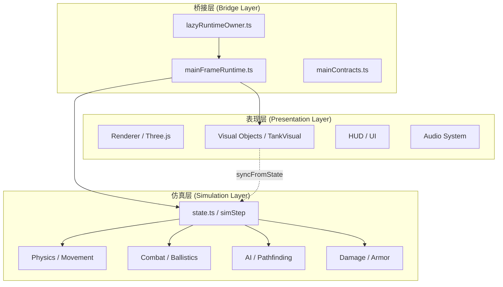
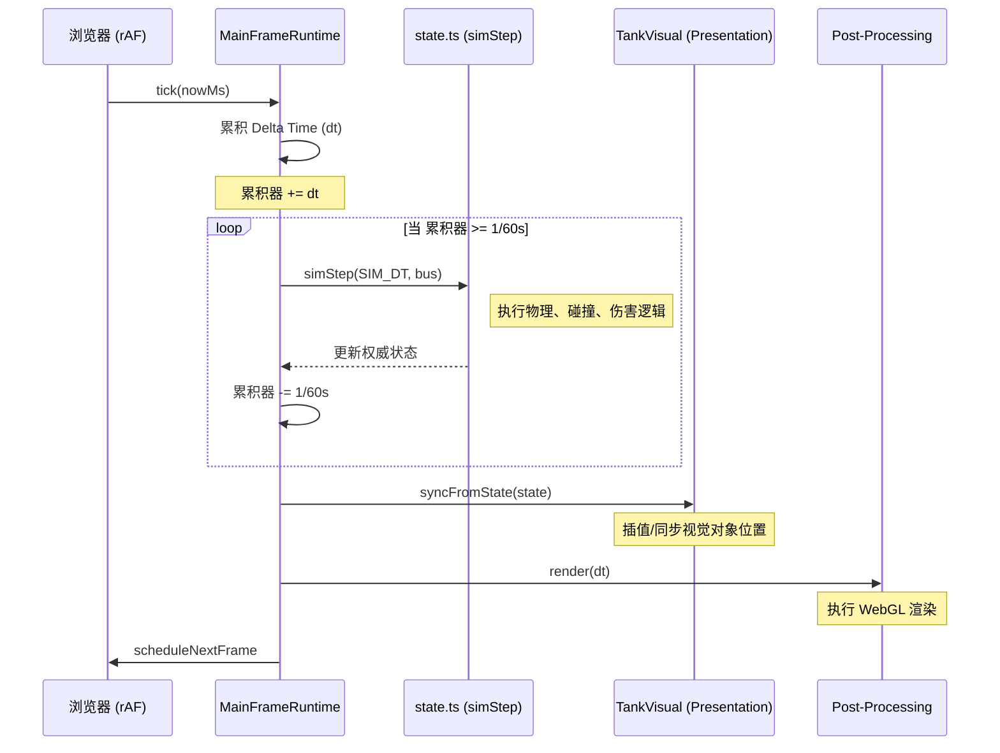
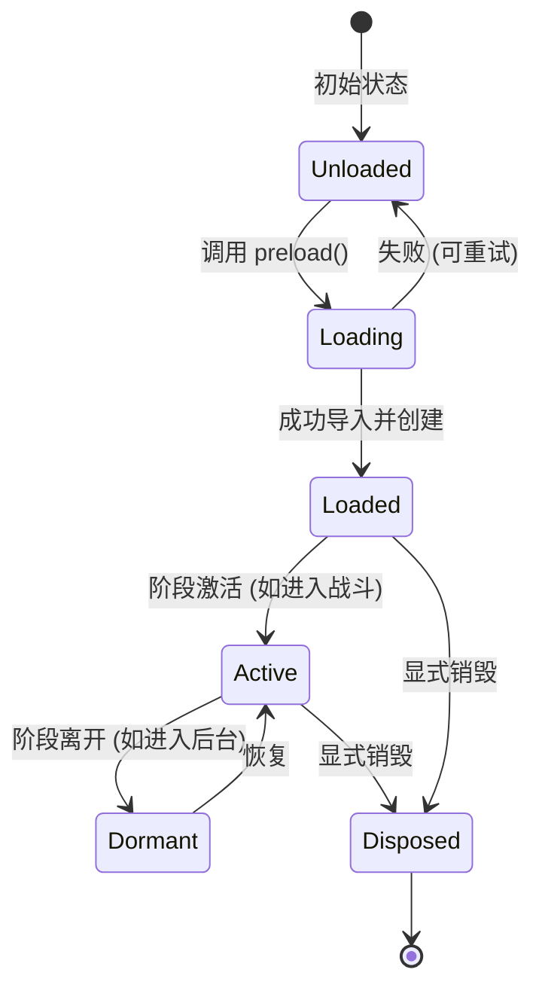
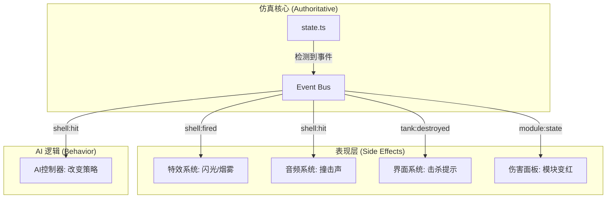
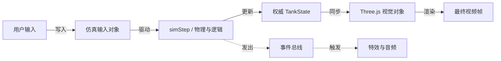

# 架构设计与核心理念

## 目录
1. [模块概览](#模块概览)
2. [核心设计哲学：渲染无关仿真](#核心设计哲学渲染无关仿真)
   - [仿真与渲染的深度解耦](#仿真与渲染的深度解耦)
   - [Node.js 环境下的确定性验证](#nodejs-环境下的确定性验证)
   - [纯逻辑模块的边界约束](#纯逻辑模块的边界约束)
3. [契约式设计与接口隔离](#契约式设计与接口隔离)
   - [mainContracts.ts：系统的“外交准则”](#maincontractsts系统的外交准则)
   - [跨模块依赖的严格控制](#跨模块依赖的严格控制)
   - [接口投影与数据隐藏](#接口投影与数据隐藏)
4. [固定步长权威仿真与时间管理](#固定步长权威仿真与时间管理)
   - [60Hz 仿真时钟的必要性](#60hz-仿真时钟的必要性)
   - [仿真帧与渲染帧的同步与追赶机制](#仿真帧与渲染帧的同步与追赶机制)
   - [确定性随机数与时间注入](#确定性随机数与时间注入)
5. [运行时所有权与延迟加载策略](#运行时所有权与延迟加载策略)
   - [lazyRuntimeOwner：资源管理的“守门人”](#lazyruntimeowner资源管理的守门人)
   - [阶段性资源驻留与清理](#阶段性资源驻留与清理)
   - [错误恢复与重试机制](#错误恢复与重试机制)
6. [核心组件实现分析](#核心组件实现分析)
   - [MainFrameRuntime：渲染事务的精密编排](#mainframeruntime渲染事务的精密编排)
   - [SoloGameState：仿真世界的单一事实来源](#sologamestate仿真世界的单一事实来源)
   - [碰撞与伤害处理的流水线](#碰撞与伤害处理的流水线)
7. [数据流向与事件驱动架构](#数据流向与事件驱动架构)
   - [事件总线作为解耦中枢](#事件总线作为解耦中枢)
   - [输入到呈现的完整生命周期分析](#输入到呈现的完整生命周期分析)
   - [表现层副作用的异步触发](#表现层副作用的异步触发)
8. [设计决策与权衡](#设计决策与权衡)
   - [为什么选择 WebGL 而非 WebGPU？](#为什么选择-webgl-而非-webgpu)
   - [性能预算与垃圾回收优化](#性能预算与垃圾回收优化)
9. [文件参考](#文件参考)

## 模块概览

本章节深入探讨 Claude-of-Tanks 项目的软件架构设计与核心理念。项目的架构设计旨在解决高性能 3D 游戏在浏览器环境下的复杂性，同时确保逻辑的可测试性和确定性。

**范围与规模**：
- **核心目录**：主要涵盖 `src/app`（应用运行时协调）和 `src/game`（游戏逻辑与状态管理）。
- **文件计数**：
    - `src/app` 目录下约有 7 个核心 TypeScript 文件，负责运行时的组合与桥接。
    - `src/game` 目录下约有 80 个核心文件，涵盖了从 AI 到状态管理的全部业务逻辑。
- **文档参考**：包括 `docs/ARCHITECTURE.md`（原始架构契约）和 `docs/DECISIONS.md`（核心设计决策）。

本 wiki 将重点分析如何通过“仿真与渲染分离”、“契约式设计”以及“严格的所有权管理”来实现一个既灵活又健壮的游戏引擎架构。我们将深入探讨为什么仿真逻辑可以在没有浏览器环境的情况下在 Node.js 中运行，以及如何通过 `mainFrameRuntime.ts` 协调复杂的渲染事务。

## 核心设计哲学：渲染无关仿真

Claude-of-Tanks 的首要设计原则是**渲染无关仿真 (Renderer-free Simulation)**。这意味着游戏的物理、弹道、伤害计算和 AI 逻辑与图形渲染引擎（Three.js）完全解耦。

### 仿真与渲染的深度解耦

在传统的游戏开发中，逻辑往往与场景图（Scene Graph）紧密耦合，这导致逻辑难以测试且容易产生副作用。本项目通过将所有计算逻辑限制在“纯逻辑模块”中，实现了逻辑与表现的彻底分离。

- **仿真层 (Simulation Layer)**：这是游戏的“大脑”，运行在固定的 60Hz 频率下。它处理位置更新、碰撞检测、装甲穿透算法和 AI 寻路。它只操作纯粹的 TypeScript 数据对象，如 `TankState`。
- **表现层 (Presentation Layer)**：这是游戏的“眼睛”，运行在浏览器的 `requestAnimationFrame` 下。它负责从仿真层获取状态，并将其同步到 Three.js 的视觉对象中，同时处理粒子特效、光影和声音。

这种分离的核心价值在于**可测试性**。核心逻辑可以在没有任何图形界面的情况下，通过 Node.js 脚本进行毫秒级的回归测试。

以下图表展示了仿真层与表现层之间的层级关系：



**图表说明**：
仿真层位于架构的最底部，作为“真理之源”。表现层通过桥接层（`mainFrameRuntime.ts`）与仿真层交互。视觉对象（`TankVisual`）并不拥有状态，而是通过 `syncFromState` 方法从仿真状态中提取数据进行渲染。这种单向数据流确保了逻辑的确定性，任何表现层的崩溃都不会影响仿真层的逻辑正确性。

**设计来源**：
- [ARCHITECTURE.md:L75-L80](docs/ARCHITECTURE.md#L75-L80)
- [DECISIONS.md:L32-L35](docs/DECISIONS.md#L32-L35)

### Node.js 环境下的确定性验证

为了确保仿真逻辑可以在 Node.js 中运行，项目在 `ARCHITECTURE.md` 中规定了严格的“模块卫生”原则：
1. **零顶级副作用**：模块导入时不得访问 `window`, `document` 或 `navigator`。
2. **仅导入数学库**：`src/sim/*` 模块只能导入 `three` 的数学类（如 `Vector3`）。如果导入了 `WebGLRenderer`，Node.js 环境下的测试将立即失败。
3. **确定性随机性**：严禁使用 `Math.random()`。项目内部统一使用 `mulberry32` 算法，并要求所有随机行为必须接受一个种子参数。

这种设计使得开发者可以编写如 `combat.selftest.mjs` 这样的测试脚本：
```javascript
// combat.selftest.mjs 示例
import { resolveShellHit } from './damage.ts';
// 在 Node.js 中直接运行逻辑测试，无需浏览器
const result = resolveShellHit(mockShell, mockTarget, mockHits, seed);
assert(result.damage > 0);
```

### 纯逻辑模块的边界约束

项目对“纯逻辑”的定义非常苛刻。例如，`src/sim/movement.ts` 负责计算坦克的物理姿态，但它从不直接操作 Three.js 的 `Object3D`。相反，它更新一个 `TankState` 对象中的 `pos` (Vector3) 和 `yaw` (number)。

这种约束强制开发者思考“数据”与“表现”的区别。如果一个逻辑需要知道“模型是否有炮管”，它不能去遍历场景树，而必须在 `TankSpec` 数据结构中明确定义炮管的长度和位置。

## 契约式设计与接口隔离

项目的另一个核心支柱是**契约式设计 (Contract-based Design)**。由于项目采用了并行开发模式，明确的接口定义成为了协作的基石。

### mainContracts.ts：系统的“外交准则”

`src/app/mainContracts.ts` 定义了系统各组件之间的交互契约。它不包含实现逻辑，而是定义了核心接口，如 `MainGameState` 和 `MainEntity`。

通过这些接口，不同的子系统（如 FX、World、UI）可以在不知道彼此具体实现的情况下协作。例如，`MainEntity` 接口将仿真状态（`TankState`）和表现状态（`MainVisual`）组合在一起，但保持了它们在类型层面的清晰界限。

```typescript
// src/app/mainContracts.ts 示例
export interface MainEntity extends Omit<RosterEntity, 'state' | 'combat' | 'visual'> {
  spec: ReturnType<typeof getSpec> & { name: string };
  state: TankState | null;
  combat: CombatState | null;
  visual: MainVisual | null;
}
```

**契约分析**：
这种设计模式有效地防止了跨模块的依赖污染。表现层组件只看到它们需要的 `visual` 接口，而仿真逻辑只操作 `state` 和 `combat` 字段。这种“按需暴露”的原则极大地降低了系统的认知负担。

### 跨模块依赖的严格控制

在 `ARCHITECTURE.md` 中明确规定了模块导入规则：
- 任何模块都可以导入 `src/sim/*`（纯逻辑）。
- 表现层模块（如 `src/ui/*`）严禁被仿真层模块导入。
- 所有的跨模块依赖必须通过“集成层”（`src/main.ts`）在运行时进行注塑。

这种严格的拓扑结构防止了循环依赖的产生，并确保了系统的层级结构清晰。

### 接口投影与数据隐藏

为了保护仿真层的内部状态，项目经常使用“接口投影”。例如，HUD 看到的坦克状态可能只是权威状态的一个只读副本或特定视图。这确保了 UI 层的代码不会意外修改核心游戏逻辑的状态。

## 固定步长权威仿真与时间管理

Claude-of-Tanks 采用**固定步长 (Fixed-step)** 机制来确保仿真的确定性，这对于物理模拟和未来的多人联网至关重要。

### 60Hz 仿真时钟的必要性

所有的物理移动、弹道轨迹、装甲计算和 AI 决策都以固定的 60Hz（`SIM_DT = 1/60s`）运行。

**为什么要固定步长？**
1. **物理稳定性**：变长步长会导致物理引擎在低帧率下发生“穿模”或能量爆炸。
2. **确定性重放**：固定步长使得记录和重放玩家操作成为可能，因为每一帧的输入都会产生完全相同的结果。
3. **网络同步**：在多人模式下，客户端和服务器必须在相同的时间步长上达成共识。

### 仿真帧与渲染帧的同步与追赶机制

`mainFrameRuntime.ts` 负责协调仿真与渲染的同步。它使用一个“累积器”模式来处理渲染频率（通常是 60Hz 或 144Hz）与仿真频率（固定 60Hz）的不匹配。

以下序列图展示了典型的帧处理流程：



**图表说明**：
当浏览器触发渲染帧时，`MainFrameRuntime` 会计算自上一帧以来的时间增量。如果增量超过了 1/60 秒，它会连续执行一次或多次 `simStep`。这种“追赶”机制确保了即使在渲染掉帧的情况下，游戏逻辑也能保持匀速运行。在所有仿真步骤完成后，视觉对象会根据最新的仿真状态进行同步，最后执行一次渲染调用。

**设计来源**：
- [mainFrameRuntime.ts:L287-L325](src/app/mainFrameRuntime.ts#L287-L325)
- [state.ts:L2437-L2462](src/game/state.ts#L2437-L2462)

### 确定性随机数与时间注入

为了保证确定性，仿真层完全被剥夺了获取系统时间的权利。
- **时间注入**：所有的 `update` 函数都接收一个显式的 `dt` 参数。
- **种子化随机**：
```typescript
// stateCore.ts 中的确定性随机源
export function mulberry32(a) {
  return function() {
    a |= 0; a = a + 0x6D2B79F5 | 0;
    let t = Math.imul(a ^ a >>> 15, 1 | a);
    t = t + Math.imul(t ^ t >>> 7, 61 | t) ^ t;
    return ((t ^ t >>> 14) >>> 0) / 4294967296;
  }
}
```
在战斗开始时，系统会生成一个固定的 `COMBAT_SEED` (6000)，确保同一场战斗的随机结果（如跳弹概率）在所有客户端上是一致的。

## 运行时所有权与延迟加载策略

为了优化启动性能并管理复杂的资源生命周期，项目引入了 `lazyRuntimeOwner` 模式。

### lazyRuntimeOwner：资源管理的“守门人”

`src/app/lazyRuntimeOwner.ts` 提供了一个通用的包装器，用于管理动态导入的模块。它解决了以下问题：
- **避免重复导入**：确保并发请求共享同一个加载 Promise。
- **错误重试**：加载失败时允许后续请求重试。
- **解耦启动图**：将重量级模块（如 FX、World）从初始启动路径中移除。

```typescript
// src/app/lazyRuntimeOwner.ts 核心逻辑
export function createLazyRuntimeOwner<Module, Runtime>(
  load: () => Promise<Module>,
  create: (module: Module) => Runtime,
): LazyRuntimeOwner<Runtime> {
  let current: Runtime | null = null;
  let pending: Promise<Runtime> | null = null;

  const preload = (): Promise<Runtime> => {
    if (current) return Promise.resolve(current);
    if (pending) return pending;
    
    pending = Promise.resolve().then(load).then((module) => {
      const runtime = create(module);
      current = runtime;
      return runtime;
    });
    // 无论成功失败，重置 pending 以便重试
    pending.then(() => { pending = null; }, () => { pending = null; });
    return pending;
  };
  
  return Object.freeze({ preload, get current() { return current; } });
}
```

### 阶段性资源驻留与清理

通过这种模式，资源的所有权变得非常清晰。例如，车库（Garage）资源仅在进入车库阶段时加载，而在进入战斗时会被卸载或置于休眠状态。这种“按需分配”的原则确保了 VRAM 的高效利用，防止了浏览器环境下的内存溢出。

以下状态图描述了延迟加载运行时的生命周期：



**图表说明**：
运行时从 `Unloaded` 开始，只有在显式需要时（`preload`）才进入 `Loading`。一旦加载成功，它就保持在内存中直到被显式销毁。这种设计允许系统在不同的游戏阶段（车库、战斗、结算）之间平滑切换，同时保持对资源占用的严格控制。

### 错误恢复与重试机制

在 Web 环境中，网络波动或 WebGL 上下文丢失是常见问题。`lazyRuntimeOwner` 的 Promise 重置机制允许系统在不刷新页面的情况下重新尝试加载资源，极大地提升了用户体验的鲁棒性。

## 核心组件实现分析

### MainFrameRuntime：渲染事务的精密编排

`MainFrameRuntime` 是整个应用表现层的“心脏”。它并不拥有应用的生命周期，而是拥有“渲染帧事务”。

它的核心职责包括：
1. **输入处理**：在每帧开始时轮询 `cameraInput` 状态。
2. **仿真步进**：驱动 `battleFrame.advance`，内部包含固定步长的仿真循环。
3. **相机管理**：更新 `CameraRig`，处理第三人称和狙击模式切换。
4. **环境同步**：根据相机位置更新世界 LOD 和雾效密度。
5. **渲染调度**：调用 `post.render(dt)` 执行最终绘制。

> **注意**：`MainFrameRuntime` 维护了大量的“抓取对象”（Scratch Objects），以实现 Garage 和战斗帧的**零分配 (Allocation-neutral)**。这对于避免 JavaScript 的垃圾回收（GC）引起的卡顿至关重要。

### SoloGameState：仿真世界的单一事实来源

`src/game/state.ts` 定义了单机模式下的完整游戏状态。它是所有仿真数据的集合点。

**关键数据结构**：
- `allTanks`: 场景中所有坦克的列表。
- `shells`: 当前在空中的所有炮弹实体。
- `matchModeController`: 处理具体比赛逻辑（如占点、歼灭）的状态机。
- `spotting`: 权威的点亮/隐蔽计算系统。

在 `simStep` 中，这些数据结构按照严格的顺序被更新，确保了逻辑的严密性。

### 碰撞与伤害处理的流水线

碰撞处理是仿真中最耗时的部分。项目采用了分层处理策略：
1. **宽相检测**：使用简单的球体碰撞快速排除不可能接触的坦克。
2. **窄相检测**：对潜在碰撞的坦克执行基于 OBB（有向包围盒）的 SAT（分离轴定理）测试。
3. **碰撞响应**：计算推回向量，并根据相对速度触发“冲撞伤害”（Ram Damage）。

## 数据流向与事件驱动架构

### 事件总线作为解耦中枢

如前所述，事件总线是解耦表现层与仿真层的关键。以下是几个典型的事件交互场景：

1. **射击反馈**：
   - 仿真层检测到玩家按下开火键且装填完成。
   - 仿真层发出 `shell:fired` 事件。
   - **FX 系统**监听到事件，在炮口位置生成闪光和烟雾。
   - **音频系统**监听到事件，播放对应的炮声。
   - **HUD 系统**监听到事件，开始更新装填进度条。

2. **击中逻辑**：
   - 仿真层检测到炮弹与装甲碰撞。
   - 仿真层计算伤害并发出 `shell:hit` 事件。
   - **FX 系统**生成火花或爆炸效果。
   - **HUD 系统**在屏幕上显示伤害数值。
   - **AI 系统**收到通知，可能会触发反击或躲避逻辑。

以下流程图展示了事件总线如何连接不同的子系统：



**图表说明**：
事件总线充当了系统内的中枢神经系统。当仿真层发生重要事件时，它只负责发出事件。表现层和 AI 子系统订阅这些事件并作出响应。这种模式使得添加新的表现效果变得非常简单，只需订阅现有事件即可，无需修改核心仿真逻辑。

### 输入到呈现的完整生命周期分析

整个系统的数据流向遵循一个清晰的循环：



**图表说明**：
这是一个典型的“输入-处理-输出”循环。用户输入被转化为仿真层的输入指令；仿真层根据指令更新权威状态；表现层将权威状态同步到视觉对象并进行渲染。同时，仿真层产生的副作用通过事件总线异步通知表现层，增强视觉和听觉体验。

## 设计决策与权衡

### 为什么选择 WebGL 而非 WebGPU？

在 `DECISIONS.md` 中记录了关于渲染技术的选择。虽然 WebGPU 提供了更好的性能潜力，但 WebGL 在当前的浏览器生态中具有更好的兼容性和成熟度。为了确保 Claude-of-Tanks 能够覆盖最广泛的用户群体，团队选择了 Three.js 的 WebGL 渲染器，并辅以高度优化的着色器和批处理技术。

### 性能预算与垃圾回收优化

为了在浏览器中维持 60FPS，项目设定了严格的性能预算：
- **零分配更新循环**：在 `simStep` 和 `render` 路径上严禁创建新的对象或数组。所有的临时向量都使用预分配的 `_muzzle`, `_dir` 等静态变量。
- **Worker 卸载**：耗时的任务（如云图生成、复杂的几何体构建）被卸载到 Web Workers 中，以避免阻塞主线程。

## 文件参考

本章节内容基于对以下核心文件的深入分析：

**核心架构与决策**：
- [ARCHITECTURE.md](docs/ARCHITECTURE.md)：定义了初始的模块划分和全局约定。
- [DECISIONS.md](docs/DECISIONS.md)：记录了关于确定性、加载策略和渲染质量的关键决策。

**表现层运行时**：
- [src/app/mainFrameRuntime.ts](src/app/mainFrameRuntime.ts)：渲染循环的协调中枢。
- [src/app/mainContracts.ts](src/app/mainContracts.ts)：定义了跨模块的类型契约。
- [src/app/lazyRuntimeOwner.ts](src/app/lazyRuntimeOwner.ts)：实现了延迟加载与资源管理模式。

**仿真层核心**：
- [src/game/state.ts](src/game/state.ts)：单机模式下的仿真状态与逻辑编排。
- [src/game/stateCore.ts](src/game/stateCore.ts)：提供基础的事件总线与随机数工具。

**子系统接口**：
- [src/sim/movement.ts](src/sim/movement.ts)：权威物理移动逻辑。
- [src/sim/damage.ts](src/sim/damage.ts)：权威伤害与装填逻辑。
- [src/fx/effects.ts](src/fx/effects.ts)：表现层特效接口。
