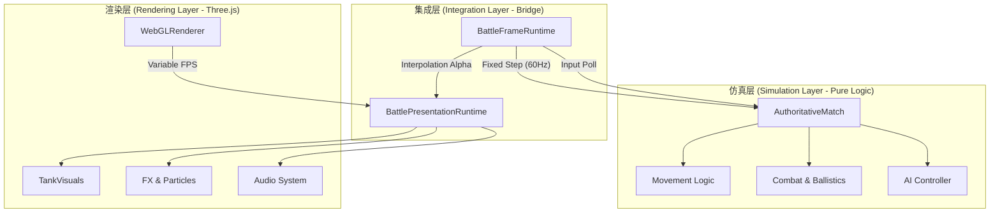
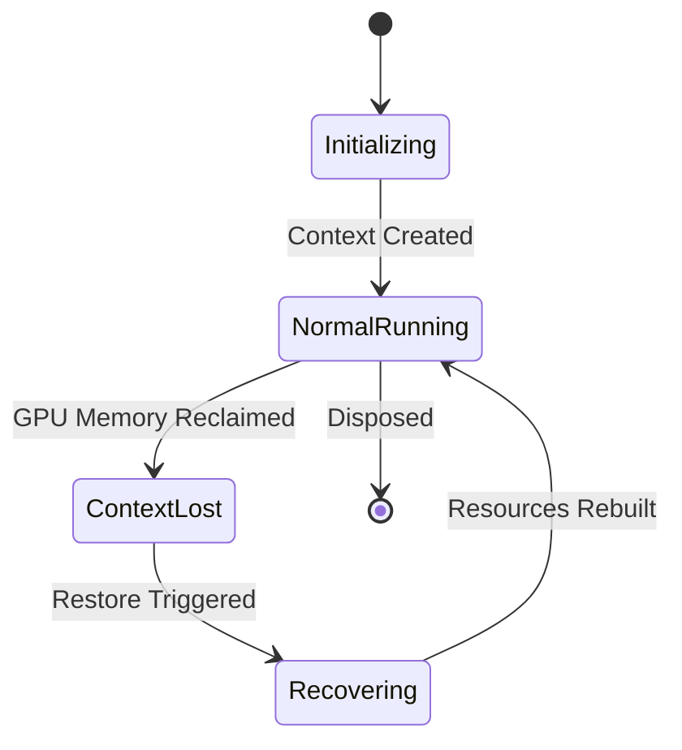
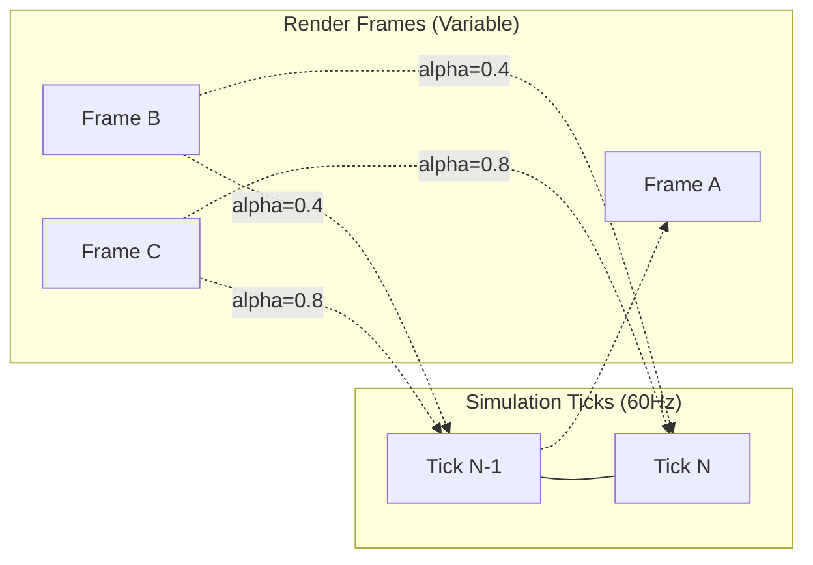

# 仿真与渲染分离架构

## 目录
1. [模块概览](#模块概览)
2. [引言：仿真与渲染分离的核心理念](#引言仿真与渲染分离的核心理念)
3. [系统架构概览](#系统架构概览)
4. [确定性仿真核心 (src/sim)](#确定性仿真核心-srcsim)
   - [纯逻辑约束与 Node.js 兼容性](#纯逻辑约束与-nodejs-兼容性)
   - [AuthoritativeMatch：权威仿真容器](#authoritativematch权威仿真容器)
5. [渲染引擎抽象层 (src/engine)](#渲染引擎抽象层-srcengine)
   - [作为观察者的渲染器](#作为观察者的渲染器)
   - [ViewportRuntime 与资源生命周期](#viewportruntime-与资源生命周期)
6. [帧同步与状态插值机制](#帧同步与状态插值机制)
   - [固定步长仿真循环 (Fixed-Step Loop)](#固定步长仿真循环-fixed-step-loop)
   - [状态插值 (State Interpolation) 原理](#状态插值-state-interpolation-原理)
7. [核心组件与交互实现](#核心组件与交互实现)
   - [BattleFrameRuntime：时间调度者](#battleframeruntime时间调度者)
   - [TankPresentationTracker：插值处理器](#tankpresentationtracker插值处理器)
8. [数据流向分析](#数据流向分析)
9. [性能考量与最佳实践](#性能考量与最佳实践)
10. [文件参考](#文件参考)

## 模块概览

本章节深入探讨 Claude of Tanks 的核心架构：**仿真与渲染的完全解耦**。该设计确保了游戏逻辑的确定性、可测试性以及在不同环境（浏览器与 Node.js）下的运行能力。

**统计信息**：
- **涉及文件总数**：约 65 个源文件。
  - `src/sim`：20 个文件（含核心逻辑与自测）。
  - `src/engine`：40 个文件（含渲染、光照、后处理及调度）。
  - `src/game`：5 个关键集成文件（负责仿真与渲染的桥接）。
- **核心子模块**：
  - **确定性仿真 (Deterministic Simulation)**：负责物理、弹道、伤害计算。
  - **渲染引擎 (Rendering Engine)**：基于 Three.js 的视觉呈现。
  - **帧调度器 (Frame Scheduler)**：管理时间步长与浏览器帧回调。
  - **状态插值 (Interpolation)**：解决仿真频率（60Hz）与渲染频率（可变）的不一致问题。

本章节将重点分析 `src/sim` 与 `src/engine` 之间的交互机制，特别是 `BattleFrameRuntime` 如何协调两者的运行。

## 引言：仿真与渲染分离的核心理念

在 Claude of Tanks 中，仿真（Simulation）与渲染（Rendering）被视为两个完全独立的世界。仿真负责“真实”的发生，而渲染负责“观察”和“呈现”。这种分离不仅仅是代码组织上的整洁，更是为了满足以下核心需求：

1.  **确定性 (Determinism)**：仿真逻辑必须在相同输入下产生完全相同的输出。通过排除 DOM、WebGL 等具有副作用或不可预测性的 API，仿真可以在 Node.js 环境中作为权威服务器运行。
2.  **多端部署**：游戏逻辑（`src/sim`）可以在 Headless 模式下运行，用于自动化测试、AI 训练或专用服务器。
3.  **渲染平滑性**：仿真通常以固定的频率（如 60Hz）运行以保证物理稳定性，而渲染器需要支持更高刷新率（如 144Hz 或 ProMotion）。解耦架构允许通过插值技术在渲染帧之间生成平滑的视觉过渡。

> 💡 **核心原则**：`src/sim` 中的代码严禁导入任何涉及 WebGL、DOM 或浏览器特有 API 的模块。Three.js 仅被允许用于数学类（如 `Vector3`, `Matrix4`）。

## 系统架构概览

Claude of Tanks 的架构可以被视为一个典型的“生产者-消费者”模型。仿真层产生状态快照，渲染层消费这些快照并转化为视觉元素。



该图展示了系统的层级结构。`BattleFrameRuntime` 位于中心，它既驱动仿真的固定步长更新，也计算用于渲染的插值系数。仿真层对渲染层一无所知，它只操作纯数据结构；而渲染层通过 `BattlePresentationRuntime` 观察仿真状态的变化。

## 确定性仿真核心 (src/sim)

### 纯逻辑约束与 Node.js 兼容性

`src/sim` 目录下的所有模块都遵循严格的“纯逻辑”约束。这意味着它们不依赖于浏览器环境，可以无缝地在 Node.js 中运行。这对于多人游戏的权威服务器（Authoritative Server）至关重要。

在 `docs/ARCHITECTURE.md` 中明确规定：
- **零顶层副作用**：导入模块时不得触发 DOM 或 WebGL 操作。
- **数学类限制**：仅允许使用 Three.js 的数学工具类。
- **时间与随机性注入**：所有时间步长（`dt`）和随机数生成器（`rng`）必须作为参数传入，严禁使用 `Math.random()` 或 `Date.now()`。

### AuthoritativeMatch：权威仿真容器

`AuthoritativeMatch` 是仿真的入口点。它封装了整场战斗的所有逻辑实体、地形数据和规则。

```typescript
// src/sim/authoritativeMatch.ts 核心逻辑示意
export function createAuthoritativeMatch(options: AuthoritativeMatchOptions): AuthoritativeMatch {
  // 初始化地形、实体、AI 和 规则控制器
  const heightField = createHeightField(seed);
  const entities: AuthoritativeEntity[] = [];
  
  return {
    step({ dt, inputs }) {
      // 1. 处理输入与消耗品
      // 2. 更新坦克动力学 (Movement)
      // 3. 处理坦克碰撞 (Collisions)
      // 4. 更新火炮装填与开火逻辑
      // 5. 步进所有炮弹 (Ballistics) 并检测命中 (Armor/Damage)
      // 6. 更新视野与隐蔽系统 (Spotting)
    }
  };
}
```

`step` 函数是仿真的心脏。它要求传入的 `dt` 必须是精确的 `1/60` 秒。这种固定步长设计保证了物理模拟的稳定性，防止了因帧率波动导致的“穿墙”或弹道异常。

**Section sources**:
- [src/sim/authoritativeMatch.ts](src/sim/authoritativeMatch.ts)
- [docs/ARCHITECTURE.md](docs/ARCHITECTURE.md)

## 渲染引擎抽象层 (src/engine)

### 作为观察者的渲染器

渲染引擎（`src/engine`）并不主动决定游戏逻辑，它是一个被动的观察者。它通过 `TankVisual` 对象将仿真的抽象状态转换为 Three.js 的场景图节点。

渲染器的核心职责包括：
1.  **场景管理**：维护光源、天空盒、地形网格和坦克模型。
2.  **视觉同步**：每一帧调用 `visual.syncFromState(state)`，将仿真的位置、偏航角、炮塔转角等应用到 3D 模型上。
3.  **特效触发**：通过事件总线（Event Bus）监听命中、爆炸等事件，并触发粒子效果。

### ViewportRuntime 与资源生命周期

为了处理浏览器窗口大小调整和 WebGL 上下文丢失，`ViewportRuntime` 提供了健壮的同步机制。它确保了渲染器、后处理管线（Post-processing）和级联阴影图（CSM）在视口变化时保持一致。



在 `src/engine/renderer.ts` 中，系统会监听 `webglcontextlost` 事件。由于坦克模型和地形网格是程序化生成的，系统可以在上下文恢复后重新构建所有 GPU 资源，而不会丢失当前的战斗状态。

**Section sources**:
- [src/engine/renderer.ts](src/engine/renderer.ts)
- [src/engine/viewportRuntime.ts](src/engine/viewportRuntime.ts)

## 帧同步与状态插值机制

这是解耦架构中最复杂的部分：如何将 60Hz 的仿真与可能为 120Hz 的渲染同步？

### 固定步长仿真循环 (Fixed-Step Loop)

`BattleFrameRuntime` 使用累加器（Accumulator）模式来驱动仿真。当浏览器触发一个渲染帧时，系统计算自上一帧以来流逝的时间，并将其加入累加器。

```typescript
// src/game/battleFrameRuntime.ts 逻辑简化
simulationAccumulator += dtSeconds;
while (simulationAccumulator >= simulationDt) {
  stepSimulation(); // 执行一次 1/60s 的仿真
  presentation.captureSoloPose(); // 记录当前状态作为“最新状态”
  simulationAccumulator -= simulationDt;
}
```

如果渲染帧率为 30FPS，循环会运行两次；如果为 120FPS，循环每两帧运行一次。

### 状态插值 (State Interpolation) 原理

由于渲染帧往往落在两个仿真步之间，直接显示最新的仿真状态会导致视觉上的微小抖动（Jitter）。为了解决这个问题，系统引入了插值系数 `alpha`。

`alpha = simulationAccumulator / simulationDt`

这个 `alpha` 值表示我们当前处于上一个仿真帧（`previous`）和当前仿真帧（`current`）之间的比例。



插值不仅应用于位置（LERP），还应用于角度（SLERP 或 AngleDelta LERP）以及履带滚动、悬挂系统摆动等视觉参数。

**Section sources**:
- [src/game/battleFrameRuntime.ts](src/game/battleFrameRuntime.ts)
- [src/game/presentationPose.ts](src/game/presentationPose.ts)

## 核心组件与交互实现

### BattleFrameRuntime：时间调度者

`BattleFrameRuntime` 是整个游戏循环的指挥官。它不仅负责驱动仿真，还处理暂停逻辑、倒计时和网络数据包的泵送。

```typescript
// src/game/battleFrameRuntime.ts:L175-L201
if (inBattle && !paused && !killcamActive) {
  if (network.isActive()) {
    // 网络模式下，仿真由服务器驱动，本地仅做平滑处理
    countdown.show(game.preBattleS);
    simulationAccumulator = 0;
  } else {
    // 单机模式：固定步长累加器
    simulationAccumulator = Math.min(
      simulationAccumulator + appliedDtSeconds,
      simulationDt * maxSimulationSteps,
    );
    while (simulationAccumulator >= simulationDt) {
      stepSimulation(); // 执行仿真步
      presentation.captureSoloPose(); // 捕获状态快照用于插值
      simulationAccumulator -= simulationDt;
    }
  }
}
```

### TankPresentationTracker：插值处理器

`TankPresentationTracker` 负责管理每个坦克的历史状态。它保存了 `previous`（上一仿真帧）和 `current`（当前仿真帧）的状态，并在渲染时计算插值结果。

```typescript
// src/game/presentationPose.ts:L181-L209
function lerpSample(
  out: TankPresentationSample,
  previous: TankPresentationSample,
  current: TankPresentationSample,
  alpha: number,
): TankPresentationSample {
  const t = Math.max(0, Math.min(1, finite(alpha, 1)));
  // 位置线性插值
  out.pos.x = lerp(previous.pos.x, current.pos.x, t);
  out.pos.y = lerp(previous.pos.y, current.pos.y, t);
  out.pos.z = lerp(previous.pos.z, current.pos.z, t);
  // 偏航角插值（处理 360 度跨越）
  out.yaw = previous.yaw + angleDelta(previous.yaw, current.yaw) * t;
  // 悬挂与摆动插值
  out.visualPitch = lerp(previous.visualPitch, current.visualPitch, t);
  out.visualRoll = lerp(previous.visualRoll, current.visualRoll, t);
  return out;
}
```

这种设计确保了即使在仿真频率较低的情况下，玩家看到的坦克移动依然丝滑顺畅。

**Section sources**:
- [src/game/battleFrameRuntime.ts](src/game/battleFrameRuntime.ts)
- [src/game/presentationPose.ts](src/game/presentationPose.ts)

## 数据流向分析

下面的序列图展示了从用户输入到最终画面输出的完整数据流向。

```mermaid
sequenceDiagram
    participant User as 用户/AI
    participant Loop as FrameLoopScheduler
    participant Runtime as BattleFrameRuntime
    participant Sim as AuthoritativeMatch
    participant Present as BattlePresentationRuntime
    participant Renderer as WebGLRenderer

    Loop->>Runtime: advance(dtSeconds)
    Runtime->>User: 轮询输入 (Poll Input)
    
    loop Fixed Step (simulationAccumulator >= 1/60)
        Runtime->>Sim: step(1/60, inputs)
        Sim-->>Sim: 更新物理、弹道、AI
        Runtime->>Present: captureSoloPose()
        Note over Present: 记录当前状态为 current<br/>旧状态移至 previous
    end
    
    Runtime->>Runtime: 计算 alpha = remainder / (1/60)
    Runtime->>Present: update(dt, alpha)
    Present->>Present: lerpSample(previous, current, alpha)
    Present->>Renderer: visual.syncFromState(interpolatedState)
    
    Runtime->>Renderer: post.render(dt)
    Renderer-->>User: 显示最终帧
```

这个流程清晰地展示了仿真与渲染是如何在时间轴上错开并最终通过插值汇合的。注意 `captureSoloPose` 的调用时机：它只在仿真步完成后触发，确保了渲染层始终拥有两个有效的物理状态进行插值。

## 性能考量与最佳实践

在实现仿真与渲染分离时，性能是一个关键因素。以下是 Claude of Tanks 采用的一些优化策略：

1.  **零分配同步 (Allocation-Free Sync)**：在 `syncFromState` 和 `lerpSample` 中，系统会复用已有的向量和矩阵对象，避免在每秒 60+ 次的渲染循环中产生垃圾回收（GC）压力。
2.  **视锥剔除与细节等级 (LOD)**：`BattlePresentationRuntime` 会根据坦克与相机的距离决定是否进行昂贵的运行机构（如轮轴旋转、履带滚动）同步。对于屏幕外的坦克，同步频率会降至 30Hz。
3.  **确定性随机数**：使用 `mulberry32` 生成器确保了在回放（Replay）和多人同步时，仿真结果的一致性。

> ⚠️ **注意**：虽然插值解决了平滑性问题，但它引入了半个仿真步（约 8ms）的视觉延迟。这在竞技类游戏中是常见的权衡，但在调试碰撞检测时需要意识到：视觉位置可能略微滞后于物理位置。

## 文件参考

以下是本章节涉及的核心文件列表：

- **仿真核心**：
  - `src/sim/authoritativeMatch.ts`：权威仿真容器。
  - `src/sim/movement.ts`：坦克动力学实现。
  - `src/sim/ballistics.ts`：弹道模拟。
  - `src/sim/armor.ts`：装甲碰撞检测。
- **渲染引擎**：
  - `src/engine/renderer.ts`：Three.js 渲染器配置。
  - `src/engine/frameLoopScheduler.ts`：帧循环调度。
  - `src/engine/viewportRuntime.ts`：视口同步。
- **桥接与插值**：
  - `src/game/battleFrameRuntime.ts`：固定步长循环与累加器管理。
  - `src/game/battlePresentationRuntime.ts`：视觉状态同步观察者。
  - `src/game/presentationPose.ts`：状态插值逻辑实现。
- **架构文档**：
  - `docs/ARCHITECTURE.md`：原始设计规约。
