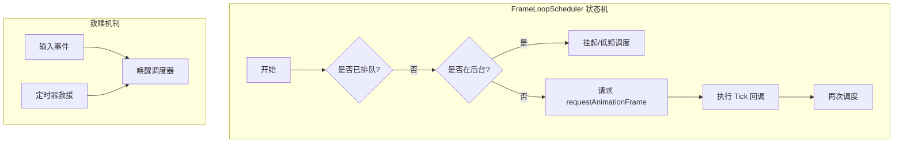
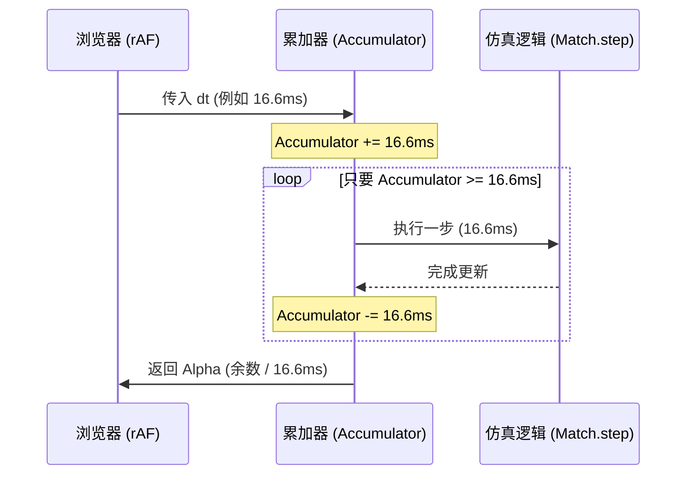
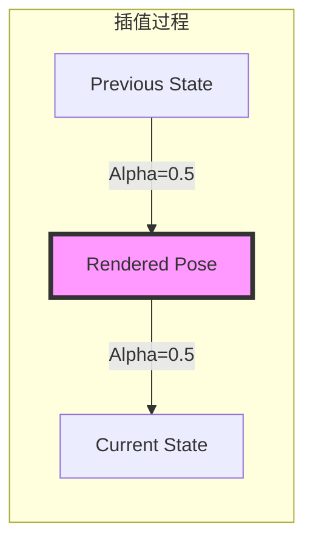
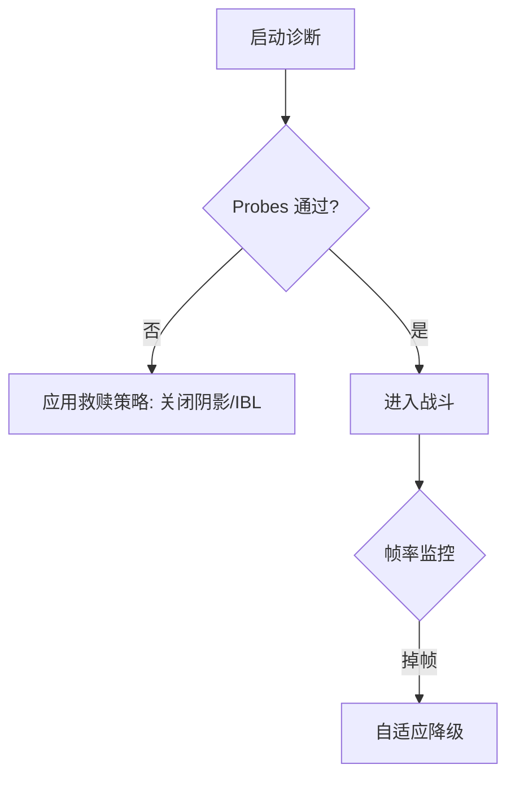
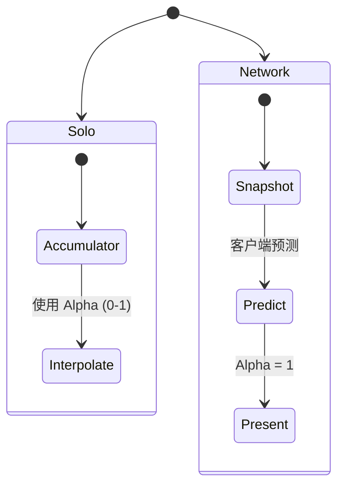

# 帧同步与状态插值机制分析

## 目录
1. [模块概览](#模块概览)
2. [引言：时间同步的挑战](#引言时间同步的挑战)
3. [核心组件分析](#核心组件分析)
   - [FrameLoopScheduler：高层帧循环调度](#frameloopscheduler高层帧循环调度)
   - [BattleFrameRuntime：仿真时间线控制器](#battleframeruntime仿真时间线控制器)
   - [BattlePresentationRuntime：视觉表现层](#battlepresentationruntime视觉表现层)
4. [累加器模式 (Accumulator Pattern)](#累加器模式-accumulator-pattern)
   - [固定步长仿真与可变频率渲染](#固定步长仿真与可变频率渲染)
   - [时间债的处理与死亡螺旋防御](#时间债的处理与死亡螺旋防御)
5. [双缓冲区状态与插值算法](#双缓冲区状态与插值算法)
   - [状态捕获 (State Buffering)](#状态捕获-state-buffering)
   - [插值比例 (Alpha) 的计算](#插值比例-alpha-的计算)
   - [平滑插值实现 (LERP)](#平滑插值实现-lerp)
6. [性能诊断与自适应补偿机制](#性能诊断与自适应补偿机制)
   - [DeviceDiag：硬件能力探测与救赎](#devicediag硬件能力探测与救赎)
   - [自适应质量策略](#自适应质量策略)
7. [掉帧与网络延迟下的视觉连续性](#掉帧与网络延迟下的视觉连续性)
   - [掉帧补偿逻辑](#掉帧补偿逻辑)
   - [网络快照与插值](#网络快照与插值)
8. [关键代码参考](#关键代码参考)
9. [文件参考](#文件参考)

## 模块概览
在 `Claude of Tanks` 引擎中，帧同步与状态插值是保证游戏“手感”和“丝滑感”的核心技术。该模块主要涉及以下组件：

- **总文件数**: 约 50 个核心 TypeScript 文件（位于 `src/engine` 和 `src/sim`）。
- **主要子模块**:
  - **调度层 (`src/engine/frameLoopScheduler.ts`)**: 负责驱动浏览器 `requestAnimationFrame` 并处理后台挂起。
  - **仿真层 (`src/game/battleFrameRuntime.ts`)**: 实现固定 60Hz 的物理与逻辑仿真。
  - **表现层 (`src/game/battlePresentationRuntime.ts`)**: 负责在渲染帧之间进行状态插值。
  - **诊断层 (`src/engine/deviceDiag.ts`)**: 监控硬件性能并执行自动降级救赎。

本章节将深入探讨这些模块如何协同工作，以解决 Web 平台特有的计时不确定性。

## 引言：时间同步的挑战
在 Web 游戏开发中，开发者面临一个根本性的矛盾：**仿真的确定性**与**渲染的流畅性**。
- **仿真 (Simulation)** 需要固定的时间步长（如 60Hz），以保证物理模拟（碰撞、弹道）的确定性和可重复性。
- **渲染 (Rendering)** 则依赖于浏览器的 `requestAnimationFrame` (rAF)，其触发频率是可变的（通常为 60Hz，但在 120Hz 的 ProMotion 屏幕或性能受限的移动设备上会发生波动）。

如果直接将渲染频率与仿真频率绑定，当 rAF 频率高于仿真频率时，会出现视觉抖动；当 rAF 频率低于仿真频率时，游戏逻辑会变慢。`Claude of Tanks` 通过**累加器模式**和**状态插值**完美解决了这一问题。

## 核心组件分析

### FrameLoopScheduler：高层帧循环调度
`FrameLoopScheduler` 是整个引擎的“心脏”。它不仅封装了 `requestAnimationFrame`，还处理了 Web 环境下的各种边缘情况，如标签页切换、失去焦点以及性能低下时的“救赎”逻辑。



`FrameLoopScheduler` 保证了即使在浏览器为了省电而限制 rAF 的情况下（例如隐藏的 iframe），引擎依然能通过输入事件或备份定时器维持逻辑更新。

### BattleFrameRuntime：仿真时间线控制器
`BattleFrameRuntime` 负责管理战斗中的每一帧。它持有“时间累加器”，决定何时执行物理仿真步骤，并计算渲染所需的插值比例（Alpha）。

### BattlePresentationRuntime：视觉表现层
该组件是仿真与渲染的桥梁。它不直接操作物理状态，而是维护一套“表现状态”。通过 `captureSoloPoses()` 捕获仿真步长结束后的状态，并在渲染时根据 Alpha 值在“上一个状态”和“当前状态”之间进行平滑过渡。

**核心组件源码参考**:
- [src/engine/frameLoopScheduler.ts](src/engine/frameLoopScheduler.ts)
- [src/game/battleFrameRuntime.ts](src/game/battleFrameRuntime.ts)
- [src/game/battlePresentationRuntime.ts](src/game/battlePresentationRuntime.ts)

## 累加器模式 (Accumulator Pattern)

### 固定步长仿真与可变频率渲染
累加器模式的核心思想是将真实流逝的时间（Wall Clock Time）存储在一个变量中。每当累加的时间超过了设定的仿真步长（`simulationDt`，通常为 1/60s），就执行一次逻辑更新。



### 时间债的处理与死亡螺旋防御
当设备性能不足以维持 60Hz 仿真时，累加器会迅速积累“时间债”。如果无限制地追赶，会导致单帧执行过多的仿真步骤，进一步降低帧率，形成“死亡螺旋”。`BattleFrameRuntime` 通过 `maxSimulationSteps`（默认为 4）来限制每帧最多执行的步数。

```typescript
// src/game/battleFrameRuntime.ts 关键逻辑
simulationAccumulator = Math.min(
  simulationAccumulator + appliedDtSeconds,
  simulationDt * maxSimulationSteps, // 死亡螺旋防御
);
while (simulationAccumulator >= simulationDt) {
  stepSimulation();
  presentation.captureSoloPose(); // 捕获插值所需的“当前”状态
  simulationAccumulator -= simulationDt;
}
```

**累加器模式源码参考**:
- [src/game/battleFrameRuntime.ts:L192-L200](src/game/battleFrameRuntime.ts#L192-L200)

## 双缓冲区状态与插值算法

### 状态捕获 (State Buffering)
为了实现插值，每个实体必须保留至少两个时间点的状态：
1. **Previous State**: 上一个仿真步长结束时的状态。
2. **Current State**: 当前仿真步长结束时的状态。

在 `BattlePresentationRuntime` 中，`captureSoloPoses()` 会在每个仿真步骤结束时被调用，将旧的 `current` 拷贝到 `previous`，并读取最新的 `state` 到 `current`。

### 插值比例 (Alpha) 的计算
Alpha 值表示当前渲染时间点处于两个仿真步长之间的位置。其计算公式为：
`presentationAlpha = simulationAccumulator / simulationDt`

例如，如果 `simulationDt` 是 16.6ms，而累加器中剩余 8.3ms，则 `Alpha = 0.5`。这意味着渲染器应该绘制在两个物理状态正中间的位置。

### 平滑插值实现 (LERP)
`presentationPose.ts` 实现了具体的插值逻辑。对于位置，使用线性插值（LERP）；对于旋转，使用考虑了弧度环绕的 `angleDelta` 插值。



```typescript
// src/game/presentationPose.ts 关键插值逻辑
export function sampleTankPresentationPose(
  tracker: TankPresentationTracker,
  state: TankPoseSource,
  alpha: number,
): TankPresentationSample {
  const t = Math.max(0, Math.min(1, alpha));
  const out = tracker.pose;
  const prev = tracker.previous;
  const curr = tracker.current;

  // 位置线性插值
  out.pos.x = prev.pos.x + (curr.pos.x - prev.pos.x) * t;
  out.pos.y = prev.pos.y + (curr.pos.y - prev.pos.y) * t;
  out.pos.z = prev.pos.z + (curr.pos.z - prev.pos.z) * t;
  
  // 偏航角插值 (处理 0-2PI 环绕)
  out.yaw = prev.yaw + angleDelta(prev.yaw, curr.yaw) * t;
  
  return out;
}
```

**插值算法源码参考**:
- [src/game/presentationPose.ts:L183-L209](src/game/presentationPose.ts#L183-L209)

## 性能诊断与自适应补偿机制

### DeviceDiag：硬件能力探测与救赎
`deviceDiag.ts` 在引擎启动时执行一系列微型渲染测试（Probes），以确定设备的 GPU 能力。

- **Basic Probe**: 测试基础材质渲染。
- **Lit Probe**: 测试光照系统。
- **Shadow Probe**: 测试阴影映射。

如果某个测试失败（例如在某些旧款 iPhone 上阴影映射会导致全黑），`applyDiagRescue` 会自动关闭阴影功能，确保游戏至少是可玩的（“Flat-lit beats black”）。

### 自适应质量策略
在战斗过程中，`MainFrameRuntime` 还会监控帧率。如果检测到持续的性能过载，会触发 `reportSustainedOverload`，进而调整渲染缩放或阴影质量。



**性能诊断源码参考**:
- [src/engine/deviceDiag.ts](src/engine/deviceDiag.ts)
- [src/engine/quality.ts](src/engine/quality.ts)

## 掉帧与网络延迟下的视觉连续性

### 掉帧补偿逻辑
当发生严重掉帧时，`FrameLoopScheduler` 会通过 `animationToleranceMs` 来容忍细微的调度偏差，防止在 60Hz 屏幕上因为微小的延迟误判为 30Hz 目标。同时，累加器的 `maxSimulationSteps` 保证了即使丢失了大量渲染帧，物理仿真依然能以正确的步长追赶。

### 网络快照与插值
在网络对战模式下，`presentationAlpha` 默认设为 1。这是因为 `BrowserBattleBridge` 已经处理了基于网络快照的 Hermite 插值和客户端预测。此时，表现层直接使用最新的预测状态，以避免引入额外的感知延迟。



## 关键代码参考

### 1. 仿真步进与插值捕获
在 `BattleFrameRuntime` 中，仿真步骤与插值捕获是严格绑定的。

```typescript
// src/game/battleFrameRuntime.ts
while (simulationAccumulator >= simulationDt) {
  stepSimulation(); // 物理逻辑更新
  presentation.captureSoloPose(); // 捕获当前状态供渲染插值使用
  simulationAccumulator -= simulationDt;
}
```

### 2. 渲染循环中的插值应用
在 `MainFrameRuntime` 的 tick 中，计算出的 Alpha 被传递给表现层。

```typescript
// src/app/mainFrameRuntime.ts
const frame = battleFrame.advance(dtSeconds, frameWallDtS, nowMs, cameraLocked);
// ...
updateWorldPresentation(frame, appliedDtSeconds, fx);
```

而在 `BattlePresentationRuntime` 中：
```typescript
// src/game/battlePresentationRuntime.ts
const presented = presentationStateFor(entity, presentationAlpha, networkActive);
visual.syncFromState(state, presentationDt, viewDistanceM, presented, detailVisible);
```

## 文件参考
本机制涉及的核心源文件如下：

- `src/engine/frameLoopScheduler.ts`: 核心帧循环调度器，处理 rAF 和后台挂起。
- `src/engine/frameScheduler.ts`: 协作式任务调度，处理加载预算。
- `src/engine/deviceDiag.ts`: 硬件能力探测与黑屏救赎逻辑。
- `src/game/battleFrameRuntime.ts`: 战斗帧状态机，管理累加器和 Alpha 计算。
- `src/game/battlePresentationRuntime.ts`: 坦克视觉表现管理，驱动插值。
- `src/game/presentationPose.ts`: 具体的 LERP 插值算法实现。
- `src/sim/authoritativeMatch.ts`: 权威仿真逻辑，要求严格的 `SIM_DT` 步进。
- `src/main.ts`: 引擎集成入口，配置调度参数。

**Section sources**:
- [src/engine/frameLoopScheduler.ts](src/engine/frameLoopScheduler.ts)
- [src/game/battleFrameRuntime.ts](src/game/battleFrameRuntime.ts)
- [src/game/presentationPose.ts](src/game/presentationPose.ts)
- [src/engine/deviceDiag.ts](src/engine/deviceDiag.ts)
