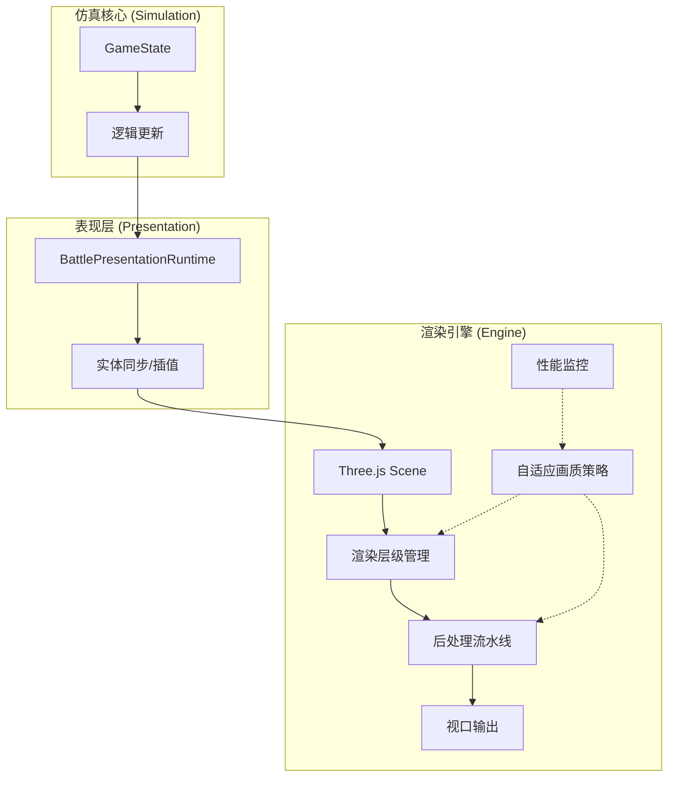
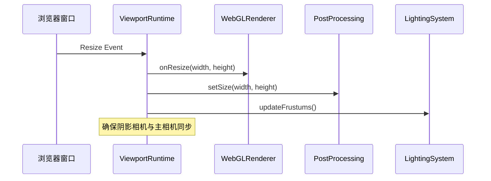
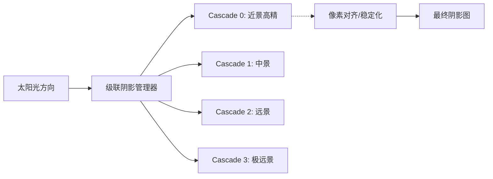
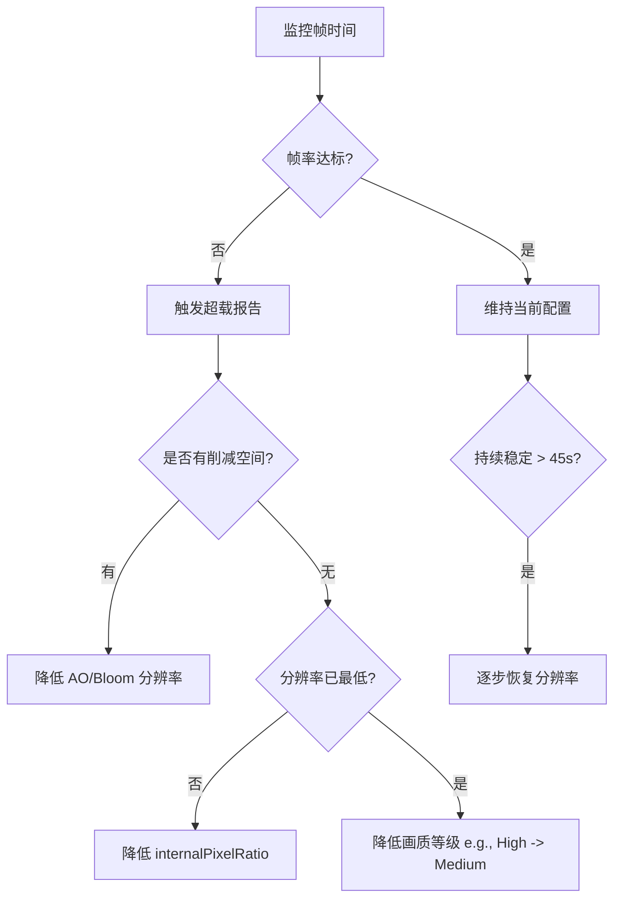

# 渲染引擎抽象与观察者模式

## 目录
1. [模块概览](#模块概览)
2. [渲染引擎架构与设计哲学](#渲染引擎架构与设计哲学)
3. [核心组件分析](#核心组件分析)
   - [渲染器初始化与生命周期 (renderer.ts)](#渲染器初始化与生命周期-rendererts)
   - [视口运行时与同步 (viewportRuntime.ts)](#视口运行时与同步-viewportruntimets)
4. [视觉实体映射与观察者模式](#视觉实体映射与观察者模式)
5. [场景与光照系统](#场景与光照系统)
6. [后处理流水线](#后处理流水线)
7. [自适应画质系统](#自适应画质系统)
8. [性能与兼容性策略](#性能与兼容性策略)
9. [文件引用](#文件引用)

## 模块概览
渲染引擎模块位于 `src/engine/` 目录下，是 Claude of Tanks 的视觉核心。该模块不仅负责将 3D 场景绘制到屏幕上，更扮演着仿真核心的“观察者”角色，实时响应仿真状态的变化并根据硬件性能动态调整渲染策略。

**模块规模统计**：
- **总文件数**：共发现 33 个 TypeScript 核心逻辑文件（不含测试文件）。
- **主要子模块**：
  - **渲染核心**：`renderer.ts`, `viewportRuntime.ts` — 负责 WebGL 上下文管理与视口同步。
  - **画质与性能**：`quality.ts`, `adaptiveQualityPolicy.ts`, `frameScheduler.ts` — 负责多级画质梯队与自适应调整。
  - **环境与光照**：`lighting.ts`, `sky.ts`, `shadowRefresh.ts` — 构建动态战场环境与级联阴影 (CSM)。
  - **后处理**：`post.ts`, `renderScalePolicy.ts` — 实现 HDR 流水线、抗锯齿与 FSR 空间重建。

本章节将重点深入探讨渲染引擎如何通过抽象层与仿真解耦，以及它如何实现高性能、自适应的视觉输出。

## 渲染引擎架构与设计哲学
渲染引擎的设计遵循“渲染无关”原则，即仿真逻辑（Physics/Logic）与视觉表现（Graphics）完全分离。渲染引擎作为仿真状态的观察者，通过 `Presentation` 层获取数据并将其转化为 Three.js 的场景对象。

下图展示了系统整体的架构层级，描述了数据如何从仿真核心流向最终的 WebGL 渲染器：



**架构设计要点**：
- **观察者角色**：渲染引擎不主动修改仿真状态，而是通过 `BattlePresentationRuntime` 观察 `GameState` 的变化（如坦克位置、血量、开火事件），并更新对应的 Three.js `Object3D` 节点。
- **解耦设计**：仿真运行在固定步长（Fixed Timestep）下，而渲染引擎运行在可变步长（Variable Timestep）下，通过表现层进行平滑插值。
- **性能感知**：渲染引擎内置了性能观察逻辑，能够根据当前的帧率（FPS）和 GPU 负载，自动在画质梯队中切换。

**Section sources**:
- [renderer.ts](src/engine/renderer.ts)
- [viewportRuntime.ts](src/engine/viewportRuntime.ts)

## 核心组件分析

### 渲染器初始化与生命周期 (renderer.ts)
`renderer.ts` 是引擎的入口，负责 `THREE.WebGLRenderer` 的配置。它采用了现代 Web 渲染技术，如 ACES 电影级色调映射和 sRGB 颜色空间。

> 💡 **关键点**：渲染器禁用了原生抗锯齿 (`antialias: false`)，因为项目采用了更复杂的后处理抗锯齿方案（MSAA + SMAA + FSR1），以获得更好的边缘质量和性能控制。

```typescript
export function createRenderer(container: HTMLElement): GameRenderer {
  const renderer = new THREE.WebGLRenderer({
    antialias: false,
    powerPreference: 'high-performance',
    stencil: false,
  }) as GameRenderer;

  // 捕获 GPU 信息用于画质分级
  resolveDeviceTier(renderer);
  
  // 处理 WebGL 上下文丢失，确保移动端体验
  renderer.domElement.addEventListener('webglcontextlost', (e) => {
    e.preventDefault();
    showContextLossOverlay(true);
  }, false);

  renderer.outputColorSpace = THREE.SRGBColorSpace;
  renderer.toneMapping = THREE.ACESFilmicToneMapping;
  renderer.toneMappingExposure = 1.16;
  
  return renderer;
}
```

### 视口运行时与同步 (viewportRuntime.ts)
`viewportRuntime.ts` 解决了 WebGL 渲染中常见的视口同步问题。它不仅监听窗口缩放，还处理了容器在初始化时可能为 0x0 的边界情况（常见于异步加载的 UI 框架）。



`ViewportRuntime` 确保了渲染器、后处理合成器以及光照系统（尤其是阴影级联）在视口变化时保持同步，避免画面拉伸或阴影错位。

**Section sources**:
- [renderer.ts](src/engine/renderer.ts)
- [viewportRuntime.ts](src/engine/viewportRuntime.ts)

## 视觉实体映射与观察者模式
渲染引擎如何处理仿真中的“坦克”？它并不是直接操作仿真对象，而是建立了一套映射机制。

在 `src/game/battlePresentationRuntime.ts` 中，系统为每个仿真坦克维护了一个 `TankVisual` 对象。每帧渲染前，引擎会执行以下同步逻辑：
1. **状态提取**：从 `GameState` 中提取位置、朝向、速度等原始数据。
2. **平滑插值**：由于仿真频率通常低于渲染频率（例如 30Hz vs 60Hz/120Hz），引擎会根据 `presentationAlpha` 进行线性或埃尔米特插值，确保视觉上的丝滑移动。
3. **LOD 与可见性**：根据相机距离和视锥体裁剪结果，决定是否渲染高精度模型或完全隐藏非视距内的实体。

这种模式使得渲染引擎可以独立于仿真逻辑进行优化，例如在性能压力大时降低远方实体的同步频率。

**Section sources**:
- [battlePresentationRuntime.ts](src/game/battlePresentationRuntime.ts)

## 场景与光照系统
`lighting.ts` 实现了复杂的级联阴影映射 (Cascaded Shadow Maps, CSM)。为了在 WebGL 上实现 AAA 级的阴影效果，引擎对 Three.js 的标准 CSM 进行了深度定制。

**光照架构特点**：
- **稳定阴影 (Shadow Stability)**：通过像素对齐和纹理捕捉技术，消除了相机移动时的阴影闪烁（Shimmering）。
- **级联配置**：通常使用 4 个级联。近处级联（Cascade 0）提供高精度接触阴影，远处级联（Cascade 3）覆盖长达 700 米的视野。
- **环境光遮蔽 (GTAO)**：在 `post.ts` 中集成的 Ground Truth Ambient Occlusion 提供了极佳的地面接地感，使坦克看起来真正停留在地面上而非悬浮。



**Section sources**:
- [lighting.ts](src/engine/lighting.ts)
- [shadowStability.ts](src/engine/shadowStability.ts)

## 后处理流水线
`post.ts` 定义了极其复杂的渲染管线，这是实现“Claude of Tanks”视觉品质的关键。

**后处理链条顺序**：
1. **SceneAAPass**：执行 MSAA 渲染并解析（Resolve）到单采样缓冲区。
2. **AerialPass**：处理大气散射和“火花”钳制（Specular Firefly Clamp），防止高光闪烁。
3. **GTAOPass**：计算环境光遮蔽。
4. **UnrealBloomPass**：处理辉光，通过阈值控制确保只有火光和太阳高光产生溢出效果。
5. **OutputGradePass**：应用电影级调色（Color Grading）和色调映射。
6. **SMAAPass**：子像素形态抗锯齿，进一步平滑边缘。
7. **FsrUpscalePass**：AMD FSR 1.0 重建，将低分辨率渲染图拉伸至原生分辨率并锐化。

这种多阶段抗锯齿方案（MSAA 用于几何边缘，SMAA 用于着色边缘）在保证画质的同时，通过 FSR 提供了极大的性能灵活性。

**Section sources**:
- [post.ts](src/engine/post.ts)

## 自适应画质系统
这是渲染引擎作为“性能观察者”最核心的体现。通过 `quality.ts` 和 `adaptiveQualityPolicy.ts`，引擎能够根据实时负载调整渲染负荷。

**画质梯队设计**：
- **Ultra**：4x MSAA, 全分辨率 AO, 4096 阴影图。
- **High**：SMAA, 0.5x AO, 2048 阴影图, 1.5x 内部渲染比例。
- **Medium/Low**：关闭 AO，降低分辨率比例。
- **Mobile**：针对移动端 GPU 进行纹理压缩和显存优化。

**自适应调整流程**：
当引擎检测到持续的帧率下降（掉帧）时，会触发以下决策树：



这种机制保证了即使在复杂的战斗场景（多坦克同时开火、大量特效）下，游戏也能维持可玩的帧率。

**Section sources**:
- [quality.ts](src/engine/quality.ts)
- [adaptiveQualityPolicy.ts](src/engine/adaptiveQualityPolicy.ts)

## 性能与兼容性策略
为了确保在各种设备上都能运行，引擎实施了多项策略：
- **设备分级 (Device Tiering)**：启动时根据 GPU 字符串和内存大小自动识别“移动端”或“桌面端”。
- **纹理预算控制**：通过 `texSize()` 函数统一管理纹理尺寸，移动端会自动缩减 50% 的纹理显存占用。
- **着色器预热 (Shader Warming)**：在战斗开始前预先编译所有着色器，避免战斗中因动态编译导致的卡顿（Stutter）。

## 文件引用
以下是本章节涉及的核心源文件：
- [src/engine/renderer.ts](src/engine/renderer.ts) — 渲染器入口与 WebGL 配置
- [src/engine/viewportRuntime.ts](src/engine/viewportRuntime.ts) — 视口同步与恢复
- [src/engine/quality.ts](src/engine/quality.ts) — 画质梯队定义与设备分级
- [src/engine/adaptiveQualityPolicy.ts](src/engine/adaptiveQualityPolicy.ts) — 自适应调整策略逻辑
- [src/engine/lighting.ts](src/engine/lighting.ts) — CSM 阴影与环境光照
- [src/engine/post.ts](src/engine/post.ts) — 后处理流水线核心
- [src/engine/renderScalePolicy.ts](src/engine/renderScalePolicy.ts) — 渲染比例与 FSR 策略
- [src/engine/shadowStability.ts](src/engine/shadowStability.ts) — 阴影稳定化算法
- [src/game/battlePresentationRuntime.ts](src/game/battlePresentationRuntime.ts) — 仿真与渲染的桥梁
