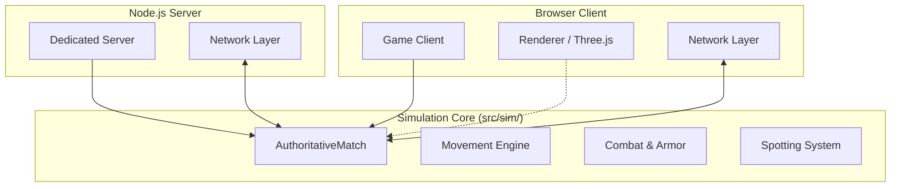
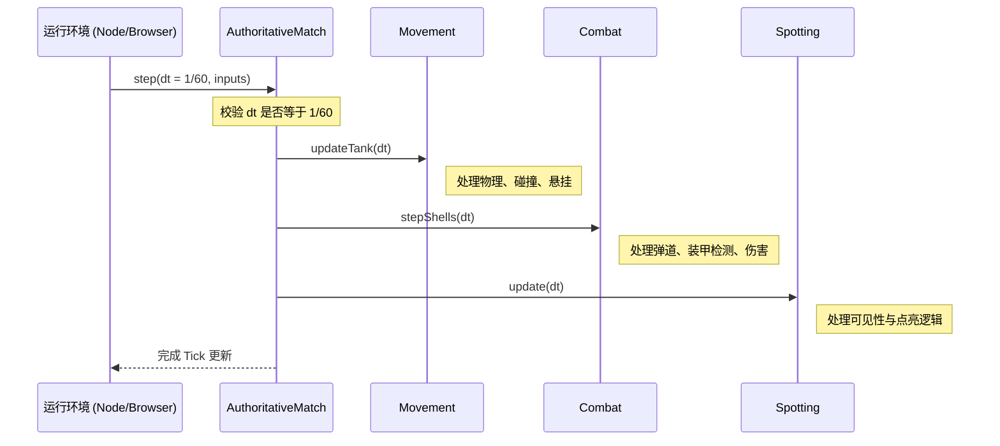
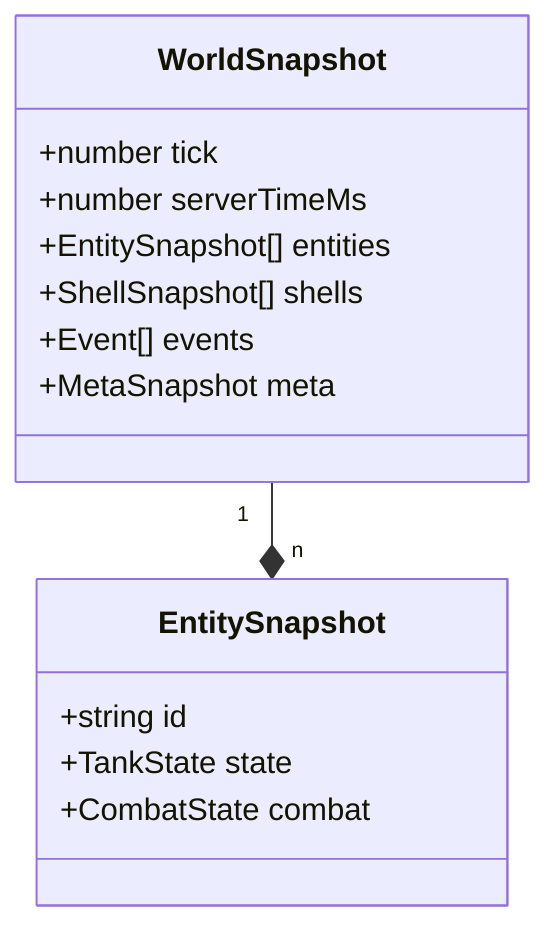
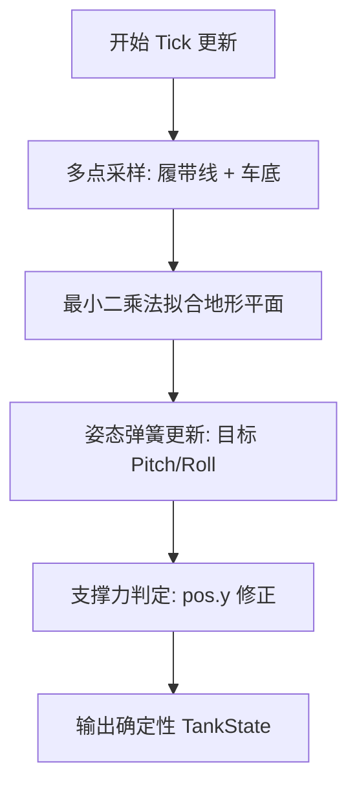

# 确定性仿真核心架构

## 目录
1. [模块概览](#模块概览)
2. [引言：确定性仿真的必要性](#引言-确定性仿真的必要性)
3. [核心架构设计](#核心架构设计)
   - [环境无关性 (Environment Agnostic)](#环境无关性-environment-agnostic)
   - [确定性循环 (Deterministic Loop)](#确定性循环-deterministic-loop)
   - [状态与逻辑的分离](#状态与逻辑的分离)
4. [核心组件解析](#核心组件解析)
   - [AuthoritativeMatch：仿真主控器](#authoritativematch-仿真主控器)
   - [Movement：确定性物理与悬挂模拟](#movement-确定性物理与悬挂模拟)
   - [Armor & Ballistics：高精度战斗逻辑](#armor--ballistics-高精度战斗逻辑)
   - [Damage & Combat：伤害判定与模块系统](#damage--combat-伤害判定与模块系统)
5. [数据模型与状态序列化](#数据模型与状态序列化)
   - [TankState：物理状态实体](#tankstate-物理状态实体)
   - [WorldSnapshot：网络同步的基石](#worldsnapshot-网络同步的基石)
6. [关键算法深度解析](#关键算法深度解析)
   - [地形接触解算 (Terrain Contact Solve)](#地形接触解算-terrain-contact-solve)
   - [弹道积分与引导算法](#弹道积分与引导算法)
   - [可见性与点亮系统 (Spotting System)](#可见性与点亮系统-spotting-system)
7. [集成与验证](#集成与验证)
   - [在 Node.js 中运行仿真](#在-node-js-中运行仿真)
   - [自检 (Self-test) 机制与确定性验证](#自检-self-test-机制与确定性验证)
8. [性能优化与并发考虑](#性能优化与并发考虑)
9. [文件参考](#文件参考)

## 模块概览

`src/sim/` 目录是 Claude of Tanks 的心脏，负责处理所有的物理模拟、战斗逻辑和规则判定。该模块被设计为**权威服务器 (Authoritative Server)** 的核心，同时也运行在客户端用于预测和回滚。

**统计信息**：
- **文件总数**：该目录下共有约 28 个文件。
- **核心逻辑**：包含 16 个 `.ts` 文件，定义了从物理运动、装甲检测到伤害判定的全部纯逻辑。
- **验证体系**：包含 12 个 `.selftest.mjs` 文件，用于在无头环境下通过 Node.js 直接验证逻辑的确定性。
- **子模块划分**：
  - **核心循环**：`authoritativeMatch.ts` 负责整体流程调度。
  - **物理运动**：`movement.ts`, `tankBodyContacts.ts`, `rollover.ts`, `terrainMobility.ts` 等。
  - **战斗系统**：`armor.ts`, `ballistics.ts`, `damage.ts`, `ammunition.ts` 等。
  - **AI 与 路径**：`botRoutePlanner.ts` 及其相关逻辑。

本页面将深入探讨这些组件如何协同工作，以实现一个高性能、可预测且环境无关的仿真核心。

## 引言：确定性仿真的必要性

在多人实时对战游戏中，确保所有参与者看到一致的游戏状态是最大的挑战。Claude of Tanks 采用了**确定性锁定步进 (Deterministic Lockstep)** 的变体。这意味着，给定相同的初始状态和相同的输入序列，仿真引擎在任何设备（无论是高配 PC 还是移动端浏览器，甚至是 Node.js 服务器）上运行，都必须产生完全一致的结果。

确定性仿真的核心挑战在于消除所有非确定性来源：
1. **时间不确定性**：通过固定步长（Fixed Timestep）解决。
2. **浮点数不确定性**：在 JavaScript 环境中，虽然 IEEE 754 浮点数在大多数情况下是确定性的，但某些数学函数（如 `Math.sin`）在不同引擎实现中可能存在微小差异。仿真核心通过注入 Seeded RNG 和尽量使用基础算术运算来规避。
3. **环境依赖**：彻底剔除对浏览器特定 API（如 `window`, `document`, `requestAnimationFrame`）的依赖。

## 核心架构设计

仿真核心的架构遵循“逻辑与表现完全分离”的原则。它不感知 Three.js 的场景树，不感知 HTML DOM，也不感知任何音频或输入设备。

### 环境无关性 (Environment Agnostic)

仿真核心仅依赖于 `three` 提供的数学类（如 `Vector3`, `Matrix4`, `Quaternion`），但并不使用其渲染功能。这使得相同的代码可以无缝地在浏览器 Web Worker 中运行以进行客户端预测，或者在 Node.js 环境中运行以作为权威服务器。

下图展示了仿真核心与不同运行环境的解耦关系：



仿真核心作为中间层，通过标准化的输入（`AuthoritativePlayerInput`）和输出（`WorldSnapshot`）与外部环境交互。这种设计确保了逻辑的纯粹性，极大地简化了调试和自动化测试。

### 确定性循环 (Deterministic Loop)

确定性的基石是**固定步长 (Fixed Timestep)**。在 `src/sim/movement.ts` 中定义了 `SIM_DT = 1/60`，这意味着物理模拟始终以 60Hz 的频率更新。



在 `AuthoritativeMatch.step` 方法中，如果传入的 `dt` 与 `SIM_DT` 不符，系统会抛出异常。这强制要求调用方必须以正确的频率驱动仿真，或者在内部进行步长补偿。

### 状态与逻辑的分离

仿真核心采用了类似于 ECS（实体组件系统）的思想，但更为轻量化。逻辑函数（如 `updateTank`）是纯函数或准纯函数，它们接受一个状态对象（如 `TankState`）并对其进行原地修改。这种设计使得状态的序列化和反序列化变得非常简单，从而支持了网络同步和回滚预测。

**Diagram sources**:
- [src/sim/authoritativeMatch.ts:L1362-L1470](src/sim/authoritativeMatch.ts#L1362-L1470)
- [src/sim/movement.ts:L327](src/sim/movement.ts#L327)

## 核心组件解析

### AuthoritativeMatch：仿真主控器

`AuthoritativeMatch` 是整个仿真的入口点。它管理着所有坦克实体（`AuthoritativeEntity`）、炮弹（`DamageShell`）以及比赛状态（相位、结果、得分）。

它的核心职责包括：
1. **输入处理**：将网络层的原始输入（包含摇杆位置、按键状态、瞄准点）解码并映射到实体上。
2. **生命周期管理**：处理加载、倒计时、比赛开始、结束判定。
3. **事件发射**：在仿真过程中产生事件（如 `shell_fired`, `tank_hit`, `world_prop_destroyed`），这些事件会被包含在快照中发往客户端。
4. **确定性种子管理**：通过 `mulberry32` 生成器为所有随机过程（如散布、伤害浮动）提供统一的随机数流。

### Movement：确定性物理与悬挂模拟

`movement.ts` 实现了复杂的坦克运动物理模型。不同于简单的刚体模拟，它包含了一个精细的悬挂系统镜像，用于在解算地形接触时考虑坦克的视觉晃动。

**核心逻辑包含**：
- **引擎扭矩模拟**：通过 `SPOOL_S` 等常量模拟发动机从静止到全速的动力响应曲线。
- **转向阻力**：根据地形阻力（`terrainResistance`）和当前速度动态调整转弯半径。
- **悬挂反馈**：模拟坦克在加减速时的抬头和点头效果，这些效果会实时影响炮管的俯仰限制。
- **履带滚动**：计算左右履带的差速位移，用于客户端的履带动画同步。

### Armor & Ballistics：高精度战斗逻辑

战斗逻辑被分为弹道模拟（Ballistics）和装甲检测（Armor）。
- **Ballistics**：处理炮弹的抛物线运动、重力补偿以及导弹的引导逻辑。它支持不同类型的弹药，如动能弹（APFSDS）和化学能弹（HEAT）。
- **Armor**：使用多层次的碰撞盒（Collision Shells）和精确的模块/成员体积进行射线检测。它不仅计算是否击中，还计算入射角、等效厚度以及是否发生跳弹。

### Damage & Combat：伤害判定与模块系统

伤害系统负责处理击中后的连锁反应：
- **HP 扣减**：根据穿透余量和弹药参数计算基础伤害。
- **模块损坏**：如果射线穿过内部模块（如发动机、弹药架），会根据概率判定模块受损状态（OK -> Yellow -> Red）。
- **乘员伤亡**：类似的逻辑应用于乘员体积。
- **起火与殉爆**：特定模块损坏可能引发持续扣血的火灾或直接导致坦克被摧毁的殉爆。

**Section sources**:
- [src/sim/authoritativeMatch.ts](src/sim/authoritativeMatch.ts)
- [src/sim/movement.ts](src/sim/movement.ts)
- [src/sim/damage.ts](src/sim/damage.ts)
- [src/sim/ballistics.ts](src/sim/ballistics.ts)

## 数据模型与状态序列化

为了实现高效的网络同步，仿真核心定义了严格的数据契约。

### TankState：物理状态实体

`TankState` 包含了坦克在某一时刻的所有物理属性。它是客户端预测和服务器校正的基础。

```typescript
export interface TankState {
  pos: Vector3;          // 世界坐标
  yaw: number;          // 车体朝向
  speed: number;        // 线速度
  yawRate: number;      // 角速度
  turretYaw: number;    // 炮塔局部朝向
  gunPitch: number;     // 炮管局部俯仰
  bloomF: number;       // 扩圈系数
  // ... 还有用于悬挂模拟的内部状态
}
```

### WorldSnapshot：网络同步的基石

快照是仿真状态的完整提取。它不仅包含所有实体的 `TankState`，还包含当前 Tick 产生的事件流。



快照的生成过程非常严谨，它会根据观察者的身份进行**可见性裁剪**，确保未点亮的敌人信息不会被泄露。

**Section sources**:
- [src/sim/movement.ts:L249-L289](src/sim/movement.ts#L249-L289)
- [src/net/snapshot.ts](src/net/snapshot.ts)

## 关键算法深度解析

### 地形接触解算 (Terrain Contact Solve)

这是仿真中最复杂的算法之一。为了防止坦克在崎岖地形中穿模，`movement.ts` 实现了一套多点采样与平面拟合算法。

1. **多点采样**：在坦克履带接触线和车底进行多点高度采样（通常每侧履带采样 5-10 个点）。
2. **最小二乘法拟合**：根据采样点拟合出一个局部地形平面，计算出理想的俯仰（Pitch）和横滚（Roll）角度。
3. **悬挂修正**：将拟合出的理想姿态作为目标，通过弹簧阻尼系统（Spring-Damper System）驱动坦克的视觉姿态。
4. **支撑力补偿**：如果任何采样点低于地面，则强制抬升坦克位置，确保履带永远位于地面之上。



该算法通过 `SUPPORT_FAN` 常量定义了采样点的分布，覆盖了履带边缘、中心线以及车底盘，确保了在极端地形（如尖锐的棱线）下的稳定性。

### 弹道积分与引导算法

炮弹的运动是通过数值积分实现的。对于普通炮弹，它遵循简单的重力抛物线；对于反坦克导弹（ATGM），则包含了一套复杂的引导逻辑。

```typescript
// src/sim/ballistics.ts 中的导弹引导逻辑简化版
export function guideShellToward(shell: ShellEntity, aimPoint: Vector3, dt: number) {
  const speed = shell.vel.length();
  const desiredDir = aimPoint.clone().sub(shell.pos).normalize();
  const currentDir = shell.vel.clone().normalize();
  
  // 计算旋转差值并限制转向速率
  const turn = Math.min(maxTurnAngle, GUIDED_MISSILE_TURN_RATE_RAD_S * dt);
  const newDir = rotateToward(currentDir, desiredDir, turn);
  
  shell.vel.copy(newDir).multiplyScalar(speed);
}
```

这种引导算法确保了导弹能够平滑地追踪玩家的准星，同时受限于物理上的最大过载（转向速率限制），保证了对抗的公平性。

### 可见性与点亮系统 (Spotting System)

点亮系统决定了谁能看见谁。它基于以下规则：
- **视野范围**：每个坦克根据其配置（光学设备）拥有基础视野。
- **隐蔽系数**：环境（草丛）和坦克状态（移动、开火）会影响被发现的距离。
- **射线检测**：系统会定期从观察者的观察孔向目标的多个暴露点发射射线，检测是否有地形或障碍物遮挡。

**Section sources**:
- [src/sim/movement.ts:L1734-L2160](src/sim/movement.ts#L1734-L2160)
- [src/sim/ballistics.ts:L214-L244](src/sim/ballistics.ts#L214-L244)
- [src/sim/spotting.ts](src/sim/spotting.ts)

## 集成与验证

### 在 Node.js 中运行仿真

由于引擎的解耦设计，初始化一个仿真实例非常简单。以下代码展示了如何在 Node.js 环境中启动一个权威匹配：

```typescript
import { createAuthoritativeMatch } from './sim/authoritativeMatch.ts';

const match = createAuthoritativeMatch({
  mapId: 'verdant',
  seed: 12345,
  players: [
    { id: 'player-1', specId: 'm1a2', team: 'alpha' },
    { id: 'bot-1', specId: 't90m', team: 'bravo', bot: true }
  ]
});

// 仿真主循环
setInterval(() => {
  match.step({ dt: 1/60, inputs: getLatestInputs() });
  const snapshot = match.snapshot({ tick: currentTick++, ... });
  broadcastToClients(snapshot);
}, 1000 / 60);
```

### 自检 (Self-test) 机制与确定性验证

`*.selftest.mjs` 文件是维护确定性的核心工具。它们不依赖于浏览器环境，直接通过 `node` 运行。测试用例会模拟数千个 Tick 的运动和战斗，并断言结果是否符合预期。

例如，`authoritativeMatch.selftest.mjs` 验证了：
- **身份一致性**：确保实体的 ID 在整个生命周期中保持不变。
- **物理边界**：坦克在地图边缘是否被正确挡住。
- **战斗同步**：炮弹击中是否产生了预期的伤害和事件。
- **确定性重播**：给定相同的种子和输入，两次运行的结果是否位级一致。

## 性能优化与并发考虑

仿真核心在设计时极度关注性能，以支持在单台服务器上运行多个匹配实例。
- **零分配 (Zero Allocation)**：在 `updateTank` 等热点函数中，大量使用模块作用域的临时变量（如 `_push`, `_aimLocal`），避免了每帧产生垃圾回收压力。
- **空间索引**：在处理碰撞和可见性时，使用 `queryObstacles` 等方法限制搜索范围。
- **惰性解算**：对于静止不动的坦克，会复用缓存的支撑高度，跳过昂贵的地形采样。
- **单线程模型**：为了保证确定性，仿真核心是单线程的。并发通过在 Node.js 中运行多个进程（每个进程负责一个 Match）来实现。

## 文件参考

以下是本章节涉及的关键源代码文件，建议深入阅读以了解实现细节：

- [src/sim/authoritativeMatch.ts](src/sim/authoritativeMatch.ts): 仿真核心入口，定义了 Match 状态机和 Tick 逻辑。
- [src/sim/movement.ts](src/sim/movement.ts): 核心物理模拟，包含地形拟合和悬挂算法。
- [src/sim/armor.ts](src/sim/armor.ts): 装甲模型定义与射线检测实现。
- [src/sim/damage.ts](src/sim/damage.ts): 伤害判定逻辑，包括 HE 爆炸和模块损坏。
- [src/sim/ballistics.ts](src/sim/ballistics.ts): 炮弹飞行积分与引导逻辑。
- [src/sim/spotting.ts](src/sim/spotting.ts): 基于射线的可见性点亮系统。
- [src/sim/authoritativeMatch.selftest.mjs](src/sim/authoritativeMatch.selftest.mjs): 核心功能的自动化测试套件。
- [src/net/snapshot.ts](src/net/snapshot.ts): 快照序列化与差分同步逻辑。
