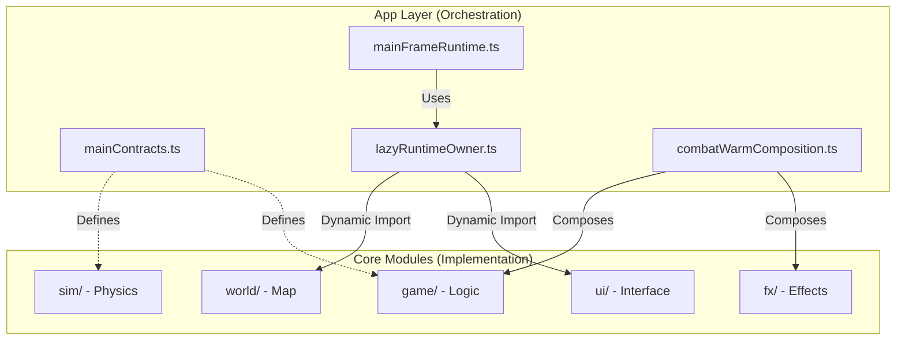
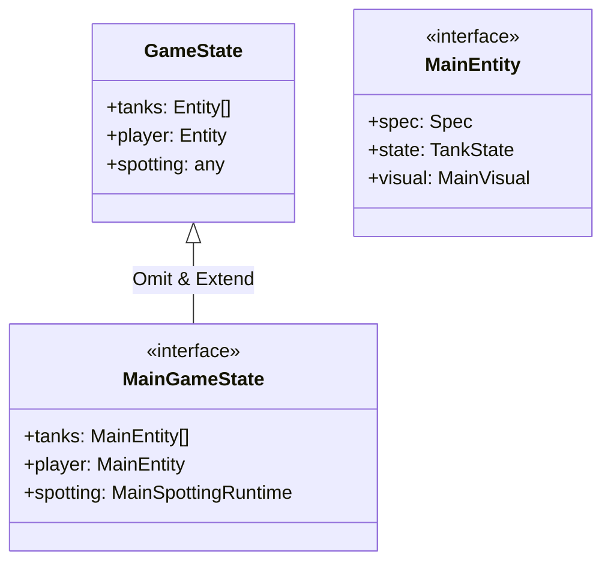
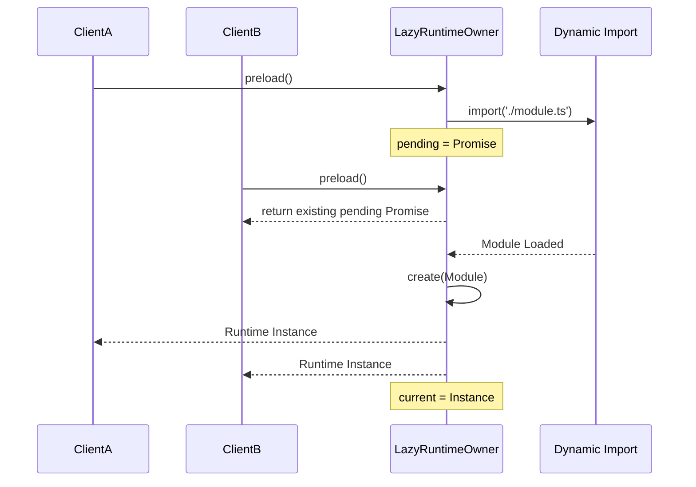
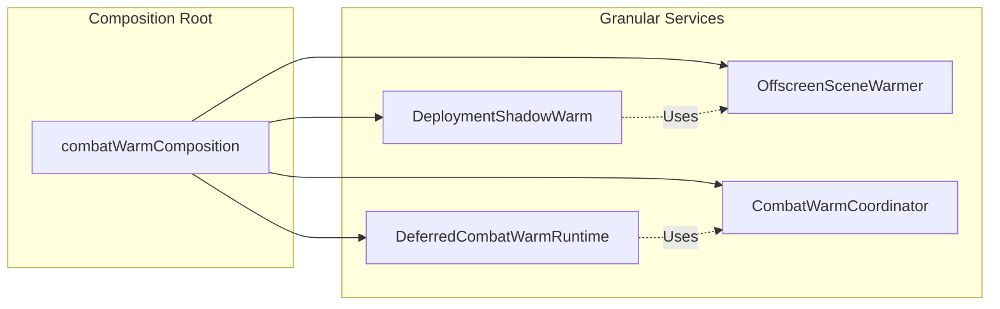
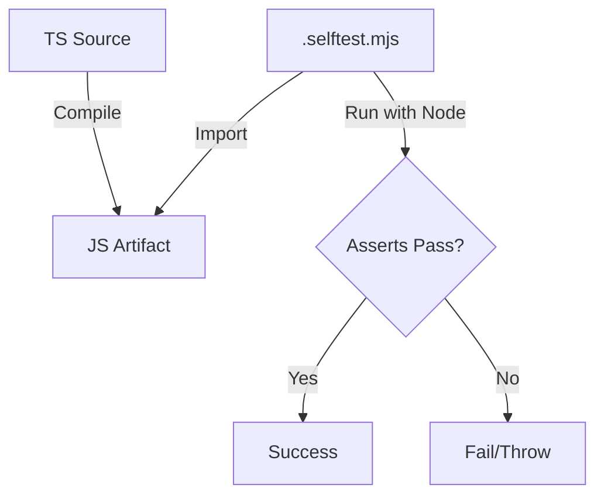

# 契约式设计与模块化模式

## 目录
1. [模块概述](#模块概述)
2. [引言：架构哲学](#引言架构哲学)
3. [核心组件分析](#核心组件分析)
   - [MainContracts：契约定义的源头](#maincontracts契约定义的源头)
   - [LazyRuntimeOwner：延迟加载与所有权管理](#lazyruntimeowner延迟加载与所有权管理)
   - [CheckedIntegrationPort：集成安全性检查](#checkedintegrationport集成安全性检查)
4. [架构概览：分层与解耦](#架构概览分层与解耦)
5. [设计模式：契约式接口定义](#设计模式契约式接口定义)
6. [设计模式：延迟加载与所有权模式](#设计模式延迟加载与所有权模式)
7. [设计模式：组合式逻辑构建](#设计模式组合式逻辑构建)
8. [集成与自测试：.selftest.mjs 的应用](#集成与自测试selftestmjs-的应用)
9. [文件参考](#文件参考)

## 模块概述

`src/app` 目录是 Claude of Tanks 项目的架构支撑核心。它不负责具体的业务逻辑（如坦克移动或 UI 渲染），而是负责定义各模块之间的**契约（Contracts）**、管理组件的**生命周期**以及协调复杂的**逻辑组合**。

**统计信息**：
- **文件总数**：12 个文件
- **核心逻辑文件**：7 个 TypeScript 文件 (`.ts`)
- **自测试文件**：6 个 JavaScript 测试文件 (`.selftest.mjs`)

**涵盖子模块**：
- **契约定义** (`mainContracts.ts`)：定义了项目全局使用的核心接口。
- **运行时所有者** (`lazyRuntimeOwner.ts`, `mainFrameRuntime.ts`, `mainBattleHudRuntime.ts`)：负责管理动态加载的运行时实例。
- **组合逻辑** (`combatWarmComposition.ts`, `combatAimComposition.ts`)：将多个独立的子系统组合成高级功能单元。
- **集成工具** (`checkedIntegrationPort.ts`)：提供运行时的类型安全检查。

## 引言：架构哲学

在大型 WebGL 应用中，随着功能模块的增加，代码库往往会面临两个严峻挑战：**启动性能瓶颈**和**模块间的循环依赖**。Claude of Tanks 通过“契约式设计”和“模块化模式”优雅地解决了这些问题。

该架构的核心思想是将“接口定义”与“具体实现”彻底分离。`app` 层定义了系统运行所需的“插槽”（Slots），而具体的实现模块（如 `game`、`sim`、`ui`）则作为可插拔的组件，在需要时被动态加载并注入到这些插槽中。这种方式不仅优化了首屏加载速度，还使得每个模块都可以独立于庞大的引擎环境进行单元测试。

## 核心组件分析

### MainContracts：契约定义的源头

`mainContracts.ts` 是整个项目的“法律条文”。它不包含任何可执行代码，而是利用 TypeScript 的类型系统，通过 `Omit`、`Pick` 和 `ReturnType` 等高级类型操作，将底层模块的原始类型重新定义为符合 `app` 层需求的“高级契约”。

```typescript
// src/app/mainContracts.ts 示例
export interface MainEntity extends Omit<
  RosterEntity,
  'spec' | 'state' | 'combat' | 'specialAction' | 'visual'
> {
  spec: ReturnType<typeof getSpec> & { name: string };
  state: TankState | null;
  combat: CombatState | null;
  specialAction: SpecialActionState | null;
  visual: MainVisual | null;
}
```

通过这种方式，`app` 层确保了所有核心实体（如 `MainEntity`）在整个应用生命周期中都具有一致的结构，即使底层 `sim` 或 `game` 模块的内部实现发生变化，只要符合契约，上层逻辑就不受影响。

### LazyRuntimeOwner：延迟加载与所有权管理

`lazyRuntimeOwner.ts` 提供了一个通用的容器，用于管理那些不需要在启动时立即加载的模块。它解决了两个关键问题：
1. **并发加载去重**：如果多个逻辑同时请求同一个模块，它会确保只发起一次加载请求。
2. **错误重试**：如果加载失败，它不会污染状态，允许后续再次尝试。

```typescript
// src/app/lazyRuntimeOwner.ts 核心逻辑
export function createLazyRuntimeOwner<Module, Runtime>(
  load: () => Promise<Module>,
  create: (module: Module) => Runtime,
): LazyRuntimeOwner<Runtime> {
  let current: Runtime | null = null;
  let pending: Promise<Runtime> | null = null;

  const preload = (): Promise<Runtime> => {
    if (current) return Promise.resolve(current);
    if (pending) return pending;
    // ... 执行加载逻辑
  };
  // ...
}
```

### CheckedIntegrationPort：集成安全性检查

由于项目大量使用动态导入（Dynamic Imports），编译时的类型检查有时无法完全覆盖运行时的集成细节。`checkedIntegrationPort.ts` 充当了运行时的“安检员”，在模块加载后立即验证其是否导出了预期的函数。

```typescript
// src/app/checkedIntegrationPort.ts
export function checkedIntegrationPort<T extends object>(
  value: object,
  label: string,
  requiredFunctions: readonly string[],
): T {
  const record = value as Record<string, unknown>;
  for (const key of requiredFunctions) {
    if (typeof record[key] !== 'function') {
      throw new TypeError(`${label} integration requires ${key}()`);
    }
  }
  return value as T;
}
```

**Section sources**:
- [mainContracts.ts](src/app/mainContracts.ts)
- [lazyRuntimeOwner.ts](src/app/lazyRuntimeOwner.ts)
- [checkedIntegrationPort.ts](src/app/checkedIntegrationPort.ts)

## 架构概览：分层与解耦

Claude of Tanks 的架构可以看作是一个高度解耦的星型结构。`app` 层位于中心，通过契约连接各个功能叶子节点。

下面的图表展示了 `app` 层如何作为中介，协调各个独立模块的交互。



在该架构中，`mainContracts.ts` 定义了所有模块必须遵守的接口规范。`mainFrameRuntime.ts` 作为主循环所有者，并不直接引用 `UI` 或 `World` 的具体实现，而是通过 `lazyRuntimeOwner` 管理的“插槽”来访问它们。这种设计使得 `App Layer` 能够控制模块的加载时机，从而实现极速启动。

**Diagram sources**: 
- [mainContracts.ts:L1-L77](src/app/mainContracts.ts#L1-L77)
- [mainFrameRuntime.ts:L41-L127](src/app/mainFrameRuntime.ts#L41-L127)

## 设计模式：契约式接口定义

契约式设计（Contract-based Design）在本项目中不仅仅是定义 `interface`，更是一种**类型重构策略**。它允许 `app` 层对底层模块提供的“粗粒度”类型进行精简和增强。

例如，底层的 `GameState` 可能包含许多中间状态，但在 `app` 层的业务逻辑中，我们只关心经过过滤和扩展后的状态。



通过 `Omit` 掉不相关的字段并注入更具体的子契约（如 `MainEntity`），`mainContracts.ts` 建立了一个强类型的安全网。当开发者在 `app` 层编写代码时，IDE 能够提供精确的补全，且任何违反契约的底层改动都会在编译期被捕获。

**Section sources**:
- [mainContracts.ts](src/app/mainContracts.ts)

## 设计模式：延迟加载与所有权模式

延迟加载（Lazy Loading）不仅是为了性能，也是为了解决**所有权（Ownership）**问题。在 Claude of Tanks 中，`lazyRuntimeOwner` 充当了模块的“监护人”。

下面的序列图展示了 `LazyRuntimeOwner` 如何处理并发的模块请求：



这种模式确保了：
1. **单一实例**：无论请求多少次，模块的初始化逻辑（`create` 函数）只执行一次。
2. **状态稳定性**：通过 `Object.freeze` 导出的 owner 保证了外部无法篡改加载状态。
3. **生命周期隔离**：Owner 可以被销毁并重新初始化（如在 `resetRendererWarmState` 中），而不需要重新下载代码。

**Section sources**:
- [lazyRuntimeOwner.ts](src/app/lazyRuntimeOwner.ts)
- [mainFrameRuntime.ts:L206-L213](src/app/mainFrameRuntime.ts#L206-L213)

## 设计模式：组合式逻辑构建

组合模式（Composition Pattern）在 `combatWarmComposition.ts` 和 `combatAimComposition.ts` 中得到了充分体现。这些文件不实现具体的算法，而是像“乐高积木”一样，将多个细粒度的服务（Services）组合成一个高层级的运行时对象。



以 `createCombatWarmComposition` 为例，它接收一组复杂的依赖项（`renderer`, `scene`, `camera` 等），在内部创建多个相互关联的子运行时，并最终导出一个稳定的接口。这种做法的优势在于：
- **职责清晰**：每个子运行时只负责一件事（如 `OffscreenSceneWarmer` 只负责离屏渲染）。
- **解耦依赖**：子运行时之间通过 `App` 层传递的 `Context` 进行交互，而不是直接硬编码依赖。
- **原子化操作**：`CWC` 提供的 `resetRendererWarmState` 可以一次性重置所有子系统的状态，确保清理逻辑不遗漏。

**Section sources**:
- [combatWarmComposition.ts](src/app/combatWarmComposition.ts)
- [combatAimComposition.ts](src/app/combatAimComposition.ts)

## 集成与自测试：.selftest.mjs 的应用

由于 `app` 层高度解耦，项目引入了一种轻量级的测试机制：`.selftest.mjs`。这些文件是原生的 Node.js 脚本，利用 `node:assert` 模块对 `app` 层的逻辑进行验证。



这种测试方式的特点是：
1. **零依赖**：不需要复杂的测试框架（如 Jest 或 Vitest），直接用 Node 运行。
2. **隔离性强**：由于 `app` 组件通过契约接收依赖，测试脚本可以轻松地注入“伪造”的依赖（Mocks）来验证边界条件。
3. **快速反馈**：测试执行极其迅速，非常适合验证 `LazyRuntimeOwner` 的并发控制或 `CheckedIntegrationPort` 的类型检查逻辑。

**示例：验证延迟加载的重试机制**
```javascript
// src/app/lazyRuntimeOwner.selftest.mjs
let attempts = 0;
const retrying = createLazyRuntimeOwner(
  async () => {
    attempts += 1;
    if (attempts === 1) throw new Error('expected first failure');
    return { ready: true };
  },
  (module) => module,
);
// 第一次预加载应该失败
await assert.rejects(retrying.preload(), /expected first failure/);
// 第二次预加载应该成功，证明失败不会污染状态
assert.deepEqual(await retrying.preload(), { ready: true });
```

**Section sources**:
- [lazyRuntimeOwner.selftest.mjs](src/app/lazyRuntimeOwner.selftest.mjs)
- [checkedIntegrationPort.selftest.mjs](src/app/checkedIntegrationPort.selftest.mjs)

## 文件参考

本章节涉及的核心架构文件如下：

- [mainContracts.ts](src/app/mainContracts.ts)：核心契约与接口定义。
- [lazyRuntimeOwner.ts](src/app/lazyRuntimeOwner.ts)：延迟加载容器与所有权管理。
- [checkedIntegrationPort.ts](src/app/checkedIntegrationPort.ts)：运行时集成安全检查。
- [combatWarmComposition.ts](src/app/combatWarmComposition.ts)：战斗预热逻辑的组合根。
- [combatAimComposition.ts](src/app/combatAimComposition.ts)：瞄准与相机系统的组合根。
- [mainFrameRuntime.ts](src/app/mainFrameRuntime.ts)：主循环运行时，最高层级的组合节点。
- [mainBattleHudRuntime.ts](src/app/mainBattleHudRuntime.ts)：战斗 HUD 的运行时管理。
- [lazyRuntimeOwner.selftest.mjs](src/app/lazyRuntimeOwner.selftest.mjs)：延迟加载逻辑的自测试。
- [checkedIntegrationPort.selftest.mjs](src/app/checkedIntegrationPort.selftest.mjs)：集成检查工具的自测试。
