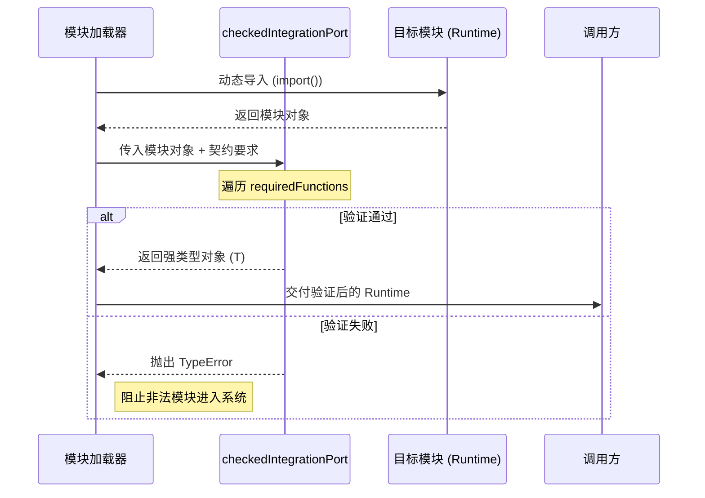

# 契约式接口定义与集成检查

## 目录
1. [模块概览](#模块概览)
2. [引言：契约式设计的核心作用](#引言契约式设计的核心作用)
3. [类型精炼：构建应用层视图](#类型精炼构建应用层视图)
   - [基于 Omit 与 Pick 的类型重组](#基于-omit-与-pick-的类型重组)
   - [实战：扩展 MainEntity 属性](#实战扩展-mainentity-属性)
4. [全局状态增强与调试支持](#全局状态增强与调试支持)
   - [Window 接口的扩展机制](#window-接口的扩展机制)
   - [性能监控与调试入口](#性能监控与调试入口)
5. [运行时验证：防止接口漂移](#运行时验证防止接口漂移)
   - [checkedIntegrationPort 的实现原理](#checkedintegrationport-的实现原理)
   - [集成检查的执行流程](#集成检查的执行流程)
6. [契约测试与自验证](#契约测试与自验证)
   - [编写集成契约单元测试](#编写集成契约单元测试)
7. [WebGL 应用中的稳定性保障](#webgl-应用中的稳定性保障)
8. [核心组件](#核心组件)
9. [文件参考](#文件参考)

## 模块概览

在 `Claude of Tanks` 项目中，`src/app` 目录承担了定义系统全局契约和集成检查工具的核心职责。该模块通过 TypeScript 的高级类型系统和运行时反射机制，确保了复杂系统（如仿真引擎、UI 层、网络层）之间的解耦与稳定协作。

**模块统计数据**：
- **核心文件数**：3 个（`mainContracts.ts`, `checkedIntegrationPort.ts`, `checkedIntegrationPort.selftest.mjs`）
- **涉及子模块**：`game`, `sim`, `ui`, `world`, `fx`, `engine`
- **主要职责**：定义全局类型契约、扩展全局对象、提供运行时集成验证工具。

本章将深入探讨这些机制如何共同作用，构建出一个既灵活又强健的大型 WebGL 应用程序架构。

## 引言：契约式设计的核心作用

契约式设计（Contract-based Design, CBD）是 `Claude of Tanks` 架构的基石。在处理像坦克世界仿真这样复杂的系统时，不同模块（如负责物理计算的 `sim` 模块和负责界面显示的 `ui` 模块）往往由不同的逻辑层级驱动。

如果模块之间直接引用底层数据结构，会导致严重的耦合问题：
1. **类型污染**：UI 层不应感知仿真引擎内部的复杂状态。
2. **重构困难**：修改底层数据结构可能导致整个应用崩溃。
3. **动态加载风险**：本项目大量使用动态导入（Dynamic Imports），编译时的类型检查无法完全保证运行时加载的模块符合预期。

通过在 `src/app/mainContracts.ts` 中定义明确的“契约”类型，并使用 `checkedIntegrationPort.ts` 进行运行时验证，我们实现了一个“强类型桥接层”。这层桥接确保了各个模块只需关注契约本身，而无需关心具体实现，从而实现了真正的解耦。

## 类型精炼：构建应用层视图

### 基于 Omit 与 Pick 的类型重组

`src/app/mainContracts.ts` 的核心任务是从底层模块（如 `game` 或 `sim`）中提取原始类型，并通过 `Omit` 和 `Pick` 等工具类型进行“精炼”，生成适用于应用层逻辑的视图类型。

这种模式的优势在于：它保留了底层数据的核心属性，同时允许应用层根据自身需求覆盖或扩展特定字段。

```typescript
// src/app/mainContracts.ts 中的 MainEntity 定义
export interface MainEntity extends Omit<
  RosterEntity,
  'spec' | 'state' | 'combat' | 'specialAction' | 'visual'
> {
  spec: ReturnType<typeof getSpec> & { name: string };
  state: TankState | null;
  combat: CombatState | null;
  specialAction: SpecialActionState | null;
  equip?: readonly string[] | null;
  visual: MainVisual | null;
}
```

在上述代码中，`MainEntity` 继承了 `RosterEntity` 的大部分属性，但通过 `Omit` 剔除了几个关键字段，并用应用层更关心的类型（如 `TankState`, `CombatState`）进行了重定义。这种方式确保了 UI 和应用逻辑处理的是经过“净化”的对象，而不是原始的、可能包含过多细节的仿真对象。

### 实战：扩展 MainEntity 属性

假设我们需要为坦克实体添加一个新的“光环效果”属性 `auras`，该属性在底层 `sim` 模块中可能是一个复杂的集合，但在应用层我们只需要它的名称列表。

**步骤 1：更新契约定义**
在 `src/app/mainContracts.ts` 中修改 `MainEntity`：

```typescript
export interface MainEntity extends Omit<
  RosterEntity,
  'spec' | 'state' | 'combat' | 'specialAction' | 'visual' | 'auras' // 添加 auras 到 Omit
> {
  // ... 其他字段
  auras: string[]; // 在应用层定义为简单的字符串数组
}
```

**步骤 2：同步更新相关逻辑**
由于 `MainGameState` 使用了 `MainEntity[]`，所有引用 `MainGameState` 的 UI 组件（如战斗 HUD）现在都能感知到 `auras` 属性，且类型安全。

这种集中式的契约管理使得跨模块的属性扩展变得清晰且可控。

**Section sources**:
- [mainContracts.ts](src/app/mainContracts.ts)

## 全局状态增强与调试支持

### Window 接口的扩展机制

在大型 Web 应用中，全局调试工具和性能监控是必不可少的。`Claude of Tanks` 利用 TypeScript 的 `declare global` 特性，在 `mainContracts.ts` 中对 `Window` 接口进行了扩展。

```typescript
declare global {
  interface Window {
    __BATTLE_REVEAL?: unknown;
    __BOOT_MS?: number;
    __BOOT_TIMINGS?: Record<string, number>;
    __GAME_READY?: boolean;
    // ... 其他调试属性
  }
}
```

这种做法虽然引入了全局变量，但在开发和生产环境的监控中极具价值。通过在契约中显式声明这些属性，我们避免了在代码中到处使用 `(window as any).__DEBUG_VAR` 这种不安全的写法。

### 性能监控与调试入口

这些全局属性通常用于记录关键的生命周期事件，例如 `__BOOT_TIMINGS` 记录了各个模块的启动耗时。开发工具（DevTools）或自动化脚本可以直接访问这些属性来评估应用的健康状况。

例如，当 `__GAME_READY` 被设置为 `true` 时，自动化测试框架就知道可以开始执行战斗逻辑测试了。这种通过契约定义的全局通信机制，为复杂系统的可观测性提供了基础支持。

**Section sources**:
- [mainContracts.ts](src/app/mainContracts.ts)

## 运行时验证：防止接口漂移

### checkedIntegrationPort 的实现原理

由于项目采用了模块化设计和延迟加载技术，静态类型检查有时会显得力不从心。如果一个动态加载的模块修改了导出的函数名，编译可能通过，但运行时会报错。

`src/app/checkedIntegrationPort.ts` 提供了一个轻量级的运行时验证器，用于在模块集成点强制执行检查。

```typescript
export function checkedIntegrationPort<T extends object>(
  value: object,
  label: string,
  requiredFunctions: readonly string[],
): T {
  const record = value as Record<string, unknown>;
  for (const key of requiredFunctions) {
    if (typeof record[key] !== 'function') {
      throw new TypeError(`${label} integration requires ${key}()`);
    }
  }
  return value as T;
}
```

该函数接受一个对象（通常是加载后的模块或适配器）、一个用于错误提示的标签，以及一个必须存在的函数名列表。如果任何要求的函数不存在或不是函数类型，它会立即抛出 `TypeError`。

### 集成检查的执行流程

下图展示了 `checkedIntegrationPort` 如何在模块加载过程中发挥作用：



这个流程体现了“快速失败（Fail-Fast）”原则。通过在集成发生的第一时间进行检查，我们防止了错误状态在系统中蔓延，大大降低了调试动态加载问题的难度。

**Diagram sources**: 
- [checkedIntegrationPort.ts:L6-L18](src/app/checkedIntegrationPort.ts#L6-L18)

在 `Claude of Tanks` 的实际应用中，这种模式被广泛用于战斗加载（`soloBattleLoadingRuntime.ts`）、车库返回（`garageReturnRuntime.ts`）等关键路径。

**Section sources**:
- [checkedIntegrationPort.ts](src/app/checkedIntegrationPort.ts)
- [main.ts](src/main.ts)

## 契约测试与自验证

### 编写集成契约单元测试

为了确保 `checkedIntegrationPort` 自身逻辑的正确性，项目包含了 `src/app/checkedIntegrationPort.selftest.mjs`。这个自测试文件展示了如何针对接口契约编写测试用例。

```javascript
// src/app/checkedIntegrationPort.selftest.mjs
import assert from 'node:assert/strict';
import { checkedIntegrationPort } from './checkedIntegrationPort.ts';

const port = {
  begin() { return 'ready'; },
  close() {},
};

// 正面测试：完整的接口应该被保留身份
assert.equal(
  checkedIntegrationPort(port, 'test port', ['begin', 'close']),
  port,
);

// 反面测试：缺失函数应抛出错误
assert.throws(
  () => checkedIntegrationPort({ begin() {} }, 'test port', ['begin', 'close']),
  /test port integration requires close\(\)/,
);
```

这种自测试模式不仅验证了工具函数，也为其他开发者提供了使用示例。它确保了即使核心集成逻辑发生变化，系统最底层的“安检”机制依然可靠。

**Section sources**:
- [checkedIntegrationPort.selftest.mjs](src/app/checkedIntegrationPort.selftest.mjs)

## WebGL 应用中的稳定性保障

在 WebGL 坦克仿真应用中，性能和稳定性是并重的。由于 WebGL 渲染循环（RequestAnimationFrame）对时间极其敏感，任何运行时的接口错误（如 `undefined is not a function`）都可能导致整个渲染管线崩溃，造成画面冻结或浏览器崩溃。

**强类型契约 + 运行时检查** 模式的必要性：
1. **防止渲染中断**：通过在加载阶段拦截错误接口，避免了在 60FPS 的渲染循环中触发异常。
2. **支持热重载与模块化**：在开发过程中，频繁的模块替换需要可靠的验证机制来保证新加载的代码与现有系统兼容。
3. **长期维护性**：随着坦克型号、地图、特效模块的增加，契约定义成为了项目唯一的真理来源（Source of Truth），指导着各模块的并行开发。

这种架构设计使得 `Claude of Tanks` 能够承载数以百计的实体和复杂的视觉效果，同时保持极高的运行时稳定性。

## 核心组件

| 组件名称 | 类型 | 职责 |
| :--- | :--- | :--- |
| `MainEntity` | Interface | 定义应用层坦克实体的标准结构，重炼底层仿真数据。 |
| `MainGameState` | Type | 全局游戏状态的契约定义，整合了坦克列表、玩家信息及探测系统。 |
| `checkedIntegrationPort` | Function | 运行时反射工具，验证动态加载的模块是否满足特定接口要求。 |
| `LazyRuntimeOwner` | Interface | 管理延迟加载运行时的生命周期，确保单例加载及异常处理。 |

## 文件参考

本章内容涉及以下核心源文件：

- `src/app/mainContracts.ts`：定义了系统全局的类型契约和 `Window` 扩展。
- `src/app/checkedIntegrationPort.ts`：实现了运行时的接口验证逻辑。
- `src/app/checkedIntegrationPort.selftest.mjs`：针对集成检查工具的自测试套件。
- `src/app/lazyRuntimeOwner.ts`：提供了延迟加载运行时的管理机制。
- `src/main.ts`：展示了 `checkedIntegrationPort` 在实际集成点（如 Killcam 和 ShotRuntime）的应用。
