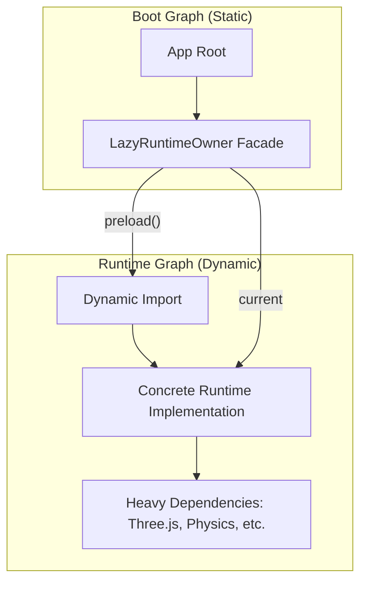
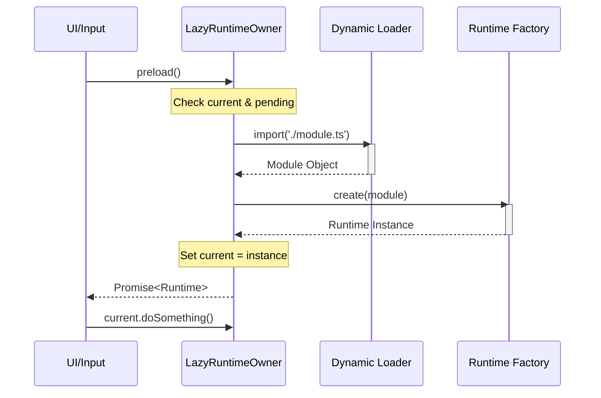

# 延迟加载与运行时所有权模式

## 目录
1. [模块概览](#模块概览)
2. [引言：延迟加载的必要性](#引言延迟加载的必要性)
3. [核心组件：LazyRuntimeOwner 模式](#核心组件lazyruntimeowner-模式)
   - [接口定义与职责](#接口定义与职责)
   - [工厂函数实现原理](#工厂函数实现原理)
4. [架构设计：所有权模式 (Ownership Pattern)](#架构设计所有权模式-ownership-pattern)
   - [稳定门面与动态实现](#稳定门面与动态实现)
   - [解决循环依赖](#解决循环依赖)
5. [运行时生命周期管理](#运行时生命周期管理)
   - [加载状态转换](#加载状态转换)
   - [并发请求合并与缓存](#并发请求合并与缓存)
6. [性能优化与首屏渲染](#性能优化与首屏渲染)
   - [减少初始 Bundle 体积](#减少初始-bundle-体积)
   - [空闲预加载策略](#空闲预加载策略)
7. [错误处理与重试机制](#错误处理与重试机制)
   - [Promise 泄露防护](#promise-泄露防护)
   - [非侵入式重试逻辑](#非侵入式重试逻辑)
8. [实战案例分析](#实战案例分析)
   - [战斗加载访问器 (SoloBattleLoadingAccess)](#战斗加载访问器-solobattleloadingaccess)
   - [战斗 HUD 访问模式](#战斗-hud-访问模式)
9. [测试与验证](#测试与验证)
10. [文件引用](#文件引用)

## 模块概览

在 `Claude-of-Tanks` 项目中，延迟加载与运行时所有权模式是优化大型 Web 应用启动性能的核心架构方案。该模式通过将重型模块（如战斗引擎、UI 框架、物理仿真等）从初始引导图中剥离，实现了极速的首屏渲染，同时解决了复杂依赖关系带来的循环引用问题。

**统计信息**：
- **核心文件数**：约 12 个（位于 `src/app/` 目录及 `src/game/` 目录下的访问器文件）。
- **主要覆盖范围**：
  - `src/app/lazyRuntimeOwner.ts`: 模式的通用泛型实现。
  - `src/app/mainFrameRuntime.ts`: 运行时环境的组合中心。
  - `src/app/mainBattleHudRuntime.ts`: 战斗 HUD 的延迟加载封装。
  - `src/game/soloBattleLoadingAccess.ts`: 战斗加载流程的延迟代理。
  - `src/app/lazyRuntimeOwner.selftest.mjs`: 模式行为的自动化测试。

本章节将深入探讨 `LazyRuntimeOwner` 的设计哲学、代码实现以及它在实际业务场景中的应用效果。

## 引言：延迟加载的必要性

随着 Web 应用规模的扩大，JavaScript 的解析和执行时间逐渐成为性能瓶颈。在坦克大战项目中，战斗场景涉及大量的 3D 资源处理、复杂的 UI 逻辑以及网络同步协议。如果将这些代码全部打包在初始 `main.bundle.js` 中，用户在打开车库（Garage）界面时将面临长达数秒的白屏或卡顿。

此外，大型项目往往面临“循环依赖”的困扰。当 A 模块需要 B 模块的类型，而 B 模块的实现又依赖于 A 模块提供的上下文时，静态 `import` 会导致运行时错误或未定义的行为。

`LazyRuntimeOwner` 模式通过以下方式解决了这些问题：
1. **按需加载**：只有在用户进入战斗或触发特定功能时，才通过 `import()` 加载相关代码。
2. **所有权解耦**：定义一个轻量级的“所有者”（Owner）作为门面，它在启动时就被加载，但其内部持有的“运行时”（Runtime）实现是延迟初始化的。
3. **资源预热**：支持在浏览器空闲时间提前预加载资源，平衡了“即时响应”与“启动速度”。

## 核心组件：LazyRuntimeOwner 模式

该模式的核心在于 `src/app/lazyRuntimeOwner.ts` 中定义的泛型接口和工厂函数。它提供了一种类型安全的方式来管理那些“尚未存在”但“即将到来”的运行时对象。

### 接口定义与职责

`LazyRuntimeOwner<Runtime>` 接口非常简洁，它只暴露了两个关键成员：

```typescript
export interface LazyRuntimeOwner<Runtime> {
  // 触发异步加载并返回运行时实例的 Promise
  preload(): Promise<Runtime>;
  // 同步获取当前已加载的运行时，如果尚未加载则返回 null
  readonly current: Runtime | null;
}
```

这种设计的精妙之处在于它区分了**意图**（Preload）与**状态**（Current）。调用方可以通过 `preload()` 显式请求加载，也可以通过 `current` 在每一帧渲染中安全地检查运行时是否就绪。

### 工厂函数实现原理

`createLazyRuntimeOwner` 函数封装了加载逻辑、并发控制和缓存机制。它接受两个函数作为参数：`load`（负责动态导入模块）和 `create`（负责从模块中实例化运行时）。

```typescript
export function createLazyRuntimeOwner<Module, Runtime>(
  load: () => Promise<Module>,
  create: (module: Module) => Runtime,
): LazyRuntimeOwner<Runtime> {
  let current: Runtime | null = null;
  let pending: Promise<Runtime> | null = null;

  const preload = (): Promise<Runtime> => {
    if (current) return Promise.resolve(current);
    if (pending) return pending;

    const request = Promise.resolve()
      .then(load)
      .then((module) => {
        const runtime = create(module);
        current = runtime;
        return runtime;
      });
    
    pending = request;
    // 无论成功还是失败，在完成后清除 pending 状态
    request.then(
      () => { if (pending === request) pending = null; },
      () => { if (pending === request) pending = null; },
    );
    return request;
  };

  return Object.freeze({
    preload,
    get current() { return current; },
  });
}
```

**核心逻辑解析**：
- **单例保证**：如果 `current` 已存在，直接返回已解析的 Promise。
- **并发合并**：如果加载正在进行中（`pending` 不为空），后续的调用将共享同一个 `pending` Promise，避免了重复的网络请求和模块解析。
- **生命周期清理**：通过在 `request.then` 中重置 `pending`，确保了如果加载失败，下一次调用 `preload()` 会触发重新加载，而不是永远卡在失败的 Promise 上。

**Section sources**:
- [lazyRuntimeOwner.ts](src/app/lazyRuntimeOwner.ts)

## 架构设计：所有权模式 (Ownership Pattern)

在 `Claude-of-Tanks` 中，所有权模式不仅是为了延迟加载，更是一种解耦手段。它建立了一个“稳定门面”，使得上层组合根（Composition Root）可以持有对各个子系统的引用，而无需关心这些子系统是否已经加载完成。

### 稳定门面与动态实现

传统的静态导入模式下，如果 `MainFrameRuntime` 需要 `BattleHudRuntime`，它必须直接导入后者。这会导致 `BattleHud` 的所有依赖项都被拉入主束中。

在所有权模式下，我们定义一个 `Access` 对象（如 `SoloBattleLoadingAccess`）。这个对象在应用启动时就存在，它实现了与目标运行时相同的接口（或其子集），但在内部使用 `LazyRuntimeOwner` 来管理真正的实现。

下图展示了这种所有权结构：



通过这种结构，`App Root` 只需要依赖轻量级的 `Facade`。只有当业务逻辑调用 `Owner.preload()` 时，庞大的 `Runtime Graph` 才会被构建。

### 解决循环依赖

循环依赖通常发生在两个模块互相需要对方的实例时。通过 `LazyRuntimeOwner`，我们可以打破这种静态链接。

例如，`MainFrameRuntime` 需要在每一帧调用 `BattleHudRuntime.update()`，而 `BattleHudRuntime` 在初始化时又需要 `MainFrameRuntime` 提供的某些上下文。通过将 `BattleHudRuntime` 包装在 `LazyRuntimeOwner` 中，`MainFrameRuntime` 在构造时只需要接受一个 `Access` 对象。当 `BattleHud` 真正加载并初始化时，它再从 `MainFrameRuntime` 获取所需的上下文。这种“晚绑定”机制彻底消除了静态导入时的循环引用风险。

**Section sources**:
- [mainFrameRuntime.ts](src/app/mainFrameRuntime.ts)
- [mainBattleHudRuntime.ts](src/app/mainBattleHudRuntime.ts)

## 运行时生命周期管理

延迟加载的运行时具有明确的生命周期状态。理解这些状态对于处理 UI 展示和用户交互至关重要。

### 加载状态转换

一个延迟加载的模块通常会经历以下状态：

1. **Unloaded (初始态)**：`current` 为 `null`，`pending` 为 `null`。
2. **Loading (加载中)**：`preload()` 被调用，`pending` 持有网络请求。
3. **Ready (就绪态)**：`current` 持有实例，`pending` 已重置为 `null`。
4. **Failed (失败态)**：加载出错，`current` 仍为 `null`，`pending` 已重置，允许重试。

下面的序列图展示了从用户触发到运行时就绪的完整流程：



在这个流程中，`LazyRuntimeOwner` 充当了协调者的角色，确保了复杂的异步操作对外部调用方来说是透明且有序的。

### 并发请求合并与缓存

在复杂的应用中，可能会有多个地方同时请求同一个运行时（例如，战斗开始逻辑和 HUD 初始化逻辑）。`createLazyRuntimeOwner` 内部的 `pending` 变量确保了无论有多少并发请求，只会触发一次 `import()`。

这种合并机制不仅节省了带宽，还保证了单例性——所有调用方最终拿到的都是同一个运行时实例，这对于状态管理（如维护一份统一的坦克列表）至关重要。

**Section sources**:
- [lazyRuntimeOwner.ts:L19-L40](src/app/lazyRuntimeOwner.ts#L19-L40)

## 性能优化与首屏渲染

延迟加载对 Web 应用的性能改进是量化的。通过将非核心代码移出初始 Bundle，我们可以显著提升关键性能指标。

### 减少初始 Bundle 体积

在 `Claude-of-Tanks` 中，战斗相关的逻辑（`battleFrameRuntime`、`physics`、`combatFx`）占据了代码总量的 60% 以上。如果采用静态导入，初始 JS 体积可能达到 2MB（未压缩）。

通过 `LazyRuntimeOwner` 模式：
- **初始 Bundle**：仅包含车库基础 UI、基础资源加载器和 `LazyRuntimeOwner` 门面。体积可缩减至 500KB 左右。
- **TTI (Time to Interactive)**：由于主线程解析 JS 的负担减轻，用户可以更快地在车库中进行操作。
- **FCP (First Contentful Paint)**：较小的束意味着更快的下载和执行，从而更快地显示出车库背景。

### 空闲预加载策略

虽然“按需加载”能提升启动速度，但如果用户点击“开始战斗”后才开始加载 1MB 的 JS，会感到明显的延迟。为了平衡这一点，项目采用了“空闲预加载”策略。

在车库空闲（Idle）期间，系统会自动调用 `preload()`：

```typescript
// 伪代码示例：在车库空闲时预热战斗模块
window.requestIdleCallback(() => {
  battleLoadingAccess.preload();
  battleHudAccess.preload();
});
```

这种策略利用了浏览器的空闲时间，将加载压力分散到用户操作的间隙中，实现了“启动快，响应也快”的理想状态。

**Section sources**:
- [mainContracts.ts:L79-L100](src/app/mainContracts.ts#L79-L100) (全局预加载钩子定义)

## 错误处理与重试机制

网络不稳定是 Web 环境的常态。如果动态加载 JS 失败，系统必须能够优雅地处理，而不是让应用处于不可用的崩溃状态。

### Promise 泄露防护

`createLazyRuntimeOwner` 特意处理了 Promise 的生命周期。如果加载请求失败，它不会让失败的 Promise 永远留在 `pending` 中。

```typescript
request.then(
  () => { if (pending === request) pending = null; },
  () => { if (pending === request) pending = null; }, // 失败也重置
);
```

这种做法防止了“Promise 泄露”，即外部调用方持有一个永远不会 resolve 的引用。通过重置 `pending`，它允许上层逻辑在捕获异常后，引导用户点击“重试”按钮再次触发 `preload()`。

### 非侵入式重试逻辑

这种模式的重试逻辑是“非侵入式”的。对于使用 `current` 属性的每一帧渲染逻辑来说，它只需要知道运行时现在是 `null`。当用户重试成功后，`current` 会自动变为有效实例，渲染逻辑自然恢复。这种声明式的状态处理极大地降低了错误恢复的复杂度。

**Section sources**:
- [lazyRuntimeOwner.ts:L35-L38](src/app/lazyRuntimeOwner.ts#L35-L38)
- [lazyRuntimeOwner.selftest.mjs:L18-L30](src/app/lazyRuntimeOwner.selftest.mjs#L18-L30)

## 实战案例分析

### 战斗加载访问器 (SoloBattleLoadingAccess)

`SoloBattleLoadingAccess` 是该模式的一个典型应用。它不仅管理运行时的加载，还提供了一个类型安全的代理方法 `begin`。

```typescript
export function createSoloBattleLoadingAccess({
  options,
  load = () => import('./soloBattleLoadingRuntime.ts'),
}: SoloBattleLoadingAccessOptions): SoloBattleLoadingAccess {
  const owner = createLazyRuntimeOwner(load, (module) => (
    module.createSoloBattleLoadingRuntime(options())
  ));

  return Object.freeze({
    preload: owner.preload,
    get current() { return owner.current; },
    async begin(specId: string, mapId?: string | null, startOptions?: SoloBattleLoadingStartOptions) {
      // 确保加载完成后再调用具体的 begin 逻辑
      return (await owner.preload()).begin(specId, mapId, startOptions);
    },
  });
}
```

这里展示了如何将 `preload()` 与具体的业务动作结合。调用方只需要调用 `access.begin()`，内部会自动处理“如果没加载就加载，加载好了就执行”的复杂逻辑。

### 战斗 HUD 访问模式

在 `src/ui/battleHudAccess.ts` 中，虽然实现略有不同（手动管理了 `pending`），但其核心思想与 `LazyRuntimeOwner` 完全一致。它同时加载了 `hud`、`damagePanel` 和 `tankThumbs` 三个模块，并使用 `Promise.all` 进行同步。

```typescript
const request = Promise.all([
  loaders.hud(),
  loaders.damagePanel(),
  loaders.tankThumbs(),
]).then(([hudModule, damagePanelModule, tankThumbModule]) => {
  // 初始化逻辑...
  current = Object.freeze({ hud, damagePanel });
  return current;
});
```

这证明了该模式的可扩展性：它可以管理单个对象，也可以管理一组协同工作的运行时束（Bundle）。

**Section sources**:
- [soloBattleLoadingAccess.ts](src/game/soloBattleLoadingAccess.ts)
- [battleHudAccess.ts](src/ui/battleHudAccess.ts)

## 测试与验证

为了确保延迟加载逻辑的鲁棒性，项目包含了专门的自测试脚本 `lazyRuntimeOwner.selftest.mjs`。该测试验证了以下关键行为：

1. **并发合并**：验证两个同时发起的 `preload()` 是否返回同一个对象。
2. **缓存重用**：验证加载成功后，后续调用是否不再触发 `load` 函数。
3. **失败重试**：模拟第一次加载失败，验证第二次调用是否能成功恢复。

```javascript
// 测试片段：验证失败重试
let attempts = 0;
const retrying = createLazyRuntimeOwner(
  async () => {
    attempts += 1;
    if (attempts === 1) throw new Error('expected first failure');
    return { ready: true };
  },
  (module) => module,
);
await assert.rejects(retrying.preload(), /expected first failure/);
assert.equal(retrying.current, null);
assert.deepEqual(await retrying.preload(), { ready: true });
assert.equal(attempts, 2, 'a rejected load does not poison the owner');
```

这种基于单元测试的验证确保了核心架构模式在迭代过程中的稳定性。

**Section sources**:
- [lazyRuntimeOwner.selftest.mjs](src/app/lazyRuntimeOwner.selftest.mjs)

## 文件引用

以下是本章节涉及的核心源代码文件：

- [src/app/lazyRuntimeOwner.ts](src/app/lazyRuntimeOwner.ts): 延迟加载所有者模式的通用实现。
- [src/app/lazyRuntimeOwner.selftest.mjs](src/app/lazyRuntimeOwner.selftest.mjs): 针对延迟加载模式的单元测试。
- [src/app/mainFrameRuntime.ts](src/app/mainFrameRuntime.ts): 主框架运行时，展示了如何消费延迟加载的端口。
- [src/app/mainBattleHudRuntime.ts](src/app/mainBattleHudRuntime.ts): 战斗 HUD 运行时的所有权封装。
- [src/ui/battleHudAccess.ts](src/ui/battleHudAccess.ts): 具体的 HUD 资源加载访问器实现。
- [src/game/soloBattleLoadingAccess.ts](src/game/soloBattleLoadingAccess.ts): 战斗加载流程的延迟加载示例。
- [src/app/mainContracts.ts](src/app/mainContracts.ts): 定义了系统中各个运行时的契约接口。
