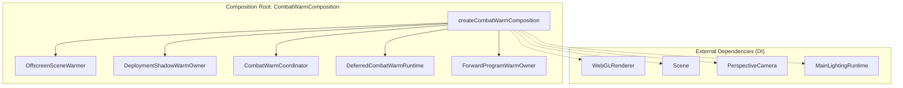
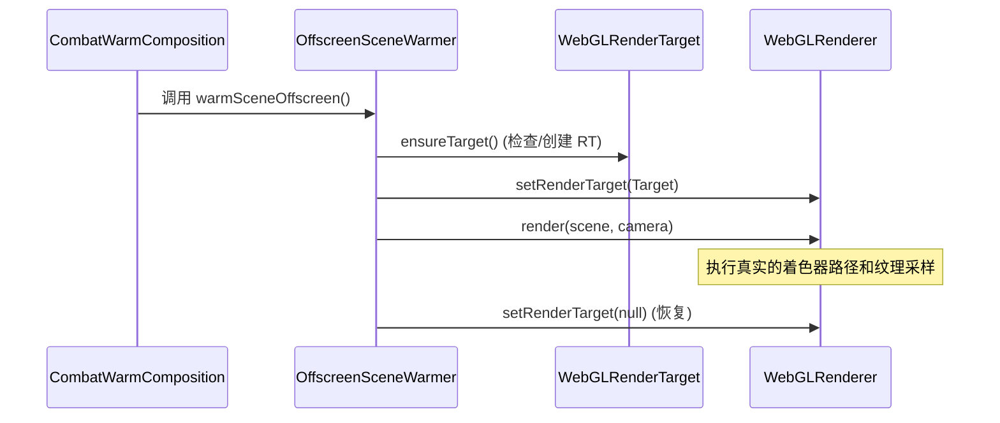
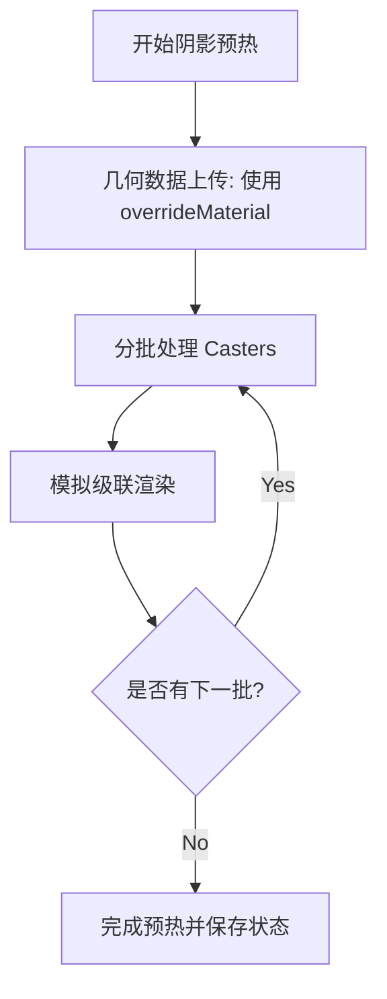
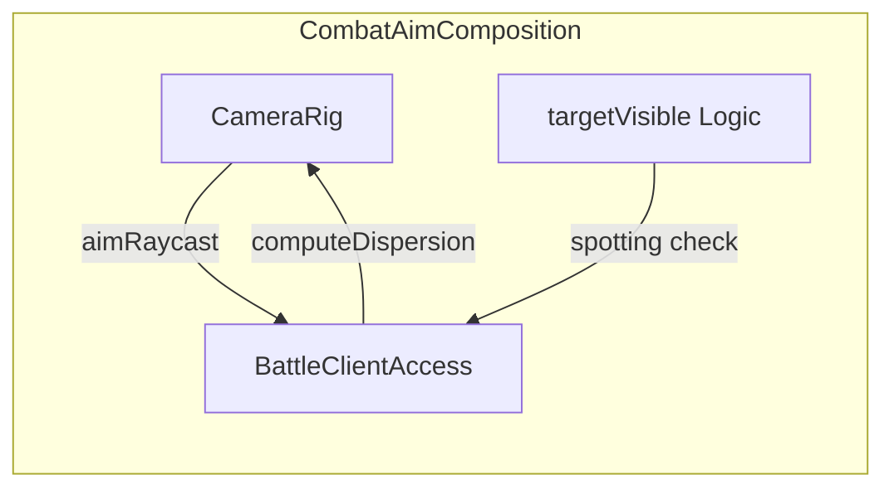
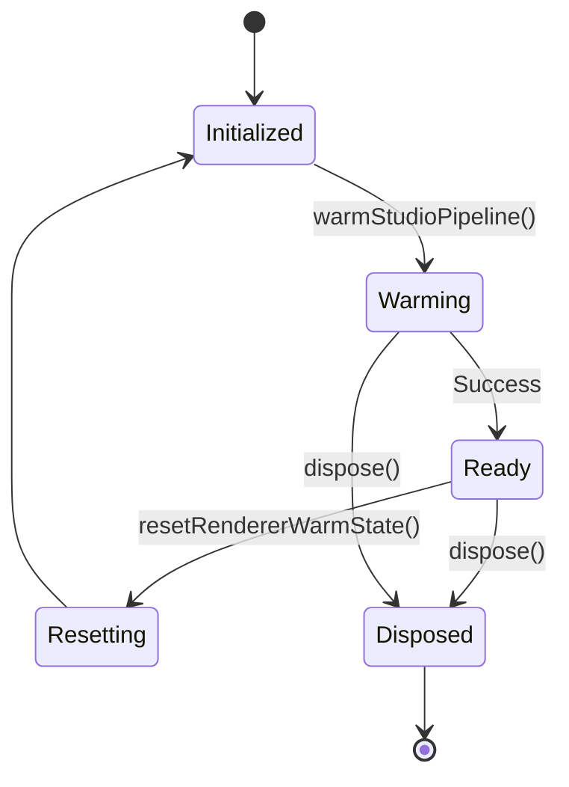
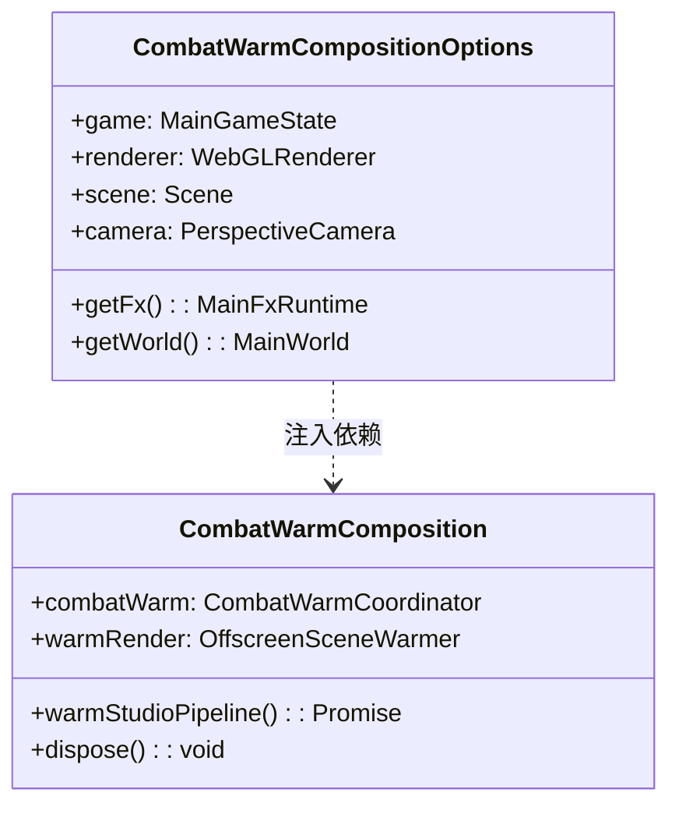

# 组合式逻辑与生命周期管理

## 目录
1. [模块概览](#模块概览)
2. [引言：组合模式与组合根](#引言组合模式与组合根)
3. [战斗预热组合 (Combat Warm Composition)](#战斗预热组合-combat-warm-composition)
   - [预热的核心含义与必要性](#预热的核心含义与必要性)
   - [组合根的实现：createCombatWarmComposition](#组合根的实现createcombatwarmcomposition)
4. [预热子系统深度分析](#预热子系统深度分析)
   - [离屏场景预热 (Offscreen Scene Warmer)](#离屏场景预热-offscreen-scene-warmer)
   - [部署阴影预热 (Deployment Shadow Warm)](#部署阴影预热-deployment-shadow-warm)
   - [着色器程序预热 (Forward Program Warm)](#着色器程序预热-forward-program-warm)
5. [战斗瞄准组合 (Combat Aim Composition)](#战斗瞄准组合-combat-aim-composition)
6. [生命周期管理与资源清理](#生命周期管理与资源清理)
   - [重置与失效机制](#重置与失效机制)
   - [GPU 资源释放路径](#gpu-资源释放路径)
7. [设计模式与依赖注入](#设计模式与依赖注入)
   - [Composition over Inheritance](#composition-over-inheritance)
   - [依赖注入与 Options 模式](#依赖注入与-options-模式)
8. [核心组件与文件参考](#核心组件与文件参考)

## 模块概览

在 `Claude of Tanks` 项目中，`src/app` 目录承担了将底层引擎功能与高层业务逻辑缝合在一起的关键角色。本章节主要关注该目录下的组合式逻辑实现，特别是战斗预热和瞄准逻辑。

- **文件统计**：`src/app` 目录下共有 7 个核心 TypeScript 源文件，以及配套的 5 个自测试文件。
- **涵盖范围**：
  - `combatWarmComposition.ts`: 战斗预热组合的核心实现，协调渲染器、场景和着色器预热。
  - `combatAimComposition.ts`: 瞄准逻辑组合，连接相机系统与战斗逻辑。
  - `mainContracts.ts`: 定义了模块间交互的各种接口和契约。
  - `lazyRuntimeOwner.ts` & `checkedIntegrationPort.ts`: 辅助生命周期管理和集成检查的工具。

本章节将深入探讨这些文件如何通过组合模式（Composition Pattern）构建复杂的业务单元，并统一管理其生命周期。

## 引言：组合模式与组合根

在构建大型 3D 游戏（如 `Claude of Tanks`）时，系统往往面临极高的复杂性。传统的继承模式（Inheritance）容易导致深层的类层级，使得代码难以维护和测试。`Claude of Tanks` 采用了**组合模式（Composition Pattern）**，通过将独立的功能单元（如渲染器预热器、阴影管理器、相机控制器）组合成一个高层级的 API，来实现复杂功能的解耦。

**组合根（Composition Root）** 是这一模式的核心概念。它是一个集中的位置，负责实例化所有组件并将它们“缝合”在一起。在我们的代码中，`createCombatWarmComposition` 就是这样一个组合根。它不仅负责创建子系统，还定义了这些子系统如何共享状态、如何响应生命周期事件（如重置或销毁）。这种设计使得高层业务逻辑（如 `BattleWarmAccess`）不需要知道底层 `WebGLRenderer` 或 `ShadowMap` 的实现细节，只需与组合后的接口交互即可。

下图展示了组合模式在战斗预热系统中的基本结构：



通过这种结构，`CombatWarmComposition` 隐藏了内部子系统的复杂性，为外部提供了简洁的 `warmStudioPipeline` 和 `scheduleDeferred` 接口。这种封装不仅提高了代码的可读性，还极大地简化了单元测试和功能扩展。

**Diagram sources**: 
- [src/app/combatWarmComposition.ts:L90-L220](src/app/combatWarmComposition.ts#L90-L220)

## 战斗预热组合 (Combat Warm Composition)

战斗预热是确保玩家进入战斗场景时体验流畅的关键环节。在现代 3D 引擎中，简单的资源加载是不够的；GPU 往往需要在第一次渲染某个物体时进行着色器编译、纹理上传和阴影图生成。如果这些工作发生在玩家操作期间，就会导致明显的“掉帧”或卡顿。

### 预热的核心含义与必要性

在 `Claude of Tanks` 中，“预热”（Warming）包含以下三个层面的具体操作：
1.  **纹理上传 (Texture Upload)**：将主存中的纹理数据传输到 GPU 显存。这通常发生在第一次绑定纹理进行采样时。
2.  **着色器编译 (Shader Compilation)**：根据当前的材质、灯光配置和渲染目标状态，生成并链接 WebGL 程序。Three.js 采用惰性编译策略，只有在渲染时才会根据当前环境生成对应的 Shader 代码。
3.  **阴影图生成 (Shadow Map Generation)**：为级联阴影贴图（CSM）预先生成深度信息，避免在战斗开始时产生巨大的 GPU 压力。

### 组合根的实现：createCombatWarmComposition

`createCombatWarmComposition` 函数通过 `CombatWarmCompositionOptions` 接收所有必要的依赖项（依赖注入），并构建出一个完整的预热环境。它协调了多个子系统的启动顺序和生命周期。

```typescript
// src/app/combatWarmComposition.ts L90-117
export function createCombatWarmComposition({
  game,
  renderer,
  scene,
  camera,
  // ... 其他依赖项
}: CombatWarmCompositionOptions): CombatWarmComposition {
  const warmRender = createOffscreenSceneWarmer(renderer, scene, camera, 0.125);
  const deploymentShadowWarm = createDeploymentShadowWarmOwner({
    renderer,
    scene,
    camera,
    lighting,
    warmRender,
    // ...
  });
  
  // ... 构建协调器和延迟运行时
  
  return {
    combatWarm,
    warmRender,
    deploymentShadowWarm,
    // ... 导出统一接口
  };
}
```

这个组合根不仅负责“创建”，还负责“管理”。例如，当调用 `dispose()` 时，它会确保所有持有 GPU 资源的子系统（如 `warmRender` 的 RenderTarget）都被正确释放。

**Section sources**:
- [src/app/combatWarmComposition.ts](src/app/combatWarmComposition.ts)

## 预热子系统深度分析

为了实现高效且彻底的预热，系统被拆分为几个专门的子系统。每个子系统负责处理 GPU 渲染管线中的特定瓶颈。

### 离屏场景预热 (Offscreen Scene Warmer)

`OffscreenSceneWarmer` 的核心思想是进行“真实的渲染”但不显示在屏幕上。虽然 Three.js 提供了 `renderer.compile()`，但它并不能覆盖所有的绘制时路径（Draw-time paths）。通过在一个较小的离屏 RenderTarget（通常是 1/8 或 1/4 分辨率）上执行真实的 `renderer.render()`，我们可以强制 GPU 执行完整的渲染流程。



这种方法的巧妙之处在于使用小尺寸的 RenderTarget 来降低像素填充率（Fill rate）的开销，同时仍然能触发着色器编译和纹理上传。

**Diagram sources**:
- [src/engine/offscreenWarm.ts:L58-L133](src/engine/offscreenWarm.ts#L58-L133)

### 部署阴影预热 (Deployment Shadow Warm)

阴影预热比普通场景预热更复杂，因为它涉及到级联阴影贴图（CSM）。`DeploymentShadowWarmOwner` 采用了分批处理（Batching）的策略，避免一次性向 GPU 提交过多的投影物体（Casters）导致驱动程序挂起。

它使用了一个特殊的 `uploadMaterial`（不写入颜色和深度），专门用于触发几何数据的上传。此外，它还会模拟不同的级联状态，确保所有阴影着色器变体都被编译。



**Diagram sources**:
- [src/engine/deploymentShadowWarm.ts:L253-L340](src/engine/deploymentShadowWarm.ts#L253-L340)

### 着色器程序预热 (Forward Program Warm)

`ForwardProgramWarmOwner` 解决了 Three.js 的一个隐蔽性能陷阱：**延迟 Uniform 初始化**。即使着色器已经编译完成，Three.js 往往也会等到第一次渲染时才去初始化 Uniform 表。在 ANGLE（Windows 上的 WebGL 实现）上，这可能导致严重的队列阻塞。

该子系统通过显式调用 `WebGLProgram.getUniforms()` 来提前触发这一过程，并利用 `KHR_parallel_shader_compile` 扩展在后台检查编译状态，从而在不阻塞主线程的情况下完成预热。

**Section sources**:
- [src/engine/offscreenWarm.ts](src/engine/offscreenWarm.ts)
- [src/engine/deploymentShadowWarm.ts](src/engine/deploymentShadowWarm.ts)
- [src/engine/programWarm.ts](src/engine/programWarm.ts)

## 战斗瞄准组合 (Combat Aim Composition)

瞄准逻辑是战斗系统的核心，它涉及到相机（Camera）、射线检测（Raycast）和瞄准控制器（AimController）之间的复杂交互。`combatAimComposition.ts` 通过组合模式将这些独立的模块缝合在一起，形成一个统一的瞄准上下文。



在 `createCombatAimComposition` 中，我们可以看到一种“循环依赖”的优雅处理方式：`CameraRig` 需要 `BattleClientAccess` 的瞄准射线，而 `BattleClientAccess` 又需要 `CameraRig` 的实例。通过在闭包中延迟获取引用，组合模式成功地解决了这一问题。

```typescript
// src/app/combatAimComposition.ts L40-76
export function createCombatAimComposition({
  camera,
  heightField,
  getGame,
  worldRaycast,
  getShellCards,
}: CombatAimCompositionOptions): CombatAimComposition {
  let rig!: CameraRig; // 延迟赋值
  
  const battleClient = createBattleClientAccess(() => ({
    getGame,
    getRig: () => rig, // 通过闭包访问 rig
    worldRaycast,
    // ...
  }));

  rig = createCameraRig(camera, {
    heightField,
    raycast: worldRaycast,
    aimRaycast: battleClient.aimController.raycast,
    // ...
  });

  return { battleClient, rig, targetVisible };
}
```

这种组合方式使得瞄准逻辑变得非常模块化。如果未来需要更换相机抖动算法或射线检测逻辑，只需修改组合根中的配置，而无需触动核心的战斗逻辑。

**Diagram sources**:
- [src/app/combatAimComposition.ts:L40-L76](src/app/combatAimComposition.ts#L40-L76)

## 生命周期管理与资源清理

在 WebGL 应用中，生命周期管理至关重要。GPU 资源（如纹理、缓冲区、渲染目标）如果不显式释放，会导致显存泄漏，最终导致浏览器标签页崩溃。

### 重置与失效机制

`CombatWarmComposition` 提供了 `resetRendererWarmState()` 方法，用于在不销毁整个对象的情况下重置状态。这通常发生在玩家从一场战斗退出回到大厅时。它会取消所有挂起的异步预热任务，并通知底层系统失效（Invalidate）旧的缓存。



### GPU 资源释放路径

当调用 `dispose()` 时，组合根会确保所有持有 GPU 资源的子系统都被正确释放。例如，`OffscreenSceneWarmer` 持有的 `WebGLRenderTarget` 会被显式销毁。这种集中的清理逻辑极大地降低了资源泄漏的风险。

**Diagram sources**:
- [src/app/combatWarmComposition.ts:L206-L219](src/app/combatWarmComposition.ts#L206-L219)

## 设计模式与依赖注入

本模块的实现展示了多种现代软件设计模式的结合使用：

### Composition over Inheritance

代码库广泛采用了“组合优于继承”的原则。通过将功能拆分为小的、可重用的函数（如 `createOffscreenSceneWarmer`），我们可以灵活地构建出复杂的业务单元，而不需要处理复杂的类继承关系。

### 依赖注入与 Options 模式

特别是 `CombatWarmCompositionOptions` 的设计，它不仅包含了静态数据，还包含了许多“获取器”（Getters，如 `getWorld`, `getFx`）。这种设计允许组合对象在运行时动态地获取最新的系统状态，而不需要持有长期的引用，从而避免了潜在的循环引用和内存泄漏。



**Diagram sources**:
- [src/app/combatWarmComposition.ts:L39-L81](src/app/combatWarmComposition.ts#L39-L81)

## 核心组件与文件参考

本章节涉及的核心文件及其职责如下表所示：

| 文件路径 | 主要职责 | 关键类型/函数 |
| :--- | :--- | :--- |
| `src/app/combatWarmComposition.ts` | 战斗预热组合根，协调全局预热流程 | `createCombatWarmComposition` |
| `src/app/combatAimComposition.ts` | 瞄准逻辑组合根，连接相机与战斗系统 | `createCombatAimComposition` |
| `src/engine/offscreenWarm.ts` | 提供离屏渲染预热能力，确保真实绘制路径 | `createOffscreenSceneWarmer` |
| `src/engine/deploymentShadowWarm.ts` | 管理 CSM 阴影预热，处理几何上传和分批 | `createDeploymentShadowWarmOwner` |
| `src/engine/programWarm.ts` | 处理着色器编译和 Uniform 表提前初始化 | `createForwardProgramWarmOwner` |
| `src/game/combatWarmCoordinator.ts` | 协调预热步骤的状态（如 Opening/Rare 状态） | `CombatWarmCoordinator` |

**File references**:
- [src/app/combatWarmComposition.ts](src/app/combatWarmComposition.ts)
- [src/app/combatAimComposition.ts](src/app/combatAimComposition.ts)
- [src/app/mainContracts.ts](src/app/mainContracts.ts)
- [src/engine/offscreenWarm.ts](src/engine/offscreenWarm.ts)
- [src/engine/deploymentShadowWarm.ts](src/engine/deploymentShadowWarm.ts)
- [src/engine/programWarm.ts](src/engine/programWarm.ts)
- [src/game/combatWarmCoordinator.ts](src/game/combatWarmCoordinator.ts)
- [src/game/deferredCombatWarmRuntime.ts](src/game/deferredCombatWarmRuntime.ts)
