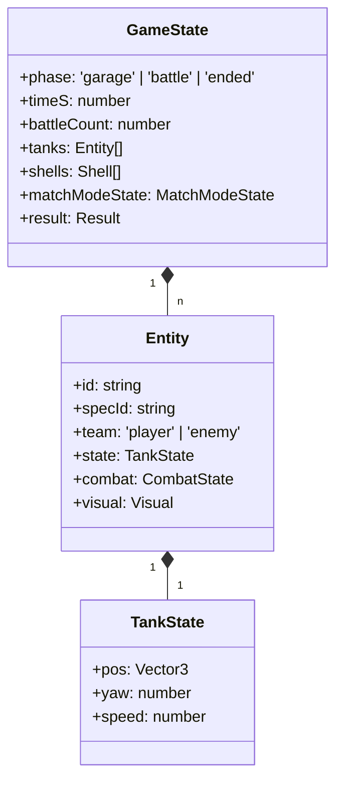
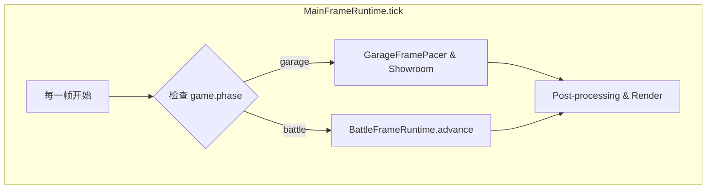
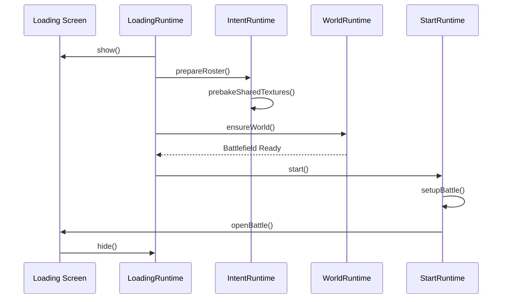
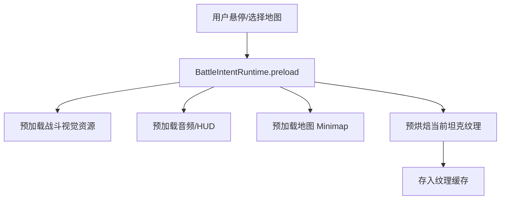

# 状态驱动与运行时生命周期

## 目录
1. [模块概览](#模块概览)
2. [引言](#引言)
3. [全局状态树设计 (Global State Tree)](#全局状态树设计-global-state-tree)
   - [核心状态结构](#核心状态结构)
   - [状态一致性与确定性](#状态一致性与确定性)
4. [运行时所有权与切换 (Runtime Ownership)](#运行时所有权与切换-runtime-ownership)
   - [主框架运行时 (MainFrameRuntime)](#主框架运行时-mainframeruntime)
   - [车库与战斗的平滑切换](#车库与战斗的平滑切换)
5. [战斗生命周期管理 (Battle Lifecycle)](#战斗生命周期管理-battle-lifecycle)
   - [从 Loading 到 Battle 的转换](#从-loading-到-battle-的转换)
   - [生命周期钩子与屏障](#生命周期钩子与屏障)
6. [核心组件分析 (Core Components)](#核心组件分析-core-components)
   - [StateCore: 基础状态容器](#statecore-基础状态容器)
   - [SoloBattleLoadingRuntime: 资源编排](#solobattleloadingruntime-资源编排)
7. [状态驱动的 UI 与逻辑集成](#状态驱动的-ui-与逻辑集成)
8. [性能与资源预加载 (Loading Intent)](#性能与资源预加载-loading-intent)
9. [文件参考](#文件参考)

## 模块概览

本模块负责 Claude of Tanks 的核心运行机制，确保游戏状态在不同阶段（如车库、加载、战斗）之间的一致性与平滑流转。通过分析 `src/game` 和 `src/app` 目录下的核心文件，我们识别出以下关键组成部分：

- **核心文件总数**：约 15 个核心生命周期与状态管理文件。
- **子模块分布**：
    - `src/game/state.ts` & `stateCore.ts`: 定义了全局状态树及其核心操作逻辑。
    - `src/app/mainFrameRuntime.ts`: 负责驱动每一帧的渲染与逻辑更新，是运行时的总入口。
    - `src/game/battleEntryLifecycle.ts`: 管理战斗进入的临界区，防止状态冲突。
    - `src/game/soloBattleLoadingRuntime.ts` & `battleIntentRuntime.ts`: 负责复杂的资源预加载与场景切换编排。
- **覆盖深度**：本文将深入探讨状态机设计、运行时所有权转移以及从加载到战斗的完整生命周期钩子。

## 引言

Claude of Tanks 采用**单一状态源 (Single Source of Truth)** 的设计哲学。无论是复杂的 UI 面板、坦克的物理模拟，还是 AI 的决策逻辑，全部由一个集中的状态树驱动。这种设计不仅简化了调试过程（通过回放和状态快照），还为多运行时的平滑切换提供了坚实基础。

系统的核心挑战在于如何在保持高性能（60 FPS）的同时，管理从“静态车库”到“动态战斗”的剧烈状态转换。本章将详细解析这一过程背后的状态驱动机制和运行时生命周期控制。

## 全局状态树设计 (Global State Tree)

### 核心状态结构

游戏的全局状态定义在 `src/game/stateCore.ts` 和 `src/game/state.ts` 中。它被设计为一个可序列化的普通 JavaScript 对象（POJO），便于状态同步和持久化。



在 `src/game/state.ts` 中，`SoloGameState` 对基础状态进行了扩展，加入了物理模拟所需的临时数据，如 `shells`（炮弹列表）和 `nextShellId`。

### 状态一致性与确定性

为了保证模拟的确定性，系统使用了自定义的随机数生成器 `mulberry32`（见 `stateCore.ts:L43`）。所有的战斗逻辑（命中判定、伤害浮动、AI 路径偏移）都依赖于从 `COMBAT_SEED` 派生的随机源。

> 💡 **设计要点**：状态树中不存储任何 Three.js 的原生对象（如 `Mesh` 或 `Scene`），而是通过 `Entity.visual` 接口将逻辑状态同步到表现层。这种解耦确保了模拟逻辑可以在没有图形环境的情况下运行（如单元测试）。

**Section sources**:
- [stateCore.ts](src/game/stateCore.ts)
- [state.ts](src/game/state.ts)

## 运行时所有权与切换 (Runtime Ownership)

### 主框架运行时 (MainFrameRuntime)

`src/app/mainFrameRuntime.ts` 是整个应用的“心脏”。它通过 `requestAnimationFrame` 驱动，根据当前的游戏阶段 (`game.phase`) 将控制权委托给不同的子系统。



`MainFrameRuntime` 并不直接拥有业务逻辑，而是作为一个**组合根 (Composition Root)**，持有各种运行时的引用（如 `battleFrame`, `showroom`, `pedestal`）。它负责处理跨阶段的通用逻辑，如雾效密度更新 (`updateFogDensity`) 和后期处理渲染。

### 车库与战斗的平滑切换

当玩家点击“战斗”按钮时，系统并不会立即销毁车库。相反，它会启动一个受控的转换序列：
1. **覆盖渲染**：`battleEntryLifecycle.coverRendering()` 激活不透明的加载界面。
2. **预加载意图**：`battleIntentRuntime` 开始 speculative 加载。
3. **状态迁移**：`game.phase` 从 `garage` 变为 `battle`。
4. **资源热切换**：在加载界面的掩护下，`mainFrameRuntime` 停止更新车库组件，转而初始化战斗世界。

**Section sources**:
- [mainFrameRuntime.ts](src/app/mainFrameRuntime.ts)
- [battleEntryLifecycle.ts](src/game/battleEntryLifecycle.ts)

## 战斗生命周期管理 (Battle Lifecycle)

### 从 Loading 到 Battle 的转换

战斗的进入是一个复杂的多阶段异步过程，由 `SoloBattleLoadingRuntime` 编排。



在 `src/game/soloBattleLoadingRuntime.ts` 中，`begin` 函数定义了严格的加载顺序：
- **阶段 1：基础 UI 与音频** - 确保加载条和背景音乐立即就绪。
- **阶段 2：世界与坦克 Builder** - 异步加载地图配置和坦克模型数据。
- **阶段 3：纹理预烘焙** - 利用 `WorkYielder` 在不阻塞主线程的情况下生成坦克涂装纹理。
- **阶段 4：同步启动** - 调用 `SoloBattleStartRuntime.start()` 完成最后的瞬时状态切换。

### 生命周期钩子与屏障

`src/game/battleEntryLifecycle.ts` 提供了一个关键的屏障机制。它确保在战场完全准备好并呈现第一帧之前，加载屏幕不会消失。

```typescript
// battleEntryLifecycle.ts:L68
async primeReveal() {
  const firstRequiredSerial = presentedBattleFrameSerial + 1;
  const startedAt = now();
  renderingCovered = false; // 允许渲染，但 UI 依然覆盖
  while (presentedBattleFrameSerial < firstRequiredSerial) {
    if (now() - startedAt > revealTimeoutMs) {
      throw new Error('Battlefield did not present before the loading screen exit.');
    }
    await nextFrame();
  }
  // ... 返回 RevealReceipt，触发 UI 隐藏
}
```

这种“等待一帧”的策略消除了从加载界面切换到游戏画面时可能出现的“黑屏”或“闪烁”。

**Section sources**:
- [soloBattleLoadingRuntime.ts](src/game/soloBattleLoadingRuntime.ts)
- [soloBattleStartRuntime.ts](src/game/soloBattleStartRuntime.ts)
- [battleEntryLifecycle.ts](src/game/battleEntryLifecycle.ts)

## 核心组件分析 (Core Components)

### StateCore: 基础状态容器

`stateCore.ts` 是一个轻量级的模块，它故意不依赖任何图形或物理引擎。这使得它可以在任何环境下被导入。

```typescript
// stateCore.ts:L58
export function createBus(onEmit: EventRecorder | null = null): EventBus {
  const listeners = new Map<string, EventListener[]>();
  return {
    on(event, listener) {
      // ... 注册监听器
    },
    emit(event, payload) {
      // ... 广播事件，支持切片拷贝防止重入问题
    },
  };
}
```

`EventBus` 是系统内部通信的骨干。例如，当炮弹击中坦克时，`state.ts` 会发出 `shell:hit` 事件，UI 层监听此事件以更新伤害数字，音效系统监听此事件播放爆炸声。

### SoloBattleLoadingRuntime: 资源编排

`SoloBattleLoadingRuntime` 是整个系统中最复杂的编排器。它不仅要管理异步任务，还要通过 `progress` 回调向 UI 提供精确的反馈。

```typescript
// soloBattleLoadingRuntime.ts:L358
async begin(specId, mapId = null, { randomRoster = true, gameMode = 'standard' } = {}) {
  post.setAdaptiveSuspended(true); // 挂起自适应性能调整，全力加载
  // ... 加载地图
  await ensureWorld(resolved, (fraction, label) => battleLoad.progress(0.02 + fraction * 0.53, label));
  // ... 加载坦克
  await battleVisuals.stream(openingVisual, loadYield, (fraction) => {
    battleLoad.progress(0.58 + fraction * 0.30, 'Painting vehicles');
  });
  // ...
}
```

它使用了 `WorkYielder`（工作让步器）来平衡加载速度与帧率稳定性，确保即使在加载重型资源时，浏览器也不会报“脚本超时”。

**Section sources**:
- [stateCore.ts](src/game/stateCore.ts)
- [soloBattleLoadingRuntime.ts](src/game/soloBattleLoadingRuntime.ts)

## 状态驱动的 UI 与逻辑集成

Claude of Tanks 的 UI 系统（如 `src/ui/hud.ts`）并不直接修改游戏逻辑。相反，它通过发送“意图 (Intent)”来改变状态，然后观察状态的变化。

例如，玩家按下“修理”键：
1. **输入捕获**：`input.ts` 捕获按键并设置 `entity.input.actionBits`。
2. **逻辑处理**：在 `simStep` 中，`applyBotSupportActions`（见 `state.ts:L2064`）读取该位，调用 `repairAllModules` 修改 `combat.modules` 的状态。
3. **事件广播**：逻辑层发出 `module:state` 事件。
4. **UI 更新**：HUD 监听到事件，更新受损模块图标的颜色。

这种单向数据流确保了逻辑的纯粹性，使得多人游戏同步和回放功能的实现变得异常简单。

## 性能与资源预加载 (Loading Intent)

为了提升用户体验，系统引入了 `battleIntentRuntime`。它的核心思想是**预测玩家行为**。

当玩家在车库中将鼠标悬停在“战斗”按钮上，或者在地图选择器中切换地图时，`battleIntentRuntime.preload()` 会被调用。



如果玩家随后点击开始战斗，`SoloBattleLoadingRuntime` 会发现许多资源已经处于“温热 (Warm)”状态，从而极大地缩短了加载进度条的停留时间。`consumeMap` 函数（见 `battleIntentRuntime.ts:L225`）负责将这些 speculative 的加载结果转正。

## 文件参考

以下是本章涉及的核心源代码文件：

- [src/game/state.ts](src/game/state.ts) — 核心战斗模拟与状态定义
- [src/game/stateCore.ts](src/game/stateCore.ts) — 基础状态容器与事件总线
- [src/app/mainFrameRuntime.ts](src/app/mainFrameRuntime.ts) — 主渲染循环与运行时所有权管理
- [src/game/battleEntryLifecycle.ts](src/game/battleEntryLifecycle.ts) — 战斗进入生命周期屏障
- [src/game/soloBattleEntryRuntime.ts](src/game/soloBattleEntryRuntime.ts) — 战斗进入事务编排
- [src/game/soloBattleLoadingRuntime.ts](src/game/soloBattleLoadingRuntime.ts) — 异步加载与资源流式处理
- [src/game/soloBattleStartRuntime.ts](src/game/soloBattleStartRuntime.ts) — 战斗同步启动逻辑
- [src/game/battleIntentRuntime.ts](src/game/battleIntentRuntime.ts) — 资源预加载意图管理
- [src/game/rosterState.ts](src/game/rosterState.ts) — 坦克名册与视觉规划
- [src/app/mainContracts.ts](src/app/mainContracts.ts) — 主框架接口契约
