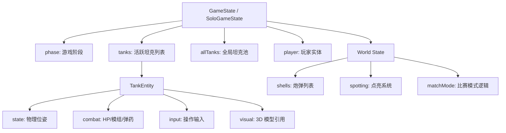
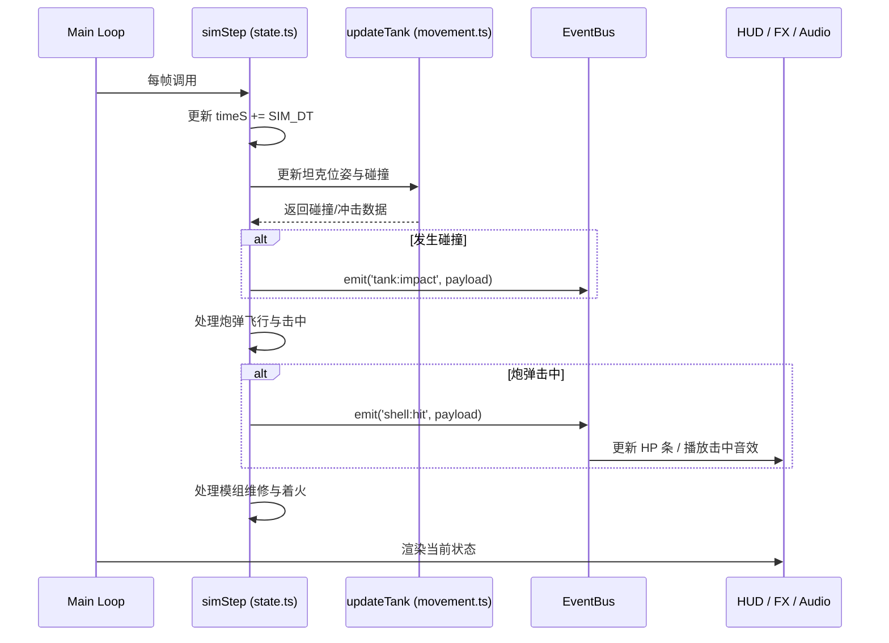
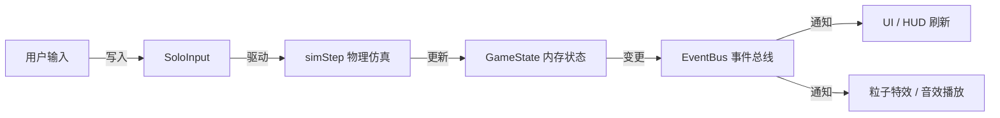
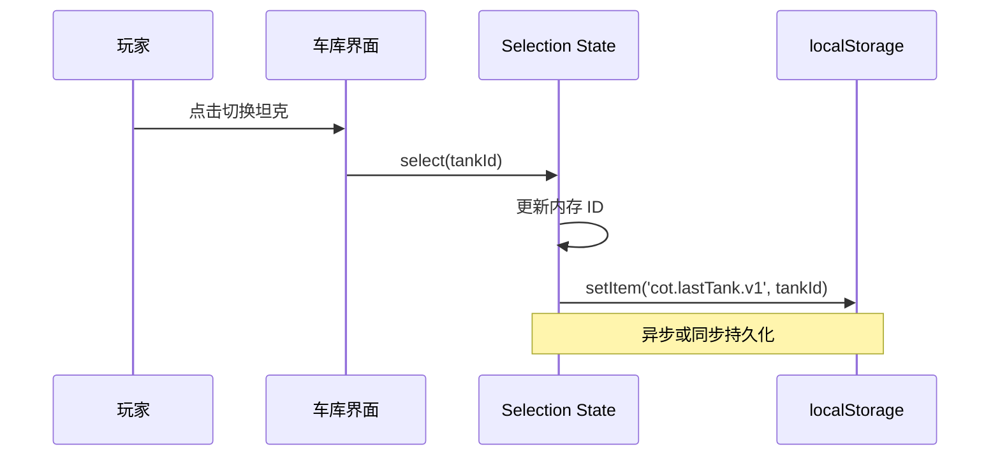
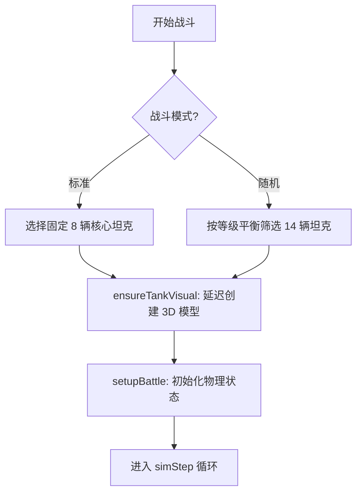

# 全局状态树与数据流

## 目录
1. [模块概览](#模块概览)
2. [全局状态树结构](#全局状态树结构)
   - [基础状态 (GameState)](#基础状态-gamestate)
   - [战斗扩展状态 (SoloGameState)](#战斗扩展状态-sologamestate)
3. [状态变更与事件驱动机制](#状态变更与事件驱动机制)
   - [同步事件总线 (EventBus)](#同步事件总线-eventbus)
   - [固定步长仿真循环 (simStep)](#固定步长仿真循环-simstep)
4. [核心组件解析](#核心组件解析)
   - [状态核心逻辑 (stateCore.ts)](#状态核心逻辑-statecorets)
   - [战斗状态管理 (state.ts)](#战斗状态管理-statets)
5. [数据流与响应式系统](#数据流与响应式系统)
   - [输入到模拟的数据流](#输入到模拟的数据流)
   - [模拟到 UI 的反馈流](#模拟到-ui-的反馈流)
6. [持久化与用户配置同步](#持久化与用户配置同步)
   - [用户档案持久化 (profile.ts)](#用户档案持久化-profilets)
   - [坦克选择记忆 (selectedVehicleSelection.ts)](#坦克选择记忆-selectedvehicleselectionts)
7. [坦克资产与名单管理](#坦克资产与名单管理)
   - [全局名单初始化](#全局名单初始化)
   - [战斗参与者筛选](#战斗参与者筛选)
8. [文件引用](#文件引用)

## 模块概览

Claude of Tanks 的状态管理系统位于 `src/game/` 目录下，是整个游戏逻辑的“大脑”。它采用了集中式的状态管理模式，通过一个单一的事实来源（Single Source of Truth）来驱动游戏的物理仿真、AI 决策、UI 渲染以及音效视觉反馈。

该模块包含约 80 个 TypeScript 文件，其中核心状态管理相关文件约 8 个。这些文件共同构成了一个分层的状态管理体系：
- **核心层**：`stateCore.ts` 提供基础的接口定义和事件总线机制。
- **业务层**：`state.ts` 和 `rosterState.ts` 实现了具体的战斗逻辑和坦克资产管理。
- **持久化层**：`profile.ts` 和 `selectedVehicleSelection.ts` 负责与 `localStorage` 的交互。

在本章节中，我们将深入探讨这些组件如何协同工作，确保游戏在复杂的物理模拟下依然保持高性能和逻辑一致性。

**模块统计**:
- 核心状态文件：8 个
- 仿真相关文件：15 个
- 资产管理文件：5 个
- 总覆盖范围：`src/game/` 目录下的核心逻辑

## 全局状态树结构

游戏的全局状态被组织成一个深层嵌套的对象树。为了保持代码的解耦，状态定义被分为基础层和扩展层。

### 基础状态 (GameState)

`GameState` 定义在 `stateCore.ts` 中，它是所有游戏阶段（车库、战斗、结算）共有的基础结构。它不依赖于任何 Three.js 或物理引擎组件，这使得它可以在不加载重型资源的情况下被实例化。

```typescript
export interface GameState<Entity = unknown, Spotting = unknown, MatchModeState = unknown> {
  phase: 'garage' | 'battle' | 'ended' | 'shot'; // 游戏当前阶段
  preBattleS: number;                            // 战斗开始前的倒计时
  mapId: string;                                 // 当前地图 ID
  tanks: Entity[];                               // 当前活跃的坦克列表
  allTanks: Entity[];                            // 全局坦克池
  battleCount: number;                           // 累计战斗场次
  tankById: Map<string, Entity>;                 // ID 到坦克的快速映射
  player: Entity | null;                         // 玩家控制的坦克实体
  shells: unknown[];                             // 场景中的炮弹
  timeS: number;                                 // 游戏运行时间（秒）
  result: 'victory' | 'defeat' | 'draw' | null;  // 战斗结果
  // ... 其他基础字段
}
```

### 战斗扩展状态 (SoloGameState)

当进入战斗阶段时，`state.ts` 通过 `SoloGameState` 接口对基础状态进行了扩展，加入了物理仿真所需的复杂对象，如炮弹池、点亮系统（Spotting）、匹配控制器等。

下图展示了全局状态树的层级结构：



这种结构清晰地划分了“数据”与“表现”。`TankState` 存储纯粹的物理数据（位置、速度、偏航角），而 `Visual` 则负责将这些数据同步到 3D 场景中。

**Section sources**:
- [stateCore.ts](src/game/stateCore.ts)
- [state.ts](src/game/state.ts)

## 状态变更与事件驱动机制

Claude of Tanks 并没有使用像 Redux 这样严格的不可变状态框架，而是采用了一种基于“可变状态 + 事件通知”的混合模式。这种模式在高性能的 60FPS 游戏循环中更为高效。

### 同步事件总线 (EventBus)

`EventBus` 是系统内部通信的枢纽。当状态发生关键变更（如坦克被摧毁、炮弹发射、模组损坏）时，逻辑层会通过总线发布事件，UI 和音效层订阅这些事件并作出响应。

```typescript
// src/game/stateCore.ts 中的 EventBus 实现
export function createBus(onEmit: EventRecorder | null = null): EventBus {
  const listeners = new Map<string, EventListener[]>();
  return {
    on(event, listener) {
      let group = listeners.get(event);
      if (!group) {
        group = [];
        listeners.set(event, group);
      }
      group.push(listener);
      return () => this.off(event, listener);
    },
    emit(event, payload) {
      const group = listeners.get(event);
      if (group) {
        for (const listener of group.slice()) listener(payload);
      }
    },
    // ... off 实现
  };
}
```

### 固定步长仿真循环 (simStep)

游戏的物理状态更新被封装在 `simStep` 函数中。为了保证物理模拟的确定性，它使用固定的时间步长 `SIM_DT`（通常为 1/60 秒）。

下面的序列图展示了一个典型的状态更新循环：



这种设计确保了逻辑更新与帧率解耦。即使在低帧率下，物理模拟依然能够保持稳定，因为 `simStep` 会根据实际流逝的时间多次执行。

**Section sources**:
- [stateCore.ts](src/game/stateCore.ts)
- [state.ts](src/game/state.ts)

## 核心组件解析

### 状态核心逻辑 (stateCore.ts)

`stateCore.ts` 是最底层的定义文件。它除了提供 `GameState` 接口外，还实现了一个关键的工具函数 `mulberry32`。这是一个确定性的伪随机数生成器（PRNG），对于保证战斗回放的确定性至关重要。

### 战斗状态管理 (state.ts)

`state.ts` 是最庞大的状态管理文件，它负责：
1. **战斗初始化 (`setupBattle`)**：将选定的坦克放置在出生点，重置所有实体的战斗状态。
2. **实体池管理**：通过 `SoloPooledEntity` 管理所有可能的坦克，只有被选中的才会激活 `state` 和 `combat` 对象。
3. **碰撞协调 (`CollisionBundle`)**：在模拟步长中收集所有的碰撞请求，并在步长结束前统一解析伤害。

> 💡 **设计决策**：炮弹对象使用了对象池 (`_shellPool`)。在高频率射击的战斗中，这极大地减少了垃圾回收（GC）引起的掉帧。

**Section sources**:
- [stateCore.ts](src/game/stateCore.ts)
- [state.ts](src/game/state.ts)

## 数据流与响应式系统

Claude of Tanks 的数据流遵循“单向循环”原则，从输入开始，经过仿真，最后到达表现层。

### 输入到模拟的数据流

玩家的按键操作（前进、后退、开火）首先被写入 `SoloInput` 对象。在 `simStep` 的坦克更新阶段，物理引擎会读取这些输入并计算新的加速度和速度。

### 模拟到 UI 的反馈流

UI 层（如 `hud.ts`）并不直接轮询 `GameState` 的每一个细微变化，而是通过 `EventBus` 监听特定事件。例如：
- `shell:fired`：更新剩余弹药显示。
- `module:state`：更新受损模组图标的状态（绿色 -> 黄色 -> 红色）。
- `tank:destroyed`：触发击杀提示通知。

这种基于事件的响应式设计降低了 UI 层的计算开销，使得复杂的 HUD 界面能够流畅运行。



**Section sources**:
- [state.ts](src/game/state.ts)
- [ui/hud.ts](src/ui/hud.ts)

## 持久化与用户配置同步

持久化层负责将内存中的状态保存到浏览器的 `localStorage` 中，确保玩家刷新页面后进度不会丢失。

### 用户档案持久化 (profile.ts)

`profile.ts` 监控战斗结果并更新玩家的全局统计数据（胜率、击杀数、最高伤害）。它巧妙地通过 `installBattleRecords` 函数挂载到 `EventBus` 上，实现了存储逻辑与游戏逻辑的解耦。

```typescript
// src/game/profile.ts 中的解耦设计
export function installBattleRecords(bus: ProfileEventBus | null | undefined): void {
  if (!bus) return;
  
  bus.on('battle:ended', (payload) => {
    // 当监听到战斗结束事件时，自动保存结果到 localStorage
    recordBattleResult({
      result: payload.result,
      kills: tally.kills,
      damage: tally.damage,
      // ...
    });
  });
}
```

### 坦克选择记忆 (selectedVehicleSelection.ts)

该组件负责记住玩家在车库中最后选中的坦克。它提供了一个简洁的 `SelectedVehicleSelection` 接口，封装了对 `cot.lastTank.v1` 键值的读写操作。



**Section sources**:
- [profile.ts](src/game/profile.ts)
- [selectedVehicleSelection.ts](src/game/selectedVehicleSelection.ts)

## 坦克资产与名单管理

坦克名单（Roster）管理是游戏启动和战斗加载的关键环节。

### 全局名单初始化

在游戏启动时，`rosterState.ts` 中的 `spawnTanks` 会根据 `PRODUCTION_TANK_IDS` 创建所有实体的基础记录。为了优化性能，此时**不会**创建 3D 模型（Visual），而是采用延迟加载策略。

### 战斗参与者筛选

当玩家点击“开始战斗”时，`pickBattleParticipants` 会根据当前模式（标准或随机）从全局池中筛选出参与者。
- **标准模式**：固定的 8 辆坦克，用于展示和测试。
- **随机模式**：根据坦克等级（Tier）进行平衡匹配，挑选 14 辆坦克（7v7）。



这种按需加载（Lazy Loading）策略极大地减少了显存占用，使得游戏能够在移动端等资源受限的设备上运行。

**Section sources**:
- [rosterState.ts](src/game/rosterState.ts)
- [matchmaking.ts](src/game/matchmaking.ts)

## 文件引用

以下是本章节涉及的核心源文件：

- [src/game/state.ts](src/game/state.ts)：战斗仿真与状态更新核心。
- [src/game/stateCore.ts](src/game/stateCore.ts)：基础状态定义与事件总线。
- [src/game/profile.ts](src/game/profile.ts)：玩家数据持久化逻辑。
- [src/game/rosterState.ts](src/game/rosterState.ts)：坦克实体池与名单管理。
- [src/game/selectedVehicleSelection.ts](src/game/selectedVehicleSelection.ts)：坦克选择记忆。
- [src/sim/movement.ts](src/sim/movement.ts)：坦克物理位姿更新逻辑。
- [src/sim/damage.ts](src/sim/damage.ts)：战斗伤害与 HP 状态机。
- [src/ui/hud.ts](src/ui/hud.ts)：UI 对状态事件的响应实现。
