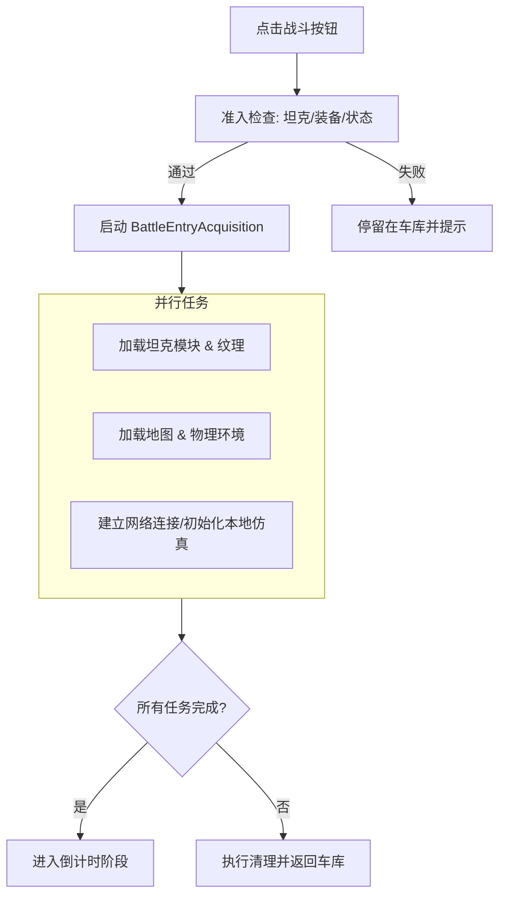
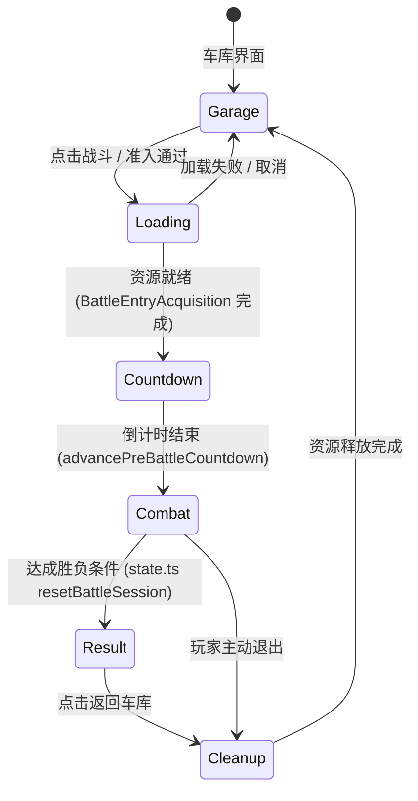
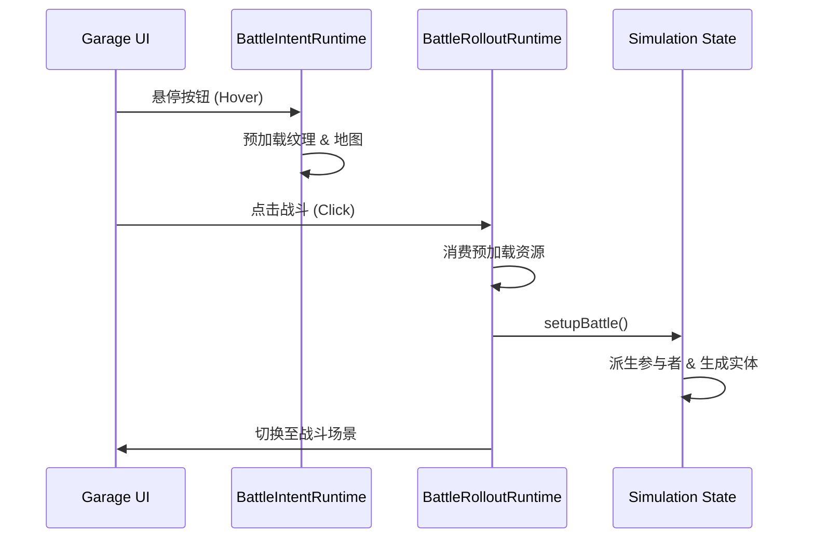
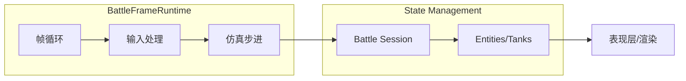
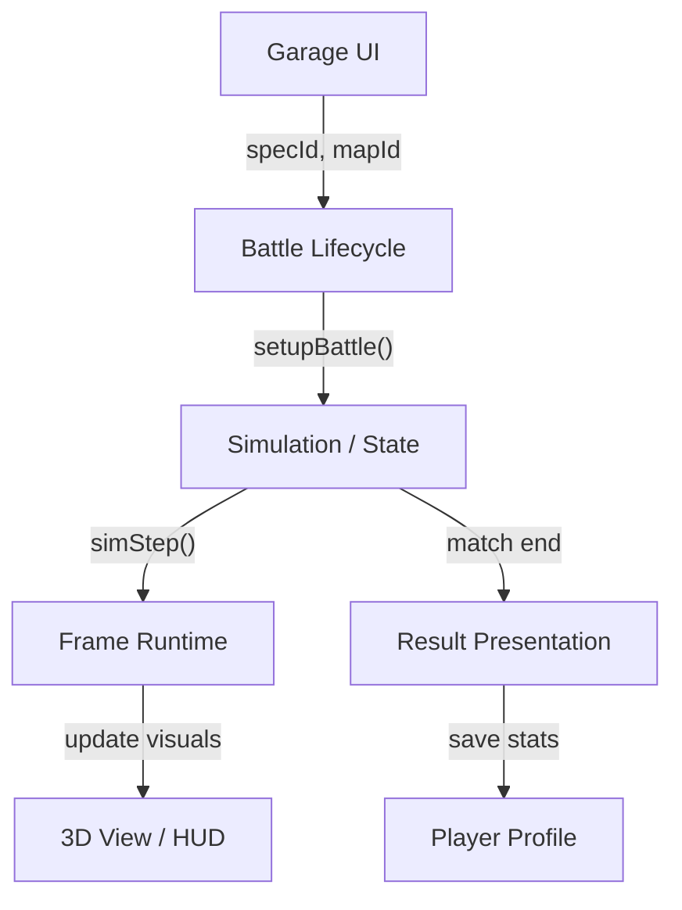

# 战斗生命周期与准入控制

## 目录
1. [模块概览](#模块概览)
2. [引言](#引言)
3. [战斗准入与初始化](#战斗准入与初始化)
4. [阶段策略与流转](#阶段策略与流转)
5. [部署与预热](#部署与预热)
6. [战斗运行环境](#战斗运行环境)
7. [结果结算与展示](#结果结算与展示)
8. [生命周期访问器](#生命周期访问器)
9. [集成点与数据流](#集成点与数据流)
10. [文件参考](#文件参考)

## 模块概览

在对 `src/game/` 目录的探索中，我们发现了约 17 个直接与战斗生命周期相关的核心文件。这些文件构成了 Claude-of-Tanks 战斗系统的骨架，负责从玩家点击“战斗”按钮那一刻起，直到战斗结束返回车库的完整流程。

**核心统计与覆盖范围**：
- **总文件数**：17 个关键战斗生命周期文件。
- **子模块划分**：
    - **准入与加载 (Admission & Loading)**：负责战斗前的检查、资源并行加载及依赖管理。
    - **运行环境 (Runtime)**：包括帧同步运行环境、部署环境及结果展示环境。
    - **策略控制 (Policy Control)**：定义战斗阶段、权限控制及状态流转逻辑。
    - **访问器 (Accessors)**：提供延迟加载和生命周期钩子的抽象层。

本章节将深入探讨这些子模块如何协同工作，确保战斗过程的平滑切换和资源的高效利用。

## 引言

战斗生命周期管理是 Claude-of-Tanks 的核心调度系统。它的目标是提供一个高度可靠、可预测且性能优化的战斗流程。从技术角度看，它解决了以下关键问题：
- **资源屏障**：确保在战斗开始前，所有必要的坦克模型、地图纹理和物理引擎资源已准备就绪。
- **状态一致性**：通过统一的阶段策略（Phase Policy），确保 UI 层、网络层和仿真层对当前战斗状态有一致的认知。
- **性能优化**：利用“意图预热（Intent Pre-warming）”技术，在玩家犹豫或悬停按钮时提前加载资源，减少实际加载时间。
- **异常恢复**：在加载或连接失败时，提供清晰的清理路径，防止内存泄漏或状态卡死。

## 战斗准入与初始化

战斗准入是生命周期的第一步。在玩家点击“BATTLE”按钮后，系统会启动一系列准入检查和资源获取任务。

### 准入检查逻辑
准入检查主要在 UI 层（`src/ui/garage.ts`）和准入生命周期（`src/game/battleEntryLifecycle.ts`）中协同完成。

- **坦克状态检查**：检查当前选定的坦克是否已被锁定（例如在多人房间中已准备就绪）。
- **资源完整性**：验证坦克配置（装备、涂装）是否合法。
- **环境准备**：确认目标地图和游戏模式是否可用。

### 资源并行获取
`BattleEntryAcquisition` 负责管理战斗进入过程中的依赖图。它通过并行执行任务来最大化加载效率。

在 `src/game/battleEntryAcquisition.ts` 中，系统区分了单机（Solo）和网络（Network）采集路径。网络路径会根据 `connectAfterWorld` 标志决定是立即连接还是等待地图加载完成后再连接，以优化 authority 边界的建立。

**Section sources**:
- [src/game/battleEntryLifecycle.ts](src/game/battleEntryLifecycle.ts)
- [src/game/battleEntryAcquisition.ts](src/game/battleEntryAcquisition.ts)
- [src/ui/garage.ts](src/ui/garage.ts)

## 阶段策略与流转

战斗阶段策略（`BattlePhasePolicy`）是系统的心脏，它定义了浏览器策略和 UI 行为的同步源。

### 核心阶段定义
虽然系统内部使用 `garage` 和 `battle` 作为大阶段，但通过 `BattlePhasePolicy` 的谓词函数，我们可以识别出细分的生命周期阶段：

1.  **加载阶段 (Loading)**：`isBattleLoadVisible()` 为真，此时 UI 展示加载遮罩，后台进行资源采集。
2.  **倒计时阶段 (Countdown)**：资源加载完成，进入 `COUNTDOWN`。此时玩家可以看到战场但无法控制坦克，用于视觉预热和相机衔接。
3.  **战斗阶段 (Combat)**：`hasControllablePlayer()` 为真且无结果，这是核心游戏时间。
4.  **结算阶段 (Result)**：`hasResult()` 为真，停止仿真步进，展示结果面板。
5.  **清理阶段 (Cleanup)**：销毁战斗实例，释放纹理，返回 `garage`。

### 阶段流转状态机

`BattlePhasePolicy` 确保了在不同阶段，系统的行为是受控的。例如，只有在 `hasLivePlayer` 状态下才允许捕获鼠标指针（Pointer Lock）或打开战斗设置菜单。

**Section sources**:
- [src/game/battlePhasePolicy.ts](src/game/battlePhasePolicy.ts)
- [src/game/preBattleCountdown.ts](src/game/preBattleCountdown.ts)

## 部署与预热

为了提供极致的流畅感，Claude-of-Tanks 引入了“意图预热（Intent Pre-warming）”机制。

### 意图预热 (BattleIntentRuntime)
当玩家在车库中将鼠标悬停在“战斗”按钮上时，`BattleIntentRuntime` 会被触发。它会根据当前的意图（选定的坦克和可能的地图）提前开始预加载任务。

- **纹理预烘焙**：提前生成坦克的共享纹理和各向异性过滤数据。
- **地图预取**：如果选定了特定地图，提前启动地图资源的下载。
- **Roster 准备**：预先规划可能的对手阵容，并加载对应的坦克构建器。

### 战斗部署 (BattleRolloutRuntime)
在加载完成后，`BattleRolloutRuntime` 接管流程。它负责将静态资源转换为活跃的战斗实体。

这种机制确保了从点击到进入战场的延迟被压缩到最小，甚至在某些情况下实现“秒进”。

**Section sources**:
- [src/game/battleIntentRuntime.ts](src/game/battleIntentRuntime.ts)
- [src/game/battleRolloutRuntime.ts](src/game/battleRolloutRuntime.ts)

## 战斗运行环境

战斗开始后，`BattleFrameRuntime` 负责驱动每一帧的更新。它是一个高频率的循环，协调着输入、仿真和表现层。

### 核心运行逻辑
`BattleFrameRuntime` 并不是简单的 `requestAnimationFrame` 包装，它处理了复杂的帧同步逻辑：
- **步进控制**：调用 `state.ts` 中的 `simStep` 进行物理和逻辑更新。
- **输入采样**：在每帧开始时捕获玩家操作。
- **时间修正**：处理浏览器标签页隐藏或性能波动导致的时间偏移。

### 运行环境组件关系

`BattleFrameRuntime` 确保了即使在网络抖动或帧率不稳的情况下，战斗逻辑的演进依然符合物理规则。

**Section sources**:
- [src/game/battleFrameRuntime.ts](src/game/battleFrameRuntime.ts)
- [src/game/state.ts](src/game/state.ts)

## 结果结算与展示

战斗结束的触发点通常在仿真层。当满足胜负条件（如全歼敌军或占领基地）时，系统进入结算流程。

### 结果汇总 (BattleResultPresentationRuntime)
`BattleResultPresentationRuntime` 负责收集战斗数据并准备 UI 展示。

- **数据收集**：汇总玩家的输出伤害、击毁数、生存时间等指标。
- **持久化**：将战斗结果写入本地服务记录（Service Record）。
- **UI 触发**：弹出结算面板，展示胜利/失败动画。

### 清理与回收
在玩家点击“返回车库”后，系统会执行严格的清理程序：
- **销毁实体**：移除所有坦克模型和物理对象。
- **释放纹理**：调用 `drainTankThumbs` 等函数释放显存。
- **重置状态**：清除战斗会话数据，为下一次准入做准备。

**Section sources**:
- [src/game/battleResultPresentationRuntime.ts](src/game/battleResultPresentationRuntime.ts)
- [src/game/profile.ts](src/game/profile.ts)

## 生命周期访问器

为了保持代码的解耦和模块化，系统使用了“访问器（Accessors）”模式。这是一种基于 `createLazyRuntimeOwner` 的延迟加载机制。

### 核心访问器
- **SoloBattleLoadingAccess**：管理单机战斗的加载流程。
- **SoloBattleDeploymentAccess**：管理单机战斗的部署流程。
- **GarageReturnAccess**：管理从战斗返回车库的 teardown 流程。

### 延迟加载优势
通过访问器，主程序（`main.ts`）不需要在启动时加载所有的战斗运行时代码。只有当玩家真正触发战斗意图时，相关的 `.ts` 模块才会被动态导入。这极大地减小了初始 Bundle 的体积，加快了首屏加载速度。

**Section sources**:
- [src/game/soloBattleLoadingAccess.ts](src/game/soloBattleLoadingAccess.ts)
- [src/game/soloBattleDeploymentAccess.ts](src/game/soloBattleDeploymentAccess.ts)
- [src/game/garageReturnAccess.ts](src/game/garageReturnAccess.ts)

## 集成点与数据流

战斗生命周期不是孤立存在的，它与系统的其他部分有着深度的集成。

### 数据流向分析
1.  **UI 到 生命周期**：玩家通过 `Garage` 发出战斗请求，携带 `specId` 和 `mapId`。
2.  **生命周期 到 仿真**：`RolloutRuntime` 调用 `setupBattle` 初始化仿真状态。
3.  **仿真 到 表现**：`FrameRuntime` 驱动 `simStep`，结果通过 `Presentation` 接口反映到画面上。
4.  **生命周期 到 存储**：`ResultPresentation` 将战果写入 `localStorage`。

这种清晰的分层确保了 Claude-of-Tanks 能够轻松扩展新的游戏模式或战斗机制，而无需重构核心生命周期逻辑。

## 文件参考

以下是本章节涉及的核心源代码文件列表：

- [src/game/battleEntryLifecycle.ts](src/game/battleEntryLifecycle.ts) — 战斗准入生命周期主控。
- [src/game/battleEntryAcquisition.ts](src/game/battleEntryAcquisition.ts) — 资源采集与依赖管理。
- [src/game/battlePhasePolicy.ts](src/game/battlePhasePolicy.ts) — 阶段策略与权限控制。
- [src/game/battleFrameRuntime.ts](src/game/battleFrameRuntime.ts) — 战斗帧驱动环境。
- [src/game/battleRolloutRuntime.ts](src/game/battleRolloutRuntime.ts) — 战斗部署与资源转换。
- [src/game/battleIntentRuntime.ts](src/game/battleIntentRuntime.ts) — 意图预热与性能优化。
- [src/game/battleResultPresentationRuntime.ts](src/game/battleResultPresentationRuntime.ts) — 结果结算与 UI 展示。
- [src/game/preBattleCountdown.ts](src/game/preBattleCountdown.ts) — 战斗前倒计时逻辑。
- [src/game/soloBattleLoadingAccess.ts](src/game/soloBattleLoadingAccess.ts) — 加载阶段访问器。
- [src/game/soloBattleDeploymentAccess.ts](src/game/soloBattleDeploymentAccess.ts) — 部署阶段访问器。
- [src/game/garageReturnAccess.ts](src/game/garageReturnAccess.ts) — 返回车库访问器。
- [src/game/state.ts](src/game/state.ts) — 战斗仿真状态初始化与步进。
- [src/ui/garage.ts](src/ui/garage.ts) — 车库 UI 与战斗准入触发。
