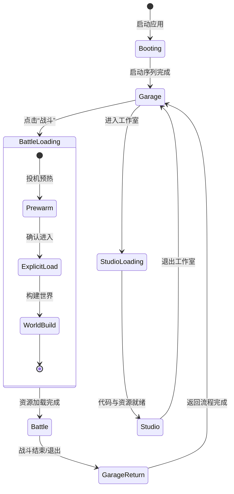
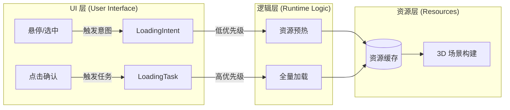
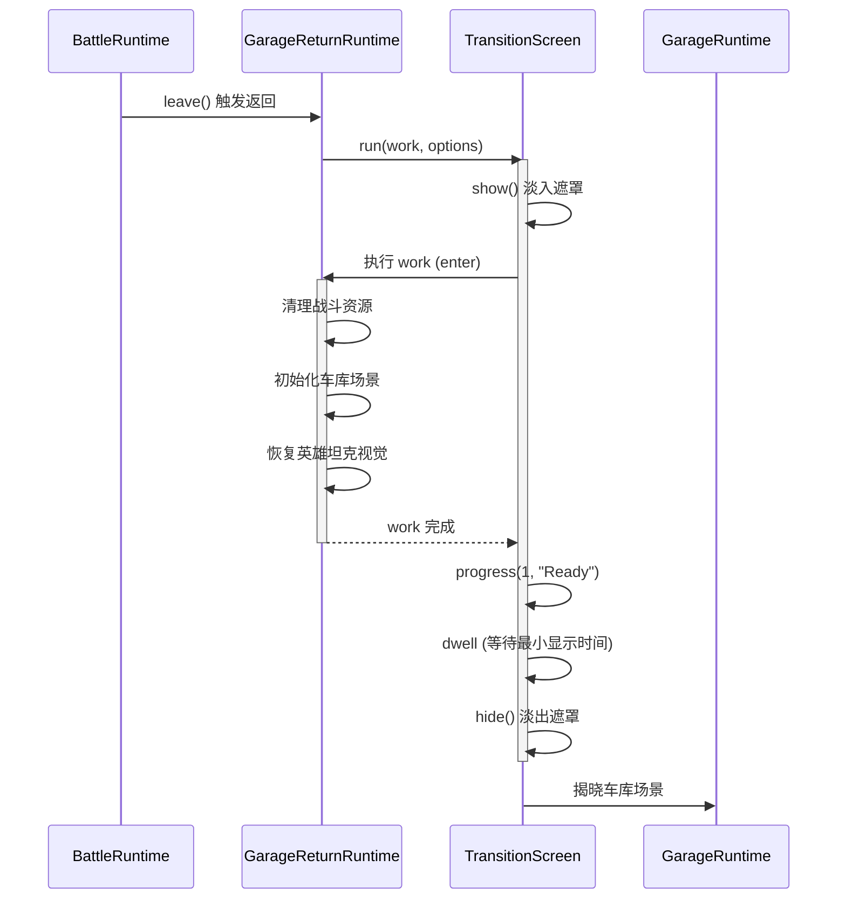
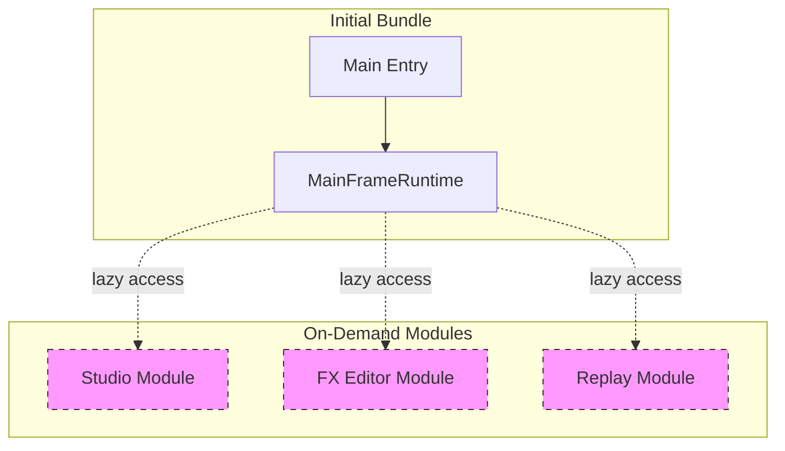

# 运行时切换与加载流

## 目录
1. [模块概览](#模块概览)
2. [简介](#简介)
3. [核心组件](#核心组件)
   - [MainFrameRuntime：主运行时控制器](#mainframeruntime主运行时控制器)
   - [BattleIntentRuntime：加载意图管理器](#battleintentruntime加载意图管理器)
   - [LazyRuntimeOwner：延迟加载机制](#lazyruntimeowner延迟加载机制)
4. [运行时状态机与切换流](#运行时状态机与切换流)
5. [加载意图与资源预热](#加载意图与资源预热)
6. [平滑切换与加载屏机制](#平滑切换与加载屏机制)
7. [启动序列与进度计算](#启动序列与进度计算)
8. [延迟加载与内存优化](#延迟加载与内存优化)
9. [文件参考](#文件参考)

## 模块概览

本章节深入探讨了 Claude of Tanks 应用程序的运行时管理架构，重点关注如何在不同的主要运行模式（车库、战斗、工作室）之间实现平滑切换，以及加载过程中的资源调度与优化。

通过对 `src/app` 和 `src/game` 目录的扫描，我们识别出约 25 个核心文件直接参与运行时管理和加载流程。

- **核心目录结构**：
  - `src/app/`：包含主框架运行时、延迟加载所有权管理以及集成端口定义。
  - `src/game/`：包含具体的业务运行时实现，如战斗进入、车库返回、加载意图等。
  - `src/ui/`：包含加载屏、过渡效果等视觉表现组件。

本指南将重点分析 `MainFrameRuntime` 的调度逻辑、`LoadingIntent` 的预加载策略以及 `LazyRuntimeOwner` 的内存优化手段。

## 简介

在高性能 WebGL 游戏中，用户体验的流畅度很大程度上取决于场景切换的平滑程度。Claude of Tanks 采用了一套基于“意图”（Intent）驱动的异步加载与运行时管理系统。

这套系统的核心目标是：
1. **消除硬切换**：通过全屏过渡（Transition）和加载屏（Loading Screen）遮盖复杂的资源初始化过程。
2. **预测性预加载**：利用用户交互意图（如悬停在坦克卡片上）提前启动资源加载，减少实际点击后的等待时间。
3. **按需加载代码**：使用延迟加载（Lazy Loading）机制，仅在进入特定模式时才下载和初始化相关的逻辑代码，降低初始包体积。
4. **统一的状态管理**：由 `MainFrameRuntime` 作为根容器，协调各个子系统的生命周期。

## 核心组件

### MainFrameRuntime：主运行时控制器

`MainFrameRuntime` 是整个应用程序的根容器。它负责驱动主渲染循环，并根据当前活跃的模式（车库、战斗、工作室）委派渲染和逻辑处理。

```typescript
// src/app/mainFrameRuntime.ts

export function createMainFrameRuntime(options: MainFrameRuntimeOptions): MainFrameRuntime {
  // ... 初始化逻辑
  const tick = (nowMs: number): void => {
    // 处理帧步进
    const frame = framePacer.step(nowMs);
    
    // 根据当前状态决定渲染内容
    if (state.studio) {
      studioRuntime.render(frame);
    } else if (state.shotMode) {
      // 截图模式渲染
    } else {
      // 标准战斗或车库渲染
      liveFrame.render(frame);
    }
    
    // 调度下一帧
    requestAnimationFrame(tick);
  };
}
```

`MainFrameRuntime` 不直接处理具体的业务逻辑，而是通过“插槽”或子运行时（如 `battleFrame`、`garageFramePacer`）来管理不同的显示状态。它确保了在模式切换时，资源能够正确释放，渲染上下文能够平滑过渡。

### BattleIntentRuntime：加载意图管理器

`BattleIntentRuntime` 实现了“加载意图”机制。它监听用户的潜在操作，并根据这些操作发起投机性的资源预热。

```typescript
// src/game/battleIntentRuntime.ts

export function createBattleIntentRuntime(options: BattleIntentOptions): BattleIntentRuntime {
  const preload = async (intent: LoadingIntent): Promise<void> => {
    // 1. 预热地图资源
    if (intent.mapId) {
      await world.warmMap(intent.mapId);
    }
    
    // 2. 预热坦克模型与贴图
    if (intent.roster) {
      await roster.warmVehicles(intent.roster);
    }
    
    // 3. 预热着色器与特效
    await effects.prewarm(intent.requiredEffects);
  };
  
  return { preload };
}
```

这种机制将原本集中的加载压力分散到了用户的交互过程中，极大地提升了感官上的加载速度。

### LazyRuntimeOwner：延迟加载机制

为了优化内存和包体积，非核心系统（如特效编辑器、录像回放、工作室模式）被封装在 `LazyRuntimeOwner` 中。

```typescript
// src/app/lazyRuntimeOwner.ts

export function createLazyRuntimeOwner<T>(
  loader: () => Promise<{ create: (deps: any) => T }>,
  deps: any
): LazyRuntimeOwner<T> {
  let instance: Promise<T> | null = null;

  return {
    async access(): Promise<T> {
      if (!instance) {
        // 仅在首次访问时执行动态 import
        instance = loader().then(m => m.create(deps));
      }
      return instance;
    }
  };
}
```

通过这种方式，只有当用户真正点击“进入工作室”时，相关的代码和资源才会被下载。

## 运行时状态机与切换流

应用程序在不同运行时之间的切换遵循严格的状态机逻辑。每一次切换都伴随着“遮盖 -> 卸载旧资源 -> 加载新资源 -> 揭晓”的过程。

下面的状态图展示了主要的运行时状态及其转换路径：



在上述流程中，`Garage`（车库）是核心枢纽。从 `Garage` 到 `Battle` 的转换由 `SoloBattleEntryRuntime` 驱动，而返回过程由 `GarageReturnRuntime` 负责。每个状态转换都由 `TransitionScreen` 或 `BattleLoadScreen` 进行视觉上的遮盖，确保用户不会看到未构建完成的场景。

**Diagram sources**: 
- [main.ts:L150-L300](src/main.ts#L150-L300)
- [game/soloBattleEntryRuntime.ts:L50-L120](src/game/soloBattleEntryRuntime.ts#L50-L120)
- [game/garageReturnRuntime.ts:L238-L314](src/game/garageReturnRuntime.ts#L238-L314)

## 加载意图与资源预热

加载意图（Loading Intent）是本系统中最具特色的优化手段。它将加载行为分为两个阶段：**投机阶段**和**确认阶段**。

1. **投机阶段 (Speculative Phase)**：当用户在 UI 上悬停或选中某个选项但尚未点击确认时触发。系统会开始低优先级地加载关键资源（如地图缩略图、坦克基础模型）。
2. **确认阶段 (Confirmed Phase)**：用户点击确认后触发。系统提升加载优先级，并开始构建完整的 3D 场景。



这种机制在 `src/ui/garage.ts` 中通过 `onTankIntent` 等回调函数实现，并交由 `pedestal.preloadIntent` 进行处理。它确保了当用户最终决定进入战斗时，大部分纹理和几何数据已经驻留在 GPU 内存中。

**Diagram sources**: 
- [ui/garage.ts:L120-L180](src/ui/garage.ts#L120-L180)
- [game/battleIntentRuntime.ts:L10-L45](src/game/battleIntentRuntime.ts#L10-L45)

## 平滑切换与加载屏机制

为了实现“平滑”感，系统使用了两种主要的 UI 遮盖组件：`TransitionScreen` 和 `BattleLoadScreen`。

- **TransitionScreen**：用于快速的状态切换（如进入工作室）。它使用品牌化的全屏遮罩，配合淡入淡出效果。
- **BattleLoadScreen**：专为进入战斗设计。它展示地图信息、双方阵容、战斗小贴士，并拥有一个真实的进度条。

下面的序列图展示了 `GarageReturnRuntime` 如何使用 `TransitionScreen` 实现从战斗返回车库的平滑过渡：



`TransitionScreen` 的 `run` 方法是一个高阶函数，它确保了即使后台加载速度极快，加载屏也会维持一个最小显示时间（`minShowMs`），以避免画面闪烁。

**Diagram sources**: 
- [ui/transition.ts:L250-L266](src/ui/transition.ts#L250-L266)
- [game/garageReturnRuntime.ts:L341-L351](src/game/garageReturnRuntime.ts#L341-L351)

## 启动序列与进度计算

应用程序的启动是一个多阶段的过程，在 `src/main.ts` 中被定义为一系列的 `bootStage`。

1. **环境准备**：创建渲染器、天空盒、烘焙环境光。
2. **核心初始化**：创建物理世界、UI 容器、音频系统。
3. **资源加载**：加载初始坦克模型、UI 贴图。
4. **预热**：执行 `warm frames`，确保首帧渲染不会掉帧。

进度条的计算逻辑基于这些阶段的权重。例如，环境烘焙可能占据 30% 的进度，而模型加载占据 50%。

```typescript
// src/main.ts 中的启动序列片段示例
async function boot() {
  const progress = (p: number, label: string) => bootScreen.progress(p, label);
  
  progress(0.1, 'Creating Renderer');
  await createRenderer();
  
  progress(0.3, 'Baking Environment');
  await bakeEnvironment();
  
  progress(0.8, 'Loading Assets');
  await loadCoreAssets();
  
  progress(1.0, 'Ready');
}
```

在战斗加载过程中，`BattleLoadScreen` 的进度则直接与 `WorldBuild` 的进度挂钩，实时反映地形生成、植被摆放和道具加载的状态。

## 延迟加载与内存优化

`LazyRuntimeOwner` 配合 Webpack/Vite 的动态导入功能，实现了逻辑代码的按需加载。



当 `MainFrameRuntime` 需要访问工作室功能时，它会调用 `studioAccess.access()`。如果该模块尚未加载，系统会发起网络请求下载对应的 JS 文件，并在加载完成后初始化运行时。这种机制极大地减少了用户首次打开页面时的等待时间。

此外，在切换运行时（如从战斗返回车库）时，系统会显式调用 `dispose` 方法释放 GPU 资源和关闭网络连接，确保内存占用不会随运行时间的增加而无限增长。

## 文件参考

本章节涉及的关键源文件如下：

- [src/app/mainFrameRuntime.ts](src/app/mainFrameRuntime.ts)：主运行时控制器，负责全局调度。
- [src/app/lazyRuntimeOwner.ts](src/app/lazyRuntimeOwner.ts)：延迟加载所有权管理工具。
- [src/game/battleIntentRuntime.ts](src/game/battleIntentRuntime.ts)：加载意图与预热逻辑实现。
- [src/game/soloBattleEntryRuntime.ts](src/game/soloBattleEntryRuntime.ts)：进入战斗的转换运行时。
- [src/game/garageReturnRuntime.ts](src/game/garageReturnRuntime.ts)：返回车库的转换运行时。
- [src/game/playSurfaceRuntime.ts](src/game/playSurfaceRuntime.ts)：播放界面（菜单）运行时。
- [src/ui/transition.ts](src/ui/transition.ts)：通用状态切换过渡屏。
- [src/ui/battleLoad.ts](src/ui/battleLoad.ts)：战斗专用加载屏。
- [src/main.ts](src/main.ts)：应用程序启动序列与根入口。
- [src/ui/garage.ts](src/ui/garage.ts)：车库 UI 逻辑，触发加载意图的源头。

**Section sources**:
- [src/app/mainFrameRuntime.ts](src/app/mainFrameRuntime.ts)
- [src/game/battleIntentRuntime.ts](src/game/battleIntentRuntime.ts)
- [src/game/garageReturnRuntime.ts](src/game/garageReturnRuntime.ts)
- [src/ui/transition.ts](src/ui/transition.ts)
