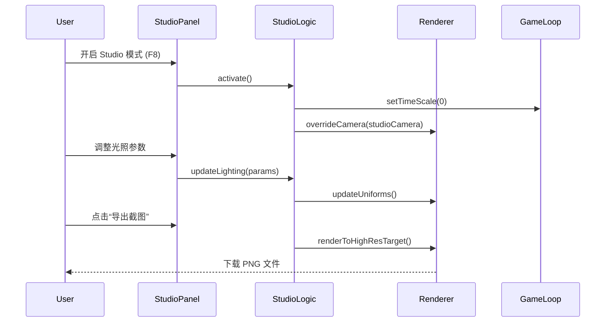
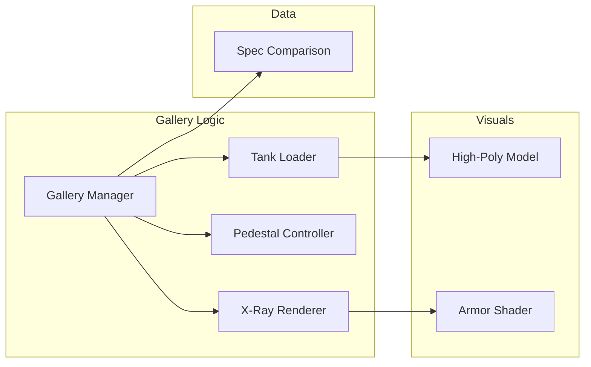
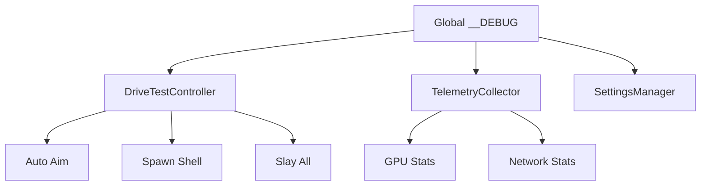
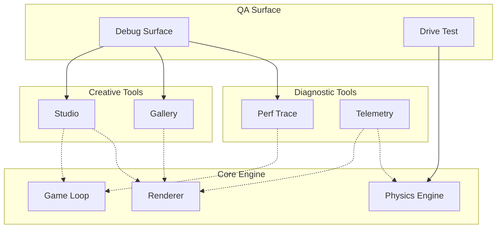

# 用户界面与内置创作工具

## 目录

1. [模块概览](#模块概览)
2. [引言](#引言)
3. [Scene Studio：电影级场景工作室](#scene-studio电影级场景工作室)
   - [核心功能与交互](#核心功能与交互)
   - [快捷键指南](#快捷键指南)
   - [技术实现原理](#技术实现原理)
4. [Tank Gallery：坦克技术展厅](#tank-gallery坦克技术展厅)
   - [X-Ray 视角与装甲分析](#x-ray-视角与装甲分析)
   - [性能参数对比](#性能参数对比)
5. [性能追踪与实时遥测](#性能追踪与实时遥测)
   - [性能图表解读](#性能图表解读)
   - [遥测数据项说明](#遥测数据项说明)
6. [调试界面与 QA 控制工具](#调试界面与-qa-控制工具)
   - [Debug Surface 接口](#debug-surface-接口)
   - [Drive Test 控制器](#drive-test-控制器)
7. [核心组件](#核心组件)
8. [架构概览](#架构概览)
9. [集成与扩展](#集成与扩展)
10. [文件参考](#文件参考)

## 模块概览

本章节涵盖了项目内置的一系列强大的创作、展示与调试工具。这些工具不仅服务于开发过程中的性能分析与 Bug 排查，还为内容创作者提供了电影级的拍摄与展示能力。

**统计信息**：
- **总文件数**：约 78 个源文件。
- **核心目录**：
  - `src/ui/`：包含工作室面板、调试 UI 以及通用界面组件（约 60 个文件）。
  - `src/gallery/`：坦克展厅的逻辑与视觉呈现（5 个文件）。
  - `src/dev/`：性能追踪、遥测收集及 QA 自动化工具（13 个文件）。

**覆盖范围**：
本 wiki 将深入探讨 `Scene Studio` 的镜头编排系统、`Tank Gallery` 的装甲分析技术，以及 `perfTrace` 与 `debugTelemetry` 的底层实现。对于通用的 UI 组件（如按钮、滑块等），将仅作简要说明，重点放在它们在工具集中的集成方式。

## 引言

在《Claude of Tanks》的开发过程中，我们意识到仅有游戏逻辑是不够的。为了达到顶尖的视觉效果并确保在各种硬件上的平稳运行，我们需要一套深度的内置工具集。

本模块的核心目标是：
1. **赋能创作**：通过 `Scene Studio` 允许开发者和玩家创作高质量的宣传素材、电影镜头和特效展示。它不仅仅是一个简单的截图工具，而是一个完整的虚拟摄影系统。
2. **技术透明**：通过 `Tank Gallery` 展示坦克复杂的装甲结构和内部组件，这不仅是视觉展示，更是对物理模拟准确性的验证。玩家可以直观地看到每一块装甲板的厚度和倾角。
3. **性能闭环**：通过 `perfTrace` 和实时遥测，将性能指标从抽象的数字转化为直观的图表，帮助开发者快速定位瓶颈。这在移动端优化中尤为关键。
4. **测试自动化**：通过 `debugSurface` 和 `driveTestController` 提供非侵入式的调试接口，支持自动化测试和快速 QA 验证。这大大缩短了回归测试的周期。

这些工具共同构成了一个完整的“开发者环境”，使项目能够超越单一的游戏体验，成为一个可扩展的技术平台。

## Scene Studio：电影级场景工作室

`Scene Studio` 是项目中最复杂的内置工具之一，位于 `src/game/studio.ts`。它将游戏引擎转变为一个虚拟的摄影棚，提供了对镜头、光影、时间以及特效的微观控制。

### 核心功能与交互

Studio 提供了一个浮动的 UI 面板（`src/ui/studioPanel.ts`），用户可以实时调整以下参数：
- **镜头控制**：支持自由相机与轨道相机切换，可调节焦距 (FOV)、景深 (DoF) 以及动态模糊强度。
- **环境模拟**：实时更改天空盒、太阳位置、大气散射参数以及天气效果（如降雨、浓雾）。
- **时间冻结**：支持全局时间缩放（Slow Motion）或完全冻结，以便捕捉爆炸瞬间的细节。
- **特效覆盖**：手动触发爆炸、火花、履带尘土等特效，并控制其生命周期。
- **高质量导出**：通过超采样技术导出 4K 甚至 8K 的无损截图。

### 快捷键指南

为了提高创作效率，Studio 预设了一系列快捷键：

| 快捷键 | 功能描述 |
| :--- | :--- |
| `F8` | 开启/关闭 Studio 模式 |
| `Space` | 暂停/恢复全局模拟时间 |
| `[ / ]` | 调整时间缩放速度 (0.1x - 2.0x) |
| `Shift + S` | 触发高质量截图导出 |
| `Ctrl + H` | 隐藏所有 UI 界面（纯净拍摄模式） |
| `WASD + Q/E` | 自由相机移动（垂直位移） |

### 技术实现原理

Studio 模式通过接管主渲染循环的相机控制权来实现。它维护了一个独立的状态机，当开启时，会将 `GameLoop` 的输入重定向到 `StudioController`。



**代码示例 1：Studio 状态管理**
```typescript
// src/game/studio.ts
export class Studio {
  private active = false;
  private state: StudioState = defaultState();

  public toggle() {
    this.active = !this.active;
    if (this.active) {
      this.enterStudioMode();
    } else {
      this.exitStudioMode();
    }
  }

  private enterStudioMode() {
    // 冻结 AI 和物理模拟，但保持渲染更新
    this.deps.game.pauseSimulation();
    this.deps.ui.showPanel('studio');
    this.setupFreeCamera();
  }

  public update(dt: number) {
    if (!this.active) return;
    // 处理自由相机平滑移动
    this.cameraController.update(dt);
    // 更新环境光照插值
    this.updateEnvironment(dt);
  }
}
```

**代码示例 2：StudioPanel UI 集成**
```typescript
// src/ui/studioPanel.ts
export function createStudioPanel(studio: Studio) {
  const container = document.createElement('div');
  container.className = 'studio-panel';
  
  // 时间缩放控制
  const timeSlider = createSlider('Time Scale', 0, 2, (val) => {
    studio.setTimeScale(val);
  });
  
  // 天气切换
  const weatherSelect = createSelect(['Clear', 'Rain', 'Fog'], (val) => {
    studio.setWeather(val);
  });
  
  container.appendChild(timeSlider);
  container.appendChild(weatherSelect);
  return container;
}
```

**Section sources**:
- [src/game/studio.ts](src/game/studio.ts)
- [src/ui/studioPanel.ts](src/ui/studioPanel.ts)

## Tank Gallery：坦克技术展厅

`Tank Gallery`（位于 `src/gallery/gallery.ts`）是一个专门用于展示坦克模型及其技术特性的模块。它通常在车库界面或独立的“展厅”模式下启动。

### X-Ray 视角与装甲分析

展厅最引人注目的功能是 **X-Ray 装甲分析**。通过自定义的 Shader，系统可以实时显示坦克不同区域的等效装甲厚度。
- **颜色编码**：使用热力图颜色表示装甲强度（绿色表示薄弱，红色表示坚固）。
- **组件透视**：允许玩家看透外部装甲，观察内部的发动机、弹药架和成员分布。
- **碰撞盒可视化**：直接渲染物理引擎使用的原始碰撞几何体，用于核对视觉模型与碰撞模型的一致性。

### 性能参数对比

展厅还集成了一个动态的性能对比系统。当用户切换不同的坦克或升级配件时，UI 会通过雷达图（Radar Chart）展示各项指标的变化：
- **火力**：穿深、单发伤害、装填速度。
- **防护**：生命值、等效装甲评分。
- **机动**：推重比、最高时速、转向速度。



**代码示例 3：X-Ray 材质切换**
```typescript
// src/gallery/gallery.ts
public setViewMode(mode: 'normal' | 'xray' | 'armor') {
  this.currentTank.traverse((node) => {
    if (node instanceof THREE.Mesh) {
      switch (mode) {
        case 'xray':
          node.material = this.xrayMaterial;
          node.material.uniforms.opacity.value = 0.3;
          break;
        case 'armor':
          node.material = this.armorHeatmapMaterial;
          break;
        default:
          node.material = node.userData.originalMaterial;
      }
    }
  });
}
```

**Section sources**:
- [src/gallery/gallery.ts](src/gallery/gallery.ts)
- [docs/GALLERY.md](docs/GALLERY.md)

## 性能追踪与实时遥测

为了确保游戏在复杂战斗场景下仍能维持 60 FPS，项目内置了精密的性能监控系统。

### 性能图表解读

`src/dev/perfTrace.ts` 负责收集高精度的帧时间数据。在调试模式下，屏幕上方会显示一个多层级的性能图表：
- **CPU Frame Time**：处理输入、AI 和物理模拟的总耗时。
- **GPU Frame Time**：渲染管线执行的总耗时。
- **Draw Calls**：每帧发出的渲染指令数量。
- **Triangles**：当前视锥体内的总三角形数。

> 💡 **提示**：如果 CPU 时间远高于 GPU 时间，通常意味着瓶颈在逻辑层（如过多的 AI 计算）；反之则意味着着色器过于复杂或顶点过多。

### 遥测数据项说明

`src/dev/debugTelemetry.ts` 提供了一个更全面的数据视图，涵盖了系统各维度的状态：
- **Quality**：当前的分辨率缩放比例、DPR (Device Pixel Ratio) 以及使用的 GPU 型号。
- **Simulation**：存活的坦克数量、飞行中的炮弹数量、场景中的可破坏物状态。
- **Network**：RTT（往返时延）、抖动（Jitter）以及丢包率估算。
- **Shadows**：阴影贴图的占用情况，以及阴影渲染的性能贡献度分析。

**代码示例 4：遥测数据收集**
```typescript
// src/dev/debugTelemetry.ts
export function collectTelemetry(deps: Dependencies) {
  const draw = deps.renderer.getDrawingBufferSize(new THREE.Vector2());
  return {
    render: {
      resolution: `${draw.x}x${draw.y}`,
      fps: deps.frameInfo.fps,
      drawCalls: deps.renderer.info.render.calls,
    },
    memory: {
      geometries: deps.renderer.info.memory.geometries,
      textures: deps.renderer.info.memory.textures,
    },
    network: deps.network.getStats(),
  };
}
```

**Section sources**:
- [src/dev/perfTrace.ts](src/dev/perfTrace.ts)
- [src/dev/debugTelemetry.ts](src/dev/debugTelemetry.ts)

## 调试界面与 QA 控制工具

除了可视化工具，项目还为高级用户和测试脚本提供了直接的控制接口。

### Debug Surface 接口

`src/dev/debugSurface.ts` 在全局对象 `window` 上安装了一个名为 `__DEBUG` 的对象。这使得开发者可以直接在浏览器控制台中执行命令：
- `__DEBUG.slayEnemies()`：瞬间击毁所有敌方坦克。
- `__DEBUG.switchMap('desert_outpost')`：立即切换地图。
- `__DEBUG.telemetry()`：打印当前的完整遥测快照。

### Drive Test 控制器

`src/dev/driveTestController.ts` 是专门为战斗逻辑测试设计的。它提供了一套“上帝视角”的控制功能：
- **自动瞄准**：`aimAtNearest()` 会计算弹道预判并自动锁定最近的敌人。
- **强制开火**：忽略装填时间进行连续射击。
- **快进模拟**：`fastForward(seconds)` 允许以极高倍速运行物理模拟，用于测试长时间运行后的稳定性。



**代码示例 5：自动瞄准逻辑实现**
```typescript
// src/dev/driveTestController.ts
function aimAtNearest(): { id: string; distM: number } | null {
  const player = game.player;
  let best: Tank | null = null;
  let bestDistanceM = Infinity;
  
  for (const entity of game.tanks) {
    if (entity.team === 'enemy' && !entity.destroyed) {
      const distanceM = player.pos.distanceTo(entity.pos);
      if (distanceM < bestDistanceM) {
        bestDistanceM = distanceM;
        best = entity;
      }
    }
  }
  
  if (best) {
    // 计算提前量并锁定目标
    const leadPoint = calculateLead(player, best);
    player.input.aimPoint.copy(leadPoint);
    return { id: best.id, distM: bestDistanceM };
  }
  return null;
}
```

**Section sources**:
- [src/dev/debugSurface.ts](src/dev/debugSurface.ts)
- [src/dev/driveTestController.ts](src/dev/driveTestController.ts)

## 核心组件

本节列出了驱动上述工具的核心类与接口。

| 类/接口 | 定义文件 | 职责说明 |
| :--- | :--- | :--- |
| `Studio` | `src/game/studio.ts` | 管理工作室模式的生命周期、相机切换与环境控制。 |
| `StudioPanel` | `src/ui/studioPanel.ts` | 提供工作室模式的图形化操作界面。 |
| `Gallery` | `src/gallery/gallery.ts` | 负责展厅场景的搭建、坦克加载及 X-Ray 渲染切换。 |
| `PerfTrace` | `src/dev/perfTrace.ts` | 高精度性能计数器，支持 CPU/GPU 时间戳记录。 |
| `DebugTelemetryOwner` | `src/dev/debugTelemetry.ts` | 汇总系统各模块的运行数据，生成标准化的遥测报告。 |
| `DriveTestController` | `src/dev/driveTestController.ts` | 提供战斗模拟的调试控制接口，支持自动化测试。 |

**代码示例 6：PerfTrace 的使用**
```typescript
// src/dev/perfTrace.ts 示例用法
const tracer = new PerfTrace();

function renderFrame() {
  tracer.begin('Frame');
  
  tracer.begin('Logic');
  updateGameLogic();
  tracer.end('Logic');
  
  tracer.begin('Render');
  renderer.render(scene, camera);
  tracer.end('Render');
  
  tracer.end('Frame');
  tracer.publish(); // 将数据推送到 UI 或控制台
}
```

## 架构概览

内置工具集采用了“非侵入式”设计原则。工具逻辑通常作为外部观察者挂载到主游戏循环上，通过特定的 Port 接口与核心引擎交互，而不直接修改核心业务代码。



这种架构确保了生产环境的构建版本可以轻松剔除这些工具模块，从而减小包体积并提高安全性。通过这种方式，我们可以维持开发效率与最终产品性能之间的平衡。

## 集成与扩展

如果你需要为项目添加新的调试工具，请遵循以下模式：
1. **定义依赖 Port**：在 `src/dev/` 下创建新的控制器，通过接口定义它需要的引擎能力（如 `Renderer`, `Scene` 等）。
2. **实现逻辑**：编写工具的核心功能，确保逻辑的独立性。
3. **注册到 Debug Surface**：在 `src/dev/debugSurface.ts` 中将你的工具实例挂载到 `__DEBUG` 对象上。
4. **添加 UI 面板**：在 `src/ui/` 中创建对应的 React/Vue 组件，并与控制器进行状态绑定。

> ⚠️ **警告**：所有调试工具必须通过 `?debug=1` 查询参数或特定的环境变量激活。严禁在生产环境默认开启涉及敏感数据或破坏平衡性的调试接口。这不仅是为了性能，也是为了防止玩家利用调试接口作弊。

## 文件参考

以下是本章节涉及的关键源文件列表：

- **Scene Studio**:
  - `src/game/studio.ts`: 工作室核心逻辑实现。
  - `src/ui/studioPanel.ts`: 工作室 UI 面板组件。
  - `docs/STUDIO.md`: 工作室模式的详细使用手册。
- **Tank Gallery**:
  - `src/gallery/gallery.ts`: 展厅场景与 X-Ray 逻辑。
  - `docs/GALLERY.md`: 展厅功能说明文档。
- **Development & Debug**:
  - `src/dev/perfTrace.ts`: 性能追踪器实现。
  - `src/dev/debugTelemetry.ts`: 遥测数据收集系统。
  - `src/dev/debugSurface.ts`: 全局调试接口定义。
  - `src/dev/driveTestController.ts`: 战斗 QA 控制器。
  - `src/dev/debugSurface.ts`: 调试界面的入口与安装逻辑。
