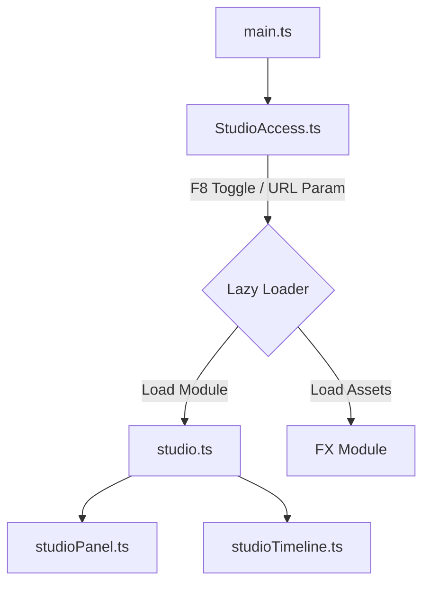
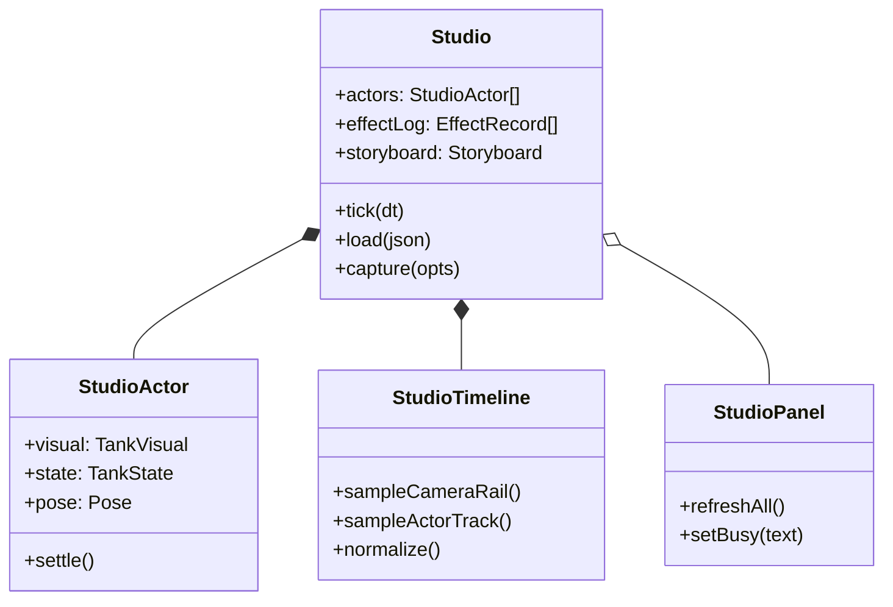
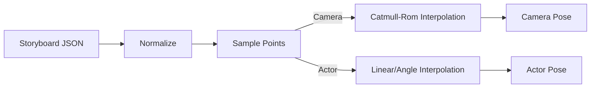
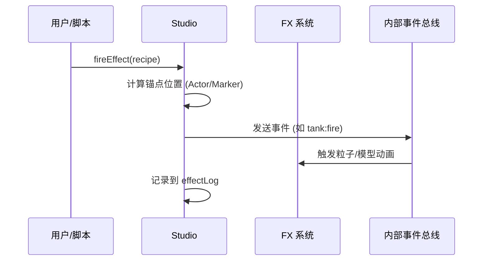
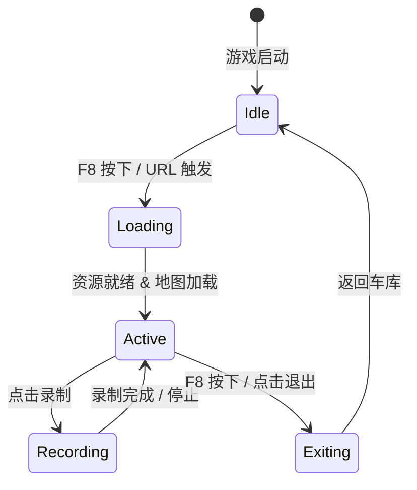

# 场景工作室 (Scene Studio)

## 目录
1. [模块概览](#模块概览)
2. [简介](#简介)
3. [架构设计与集成](#架构设计与集成)
   - [StudioAccess 注入机制](#studioaccess-注入机制)
   - [游戏循环接管](#游戏循环接管)
4. [核心组件](#核心组件)
   - [Studio 运行时](#studio-运行时)
   - [StudioTimeline 确定性时间轴](#studiotimeline-确定性时间轴)
   - [StudioPanel UI 面板](#studiopanel-ui-面板)
5. [功能区域详解](#功能区域详解)
   - [镜头控制与轨道](#镜头控制与轨道)
   - [特效系统与确定性](#特效系统与确定性)
   - [坦克姿态与液气悬挂](#坦克姿态与液气悬挂)
6. [脚本化拍摄 API](#脚本化拍摄-api)
7. [导出与高质量输出](#导出与高质量输出)
8. [生命周期与状态管理](#生命周期与状态管理)
9. [扩展指南：添加新特效或轨道](#扩展指南添加新特效或轨道)
10. [文件引用](#文件引用)

## 模块概览

场景工作室 (Scene Studio) 是一个功能完备的电影级创作工具，集成在游戏内部，用于高精度的镜头编排、特效捕捉和宣传素材制作。

**模块规模评估**：
- **核心文件数量**：约 8 个源文件（包含核心逻辑、UI、时间轴处理及文档）。
- **主要目录**：
  - `src/game/`：包含 Studio 核心逻辑 (`studio.ts`)、时间轴算法 (`studioTimeline.ts`) 和接入层 (`studioAccess.ts`)。
  - `src/ui/`：包含功能复杂的交互面板 (`studioPanel.ts`)。
  - `docs/`：包含详细的操作与 API 手册 (`STUDIO.md`)。

本章节将深入探讨 Studio 如何通过确定性模拟实现“所见即所得”的创作体验，并详细解析其内部的镜头插值、特效调度和资源管理机制。

## 简介

场景工作室 (Scene Studio) 不仅仅是一个简单的“拍照模式”，它是一个基于游戏实时渲染引擎的**非线性编辑系统**。它允许开发者和创作者在完全真实的游戏环境下（包含地形、植被、天气、光照和后期处理），在没有战斗逻辑干扰的情况下，自由放置坦克、编排动作、触发特效并录制高质量视频。

### 核心目标
- **高质量素材产出**：支持超过 4K 分辨率的截图和 60FPS 的视频录制。
- **确定性重现**：通过场景 JSON 协议，确保同一份脚本在任何环境下渲染出的画面完全一致。
- **扩展性**：提供简单的接口，允许开发者快速添加新的特效类型或自定义相机轨道。

### 关键术语
- **Actor (演员)**：场景中的坦克实体，具有独立的姿态、迷彩和损伤状态。
- **Storyboard (分镜脚本)**：定义了相机轨道和 Actor 动作的关键帧集合。
- **Effect Layer (特效层)**：在时间轴上特定时间点触发的游戏特效（如开火、爆炸、烟雾）。
- **Rail (轨道)**：相机在空间中移动的路径，通常使用 Catmull-Rom 算法进行平滑处理。

## 架构设计与集成

Studio 的设计遵循“插件式”架构，它作为一个独立的模块存在，通过 `StudioAccess` 与游戏主框架解耦。

### StudioAccess 注入机制

为了优化启动性能，Studio 相关的代码和资源（如特效模型、UI 资源）采用延迟加载策略。`StudioAccess` 充当了这一层异步边界，确保只有在真正需要时才加载沉重的 Studio 逻辑。

下图展示了从用户触发 F8 到 Studio 完全激活的加载流程：



**Diagram sources**: 
- [src/game/studioAccess.ts:L48-L129](src/game/studioAccess.ts#L48-L129)
- [src/game/studio.ts:L433-L447](src/game/studio.ts#L433-L447)

`StudioAccess` 负责监听 **F8** 热键。当用户按下 F8 时，它会触发模块的异步加载。如果加载成功，它将初始化 `Studio` 实例并接管游戏循环。这种设计确保了在普通游戏模式下，Studio 模块不会占用内存和 CPU 资源。

### 游戏循环接管

一旦 Studio 激活，它将完全接管 `main.ts` 中的 `tick` 函数。这意味着正常的战斗逻辑（AI、碰撞检测、HUD 更新）将被挂起，取而代之的是 Studio 专有的更新逻辑。

```typescript
// main.ts 中的集成伪代码
function tick(dt) {
  if (studio.active) {
    studio.tick(dt); // Studio 接管整个帧的更新
    return;
  }
  // 正常的战斗逻辑...
  battle.tick(dt);
}
```

在 Studio 的 `tick` 循环中，它处理自由相机移动、时间轴推进、特效更新以及 UI 面板的实时反馈。

**Section sources**:
- [src/game/studioAccess.ts](src/game/studioAccess.ts)
- [src/game/studio.ts](src/game/studio.ts)

## 核心组件

### Studio 运行时

`Studio` 类（由 `createStudio` 创建）是整个系统的“大脑”。它管理着场景中所有的 Actor、特效日志和相机状态。它不仅负责每一帧的逻辑更新，还通过 `window.__STUDIO` 暴露了用于脚本化控制的 API。

下图展示了 Studio 内部组件之间的交互关系：



**Diagram sources**: 
- [src/game/studio.ts:L450-L478](src/game/studio.ts#L450-L478)
- [src/game/studioTimeline.ts:L78-L83](src/game/studioTimeline.ts#L78-L83)

### StudioTimeline 确定性时间轴

`studioTimeline.ts` 是一个纯逻辑模块，不依赖于任何渲染对象。它负责处理关键帧的存储、规范化和采样。

下图展示了时间轴采样的逻辑流：



**Diagram sources**: 
- [src/game/studioTimeline.ts:L322-L387](src/game/studioTimeline.ts#L322-L387)

- **相机轨道**：使用 **Catmull-Rom** 空间插值，确保相机在多个关键帧之间平滑过渡，避免在转折点出现突兀的抖动。
- **Actor 轨道**：对位置使用线性插值，对角度（车体偏航、炮塔转向、火炮俯仰）使用**最短弧度角度插值**，确保坦克转向自然。

### StudioPanel UI 面板

UI 面板位于右侧停靠区，是一个复杂的交互式工作台。它通过监听 Studio 的状态变化并调用 API 来实现实时预览。面板的设计目标是让非技术人员也能通过可视化操作完成复杂的镜头编排。

**Section sources**:
- [src/game/studio.ts](src/game/studio.ts)
- [src/game/studioTimeline.ts](src/game/studioTimeline.ts)
- [src/ui/studioPanel.ts](src/ui/studioPanel.ts)

## 功能区域详解

### 镜头控制与轨道

Studio 提供了两种主要的相机模式：
- **自由飞行 (Fly Mode)**：使用 WASD 和鼠标自由移动，适合寻找最佳拍摄角度。
- **轨道模式 (Orbit Mode)**：相机围绕一个目标点旋转，适合拍摄坦克的展示镜头。

在时间轴模式下，用户可以添加多个“相机镜头 (Camera Shot)”。系统会自动在这些镜头之间建立轨道。

> 💡 **提示**：Studio 支持 `smooth`（平滑）、`linear`（线性）和 `cut`（剪辑）三种过渡方式。`cut` 会在到达关键帧时间点时立即跳变，非常适合制作快节奏的战斗剪辑。

### 特效系统与确定性

Studio 使用了游戏中真实的特效语言。通过 `fireEffect` 函数，开发者可以触发如 `fire`（开火）、`explosion`（爆炸）、`dust`（扬尘）等特效。

下图展示了触发一个特效时的内部处理流程：



**Diagram sources**: 
- [src/game/studio.ts:L1324-L1636](src/game/studio.ts#L1324-L1636)

为了保证确定性，Studio 在 `load` 场景时会执行以下操作：
1. **重置 FX 系统**：调用 `fx.resetAll()` 并重置种子 `fx.resetSeed(seed)`。
2. **固定步长推进**：使用 `advanceFx` 以固定的 60Hz 频率推进时间，确保粒子发射器的状态在每一帧都是可预测的。
3. **状态快照**：支持 `capture(opts)` 在任意时间点渲染出一张完全一致的高清图。

### 坦克姿态与液气悬挂

对于具有液气悬挂系统的坦克（如现代主战坦克），Studio 提供了 `setHydropneumaticAim` 接口。它不仅仅是简单的模型旋转，而是调用了底层的悬挂求解器，模拟车体在俯仰过程中的重心转移、弹簧压缩和履带形变。

```typescript
// studio.ts 中的液气悬挂处理逻辑
function setHydropneumaticAim(ref, pitchDeg) {
  // ... 验证坦克规格 ...
  for (let frame = 0; frame < 360; frame++) {
    updateTank(a, hfProxy, SIM_DT); // 调用真实物理步进
    // 保持位置固定，仅允许悬挂调整
    st.pos.x = rootX;
    st.pos.z = rootZ;
  }
  // ... 返回沉降后的悬挂遥测数据 ...
}
```

**Section sources**:
- [src/game/studio.ts](src/game/studio.ts)
- [src/sim/movement.ts](src/sim/movement.ts)

## 脚本化拍摄 API

Studio 通过 `window.__STUDIO` 暴露了一套强大的 API，允许通过 WebDriver 或控制台脚本进行自动化拍摄。这对于自动化生成营销素材或进行视觉回归测试非常有用。

| 方法 | 说明 |
| :--- | :--- |
| `load(json)` | 确定性加载一个完整的场景脚本。 |
| `capture(opts)` | 渲染并返回当前帧的高清 PNG（支持超分辨率）。 |
| `recordVideo(opts)` | 按照时间轴播放并录制 WebM 视频。 |
| `addActor(cfg)` | 动态添加一个坦克，支持指定迷彩、状态等。 |
| `effect(recipe)` | 在当前时间点触发一个特效。 |

**Section sources**:
- [docs/STUDIO.md](docs/STUDIO.md)

## 导出与高质量输出

### 高清截图 (Capture)
Studio 的截图功能会暂时调整渲染器的分辨率和后期处理链。它会强制开启所有阴影层级（Shadow Cascades），并将 `dt` 设为 0 以消除运动模糊（除非有意开启），从而生成极致清晰的静态图像。

### 视频录制 (Recording)
视频录制使用浏览器的 `MediaRecorder` API。它会捕获经过后期处理后的 Canvas 流。
- **限制**：目前不支持音频混音。
- **性能**：录制过程中会维持稳定的帧率，如果系统性能不足，Studio 会降低回放速度以确保录制出的视频不掉帧。

## 生命周期与状态管理

Studio 的运行状态可以通过以下状态机图示来理解：



**Diagram sources**: 
- [src/game/studio.ts:L2581-L2762](src/game/studio.ts#L2581-L2762)

在 `Active` 状态下，Studio 拥有对渲染器和场景的绝对控制权。在 `Exiting` 阶段，它会清理所有 Actor 和特效，恢复车库的渲染状态。

## 扩展指南：添加新特效或轨道

要扩展 Studio 的功能，通常涉及以下步骤：

1.  **添加特效类型**：
    在 `src/game/studio.ts` 的 `EFFECT_TYPES` 数组中注册新 ID。在 `fireEffect` 函数的 `switch` 语句中实现对应的触发逻辑，通常是调用 `fxBus.emit` 或直接调用 `fx` 运行时的方法。

2.  **添加新的时间轴轨道**：
    如果需要为坦克添加新的属性轨道（如开灯、更换迷彩），需要在 `src/game/studioTimeline.ts` 的 `ActorKey` 接口中添加字段，并在 `sampleActorTrack` 中实现插值逻辑。

3.  **UI 适配**：
    在 `src/ui/studioPanel.ts` 中添加对应的控件（如 Slider 或 Select），并将其绑定到 `StudioPanelApi` 提供的对应方法上。

## 文件引用

**核心逻辑与接入**:
- [src/game/studio.ts](src/game/studio.ts) - Studio 核心运行时与 API 实现
- [src/game/studioAccess.ts](src/game/studioAccess.ts) - 模块加载与 F8 键接入逻辑
- [src/game/studioTimeline.ts](src/game/studioTimeline.ts) - 确定性插值算法与数据结构

**UI 与表现**:
- [src/ui/studioPanel.ts](src/ui/studioPanel.ts) - 交互面板与样式实现
- [src/game/presentationPose.ts](src/game/presentationPose.ts) - 坦克姿态平滑处理

**文档与测试**:
- [docs/STUDIO.md](docs/STUDIO.md) - 官方操作手册与 JSON Schema 定义
- [src/game/studioTimeline.selftest.mjs](src/game/studioTimeline.selftest.mjs) - 时间轴插值单元测试
