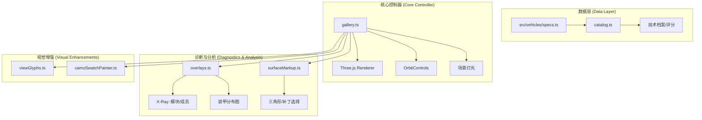
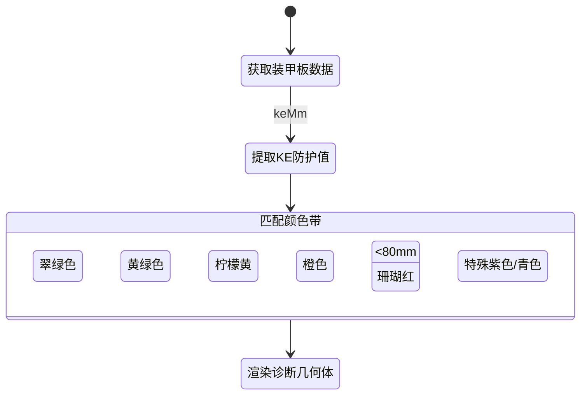
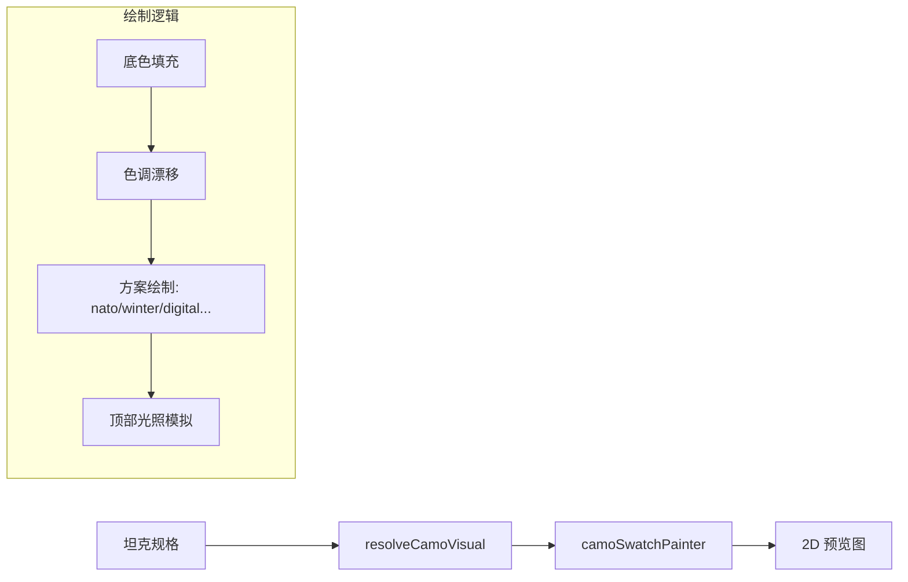

# 坦克展厅 (Tank Gallery)

## 目录
1. [模块概览](#模块概览)
2. [引言](#引言)
3. [架构设计](#架构设计)
   - [组件交互流](#组件交互流)
4. [核心组件解析](#核心组件解析)
   - [展厅主控制器 (Gallery)](#展厅主控制器-gallery)
   - [坦克目录管理 (Catalog)](#坦克目录管理-catalog)
   - [诊断叠加层 (Overlays)](#诊断叠加层-overlays)
   - [表面标记工具 (Surface Markup)](#表面标记工具-surface-markup)
5. [关键算法与逻辑](#关键算法与逻辑)
   - [装甲等效厚度可视化](#装甲等效厚度可视化)
   - [动态模型加载生命周期](#动态模型加载生命周期)
   - [性能指标标准化 (Ratings)](#性能指标标准化-ratings)
6. [视觉增强与交互](#视觉增强与交互)
   - [确定性相机视角](#确定性相机视角)
   - [迷彩样板渲染](#迷彩样板渲染)
7. [集成点与扩展](#集成点与扩展)
8. [文件参考](#文件参考)

## 模块概览

坦克展厅 (Tank Gallery) 是项目中的核心技术展示模块，位于 `src/gallery` 目录下。该模块负责加载、展示和分析复杂的坦克模型，提供包括 X-Ray 视角、装甲分布分析和精确几何标记在内的多种高级功能。

**模块统计**：
- **总文件数**：约 15 个文件（包括核心逻辑、样式、测试和文档）。
- **子目录**：主要逻辑集中在 `src/gallery` 根目录，与 `src/vehicles`（车辆模型生成）和 `src/ui`（通用 UI 组件）紧密集成。
- **覆盖范围**：本章节将深入探讨展厅的 3D 渲染流程、装甲计算逻辑、数据处理机制以及交互式标记系统。

**主要文件角色**：
- `gallery.ts`: 展厅入口，管理 Three.js 场景与 UI 绑定。
- `catalog.ts`: 坦克数据目录，处理搜索、过滤及性能参数标准化。
- `overlays.ts`: 实现 X-Ray 和装甲分布的诊断几何体生成。
- `surfaceMarkup.ts`: 提供精确到三角形层面的几何审查与标记功能。
- `viewGlyphs.ts`: 相机视角指示器的视觉增强。

## 引言

坦克展厅 (Tank Gallery) 不仅仅是一个简单的 3D 查看器，它是为技术发烧友和开发者设计的“数字装甲百科全书”。其核心目标是提供一个高度精确、交互性强的环境，用于解析坦克的内部结构、装甲防护性能以及详细的技术参数。

在《Claude of Tanks》中，展厅扮演着多重角色：
1. **技术参考**：玩家可以在此查看每辆坦克的详细规格，包括火力、机动和防护的标准化评分。
2. **装甲分析**：通过实时计算的装甲等效厚度可视化，用户可以直观地理解不同部位的防护能力。
3. **几何审查**：为开发者提供 `Surface Markup` 工具，用于在模型上直接记录修改建议或标记特定区域。
4. **视觉预览**：展示复杂的迷彩系统和细节装饰，确保模型在不同环境下的视觉一致性。

展厅完全复用了游戏核心的程序化车辆构造器 (`tankFactory.ts`)，确保用户在展厅中看到的每一块装甲板和每一个内部模块都与实际战斗中的碰撞模型完全一致。

## 架构设计

坦克展厅采用了分层架构，将 3D 渲染、数据管理和诊断逻辑解耦。`Gallery` 作为核心协调者，负责驱动 Three.js 场景，并根据用户选择动态加载 `Catalog` 中的数据。

### 组件交互流

展厅的运作流程始于用户在目录中选择一辆坦克。这一动作触发了从模型加载到诊断层初始化的链式反应。



在上述流程中，`Gallery` 监听 URL 状态和 UI 事件。当坦克 ID 发生变化时，它会调用 `loadTank` 方法，该方法首先销毁旧模型，然后通过 `createTank` 工厂方法生成新的程序化模型。与此同时，`Overlays` 会根据当前激活的模式（外观、装甲、模块或成员）重新构建诊断几何体。

**架构设计说明**：
- **解耦性**：`Catalog` 独立于 3D 场景，专注于数据的转换和标准化，这使得搜索和过滤逻辑可以非常高效地运行。
- **资源管理**：诊断几何体（如 X-Ray 视图中的模块模型）是按需生成的，并在切换模式或坦克时显式销毁，以优化显存占用。
- **状态同步**：通过 URL 查询参数同步坦克 ID 和当前模式，支持用户分享特定的检查视图。

**Section sources**:
- [gallery.ts](src/gallery/gallery.ts)
- [catalog.ts](src/gallery/catalog.ts)
- [docs/GALLERY.md](docs/GALLERY.md)

## 核心组件解析

### 展厅主控制器 (Gallery)

`gallery.ts` 是整个模块的神经中枢。它不仅管理着 Three.js 的 `Scene`、`Camera` 和 `WebGLRenderer`，还负责处理复杂的 UI 交互，如关节控制（炮塔转动、火炮俯仰）和相机视角切换。

```typescript
// src/gallery/gallery.ts 核心逻辑片段
async function loadTank(requestedId: string | null, options: GalleryLoadOptions = {}): Promise<void> {
  // ... 销毁旧模型 ...
  selectedId = id;
  await ensureTankBuilder(id);
  
  visual = createTank(id, engineCtx, {
    camoSeed: 4242,
    quality: 'high',
    proceduralOnly: true,
    decor: true,
  }) as GalleryVisual;
  
  scene.add(visual.root);
  forceHeroLod(visual.root); // 强制使用最高精度 LOD
  surfaceMarkup.attachTank(visual.root, id);
  // ... 更新 UI 和模式 ...
}
```

展厅使用了一套专门的灯光方案（半球光 + 三点式定向光），旨在清晰地勾勒出坦克的轮廓和表面细节。`forceHeroLod` 函数确保展厅始终显示最高精度的模型，不受游戏内动态 LOD 系统的影响。

### 坦克目录管理 (Catalog)

`catalog.ts` 负责将原始的车辆规格数据 (`src/vehicles/specs.ts`) 转换为展厅友好的 `GalleryRecord`。它包含了复杂的评分算法，将原始数值（如穿深、功率、装甲厚度）映射为 0-100 的标准化分数。

**评分维度**：
- **火力 (Firepower)**：综合考虑主炮穿深、每分钟伤害 (DPM) 和口径。
- **防护 (Protection)**：基于最大等效动能防护值和生命值。
- **机动 (Mobility)**：基于最高时速、推重比和车体转速。
- **生存 (Survivability)**：基于生命值和内部模块/成员的数量。

### 诊断叠加层 (Overlays)

`overlays.ts` 实现了展厅最引人注目的功能：诊断视角。它通过创建半透明的填充几何体和虚线轮廓，揭示了坦克内部的“秘密”。

- **X-Ray 模式**：加载引擎、弹药架、油箱等模块模型，并根据模块类型分配特定颜色（如弹药架为红色，引擎为橙色）。
- **装甲模式**：将坦克的碰撞壳体 (`collisionShells`) 渲染为带有颜色编码的半透明层。

### 表面标记工具 (Surface Markup)

`surfaceMarkup.ts` 是一个高级审查工具，允许用户精确选择渲染模型上的三角形。它使用射线检测 (`Raycaster`) 和几何邻接信息 (`GeometryAdjacency`) 来支持“共面补丁”选择，即一键选择所有在特定角度阈值内平齐的相邻三角形。

**Section sources**:
- [gallery.ts](src/gallery/gallery.ts)
- [catalog.ts](src/gallery/catalog.ts)
- [overlays.ts](src/gallery/overlays.ts)
- [surfaceMarkup.ts](src/gallery/surfaceMarkup.ts)

## 关键算法与逻辑

### 装甲等效厚度可视化

装甲分析的核心在于如何将复杂的防护数据转化为直观的视觉反馈。展厅采用了基于动能防护值 (KE) 的颜色梯度系统。



在 `overlays.ts` 中，`armorThicknessColor` 函数负责这一逻辑。对于复合装甲或带有爆炸反应装甲 (ERA) 的部位，系统会使用特殊的识别色，因为这些部位的防护能力无法简单地用单一的厚度数值来概括。

### 动态模型加载生命周期

为了保证流畅的用户体验，展厅实现了一套严谨的模型加载与销毁生命周期管理。

1. **请求加载**：用户点击坦克卡片，触发 `loadTank(id)`。
2. **版本检查**：增加 `loadVersion` 计数器，防止快速切换导致的竞态条件。
3. **清理阶段**：调用 `disposeTank()`，显式销毁 Three.js 几何体、材质和标记层，释放显存。
4. **准备阶段**：通过 `ensureTankBuilder(id)` 异步加载必要的模型资源。
5. **构造阶段**：调用 `createTank` 生成 3D 根节点，并应用确定的迷彩种子和装饰选项。
6. **挂载阶段**：将模型添加到场景，配置关节限制（如根据坦克角色设定炮塔转动范围），并自动调整相机焦点。

### 性能指标标准化 (Ratings)

`catalog.ts` 中的 `normalized` 函数是评分系统的核心。它使用预定义的上下限（如穿深 60mm 到 900mm）将原始数据线性映射到 0-100 区间。这种处理方式使得不同时代的坦克（如二战坦克与现代坦克）可以在同一套 UI 框架下进行直观对比。

**Section sources**:
- [overlays.ts:L87-L97](src/gallery/overlays.ts#L87-L97)
- [gallery.ts:L578-L621](src/gallery/gallery.ts#L578-L621)
- [catalog.ts:L191-L214](src/gallery/catalog.ts#L191-L214)

## 视觉增强与交互

### 确定性相机视角

为了方便技术审查，展厅提供了一系列预设的相机视角（英雄位、正前、左侧、顶部等）。这些视角不仅是简单的坐标跳转，还配合了 `viewGlyphs.ts` 提供的 SVG 指示器。

指示器通过动态生成的 SVG 路径展示了当前相机相对于坦克中心的位置。例如，当选择“俯视”视角时，指示器会显示一个带有四个对焦点的方框，直观地提示用户当前的观察方向。

### 迷彩样板渲染

`camoSwatchPainter.ts` 是一个有趣的子模块，它在 2D Canvas 上重新实现了复杂的迷彩渲染逻辑。这使得坦克卡片上的预览图能够真实反映该坦克在 3D 场景中应用的迷彩样式（包括 NATO 森林、沙漠风暴、冬季涂装等）。

该模块使用确定性的随机数生成器 (`swRngFactory`)，确保同一辆坦克在不同刷新频率下显示的样板完全一致。它模拟了喷涂、边缘模糊和色彩漂移等视觉效果，极大地增强了目录界面的质感。



**Section sources**:
- [viewGlyphs.ts](src/gallery/viewGlyphs.ts)
- [ui/camoSwatchPainter.ts](src/ui/camoSwatchPainter.ts)

## 集成点与扩展

坦克展厅作为一个独立的功能模块，通过以下方式与系统其他部分集成：

- **车辆工厂集成**：直接使用 `src/vehicles/fleetFactory.ts` 中的 `createTank`，保证了模型的一致性。
- **UI 组件复用**：使用了 `src/ui/contextInfo.ts` 提供的上下文信息按钮，为复杂的术语（如“每分钟伤害”）提供即时解释。
- **自动化契约**：通过 `window.__TANK_GALLERY` 暴露了一套精简的 API，支持浏览器自动化测试，如自动截取不同坦克的装甲分布图。

> 💡 **提示**：展厅中的 `Surface Markup` 层导出的 JSON 数据遵循 `claude-of-tanks/gallery-spec@1` 架构，这使得标记数据可以被其他外部工具（如模型编辑器）解析和导入。

## 文件参考

以下是本章节涉及的关键源代码文件，建议在深入研究实现细节时参考：

| 文件路径 | 核心职责 |
| :--- | :--- |
| `src/gallery/gallery.ts` | 展厅主入口，Three.js 场景与交互控制。 |
| `src/gallery/catalog.ts` | 坦克目录管理，数据转换与评分逻辑。 |
| `src/gallery/overlays.ts` | X-Ray 与装甲诊断层生成。 |
| `src/gallery/surfaceMarkup.ts` | 几何表面标记与审查工具。 |
| `src/gallery/viewGlyphs.ts` | 相机视角 SVG 指示器生成。 |
| `src/ui/camoSwatchPainter.ts` | 2D 迷彩样板渲染器。 |
| `docs/GALLERY.md` | 展厅功能与架构的官方文档。 |
| `src/vehicles/specs.ts` | 坦克原始规格数据源。 |
| `src/vehicles/tankFactory.ts` | 程序化车辆构造工厂。 |

**Section sources**:
- [src/gallery/gallery.ts](src/gallery/gallery.ts)
- [src/gallery/catalog.ts](src/gallery/catalog.ts)
- [src/gallery/overlays.ts](src/gallery/overlays.ts)
- [src/gallery/surfaceMarkup.ts](src/gallery/surfaceMarkup.ts)
- [src/ui/camoSwatchPainter.ts](src/ui/camoSwatchPainter.ts)
