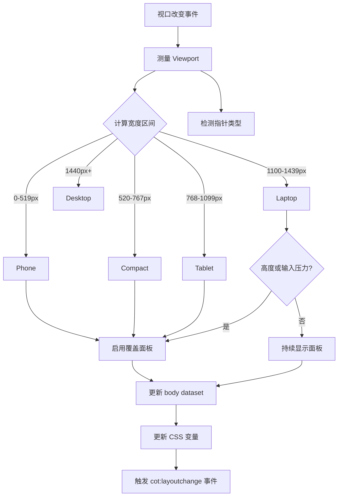
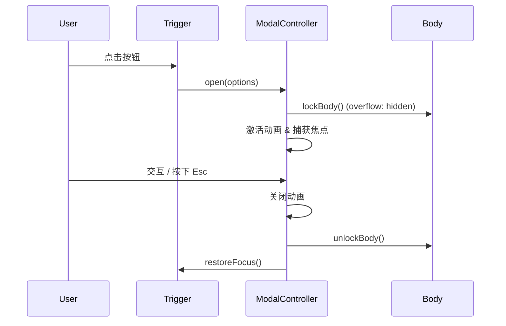
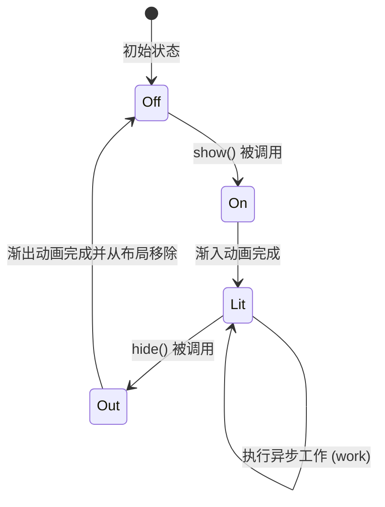
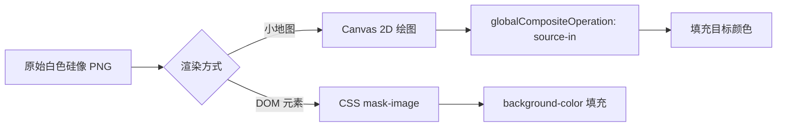
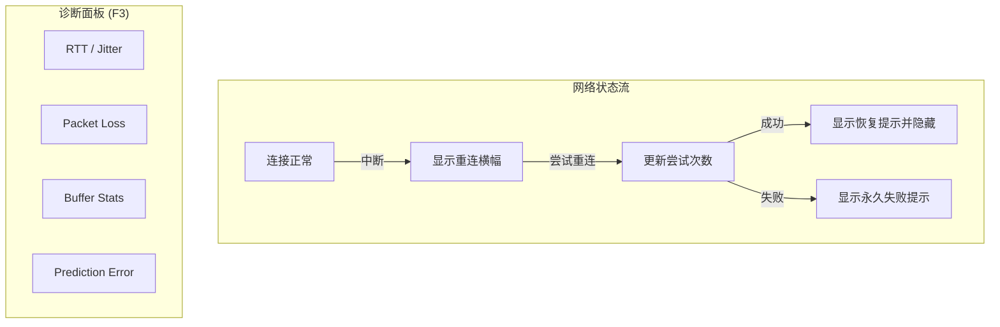

# 基础 UI 框架与通用组件

## 目录
1. [模块概览](#模块概览)
2. [DOM 抽象与类型安全构建](#dom-抽象与类型安全构建)
3. [响应式布局系统](#响应式布局系统)
4. [模态框系统 (Modal System)](#模态框系统-modal-system)
5. [全屏过渡动画 (Transition)](#全屏过渡动画-transition)
6. [字体与图标管理](#字体与图标管理)
7. [启动屏幕与网络状态反馈](#启动屏幕与网络状态反馈)
8. [核心组件列表](#核心组件列表)
9. [文件引用](#文件引用)

Claude of Tanks 的 UI 基础架构旨在构建一个高性能、响应式且具有高度一致性的 Web UI。与传统的重量级前端框架不同，本项目采用轻量级的原生 DOM 封装方案，结合 TypeScript 的强类型特性，确保了在复杂的 3D 游戏环境下 UI 层的流畅运行。

该框架的核心设计理念是“语义化响应式”和“无障碍优先”。它不依赖于具体的设备名称，而是通过分析视口压力（宽度和高度区间）以及输入方式（粗略指针 vs 精确指针）来动态调整布局。同时，所有的通用组件（如模态框、过渡动画）都内置了完善的焦点管理和屏幕阅读器支持，确保了游戏在各种环境下的可用性。

## 模块概览

在 `src/ui` 目录下，基础架构由一系列职能明确的 TypeScript 文件组成。这些文件共同构成了一个分层的 UI 系统：

*   **底层抽象层**：`dom.ts` 提供了类型安全的 DOM 操作封装。
*   **布局与适配层**：`responsiveLayout.ts` 负责实时视口监测与布局分级。
*   **通用组件层**：`modal.ts`、`transition.ts` 提供了 UI 交互的核心控件。
*   **资源管理层**：`fonts.ts`、`icons.ts`、`uiIcons.ts` 负责排版、图标及坦克视角的渲染。
*   **系统状态层**：`bootScreen.ts` 和 `networkStatus.ts` 负责游戏生命周期中的关键状态反馈。

该模块共包含约 60 个 TypeScript 文件，其中基础框架相关文件约 15 个，其余为具体的业务逻辑组件（如车库界面、战斗 HUD 等）。本页面将重点介绍这些基础架构的实现原理。

## DOM 抽象与类型安全构建

为了在不引入 React/Vue 等框架的前提下保持代码的可维护性，项目在 `dom.ts` 中封装了一套极简的 DOM 构建工具。

通过使用 TypeScript 的泛型和 `HTMLElementTagNameMap`，`createElement` 函数能够自动推断返回元素的具体类型。这意味着开发者在创建一个 `button` 元素后，可以直接访问其 `type` 或 `disabled` 属性，而无需进行手动的类型断言。

```typescript
/** 创建元素，可选分配类名并附加到父节点 */
export function createElement<Tag extends keyof HTMLElementTagNameMap>(
  tag: Tag,
  className = '',
  parent: ParentNode | null = null,
): HTMLElementTagNameMap[Tag] {
  const element = document.createElement(tag);
  if (className) element.className = className;
  if (parent) parent.appendChild(element);
  return element;
}
```

此外，`ensureStyle` 函数实现了 CSS-in-JS 的按需注入模式。它通过检查 `document` 中是否存在特定 ID 的样式表，确保全局样式（如字体定义、通用动画）只被注入一次，避免了样式冗余和重复解析的开销。

**Section sources**:
- [dom.ts](src/ui/dom.ts)

## 响应式布局系统

响应式布局是 Claude of Tanks 适配多端设备的核心。它摒弃了基于 `User-Agent` 的设备猜测，转而采用一种基于“视口带宽”（Viewport Bands）的合同机制。

### 布局分级逻辑

系统将视口宽度划分为五个等级：`phone`、`compact`、`tablet`、`laptop` 和 `desktop`。同时，它还会监测输入模式（`coarse` 指针通常代表触摸设备），并根据这些信号综合判断是否应该启用“覆盖面板”（Overlay Panels）模式。

下面的流程图展示了视口测量如何转化为最终的 UI 状态：



当视口发生变化时，`installResponsiveLayout` 会通过 `requestAnimationFrame` 调度一次测量任务。测量结果不仅会通过 `dataset` 属性反映在 `body` 标签上（例如 `data-cot-width="phone"`），还会更新一系列 CSS 全局变量（如 `--cot-ui-scale`）。这使得 CSS 能够直接利用属性选择器进行响应式设计，而无需在每个组件中编写复杂的媒体查询。

### 响应式断点配置

在 `responsiveLayout.ts` 中，断点的定义是严格冻结的，确保了全系统的一致性：

```typescript
export const VIEWPORT_WIDTH_BANDS = Object.freeze({
  phone: Object.freeze({ min: 0, max: 519 }),
  compact: Object.freeze({ min: 520, max: 767 }),
  tablet: Object.freeze({ min: 768, max: 1099 }),
  laptop: Object.freeze({ min: 1100, max: 1439 }),
  desktop: Object.freeze({ min: 1440, max: Infinity }),
});
```

这种设计允许 UI 缩放比例（`scale`）在 0.78 到 1.08 之间平滑波动，从而在保持设计比例的同时，尽可能填满不同尺寸的屏幕空间。

**Section sources**:
- [responsiveLayout.ts](src/ui/responsiveLayout.ts)

## 模态框系统 (Modal System)

`modal.ts` 实现了一个高度可定制且符合无障碍规范的模态框系统。它被广泛应用于车库详情、设置界面以及战斗结算。

### 核心功能与焦点管理

模态框系统不仅负责视觉呈现，更重要的是管理用户的交互焦点。当模态框打开时，它会自动锁定 `body` 的滚动，并将焦点捕获在对话框内部。通过监听 `Tab` 键，它确保焦点在首尾可聚焦元素之间循环，防止用户通过键盘操作意外跳出模态框。



模态框的设计采用了典型的“插槽”模式：控制器拥有头部（Header）、主体（Body）和底部（Footer），而具体的内容则由调用者填充。这种分离确保了所有的对话框在视觉风格（如字体栈、间距、过渡动画）上完全统一，不会因为业务逻辑的不同而产生视觉偏差。

### 模态框控制器接口

`ModalController` 暴露了简洁的 API 来管理对话框的生命周期和内容：

```typescript
export interface ModalController {
  root: HTMLDivElement;
  panel: HTMLElement;
  header: HTMLElement;
  body: HTMLDivElement;
  footer: HTMLElement;
  closeButton: HTMLButtonElement;
  isOpen(): boolean;
  setTitle(value: unknown): void;
  setEyebrow(value: unknown): void;
  setSubtitle(value: unknown): void;
  open(options?: ModalOpenOptions): void;
  close(options?: ModalCloseOptions): void;
  dispose(): void;
}
```

**Section sources**:
- [modal.ts](src/ui/modal.ts)

## 全屏过渡动画 (Transition)

为了消除游戏状态切换（如从车库进入工作室）时的视觉突跳，`transition.ts` 提供了一套品牌化的全屏过渡方案。

### 状态切换序列

过渡动画不仅仅是一个简单的淡入淡出，它还负责在后台执行繁重的初始化工作。`TransitionScreen` 提供了一个 `run` 方法，它接受一个异步任务，并在任务执行期间显示带有进度条的加载界面。



该系统的一个关键特性是“背景预热”。在显示过渡界面时，它会从 `featuredShots.ts` 中随机选择一张精美的坦克截图作为背景。为了防止背景切换时的闪烁，系统会先使用一张已预加载的低分辨率图片占位，待高清图片解码完成后再平滑替换。

### 自动化兼容性

考虑到自动化测试和无头探测器（Headless Probes）的需求，过渡系统内置了检测逻辑。如果检测到 `navigator.webdriver` 或 URL 中包含 `?notrans` 参数，所有的过渡效果都会被跳过，任务将同步执行，以确保测试脚本能够立即捕获到目标状态。

**Section sources**:
- [transition.ts](src/ui/transition.ts)

## 字体与图标管理

UI 的视觉品质很大程度上取决于排版和图标的细腻程度。

### 字体系统 (Fonts)

项目使用了自托管的 **ABC Monument Grotesk** 字体库。`fonts.ts` 不仅定义了 `FONT_STACK`（基础字体栈）和 `FONT_COND`（紧凑字体栈），还通过 `ensureFonts` 函数实现了字体的预热。

为了解决 Web 字体加载瞬间的“闪烁”问题，系统会显式调用 `document.fonts.load` 加载 UI 中常用的字重（500, 600, 700, 800）。此外，针对 HUD 中的计时器和数值，系统强制启用了 `tabular-nums`，确保数字在跳动时不会产生水平抖动。

### 图标系统 (Icons)

图标管理分为两个部分：
1.  **UI 矢量图标** (`uiIcons.ts`)：包含大量的 SVG 路径定义，用于通用的 UI 按钮和导航。
2.  **坦克视角图标** (`icons.ts`)：负责处理由模型预渲染生成的坦克视角图（WebP 格式）。

一个独特的设计是“着色硅像”（Tinted Silhouettes）。为了在小地图或击杀列表中显示不同颜色的坦克图标，系统并不存储多种颜色的文件，而是存储一张白色的 Alpha 掩码图。通过 `tintedIcon` 函数，系统会在 Canvas 中实时绘制并着色，或者通过 CSS `mask-image` 配合 `background-color` 实现动态着色。



### 矢量图标生成器

`uiIconSVG` 函数允许开发者快速生成一致的内联 SVG 图标：

```typescript
export function uiIconSVG(id: string, size = 24, color = 'currentColor', className = ''): string {
  const body = (P as Readonly<Record<string, string>>)[id];
  if (!body) return '';
  const cls = className ? ` class="${className}"` : '';
  return `<svg${cls} viewBox="0 0 24 24" width="${size}" height="${size}" aria-hidden="true" style="color:${color}">${body}</svg>`;
}
```

**Section sources**:
- [fonts.ts](src/ui/fonts.ts)
- [icons.ts](src/ui/icons.ts)
- [uiIcons.ts](src/ui/uiIcons.ts)

## 启动屏幕与网络状态反馈

### 启动屏幕 (BootScreen)

`bootScreen.ts` 负责管理游戏的初次加载体验。与传统的“伪进度条”不同，这里的进度条是基于真实加载阶段的“加权权重”计算的。

例如，天空盒的烘焙（Sky baking）和车辆材质的着色（Vehicle painting）被赋予了更高的权重，因为它们在实际运行中消耗的时间最长。通过这种方式，进度条的推进速度在用户看来是平滑且真实的。

此外，启动屏幕还包含一个关键的“交互门控”（Entry Gate）。由于现代浏览器限制了非交互状态下的音频播放，启动屏幕要求用户点击任意键进入游戏，这个动作同时也触发了 `AudioContext` 的恢复。

### 网络状态监测 (NetworkStatus)

对于多人对战，实时的网络反馈至关重要。`networkStatus.ts` 提供了一个常驻的横幅，用于显示重连状态。更高级的功能是通过 `F3` 键触发的诊断面板，它能实时显示 RTT（往返时延）、抖动（Jitter）、丢包率以及预测误差等底层网络指标。



**Section sources**:
- [bootScreen.ts](src/ui/bootScreen.ts)
- [networkStatus.ts](src/ui/networkStatus.ts)

## 核心组件列表

以下是 UI 框架中的核心类与函数：

| 组件 / 函数 | 所在文件 | 说明 |
| :--- | :--- | :--- |
| `createElement` | `dom.ts` | 类型安全的 DOM 元素创建工具 |
| `installResponsiveLayout` | `responsiveLayout.ts` | 初始化视口监测与响应式系统 |
| `createModal` | `modal.ts` | 创建一个具有焦点管理功能的模态框控制器 |
| `createTransition` | `transition.ts` | 创建全屏状态切换过渡器 |
| `ensureFonts` | `fonts.ts` | 注入字体样式并预热字体资源 |
| `tintedIcon` | `icons.ts` | 生成动态着色的坦克硅像 Canvas |
| `uiIconSVG` | `uiIcons.ts` | 获取 UI 矢量图标的内联 SVG 字符串 |
| `createBootScreen` | `bootScreen.ts` | 初始化加权加载屏幕 |
| `createNetworkStatus` | `networkStatus.ts` | 初始化网络状态横幅与诊断面板 |

## 文件引用

本章节涉及的关键源码文件如下：

*   [src/ui/dom.ts](src/ui/dom.ts) - DOM 操作封装
*   [src/ui/responsiveLayout.ts](src/ui/responsiveLayout.ts) - 响应式布局逻辑
*   [src/ui/modal.ts](src/ui/modal.ts) - 模态框系统实现
*   [src/ui/transition.ts](src/ui/transition.ts) - 全屏过渡动画
*   [src/ui/fonts.ts](src/ui/fonts.ts) - 字体定义与管理
*   [src/ui/icons.ts](src/ui/icons.ts) - 坦克视角图标处理
*   [src/ui/uiIcons.ts](src/ui/uiIcons.ts) - UI 矢量图标库
*   [src/ui/bootScreen.ts](src/ui/bootScreen.ts) - 启动加载屏幕
*   [src/ui/networkStatus.ts](src/ui/networkStatus.ts) - 网络状态反馈
*   [src/ui/featuredShots.ts](src/ui/featuredShots.ts) - 精选背景图配置
*   [src/ui/imagePreload.ts](src/ui/imagePreload.ts) - 图片预加载工具
