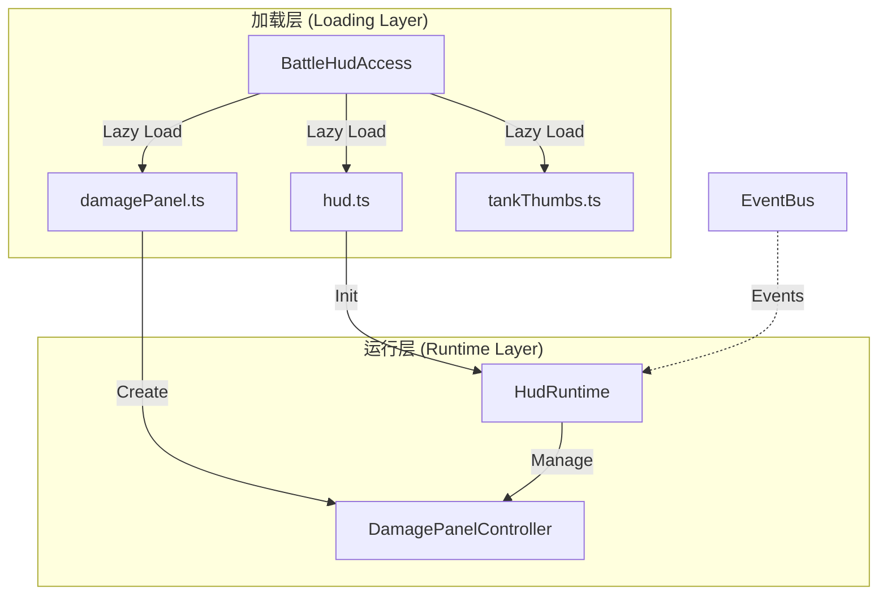
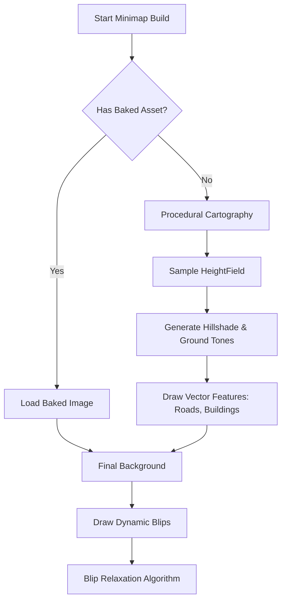
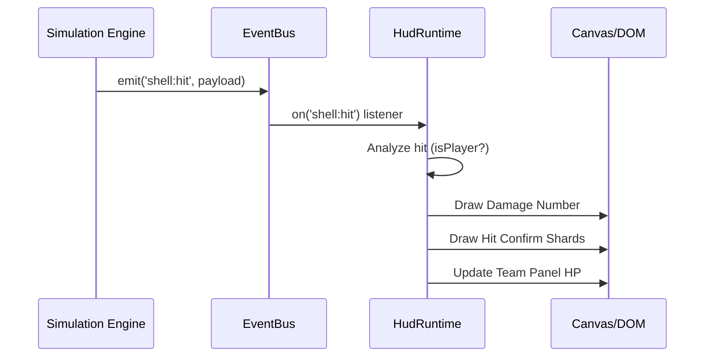
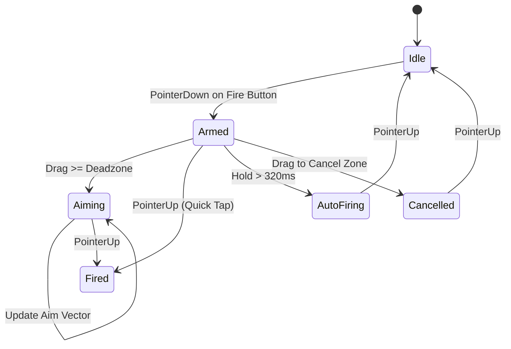

# 战斗 HUD 与实时交互

## 目录
1. [模块概览](#模块概览)
2. [架构设计](#架构设计)
   - [延迟加载与初始化](#延迟加载与初始化)
   - [渲染策略：Canvas 与 DOM 的结合](#渲染策略canvas-与-dom-的结合)
3. [核心组件实现](#核心组件实现)
   - [HUD 主控制器 (HudRuntime)](#hud-主控制器-hudruntime)
   - [损伤面板 (DamagePanel)](#损伤面板-damagepanel)
   - [小地图系统 (Minimap)](#小地图系统-minimap)
   - [击中反馈系统 (ShotInfo)](#击中反馈系统-shotinfo)
4. [实时数据同步机制](#实时数据同步机制)
   - [事件驱动的交互模型](#事件驱动的交互模型)
   - [仿真层数据映射](#仿真层数据映射)
5. [移动端交互与手势优化](#移动端交互与手势优化)
   - [动态开火手势 (Dynamic Aim)](#动态开火手势-dynamic-aim)
   - [布局自适应策略](#布局自适应策略)
6. [关键算法与逻辑](#关键算法与逻辑)
   - [准星扩缩与穿深计算](#准星扩缩与穿深计算)
   - [小地图元素排布与避让](#小地图元素排布与避让)
7. [结算与设置系统](#结算与设置系统)
   - [结算界面 (EndScreen)](#结算界面-endscreen)
   - [实时设置调整](#实时设置调整)
8. [性能考量](#性能考量)
   - [零分配渲染循环](#零分配渲染循环)
   - [频率控制与节流](#频率控制与节流)
9. [参考文件](#参考文件)

## 模块概览

战斗 HUD (Heads-Up Display) 是玩家与仿真引擎交互的核心桥梁。它不仅实时反映了坦克的物理状态、环境感知和战斗反馈，还承载了复杂的输入逻辑，特别是在移动端适配方面。该模块位于 `src/ui` 目录下，包含约 64 个源文件，涵盖了从基础 DOM 渲染到高性能 Canvas 绘图的各类组件。

本章节将重点介绍以下核心子模块：
- **HUD 主控制器**：负责整体界面的布局、准星渲染、血条管理及战斗事件的分发。
- **损伤面板**：展示坦克的模块损坏情况、成员状态及实时生命值。
- **小地图系统**：实现敌我识别、方位显示及地形背景的动态加载。
- **移动端控制层**：针对触摸屏优化的手势识别与虚拟摇杆系统。
- **数据接入层**：通过 `BattleHudAccess` 实现仿真层与 UI 层的低延迟同步。
- **击中反馈与统计**：通过 `ShotInfo` 和 `EndScreen` 提供详细的战斗表现反馈。

在深度分析中，我们将揭示系统如何处理每秒 60 帧的实时数据更新，同时保持极低的内存分配开销，并探讨移动端手势识别如何平衡操作的灵活性与准确性。

**模块规模统计**:
- 总文件数：64
- 核心逻辑文件：约 20 个
- 重点覆盖子模块：HUD Controller, Damage Panel, Minimap, Touch Controls, Battle Access, Shot Feedback, Settlement.

## 架构设计

战斗 HUD 的架构设计遵循“性能优先”和“关注点分离”的原则。由于战斗界面需要处理高频率的视觉反馈（如准星抖动、受击指示），其底层实现采用了 Canvas 2D 绘图与标准 DOM 元素的混合模式。

### 延迟加载与初始化

为了优化首屏加载性能，战斗相关的 UI 组件并不会在游戏启动时立即加载。`BattleHudAccess` 充当了延迟加载的守门员。



`BattleHudAccess` 确保只有在进入战斗场景时，才会加载重型的战斗 UI 脚本和资源（如坦克缩略图、损伤图谱）。这种设计不仅减少了车库模式下的内存占用，还通过单一的入口点简化了战斗 UI 的生命周期管理。初始化过程中，`initHud` 会建立与 `EventBus` 的订阅关系，确保后续的战斗事件能够被准确捕获。

### 渲染策略：Canvas 与 DOM 的结合

HUD 采用了混合渲染策略：
- **Canvas 2D**：用于渲染高频更新且形状复杂的元素，如准星（Reticle）、受击指示器（Hit Indicators）和击中确认（Hit Confirm）。Canvas 能够提供像素级的精确控制，并且在处理数百个绘图操作时比 DOM 具有更高的性能。例如，准星的散布圆需要根据物理引擎的 bloom 值实时缩放，Canvas 的 `arc` 和 `stroke` 操作可以在极低的开销下完成这一任务。
- **DOM (HTML/CSS)**：用于渲染结构化、具有复杂交互或动画效果的面板，如血条列表、弹药选择器、小地图容器和结算界面。利用 CSS 的布局能力和 GPU 加速动画（如 `transform` 和 `opacity`），可以轻松实现响应式布局。例如，战绩统计列表使用 DOM 实现，可以方便地利用 CSS Flexbox 进行排版，并支持鼠标悬停等交互。

**Section sources**:
- [battleHudAccess.ts](src/ui/battleHudAccess.ts)
- [hud.ts](src/ui/hud.ts)

## 核心组件实现

### HUD 主控制器 (HudRuntime)

`HudRuntime` 是整个战斗 UI 的心脏。它通过 `update(frame: HudFrame)` 方法接收来自仿真引擎的每一帧状态，并协调各个子系统的渲染。

```typescript
// src/ui/hud.ts 核心更新逻辑
export function initHud(bus: EventBus): HudRuntime {
  // ... 初始化 Canvas 和 DOM 根节点
  const hud: HudRuntime = {
    update(frame: HudFrame) {
      const dt = Math.max(0, Math.min(0.1, frame.timeS - lastTimeS)) || 1 / 60;
      lastTimeS = frame.timeS;

      // 更新子系统状态
      updateSpecialAction(frame.player);
      updateDriveReadout(frame.player, frame.timeS);
      updateSpotting(frame);
      updateTeams(frame);

      // 组装瞄准视图并执行渲染
      assembleAimView(frame.camera, frame.aim);
      renderCanvas(dt);
      
      // 更新世界空间 UI（如坦克头顶血条）
      if (frame.camera) updateHpBars(frame);
      
      // 节流更新小地图 (20Hz)
      if (mmDirty || mmNowMs - mmLastPaintMs >= 50) {
        drawMinimap(frame);
      }
    }
  };
  return hud;
}
```

在 `renderCanvas` 中，系统会根据当前的 `HudMode`（战斗、狙击、隐藏）决定渲染内容。狙击模式下会额外绘制暗角（Vignette）和十字准线，增强沉浸感。`assembleAimView` 函数负责将 3D 世界中的瞄准点投影到 2D 屏幕坐标，并计算准星的像素半径。

### 损伤面板 (DamagePanel)

损伤面板负责将复杂的坦克内部状态（模块损坏、成员伤亡）转化为直观的视觉语言。它通常位于屏幕左下角，包含一个动态旋转的坦克俯视图。

该组件通过 `setPose` 接收坦克的实时偏航角（Yaw）、炮塔转角和相机朝向，从而在面板上准确反映炮塔相对于车体的指向。当某个模块（如发动机、弹药架）受损时，面板会通过闪烁和颜色变化（黄色代表受损，红色代表被摧毁）提醒玩家。此外，面板还集成了隐蔽性指示器（Camo Indicator），通过一个“眼睛”图标显示玩家当前的隐蔽状态（如是否躲在草丛中）。

### 小地图系统 (Minimap)

小地图系统不仅是一个静态的地形图，它还集成了动态的敌我识别和方位感知逻辑。



小地图支持“北向向上”和“航向向上”两种模式。为了保证在大量坦克聚集时的可读性，系统实现了一个**元素避让算法（Blip Relaxation）**，通过迭代计算将重叠的图标推开，确保每个单位都能被清晰辨认。背景渲染支持从 3D 场景实时截取的正交投影图（Baked Asset），也支持基于高度图（HeightField）生成的程序化地图，确保了在不同环境下的兼容性。

### 击中反馈系统 (ShotInfo)

`ShotInfo` 模块提供了深度的战斗情报。当玩家击中敌人或被敌人击中时，该模块会生成详细的反馈卡片。

卡片内容包括：
- **装甲示意图**：展示炮弹击中的具体位置及其等效装甲厚度。
- **击穿分析**：显示炮弹的穿深随机值与装甲厚度的对比。
- **伤害统计**：记录单次击中的伤害、模块损坏和成员伤亡情况。
- **实时日志**：在屏幕一侧滚动显示最近的战斗事件，方便玩家复盘。

**Section sources**:
- [hud.ts](src/ui/hud.ts)
- [damagePanel.ts](src/ui/damagePanel.ts)
- [minimapAssetRuntime.ts](src/ui/minimapAssetRuntime.ts)
- [shotInfo.ts](src/ui/shotInfo.ts)

## 实时数据同步机制

### 事件驱动的交互模型

HUD 与仿真层之间的通信主要通过 `EventBus` 进行。这种解耦设计允许 UI 层只在必要时才响应状态变化，而不是每帧都去主动轮询。

典型的战斗事件流如下：
1. **炮弹击中**：仿真引擎发出 `shell:hit` 事件。
2. **HUD 响应**：
   - 检查攻击者是否为玩家：若是，则触发 `pushDamageNumber`（飘字）和 `hitMark`（击中反馈）。
   - 检查受击者是否为玩家：若是，则调用 `pushHitDirection`（受击指示弧）。
3. **数据更新**：更新相关的内部计数器或状态机。



这种架构保证了 UI 的响应速度，同时降低了仿真引擎的负担。

### 仿真层数据映射

为了保持低延迟，HUD 直接访问仿真层暴露的精简状态对象（如 `TankState` 和 `CombatState`）。`HudFrame` 结构体封装了当前帧的所有关键数据，包括相机参数、玩家坦克引用、可见坦克列表以及瞄准约束。

这种“推模式”的数据传递确保了 UI 渲染与仿真引擎的物理计算在时间轴上是完全对齐的，避免了反馈延迟。例如，坦克的行驶速度（Speedometer）是直接从物理引擎的线速度向量计算而来的，没有任何平滑滞后。

**Section sources**:
- [hud.ts](src/ui/hud.ts)
- [hitEventFormat.ts](src/ui/hitEventFormat.ts)

## 移动端交互与手势优化

移动端的战斗交互是本模块最具挑战性的部分。由于缺乏物理按键，系统必须通过复杂的手势识别来模拟精确的坦克控制。

### 动态开火手势 (Dynamic Aim)

`createMobileFireGesture` 实现了一种混合式的开火逻辑。



这种设计的巧妙之处在于：
- **点按即火**：快速点击火炮按钮立即射击。
- **拖动瞄准**：按住按钮并滑动可以微调准星，松开时射击。这解决了移动端“开火”与“瞄准”冲突的问题。
- **持续开火**：长按按钮进入自动射击模式（适用于机关炮或自动装弹机）。
- **取消机制**：如果玩家改变主意，可以将手指滑动到特定的取消区域，安全撤回射击意图。

### 布局自适应策略

在移动端，HUD 会自动切换到 `cot-touch-layout`。此时：
- **弹药与消耗品**：从底部的水平排列重组为右侧的垂直拇指操作区。
- **小地图**：移动到左上角，并缩小尺寸以腾出视野。
- **虚拟摇杆**：在左下角生成，支持动态中心点以适应不同玩家的握持习惯。
- **交互优化**：隐藏非必要的文字标签，放大点击热区，确保在小屏幕上的操作准确性。例如，弹药切换使用了“展开-选择”的二级菜单模式，节省了常驻空间。

**Section sources**:
- [touchControls.ts](src/ui/touchControls.ts)
- [touchControlsAccess.ts](src/ui/touchControlsAccess.ts)

## 关键算法与逻辑

### 准星扩缩与穿深计算

准星的渲染不仅仅是画圆。它反映了仿真引擎中的 **2σ 散布圆**。
- **扩缩逻辑**：`smoothRadPx` 变量通过指数平滑算法（Exponential Smoothing）追踪目标的物理散布半径。当坦克移动或开火时，散布圆会瞬间扩大（Bloom），然后随着瞄准时间的增加平滑收缩（Convergence）。
- **穿深指示**：系统每帧会沿炮管方向进行射线检测。如果准星指向敌方坦克，它会根据当前炮弹的穿透力随机值与命中位置的装甲厚度计算穿透概率，并将准星中心点染成绿色（必穿）、橙色（概率）或红色（不穿）。这一计算是在 UI 层完成的，但使用了仿真层提供的装甲模型数据。

### 小地图元素排布与避让

为了解决多个单位重叠导致的“图标丛”问题，系统采用了一种基于物理排斥的松弛算法。

```typescript
// src/ui/hud.ts 中的小地图避让算法简化
const MIN_SEP = 13.5; // 最小像素间距
for (let it = 0; it < 6; it++) { // 多次迭代以收敛
  let moved = false;
  for (let i = 0; i < blipCount; i++) {
    for (let j = i + 1; j < blipCount; j++) {
      const a = blips[i], b = blips[j];
      let dx = b.x - a.x, dy = b.y - a.y;
      const d = Math.hypot(dx, dy);
      if (d < MIN_SEP) {
        // 计算推力并应用偏移，玩家图标作为固定锚点不移动
        const push = MIN_SEP - d;
        if (a.fixed && !b.fixed) { b.x += dx * push; b.y += dy * push; }
        else if (!a.fixed && !b.fixed) {
          a.x -= dx * push / 2; a.y -= dy * push / 2;
          b.x += dx * push / 2; b.y += dy * push / 2;
        }
        moved = true;
      }
    }
  }
  if (!moved) break;
}
```

该算法在保持地理位置基本准确的前提下，极大地提升了战术信息的呈现质量，特别是在战斗开始时的出生点区域。

**Section sources**:
- [hud.ts](src/ui/hud.ts)
- [minimapOrientation.ts](src/ui/minimapOrientation.ts)

## 结算与设置系统

### 结算界面 (EndScreen)

战斗结束后，`EndScreen` 会汇总并展示全场数据。它不仅显示胜负结果，还提供了深度的玩家表现分析。

主要展示内容：
- **个人战绩**：伤害总量、击毁数、协助伤害、受到的伤害。
- **团队表现**：两队玩家的排名列表，按经验值或伤害排序。
- **详细统计**：射击次数、命中次数、穿透次数、行驶距离等。
- **交互功能**：支持“返回车库”或“再次战斗”的快捷操作。

### 实时设置调整

在战斗过程中，玩家可以随时通过设置面板（Settings）调整操作偏好。
- **控制设置**：调整鼠标灵敏度、反转轴向、自定义键位。
- **界面设置**：开启/关闭受击指示器数值、调整小地图缩放比例、切换性能指标显示。
- **音效与画质**：实时调整主音量及各项音效比例，或快速切换画质预设以优化帧率。

这些调整会通过 `EventBus` 立即广播给 `HudRuntime` 或 `TouchControls`，实现无缝的体验更新。

**Section sources**:
- [endScreen.ts](src/ui/endScreen.ts)
- [settings.ts](src/ui/settings.ts)

## 性能考量

### 零分配渲染循环

在 `hud.update` 这种每秒执行 60 次的热点函数中，任何对象分配（如 `new THREE.Vector3()`）都会导致频繁的垃圾回收（GC），从而引发掉帧。

为了避免这种情况，HUD 模块广泛使用了**模块级预分配变量（Scratch Variables）**。所有向量计算、矩阵变换和状态转换都在这些重用的对象上进行。例如，在投影 3D 坐标到屏幕时，使用的 `_tmp` 向量和 `_mInv` 矩阵都是预先分配好的，避免了每帧产生数千个临时对象。

### 频率控制与节流

并非所有 UI 元素都需要以 60Hz 更新。
- **小地图**：节流至 20Hz。由于地图缩放比例较大，单位移动在短时间内位移极小，20Hz 的更新频率在视觉上已经足够流畅，同时节省了大量的 Canvas 绘图开销。
- **网络状态与 FPS**：更新频率更低（约 4Hz），因为玩家不需要实时观察每一帧的波动，平滑后的均值更具参考价值。
- **驱动数据**：速度计的指针更新频率为 30Hz，而数字显示仅为 10Hz，这种分级更新策略在保证动态感的同时降低了 DOM 操作频率。

> 💡 **设计权衡**
> 
> 在移动端，为了节省电力和减少发热，HUD 会根据设备性能等级（Device Tier）自动调整渲染质量，例如降低 Canvas 的分辨率或简化受击指示器的特效。系统会优先保证准星和开火反馈的流畅度，而牺牲一些次要装饰元素的细节。

**Section sources**:
- [hud.ts](src/ui/hud.ts)
- [driveTelemetry.ts](src/ui/driveTelemetry.ts)

## 参考文件

以下是实现战斗 HUD 与实时交互的关键源文件：

- [src/ui/hud.ts](src/ui/hud.ts)：HUD 主控制器与 Canvas 渲染核心。
- [src/ui/battleHudAccess.ts](src/ui/battleHudAccess.ts)：战斗 UI 资源的延迟加载与接入。
- [src/ui/damagePanel.ts](src/ui/damagePanel.ts)：损伤面板逻辑与坦克姿态显示。
- [src/ui/touchControls.ts](src/ui/touchControls.ts)：移动端触摸控制与手势识别。
- [src/ui/minimapAssetRuntime.ts](src/ui/minimapAssetRuntime.ts)：小地图资源管理与加载流。
- [src/ui/shotInfo.ts](src/ui/shotInfo.ts)：击中详细信息与战斗统计。
- [src/ui/endScreen.ts](src/ui/endScreen.ts)：战斗结算界面实现。
- [src/ui/settings.ts](src/ui/settings.ts)：实时设置调整面板。
- [src/ui/minimapOrientation.ts](src/ui/minimapOrientation.ts)：小地图坐标变换与朝向逻辑。
- [src/ui/driveTelemetry.ts](src/ui/driveTelemetry.ts)：行驶数据（速度、转速）的采集与平滑。
- [src/ui/hitEventFormat.ts](src/ui/hitEventFormat.ts)：战斗事件的格式化与视觉呈现定义。
- [src/ui/fonts.ts](src/ui/fonts.ts)：HUD 专用字体的加载与管理。
