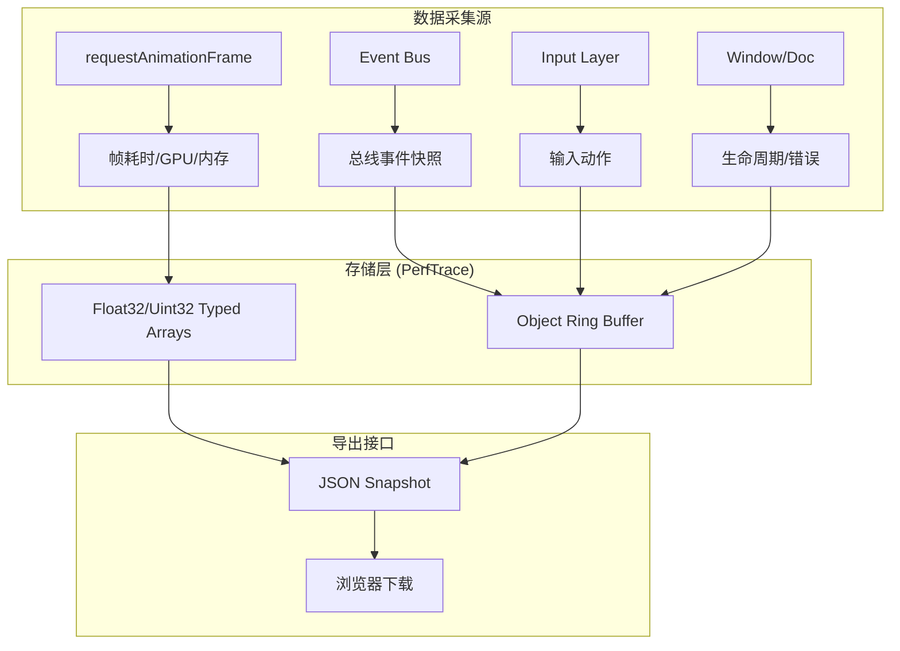
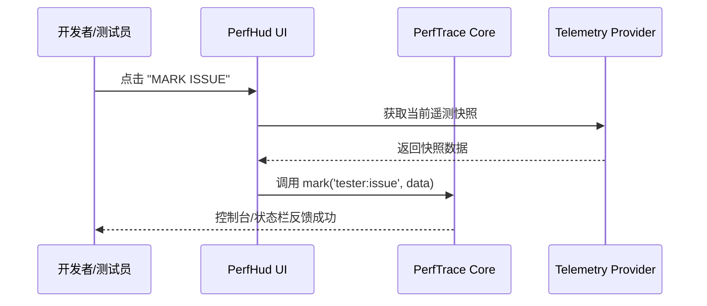
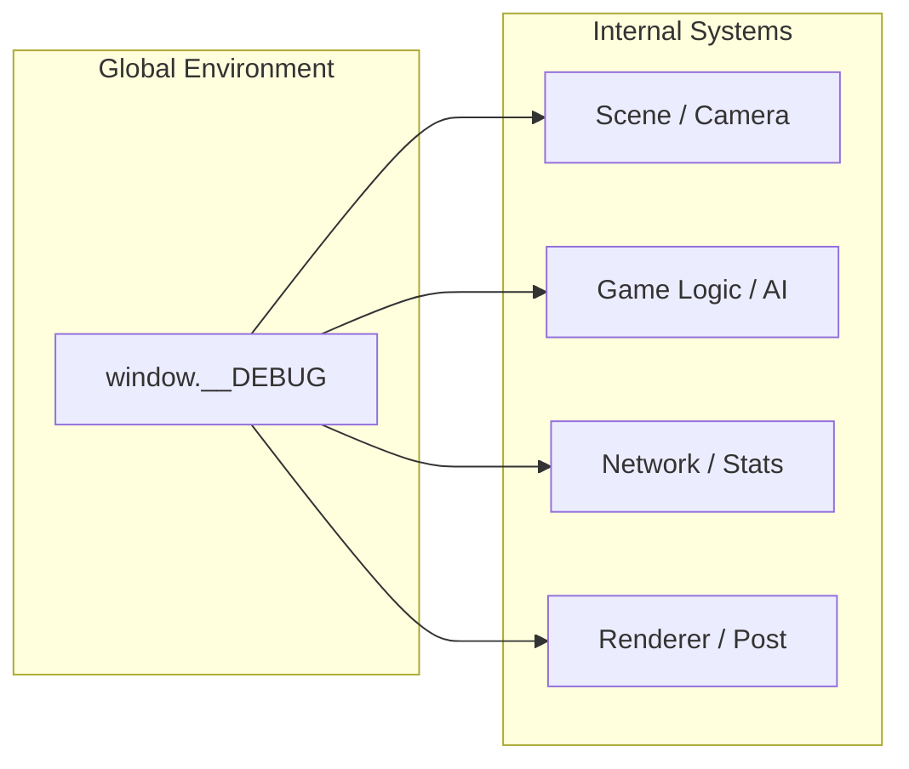
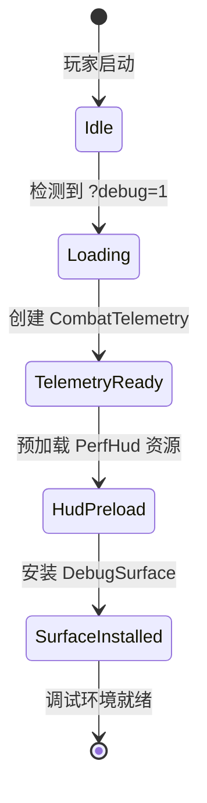

# 调试、性能追踪与回放工具

## 目录
1. [模块概览](#模块概览)
2. [性能追踪系统 (PerfTrace)](#性能追踪系统-perftrace)
   - [核心机制与数据采集](#核心机制与数据采集)
   - [控制台 API 与导出](#控制台-api-与导出)
3. [实时诊断 HUD (PerfHud)](#实时诊断-hud-perfhud)
   - [界面布局与关键指标](#界面布局与关键指标)
   - [交互功能](#交互功能)
4. [遥测系统 (Telemetry)](#遥测系统-telemetry)
   - [系统遥测 (DebugTelemetry)](#系统遥测-debugtelemetry)
   - [战斗遥测 (CombatTelemetry)](#战斗遥测-combattelemetry)
5. [调试渲染与交互 (DebugSurface)](#调试渲染与交互-debugsurface)
6. [工程化捕获系统 (Shot Runtime)](#工程化捕获系统-shot-runtime)
7. [战斗回放展示 (Battle Reels)](#战斗回放展示-battle-reels)
8. [诊断运行时 (Diagnostics Runtime)](#诊断运行时-diagnostics-runtime)
9. [文件参考](#文件参考)

## 模块概览

`Claude-of-Tanks` 内置了一套完整的开发者调试与性能追踪体系，旨在为开发人员提供实时的系统监控、离线的性能分析以及自动化的成果展示工具。该体系覆盖了从底层引擎指标到高层战斗逻辑的全方位数据采集。

**模块统计**：
- **核心文件数**：约 20 个源文件，分布在 `src/dev`、`src/ui` 和 `src/docs` 目录中。
- **主要子模块**：
  - **PerfTrace**：有界性能飞行记录仪，负责帧数据与事件的持久化记录。
  - **PerfHud**：基于 DOM 的实时诊断面板，提供直观的数据反馈。
  - **Telemetry**：多维遥测系统，涵盖系统环境、战斗事件与驾驶状态。
  - **DebugSurface**：全局调试入口，允许直接操作引擎内部状态。
  - **Shot Runtime**：确定性工程捕获系统，用于自动化视觉审计与成果展示。

该文档将深入探讨这些组件的实现机制，并指导开发者如何利用这些工具进行故障排查与性能优化。

## 性能追踪系统 (PerfTrace)

性能追踪系统（PerfTrace）是项目的“飞行记录仪”。它在开发环境（Vite Dev）中默认开启，在生产环境的 QA 路径（`?debug=1`）中延迟加载。该系统的核心目标是在不引入额外性能抖动（如 GC 停顿）的前提下，记录完整的渲染与逻辑时间轴。

### 核心机制与数据采集

`PerfTrace` 使用有界环形缓冲区（Ring Buffer）来管理内存，避免数据无限增长。帧数据（Frames）存储在类型化数组（Typed Arrays）中，而事件数据（Events）存储在固定容量的对象数组中。



`PerfTrace` 记录的内容包括：
- **帧基础指标**：帧间隔（gap）、模拟步长（dt）、渲染调用数（calls）、三角形数（tris）、着色器程序数（programs）等。
- **系统状态**：JS 堆内存占用（heap）、渲染缩放（renderScale）、输入状态（throttle/steer/fire）。
- **异常检测**：自动标记超过 50ms 的掉帧（Spike）和超过 250ms 的卡顿（Freeze）。
- **长任务监控**：通过 `PerformanceObserver` 记录浏览器主线程的 Long Tasks。

### 控制台 API 与导出

开发者可以通过浏览器控制台直接与 `window.__DEV_TRACE` 或 `window.__QA_TRACE` 交互。

```typescript
// src/dev/perfTrace.ts 中的 API 定义
const api = {
  mark: (name: string, data: unknown = {}) => push('mark', name, data),
  stats: () => { /* 返回压缩的健康摘要 */ },
  snapshot: () => { /* 生成完整的 JSON 快照 */ },
  download: () => { /* 触发浏览器下载 JSON 文件 */ },
  tail: (n = 100) => { /* 查看最近的事件 */ }
};
```

**如何解读追踪数据**：
导出的 JSON 文件包含 `frameSchema` 和 `frames` 数组。每一行 `frames` 数据对应一帧，开发者可以将其导入分析工具（如自定义的追踪查看器或数据分析脚本），通过 `gapMs` 字段定位性能瓶颈。

**Section sources**:
- [src/dev/perfTrace.ts](src/dev/perfTrace.ts)
- [docs/DEV-PERF-TRACE.md](docs/DEV-PERF-TRACE.md)

## 实时诊断 HUD (PerfHud)

`PerfHud` 是一个悬浮在游戏界面右上角的诊断面板，提供 4Hz 频率的实时数据更新。它不仅是数据的展示窗口，也是开发者在移动端或 QA 测试中快速导出报告的交互入口。

### 界面布局与关键指标

HUD 划分为多个逻辑区域，每个区域关注特定的系统维度：

1.  **FRAME**：实时 FPS、1% Low FPS、P50/P95/P99 耗时分布。
2.  **RENDER**：Draw Calls、三角形计数、资源驻留量（Geo/Tex）。
3.  **QUALITY**：当前分辨率、DPR、动态缩放比例及 GPU 型号。
4.  **SIMULATION**：当前阶段（Garage/Battle）、地图 ID、存活坦克数及炮弹数。
5.  **SHADOWS**：阴影级联（Cascades）状态、投射者/接收者数量。
6.  **NETWORK**：连接状态、RTT 延迟、抖动（Jitter）及丢包率。

### 交互功能

在开启 `PerfTrace` 的情况下，HUD 底部会显示三个关键操作按钮：
- **MARK ISSUE**：在追踪记录中插入一个 `tester:issue` 标记，方便回溯复现点。
- **COPY SUMMARY**：生成一个精简的 Markdown/JSON 文本报告并复制到剪贴板，适用于 Bug 报告。
- **EXPORT JSON**：直接触发完整追踪文件的下载。



**Section sources**:
- [src/ui/perfHud.ts](src/ui/perfHud.ts)
- [src/ui/dom.ts](src/ui/dom.ts)

## 遥测系统 (Telemetry)

遥测系统负责从各个子系统提取深度的运行指标。它采用提供者模式（Provider Pattern），允许不同的业务模块向诊断工具注入自定义数据。

### 系统遥测 (DebugTelemetry)

`DebugTelemetry` 负责采集引擎层面的重型数据。例如，它包含一个特殊的 **阴影贡献度采样器 (Shadow Contribution Sampler)**，通过在离屏画布上对比开启/关闭阴影的渲染结果，计算阴影对画面的实际影响（平均亮度差异、变化像素占比等）。

```typescript
// src/dev/debugTelemetry.ts 中的采样逻辑简述
async function sampleShadowContribution() {
  // 1. 渲染带阴影的变体
  renderVariant(true, withShadow);
  // 2. 渲染无阴影的变体
  renderVariant(false, withoutShadow);
  // 3. 逐像素对比亮度 (Luma)
  // ... 计算 delta ...
}
```

### 战斗遥测 (CombatTelemetry)

`CombatTelemetry` 仅在显式 QA 模式下安装，它通过监听 `EventBus` 记录详细的战斗行为：
- **炮弹追踪**：记录每一发炮弹的发射时间、目标距离、命中类型（坦克/地形/空气）以及未命中时的偏离距离（Miss Distance）。
- **AI 压力监控**：统计敌方坦克对玩家的瞄准次数、命中次数以及造成的伤害总量。

**如何添加自定义遥测项**：
1.  在 `DebugTelemetry` 的 `collect` 函数中添加新的字段。
2.  在 `PerfHud` 的 `renderDashboard` 函数中增加对应的 DOM 更新逻辑。
3.  如果需要通过总线监听，在 `CombatTelemetry` 中添加新的 `onCombatEvent` 监听器。

**Section sources**:
- [src/dev/debugTelemetry.ts](src/dev/debugTelemetry.ts)
- [src/dev/combatTelemetry.ts](src/dev/combatTelemetry.ts)
- [src/ui/driveTelemetry.ts](src/ui/driveTelemetry.ts)

## 调试渲染与交互 (DebugSurface)

`DebugSurface` 是暴露给全局环境（`window.__DEBUG`）的调试接口集合。它将复杂的内部依赖（如 `scene`、`camera`、`bus`）封装为一个扁平的 API 对象，方便开发者在控制台直接操作。

**主要功能列表**：
- **场景操作**：直接访问 `scene` 和 `world` 对象进行手动检查。
- **作弊与快速跳转**：`slayEnemies()` (消灭所有敌人), `fastForward()` (快进), `switchMap(id)` (切换地图)。
- **渲染设置**：动态调整 `shotMode` (截图模式) 或手动触发 `forceHitMark` (强制显示命中标记)。
- **性能探测**：获取 `battleVisualPool` (视觉对象池统计) 和 `gpuResidency` (GPU 驻留情况)。



**Section sources**:
- [src/dev/debugSurface.ts](src/dev/debugSurface.ts)
- [src/dev/debugIntent.ts](src/dev/debugIntent.ts)

## 工程化捕获 system (Shot Runtime)

`Shot Runtime` 是项目中最强大的成果展示工具。它是一套确定性的脚本系统，能够将游戏状态强行设置到特定的“配方（Recipe）”中，以生成高质量的审计截图或文档配图。

**核心流程**：
1.  **环境准备**：加载特定的地图、坦克模型及 FX 运行时。
2.  **配方执行**：执行如 `sniper_view` (狙击视角)、`detrack` (履带断裂特写) 或 `explosion` (爆炸瞬间) 的逻辑。
3.  **确定性冻结**：锁定 `VIEW_TIME`，冻结粒子系统和物理模拟，确保在任何机器上捕获的画面完全一致。

```typescript
// src/dev/shotViews.ts 中的配方示例
detrack() {
  hud.setMode('hidden');
  const ent = game.tankById.get('tiger1');
  orbitPose(ent, 10, 120, 10, 45); // 设置相机位置
  ent.visual.setTrackState('trackR', true); // 强制履带断裂状态
  bus.emit('module:state', { id: ent.id, module: 'trackR', state: 'red' });
}
```

**Section sources**:
- [src/dev/shotViews.ts](src/dev/shotViews.ts)
- [src/dev/shotRuntime.ts](src/dev/shotRuntime.ts)
- [src/dev/shotContract.ts](src/dev/shotContract.ts)

## 战斗回放展示 (Battle Reels)

`Battle Reels` 系统用于在文档或展示页面中嵌入精彩战斗片段。它不是实时的指令回放，而是预录制的高清视频展示系统。

**功能特性**：
- **网格化展示**：提供 20 个以上的战斗片段预览。
- **元数据关联**：每个回放关联特定的坦克型号（如 M1A2 vs T-90M）和地图环境。
- **交互控制**：支持键盘导航（方向键切换）和响应式布局适配。

**Section sources**:
- [src/docs/battleReels.ts](src/docs/battleReels.ts)

## 诊断运行时 (Diagnostics Runtime)

`MainDiagnosticsRuntime` 负责在检测到调试需求时，协调上述所有组件的安装。它确保了“按需加载”原则：普通玩家在启动时不会加载任何调试相关的重型代码（如 `debugSurface` 或 `perfHud` 的 UI 逻辑），从而保持极致的启动速度。



**Section sources**:
- [src/dev/mainDiagnosticsRuntime.ts](src/dev/mainDiagnosticsRuntime.ts)

## 文件参考

以下是本模块涉及的核心文件列表，建议开发者在进行故障排查时参考：

- **核心追踪与 HUD**：
  - `src/dev/perfTrace.ts`：性能追踪核心逻辑。
  - `src/ui/perfHud.ts`：实时诊断 HUD 实现。
  - `src/dev/debugSurface.ts`：全局调试表面安装器。
- **遥测数据采集**：
  - `src/dev/debugTelemetry.ts`：系统级遥测提供者。
  - `src/dev/combatTelemetry.ts`：战斗事件遥测。
  - `src/ui/driveTelemetry.ts`：驾驶状态遥测。
- **工程化与展示**：
  - `src/dev/shotViews.ts`：确定性捕获配方定义。
  - `src/dev/shotRuntime.ts`：捕获运行时环境。
  - `src/docs/battleReels.ts`：战斗回放展示组件。
- **运行时管理**：
  - `src/dev/mainDiagnosticsRuntime.ts`：诊断系统总控。
  - `src/dev/debugIntent.ts`：调试意图检测。
- **文档说明**：
  - `docs/DEV-PERF-TRACE.md`：开发者性能追踪操作指南。
