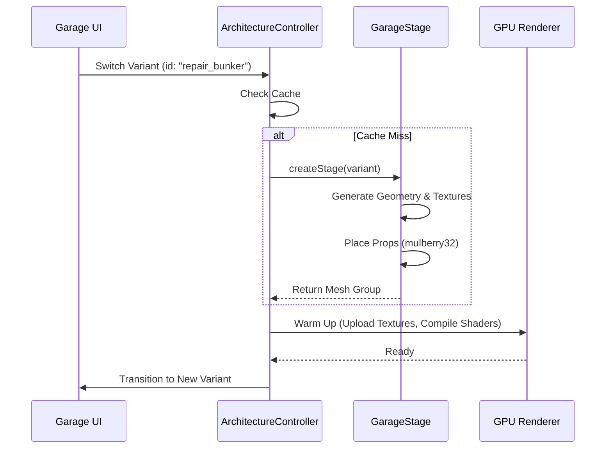
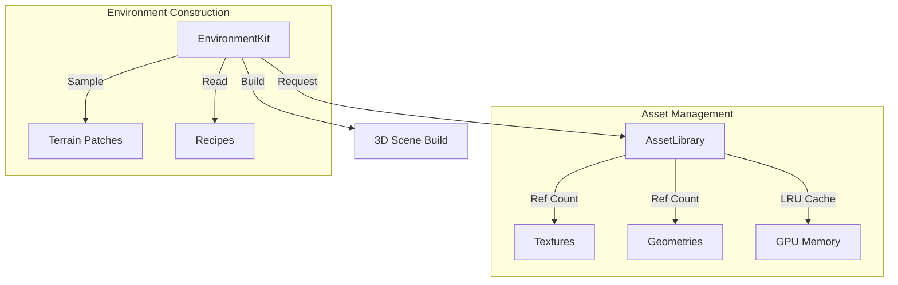
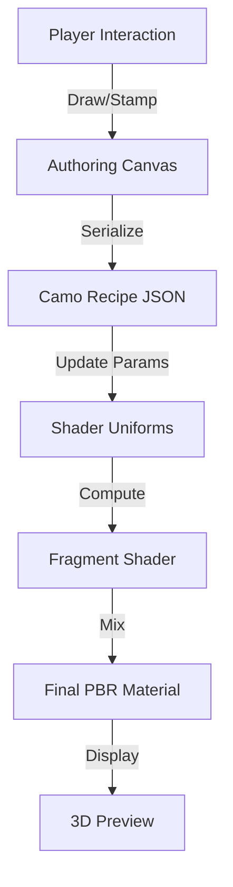

# 车库界面与环境系统

## 目录
1. [模块概览](#模块概览)
2. [引言](#引言)
3. [车库 UI 架构与核心逻辑](#车库-ui-架构与核心逻辑)
   - [Garage 主入口逻辑](#garage-主入口逻辑)
   - [架构控制器 (ArchitectureController) 与变体管理](#架构控制器-architecturecontroller-与变体管理)
   - [舞台构建 (GarageStage) 与程序化装饰](#舞台构建-garagestage-与程序化装饰)
4. [环境渲染系统深度解析](#环境渲染系统深度解析)
   - [环境套件 (EnvironmentKit) 的构建流程](#环境套件-environmentkit-的构建流程)
   - [地形采样、解码与羽化技术](#地形采样解码与羽化技术)
   - [资产库与引用计数内存优化](#资产库与引用计数内存优化)
5. [功能设施与细节生成系统](#功能设施与细节生成系统)
   - [设施详情 (FacilityDetails) 的参数化构建](#设施详情-facilitydetails-的参数化构建)
   - [通道与环境配方 (Recipes)](#通道与环境配方-recipes)
6. [坦克自定义：涂装工作室技术实现](#坦克自定义涂装工作室技术实现)
   - [基于 Canvas 的实时创作表面](#基于-canvas-的实时创作表面)
   - [涂装配方与材质烘焙流程](#涂装配方与材质烘焙流程)
7. [坦克档案系统与技术规格展示](#坦克档案系统与技术规格展示)
8. [主菜单、大厅与战斗衔接系统](#主菜单大厅与战斗衔接系统)
   - [多模式匹配与 WebRTC 信令集成](#多模式匹配与-webrtc-信令集成)
   - [车库状态同步与战斗手柄 (Handoff)](#车库状态同步与战斗手柄-handoff)
9. [性能考量与渲染优化技术](#性能考量与渲染优化技术)
10. [核心数据模型与接口定义](#核心数据模型与接口定义)
11. [文件引用](#文件引用)

## 模块概览

本模块是《Claude of Tanks》中规模最大、复杂度最高的非战斗系统，涵盖了车库 (Garage) 的 UI 交互、3D 环境渲染、坦克自定义以及战斗前的准备大厅。

- **文件规模**：涉及 `src/ui` 目录下约 30 个核心文件，总代码量超过 10,000 行。
- **子模块分布**：
  - **核心 UI (`garage.ts`)**：处理坦克轮播、装备、国家过滤及 UI 响应式布局。
  - **3D 架构与舞台 (`garageArchitecture.ts`, `garageStage.ts`)**：管理 3D 场景的生命周期、灯光及内部装饰。
  - **环境生成引擎 (`garageEnvironmentKit.ts`, `garageFacilityDetails.ts`)**：基于地形采样和程序化建模构建户外场景。
  - **自定义系统 (`customCamoStudio.ts`)**：提供涂装创作工具。
  - **匹配与大厅 (`playMenu.ts`)**：处理多人联机逻辑。
- **技术栈**：基于 Three.js 的 3D 渲染，结合原生 DOM 构建的响应式 UI。

## 引言

车库系统在《Claude of Tanks》中扮演着多重角色：它既是玩家的“基地”，也是展示坦克的“陈列室”，更是进入战斗前的“整备间”。为了提供极致的视觉体验和流畅的操作感，该系统在技术上融合了实时 3D 渲染、复杂的程序化建模以及深度的 UI 状态管理。

车库的设计理念是**“高性能的静态展示”**。与战斗场景不同，车库更注重材质细节、光影效果和环境氛围。系统通过 `GarageArchitectureController` 实现了环境的异步加载和 GPU 预热，确保玩家在切换不同风格的车库（如从“野外棚屋”切换到“海军干船坞”）时，能够获得丝滑的过渡体验。此外，车库系统还承担了繁重的坦克数据计算任务，通过 `GarageDossier` 将复杂的坦克技术规格实时呈现给玩家。

## 车库 UI 架构与核心逻辑

车库的 UI 架构采用了高度解耦的设计，将 2D 交互逻辑与 3D 渲染逻辑分离，通过状态同步机制保持一致。

### Garage 主入口逻辑

`garage.ts` 是整个模块的控制中枢。它不仅管理着 DOM 树的构建，还持有当前玩家的坦克选择状态。其核心逻辑包括：
- **坦克轮播 (Carousel)**：使用 `drag-scroll` 机制实现的坦克展示条，支持响应式布局，能够根据屏幕宽度自动调整展示数量。
- **实时过滤系统**：支持按国家（苏联、美国、德国等）和坦克类型过滤，过滤逻辑是瞬时的，通过操作 DOM 的显示状态实现。
- **装备系统集成**：玩家可以为坦克安装配件，如“改进型通风”或“输弹机”。这些选择会通过 `GarageSelection` 接口实时同步到 3D 坦克模型和 `PlayMenu` 大厅。

### 架构控制器 (ArchitectureController) 与变体管理

`GarageArchitectureController` 负责管理车库的 3D 变体 (Variants)。每个变体代表一种不同的建筑风格和环境。控制器通过 `Map<string, GarageEnvironmentBuild>` 缓存已构建的场景，并提供 `warmUp` 方法。在预热过程中，系统会遍历所有材质，强制 GPU 编译着色器并上传纹理，从而避免了在场景显示瞬间出现的帧率骤降（Hitch）。

### 舞台构建 (GarageStage) 与程序化装饰

`GarageStage.ts` 负责构建车库的内部环境。它使用了一种**“混合建模”**的方法：
1. **几何体生成**：通过 Three.js 的 `BufferGeometry` 程序化生成地板、墙壁和支撑桁架。
2. **纹理合成**：使用 Canvas 动态合成标志物、警告线和地面污渍纹理。
3. **程序化摆放**：使用 `mulberry32` 算法（一种确定性的伪随机数生成器）来摆放工具箱、轮胎、油桶等道具。这保证了在相同的种子下，每个玩家看到的车库内部陈设都是完全一致的。



**Section sources**:
- [garage.ts](src/ui/garage.ts)
- [garageArchitecture.ts](src/ui/garageArchitecture.ts)
- [garageStage.ts](src/ui/garageStage.ts)

## 环境渲染系统深度解析

环境渲染系统是车库模块中最具技术含量的部分，它通过采样真实战场地图的数据来构建户外背景。

### 环境套件 (EnvironmentKit) 的构建流程

`GarageEnvironmentKit.ts` 是户外环境的构建工厂。它的核心任务是根据 `GarageEnvironmentRecipe`（环境配方）组装出一个完整的 3D 场景包。一个典型的构建流程包括：
1. **地形解码**：从 Base64 格式的压缩数据中解码出地形高度图。
2. **地形生成**：构建一个 100x100 米的地形网格，并应用 PBR 纹理。
3. **建筑与植被摆放**：根据配方定义的坐标，摆放建筑模型和植被。
4. **远景生成**：构建多层远景几何体，模拟远处的山脉或城市天际线。

### 地形采样、解码与羽化技术

系统通过 `decodePatch` 函数将高度图数据还原为 `Float32Array`。为了让车库建筑能够平稳地坐落在起伏的地形上，系统采用了**“地形羽化” (Terrain Feathering)** 技术：
- **采样**：使用双线性插值 (`samplePatch`) 获取特定坐标的精确高度。
- **平整化**：在建筑物的占地范围内，强制地形高度保持一致（形成“平台”）。
- **过渡**：使用 `smoothstep` 函数在平台边缘和原始地形之间进行平滑插值，避免出现生硬的垂直切面。

### 资产库与引用计数内存优化

由于车库环境使用了大量的高分辨率纹理和复杂的树木模型，内存管理至关重要。`GarageEnvironmentAssetLibrary` 实现了以下优化：
- **引用计数**：每个纹理和模型都有引用计数。当一个环境变体被卸载时，只有不再被其他变体引用的资产才会被销毁。
- **纹理上限控制**：系统限制了同时驻留在显存中的纹理集数量（默认为 9 组）。当超过上限时，会根据“最近最少使用” (LRU) 原则清理旧纹理。
- **共享树木林**：所有的环境变体共享同一套树木几何体，仅通过实例矩阵 (`InstancedMesh`) 进行差异化展示。



**Section sources**:
- [garageEnvironmentKit.ts](src/ui/garageEnvironmentKit.ts)
- [garageEnvironmentRecipes.ts](src/ui/garageEnvironmentRecipes.ts)
- [garageTerrainPatches.generated.ts](src/ui/garageTerrainPatches.generated.ts)

## 功能设施与细节生成系统

`GarageFacilityDetails.ts` 提供了一套极其精细的参数化建模系统，用于生成车库内的各种工业设施。

### 设施详情 (FacilityDetails) 的参数化构建

该系统不使用预制的 FBX 模型，而是通过代码逻辑组合基础几何体（长方体、圆柱体）来构建复杂的设施。例如，一个“龙门吊”是由立柱、横梁、轨道、滑轮组和挂钩组成的，每个部分的大小、颜色和材质类（结构件、喷漆件、设备件、砖石件）都可以在代码中精确控制。

这种方法的优势在于：
- **极高的灵活性**：可以根据不同的车库变体轻松调整设施的规模和配色。
- **极致的性能**：所有的设施最终都会被合并为 `InstancedMesh`。例如，所有的“喷漆件”无论属于哪个设施，都会在同一个 Draw Call 中渲染。
- **零加载时间**：几何体是即时生成的，不需要从服务器下载大型模型文件。

### 通道与环境配方 (Recipes)

`GarageEnvironmentRecipes.ts` 定义了每个变体的“灵魂”。它规定了地形的纹理（草地、沙漠、雪地）、使用的树木种类、背景音乐的基调（Source Beat）、以及标志性的建筑（Landmark）。例如，“海军干船坞”变体配方会指定使用“砖石”材质的建筑和“龙门吊”设施，而“野外棚屋”则更倾向于使用“木质”和“简易遮阳棚”。

**Section sources**:
- [garageFacilityDetails.ts](src/ui/garageFacilityDetails.ts)
- [garageApproachDetails.ts](src/ui/garageApproachDetails.ts)
- [garageEnvironmentRecipes.ts](src/ui/garageEnvironmentRecipes.ts)

## 坦克自定义：涂装工作室技术实现

`CustomCamoStudio.ts` 是玩家展示个性的舞台，它实现了一套完整的实时纹理创作和预览系统。

### 基于 Canvas 的实时创作表面

工作室的核心是一个 512x256 的 HTML5 Canvas。玩家的每一个动作（点击、拖拽）都会转化为 `CamoStroke` 数据。系统支持多种画笔模式：
- **圆形/扁平画笔**：基础的绘画工具。
- **喷涂/像素**：带有纹理效果的画笔。
- **模板 (Stencils)**：如星形、V 形、六角形等，允许玩家快速放置复杂的几何图案。

### 涂装配方与材质烘焙流程

当玩家完成创作并点击“应用”时，系统会执行以下复杂的烘焙流程：
1. **坐标归一化**：将 Canvas 上的像素坐标转化为 0-100 的百分比坐标，以保持在不同分辨率下的比例一致。
2. **配方序列化**：将笔触数据、颜色、平铺参数（重复次数、旋转角度、镜像开关）序列化为 JSON 格式的“配方”。
3. **着色器更新**：将配方中的参数传递给坦克的 PBR 着色器。着色器会在 GPU 上实时计算涂装图案的平铺和混合，而不需要生成一张巨大的纹理图。



这种基于着色器的涂装实现方式极大地节省了显存，并且支持无限的平铺和旋转，而不会出现模糊或锯齿。

**Section sources**:
- [customCamoStudio.ts](src/ui/customCamoStudio.ts)
- [customCamoStudioAccess.ts](src/ui/customCamoStudioAccess.ts)

## 坦克档案系统与技术规格展示

`GarageDossier.ts` 负责将枯燥的坦克数据转化为直观的技术图纸。

- **三层技术视图**：系统提供“装甲”、“模块”和“乘员”三个维度的视图。每个视图都会切换 3D 坦克的展示层，例如在“模块”视图下，坦克的外壳会变得透明，暴露出内部的弹药架、发动机和油箱。
- **特殊系统解析**：针对具有特殊机制的坦克（如瑞典坦克的液气悬挂或导弹坦克），`garageSpecialSystem` 函数会提取其核心参数（如俯仰角范围、导弹初速）并生成详细的文字说明。
- **动态性能计算**：当玩家在车库中更换装备时，档案系统会重新计算坦克的战斗性能（如装填时间、视野范围），并以进度条的形式展示加成效果。

**Section sources**:
- [garageDossier.ts](src/ui/garageDossier.ts)

## 主菜单、大厅与战斗衔接系统

`PlayMenu.ts` 是车库系统的出口，负责处理从“整备”到“战斗”的平滑过渡。

### 多模式匹配与 WebRTC 信令集成

主菜单集成了四种游戏模式：
- **单人模式**：本地启动战斗引擎，通过 `onSolo` 回调传递配置。
- **私密/局域网模式**：使用 WebRTC 技术。系统通过信令服务器交换 SDP 和 ICE 候选者，建立点对点的直接连接。
- **排位赛**：连接到专门的匹配服务器，处理玩家评分（ELO）和排行榜展示。

### 车库状态同步与战斗手柄 (Handoff)

在多人大厅中，玩家的每一次车库操作（换车、换装、换涂装）都会通过 `syncGarageSelection` 同步给房主。当战斗开始时，`PlayMenu` 会执行“手柄移交” (Handoff) 流程：
1. **锁定 UI**：禁止进一步的修改。
2. **状态打包**：将所有玩家的选择打包成 `SerializedLobby` 状态。
3. **场景切换**：调用 `onNetworkStart` 或 `onRankedStart` 回调，将控制权交给战斗引擎，同时销毁车库的 UI 资源。

**Section sources**:
- [playMenu.ts](src/ui/playMenu.ts)

## 性能考量与渲染优化技术

为了在保持高质量视觉效果的同时，确保车库在各种设备上都能流畅运行，系统采用了多项优化技术：

1. **几何体合并 (`mergeGeometries`)**：在环境构建阶段，系统会将具有相同材质的静态几何体合并为一个大的 BufferGeometry，极大地减少了 Draw Call 的数量。
2. **静态绘制用法 (`StaticDrawUsage`)**：对于车库中大量的静态设施，系统显式设置了 BufferAttribute 的用法，提示 GPU 这些数据不会频繁变动，从而优化内部缓存。
3. **异步资产预热**：利用浏览器的 `requestIdleCallback` 或 `requestAnimationFrame` 分帧执行纹理上传和着色器编译，避免阻塞主线程。
4. **响应式 UI 降级**：在移动设备或低性能模式下，系统会自动减少环境中的装饰物数量（如减少草丛 tufts 的密度），并禁用复杂的后处理效果。

## 核心数据模型与接口定义

以下是车库系统中最重要的几个接口定义，它们构成了系统间通信的契约：

```typescript
// 环境统计信息，用于性能监控和调试
export interface GarageEnvironmentStats {
  readonly distinctiveElements: readonly string[];
  readonly drawCalls: number;
  readonly triangles: number;
  readonly terrainVertices: number;
  readonly trees: number;
  readonly groundCover: number; // 草丛实例数量
}

// 坦克档案规格，定义了技术展示所需的所有数据
export interface GarageDossierSpec {
  readonly id?: string;
  readonly era?: string;
  readonly armor?: {
    readonly modules?: readonly { readonly module?: string }[];
    readonly crew?: readonly { readonly crew?: string }[];
  };
  readonly gun?: {
    readonly reloadS?: number;
    readonly shells: readonly DossierShell[];
  };
}
```

## 文件引用

- [src/ui/garage.ts](src/ui/garage.ts)：车库 UI 主逻辑。
- [src/ui/garageArchitecture.ts](src/ui/garageArchitecture.ts)：车库 3D 架构管理。
- [src/ui/garageStage.ts](src/ui/garageStage.ts)：内部舞台构建。
- [src/ui/garageEnvironmentKit.ts](src/ui/garageEnvironmentKit.ts)：环境生成引擎。
- [src/ui/garageEnvironmentRecipes.ts](src/ui/garageEnvironmentRecipes.ts)：环境变体配方。
- [src/ui/garageFacilityDetails.ts](src/ui/garageFacilityDetails.ts)：工业设施生成系统。
- [src/ui/garageApproachDetails.ts](src/ui/garageApproachDetails.ts)：环境通道细节。
- [src/ui/garageDossier.ts](src/ui/garageDossier.ts)：坦克档案与属性解析。
- [src/ui/customCamoStudio.ts](src/ui/customCamoStudio.ts)：涂装自定义工作室。
- [src/ui/playMenu.ts](src/ui/playMenu.ts)：主菜单与多人大厅。
- [src/ui/garageTerrainPatches.generated.ts](src/ui/garageTerrainPatches.generated.ts)：地形采样数据。
