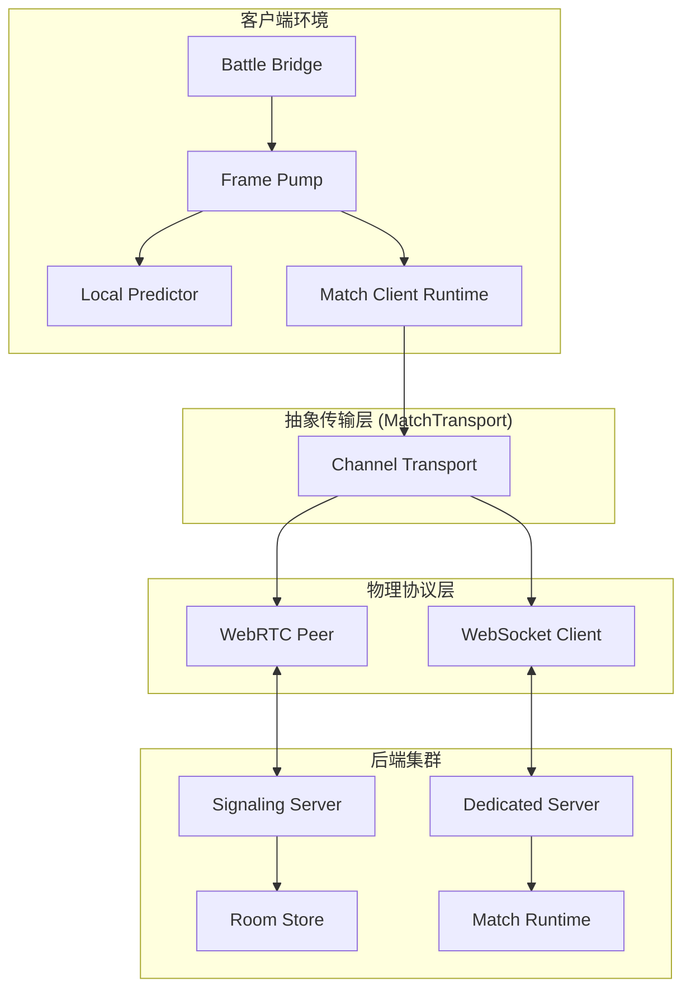
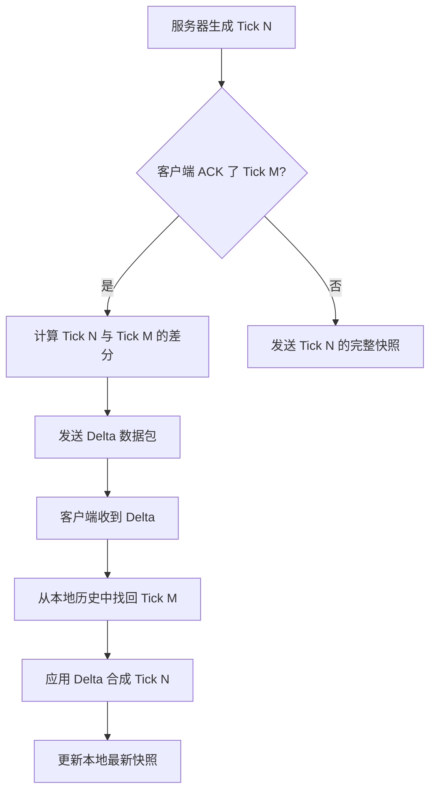
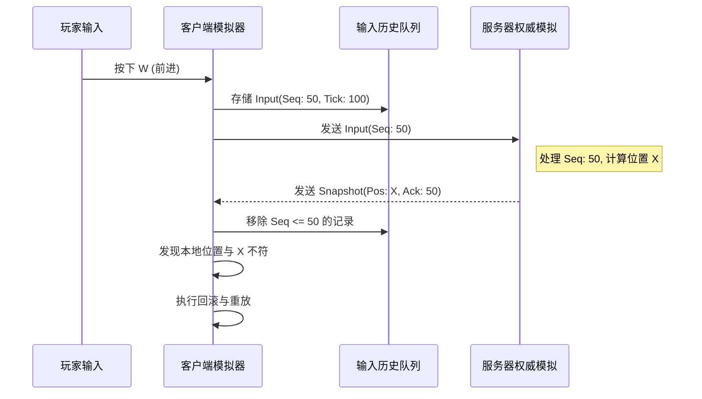
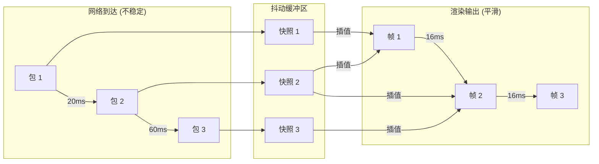
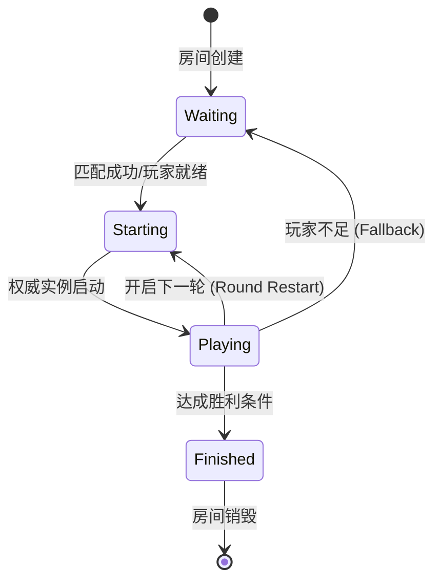

# 网络架构与多玩家同步

## 目录
1. [模块概览](#模块概览)
2. [混合联网架构设计](#混合联网架构设计)
   - [WebRTC P2P 传输实现](#webrtc-p2p-传输实现)
   - [WebSocket 权威服务器架构](#websocket-权威服务器架构)
   - [传输层抽象与适配](#传输层抽象与适配)
3. [网络协议与高效序列化](#网络协议与高效序列化)
   - [协议包格式与版本控制](#协议包格式与版本控制)
   - [快照量化与数据压缩](#快照量化与数据压缩)
   - [基于 ACK 的增量更新协议](#基于-ack-的增量更新协议)
4. [客户端预测与延迟补偿机制](#客户端预测与延迟补偿机制)
   - [本地模拟与输入历史管理](#本地模拟与输入历史管理)
   - [服务器核对与状态回滚流程](#服务器核对与状态回滚流程)
   - [指数衰减预测校正算法](#指数衰减预测校正算法)
   - [边缘触发动作的同步处理](#边缘触发动作的同步处理)
5. [远程实体同步与抖动缓冲](#远程实体同步与抖动缓冲)
   - [自适应抖动缓冲区 (Jitter Buffer)](#自适应抖动缓冲区-jitter-buffer)
   - [基于速度矢量的 Hermite 插值](#基于速度矢量的-hermite-插值)
   - [单调 Hermite 地形适配](#单调-hermite-地形适配)
   - [丢包补偿与线性外推](#丢包补偿与线性外推)
6. [信令系统与匹配流程](#信令系统与匹配流程)
   - [持久信箱信令模型](#持久信箱信令模型)
   - [分布式房间状态同步](#分布式房间状态同步)
   - [匹配队列与权威实例生命周期](#匹配队列与权威实例生命周期)
7. [核心组件分析](#核心组件分析)
8. [文件参考](#文件参考)

## 模块概览

`Claude of Tanks` 的网络模块是一个高度复杂的同步系统，旨在解决实时动作游戏在互联网环境下面临的延迟、抖动和丢包问题。该模块不仅支持传统的权威服务器架构，还引入了现代的 WebRTC P2P 技术，以适应不同的对战场景。

**范围统计**：
- **总文件数**：约 53 个源文件（`src/net` 44 个，`server` 9 个）。
- **核心目录**：
  - `src/net/`：包含客户端网络运行时（Runtime）、协议定义（Protocol）、本地预测（Prediction）、快照处理（Snapshot）以及 WebRTC 封装。
  - `server/`：包含信令服务器（Signaling）、匹配服务器（Matchmaker）、权威对战注册表（Registry）以及房间存储逻辑。
- **覆盖深度**：本章节将从底层的二进制协议格式出发，深入探讨客户端预测的数学实现、插值算法的细节，以及分布式信令系统的架构设计。

## 混合联网架构设计

为了兼顾运营成本、连接质量和竞技公平性，系统采用了混合联网模型。这种设计允许游戏在不同的网络拓扑结构之间无缝切换。

### WebRTC P2P 传输实现
在私人房间模式下，系统优先使用 WebRTC。`webrtcPeer.ts` 封装了复杂的连接握手逻辑，支持 ICE 重启和自动恢复。通过创建两个数据通道（DataChannel）：
- **可靠通道 (Reliable)**：用于传输信令、聊天和关键事件（如击杀通知）。
- **不可靠通道 (Unreliable)**：用于高频的状态快照，允许丢包以换取最低的延迟。

### WebSocket 权威服务器架构
在排名匹配中，`dedicatedMatchServer.ts` 托管了所有的对战逻辑。它使用 WebSocket 作为传输层，通过 `AuthoritativeMatchRuntime` 驱动固定步长（60Hz）的物理模拟。这种架构确保了所有玩家看到的都是经过服务器验证的“真理”。

### 传输层抽象与适配
系统通过 `MatchTransport` 接口抽象了底层的传输细节。无论是 WebRTC 的 `RTCDataChannel` 还是 WebSocket，都被包装成统一的 `send/onMessage` 接口。这使得上层的同步逻辑（如 `MatchClientRuntime`）可以完全忽略物理连接的类型。

下面的架构图展示了系统中各组件如何通过抽象层进行交互：

在上述架构中，`NetworkFramePump` 是客户端的驱动核心，它每帧调用 `MatchClientRuntime` 来获取最新的网络快照，并将其传递给 `LocalTankPredictor` 进行预测校正。这种分层设计使得网络协议的升级（如从 v8 到 v9）不会影响到物理模拟逻辑。

**Section sources**:
- [src/net/webrtcPeer.ts](src/net/webrtcPeer.ts)
- [src/net/matchRuntime.ts](src/net/matchRuntime.ts)
- [src/net/channelTransport.ts](src/net/channelTransport.ts)
- [server/dedicatedMatchServer.ts](server/dedicatedMatchServer.ts)

## 网络协议与高效序列化

网络带宽是多人游戏最宝贵的资源。`src/net/protocol.ts` 定义了一套极其精简的二进制兼容协议，旨在最小化每个数据包的尺寸。

### 协议包格式与版本控制
所有消息均带有 `v: PROTOCOL_VERSION` 字段。当客户端与服务器版本不匹配时，系统会立即拒绝连接，防止因数据结构差异导致的模拟崩溃。

### 快照量化与数据压缩
为了减少浮点数传输，系统在 `snapshot.ts` 中实现了严格的量化策略：
- **位置 (Position)**：缩放 100 倍，以厘米为单位存储为整数。
- **速度 (Velocity)**：同样缩放 100 倍。
- **角度 (Angle)**：使用 16 位有符号整数表示，将 `[-PI, PI]` 映射到 `[-32768, 32767]`。

### 基于 ACK 的增量更新协议
这是系统最核心的带宽优化技术。服务器维护每个玩家的 `lastSnapshotAckTick`。
1.  **生成增量**：服务器对比“当前状态”与“玩家已确认的基准状态”。
2.  **行过滤**：只有发生变化的实体（坦克、炮弹）才会被包含在快照中。
3.  **显式删除**：如果某个实体消失（如被摧毁或离开视野），服务器会发送一个 `removedEntityIds` 列表。

下面的流程图描述了增量快照的生成与组装流程：

通过这种方式，在坦克静止或低速运动时，网络流量可以降低 80% 以上。同时，系统通过 `SnapshotAssembler` 在客户端重建完整的世界状态，供渲染层使用。

**Section sources**:
- [src/net/protocol.ts](src/net/protocol.ts)
- [src/net/snapshot.ts](src/net/snapshot.ts)
- [src/net/snapshotWireCodec.ts](src/net/snapshotWireCodec.ts)

## 客户端预测与延迟补偿机制

在 60Hz 的对战中，任何超过 50ms 的延迟都会被玩家察觉。`LocalTankPredictor` 通过复杂的重放机制消除了这种延迟感。

### 本地模拟与输入历史管理
客户端在发送操作的同时，会将输入（Input）存入一个 `history` 队列中。这个队列记录了每个输入的序列号（Sequence）和执行时的 Tick。

### 服务器核对与状态回滚流程
当权威快照到达时，它代表的是“过去”某个时刻的真实状态。客户端必须执行回滚：
1.  **回溯**：将本地模拟状态重置到快照指定的 Tick。
2.  **重放**：从该 Tick 开始，重新执行 `history` 队列中所有未被服务器确认的输入。
3.  **追赶**：在极短的时间内运行多次物理步进（Step），使本地状态重新回到“现在”。

### 指数衰减预测校正算法
如果预测失败（例如本地坦克撞到了服务器上才存在的障碍物），预测位置与权威位置会产生偏差。系统使用 `PredictionCorrection` 记录这个三维矢量偏差，并在后续的渲染帧中，使用指数衰减函数将其平滑地过渡到零。

### 边缘触发动作的同步处理
对于“开火”或“修理”等边缘触发（Edge-triggered）动作，系统采用了特殊的队列机制。即使在高丢包环境下，只要输入包到达，服务器就会确保该动作至少被执行一次，而不会因为下一帧的移动输入覆盖了开火指令而导致“哑火”。

下面的序列图展示了输入从产生到被核对的全过程：

这种机制确保了玩家在操作时的“零延迟”反馈，同时保持了服务器作为最终仲裁者的地位。

**Section sources**:
- [src/net/localTankPrediction.ts](src/net/localTankPrediction.ts)
- [src/net/predictionCorrection.ts](src/net/predictionCorrection.ts)
- [src/sim/movement.ts](src/sim/movement.ts)

## 远程实体同步与抖动缓冲

对于其他玩家的坦克，客户端无法预测其行为，只能通过 `SnapshotBuffer` 进行平滑渲染。

### 自适应抖动缓冲区 (Jitter Buffer)
网络数据包的到达时间是不稳定的。如果收到包就立即渲染，画面会因为抖动而卡顿。`SnapshotBuffer` 通过维持一个延迟窗口（Interpolation Delay），在本地存储最近的几个快照。系统会根据 RTT（往返时延）的变化，自动调整这个延迟窗口的大小。

### 基于速度矢量的 Hermite 插值
简单的线性插值会导致坦克在转弯时看起来像是在“平移”。系统采用了 Hermite 插值算法，利用快照中记录的当前速度（Velocity）作为切线，计算出平滑的曲线轨迹。

### 单调 Hermite 地形适配
在处理复杂的坡度地形时，普通的 Hermite 插值可能会导致坦克“穿地”或“悬空”。`monotoneHermite` 函数通过限制斜率，确保插值结果始终位于两个已知快照的高度范围内，从而完美适配地形起伏。

### 丢包补偿与线性外推
如果网络出现严重波动，缓冲区耗尽，系统会进入“外推”模式。根据最后已知的速度和角速度，预测实体在未来 250ms 内的可能位置。如果超过这个时长仍未收到新包，实体将停止运动，直到连接恢复。

下面的图表说明了插值延迟如何吸收网络抖动：

这种“以延迟换平滑”的策略是多人实时对战的标准做法，通过 `SnapshotBuffer` 的自适应算法，系统能在极差的网络条件下依然保持视觉上的连贯性。

**Section sources**:
- [src/net/snapshot.ts](src/net/snapshot.ts)

## 信令系统与匹配流程

在玩家进入战斗之前，必须通过信令服务器和匹配服务器完成身份验证和连接建立。

### 持久信箱信令模型
`signalingServer.ts` 不仅仅是一个简单的转发器。它实现了“持久信箱”机制：
- **离线存储**：如果目标玩家暂时断开连接（如手机切换网络），信令包会存储在 Redis 或内存中。
- **主动轮询**：客户端通过 `room_poll` 定期检查信箱，确保不会错过任何 WebRTC 握手信息。

### 分布式房间状态同步
为了支持大规模并发，信令服务器支持分布式部署。通过 `DistributedRoomStore`，不同服务器节点上的玩家可以通过 Redis 的发布/订阅（Pub/Sub）机制进行跨节点信令交换。

### 匹配队列与权威实例生命周期
`RankedMatchmaker` 负责将水平相当的玩家分配到同一个 `DedicatedMatchServer` 实例中。
1.  **入队**：玩家发送 `room_join` 请求。
2.  **撮合**：匹配器根据 ELO 分分值寻找合适的对手。
3.  **实例分配**：一旦匹配成功，系统在权威服务器上启动一个新的 `AuthoritativeMatchRuntime`。
4.  **连接引导**：玩家收到包含 `matchId` 和 `token` 的响应，随后建立 WebSocket 连接。

下面的状态机展示了一个对战房间的生命周期：

**Section sources**:
- [server/signalingServer.ts](server/signalingServer.ts)
- [server/dedicatedMatchServer.ts](server/dedicatedMatchServer.ts)
- [server/roomStore.ts](server/roomStore.ts)
- [server/rankedMatchmaker.ts](server/rankedMatchmaker.ts)

## 核心组件分析

| 组件 | 职责描述 | 实现文件 |
| :--- | :--- | :--- |
| **MatchClientRuntime** | 客户端网络中枢。负责处理与服务器的握手、时钟漂移补偿（Clock Slew）以及快照的分发。 | `src/net/matchRuntime.ts` |
| **LocalTankPredictor** | 本地玩家的“时间旅行者”。通过保存输入历史并在快照到达时重放，实现零延迟操作感。 | `src/net/localTankPrediction.ts` |
| **SnapshotBuffer** | 远程实体的“缓冲大师”。利用 Hermite 插值和自适应延迟，消除网络抖动带来的卡顿。 | `src/net/snapshot.ts` |
| **WebRtcPeerSession** | WebRTC 的“外交官”。管理复杂的 SDP 交换和 ICE 候选者收集，确保 P2P 连接的稳定性。 | `src/net/webrtcPeer.ts` |
| **AuthoritativeMatchRuntime** | 服务器的“最终裁判”。在固定 Tick 下驱动物理模拟，生成并广播权威快照。 | `src/net/matchRuntime.ts` |
| **SignalingServerService** | 信令的中转站。支持分布式部署，确保玩家能跨越防火墙和 NAT 进行连接。 | `server/signalingServer.ts` |

## 文件参考

本章节深入分析了以下核心源文件：

- `src/net/protocol.ts`: 定义了统一的 `ProtocolEnvelope` 和消息类型。
- `src/net/webrtcPeer.ts`: 实现了基于 WebRTC 的 P2P 连接与恢复逻辑。
- `src/net/localTankPrediction.ts`: 包含了客户端预测、重放和纠正的核心算法。
- `src/net/snapshot.ts`: 实现了增量快照压缩、量化以及插值缓冲区。
- `src/net/matchRuntime.ts`: 提供了客户端和服务器端通用的对战运行环境。
- `src/net/networkFramePump.ts`: 负责将网络更新与浏览器的 `requestAnimationFrame` 同步。
- `server/signalingServer.ts`: 实现了支持持久信箱的分布式信令服务器。
- `server/dedicatedMatchServer.ts`: 权威匹配服务器的入口，管理对战实例。
- `server/rankedMatchmaker.ts`: 实现了基于评分的玩家撮合逻辑。
- `src/net/predictionCorrection.ts`: 专门处理预测偏差的平滑过渡计算。
- `src/net/adverseNetworkTransport.ts`: 用于模拟恶劣网络环境（丢包、延迟）的测试工具。
