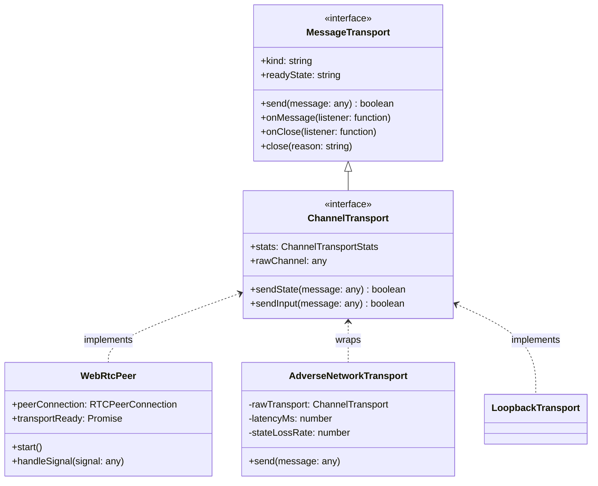
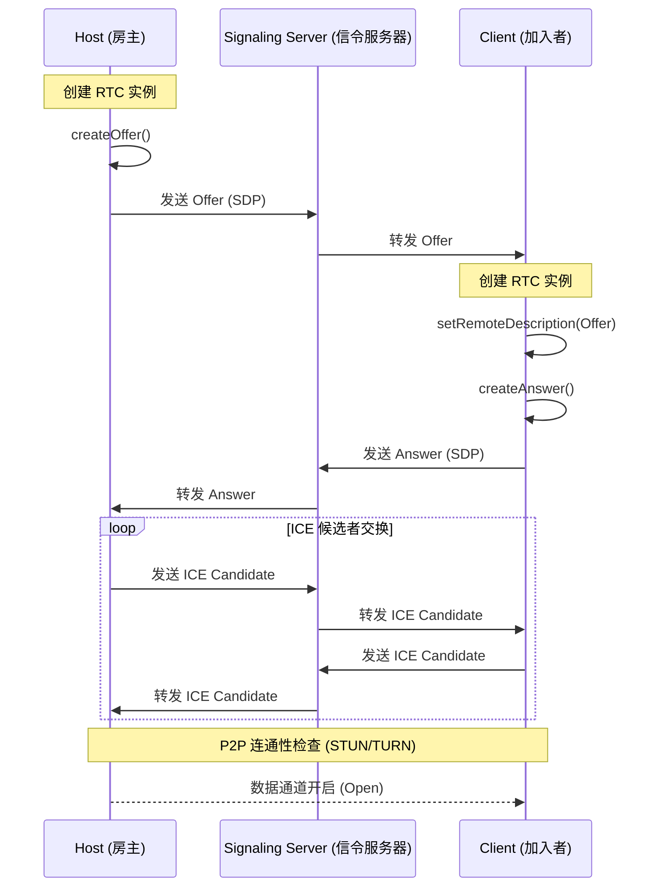
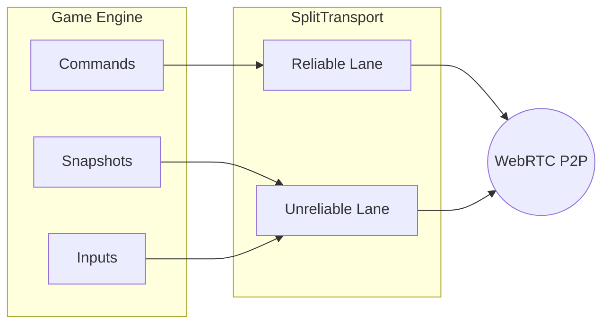
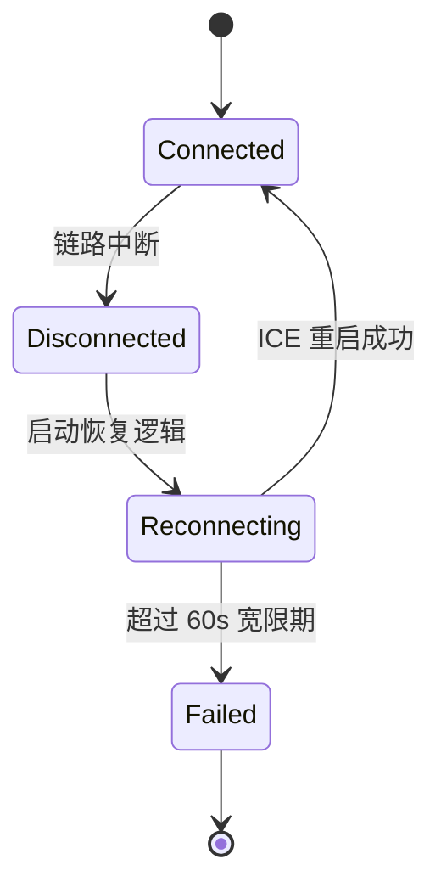

# WebRTC P2P 联网与传输层

## 目录
1. [模块概览](#模块概览)
2. [引言](#引言)
3. [网络传输层核心架构](#网络传输层核心架构)
4. [WebRTC P2P 连接与信令流程](#webrtc-p2p-连接与信令流程)
5. [信令客户端：RoomSignalingClient 实现](#信令客户端-roomsignalingclient-实现)
6. [分层传输机制：可靠性与实时性的平衡](#分层传输机制可靠性与实时性的平衡)
7. [网络仿真：AdverseNetworkTransport 弱网模拟](#网络仿真-adversenetworktransport-弱网模拟)
8. [连接恢复策略与 ICE 重启](#连接恢复策略与-ice-重启)
9. [性能优化：缓冲管理与二进制编解码](#性能优化缓冲管理与二进制编解码)
10. [文件参考](#文件参考)

## 模块概览

`src/net` 模块是 Claude of Tanks 的网络通信中心，负责处理从底层 P2P 连接到高层对战逻辑的所有网络交互。该模块的设计目标是提供低延迟、高可靠且具备容错能力的对战体验。

**统计数据与范围**：
- **文件规模**：包含 44 个 `.ts` 源文件，涵盖了从基础传输接口到复杂的 WebRTC 状态机的所有实现。
- **子模块划分**：
  - **传输抽象 (Transport Abstraction)**：定义了统一的消息传输接口 `ChannelTransport`，并提供了回环（Loopback）、WebSocket 和 WebRTC 的多种实现。
  - **信令系统 (Signaling System)**：通过 `RoomSignalingClient` 和 `SignalEndpoint` 处理房间发现、成员加入及 WebRTC 握手信息的交换。
  - **P2P 核心 (P2P Core)**：`WebRtcPeer` 封装了浏览器的 WebRTC API，处理复杂的 ICE 协商和数据通道生命周期。
  - **弱网仿真 (Network Simulation)**：`AdverseNetworkTransport` 提供了一个透明的装饰器，用于模拟真实互联网环境中的延迟、抖动和丢包。
  - **同步与恢复 (Sync & Recovery)**：`ConnectionRecovery` 和 `MatchRuntime` 负责在网络波动时保持游戏状态的一致性并执行自动重连。

本页面将深入探讨这些组件的内部工作原理及其设计权衡。

## 引言

在实时坦克对战游戏中，每一毫秒的延迟都可能决定胜负。传统的客户端-服务器（C/S）架构在处理全球玩家对战时，往往会因为中转服务器的物理距离而引入不可接受的延迟。为了解决这一问题，Claude of Tanks 采用了基于 WebRTC 的 P2P（点对点）联网架构。

WebRTC 允许玩家浏览器之间直接建立加密的 UDP 数据通道。然而，实现一个稳健的 P2P 系统面临诸多挑战：NAT 穿透失败、网络环境突变、信令可靠性以及缓冲区管理等。本项目通过构建一套高度抽象的传输层，将这些复杂性封装在简单的接口之下，确保游戏核心逻辑能够专注于战斗同步，而不必关心底层的连接细节。

## 网络传输层核心架构

传输层的设计遵循“接口优于实现”的原则。所有的通信组件都围绕着 `MessageTransport` 和 `ChannelTransport` 接口构建。



这种架构允许我们通过“装饰器模式”轻松扩展传输层的功能。例如，`AdverseNetworkTransport` 并不直接实现底层的发送逻辑，而是包裹一个现有的 `ChannelTransport` 实例，并在消息传递过程中注入人工延迟和丢包逻辑。这种设计极大地简化了测试和调试过程，使得开发人员可以在本地环境下模拟全球互联网的复杂状况。

**Section sources**:
- [channelTransport.ts](src/net/channelTransport.ts)
- [loopbackTransport.ts](src/net/loopbackTransport.ts)

## WebRTC P2P 连接与信令流程

建立 P2P 连接的第一步是信令交换。由于 WebRTC 本身不提供信令传输媒介，我们使用了一个基于 WebSocket 的信令服务器来协助节点发现。

连接建立的详细过程如下：



在 `webrtcPeer.ts` 中，`createWebRTCPeer` 负责驱动这一流程。它将 `RTCPeerConnection` 的复杂事件（如 `onicecandidate`, `onconnectionstatechange`）转化为简单的 `onSignal` 回调。

**关键设计点**：
- **ICE 候选者池**：通过设置 `iceCandidatePoolSize: 4`，浏览器可以在生成 Offer 之前预先收集候选者，从而缩短连接建立时间。
- **SDP 序列化**：为了通过 JSON 传输，SDP 和 ICE 候选者都会调用 `toJSON()` 进行序列化，并在接收端重新实例化。
- **角色对等**：虽然 WebRTC 是对等的，但逻辑上我们区分了 Host（负责发起 Offer 和创建 DataChannel）和 Client（负责接收 Offer 并创建 Answer）。

**Section sources**:
- [webrtcPeer.ts](src/net/webrtcPeer.ts)
- [signalEndpoint.ts](src/net/signalEndpoint.ts)

## 信令客户端：RoomSignalingClient 实现

`RoomSignalingClient` 是连接建立的“媒人”。它不仅负责消息的传递，还管理着房间的生命周期和成员身份验证。

**核心功能**：
- **会话持久化**：使用 `sessionId`（随机 UUID）来标识当前的页面会话。这防止了在页面重载或连接重启时，旧的信令消息干扰新的协商过程。
- **信号队列 (Signal Queue)**：如果 WebSocket 连接暂时中断，信令客户端会将发出的 SDP 或 ICE 候选者放入队列中，并在重新连接后自动补发。这确保了 P2P 协商过程的鲁棒性。
- **心跳与轮询**：除了 WebSocket 实时推送，客户端还支持 `room_poll` 机制。如果 WebSocket 链路不稳定，客户端会通过短轮询从服务器拉取未读消息。

**代码逻辑示例**：
```typescript
// src/net/signalingClient.ts
sendSignal(toPeerId: unknown, signal: unknown, toSessionId: unknown = ''): boolean {
  const message: QueuedSignalMessage = {
    type: 'room_signal',
    payload: {
      roomCode: this.roomCode,
      toPeerId: String(toPeerId),
      toSessionId: String(toSessionId),
      signal,
    },
  };
  if (!this.roomAuthenticated || this.state !== 'open') {
    this.signalQueue.push(message); // 队列化处理
    this.#scheduleReconnect('signal_queued');
    return false;
  }
  this.#send(message);
  return true;
}
```

**Section sources**:
- [signalingClient.ts](src/net/signalingClient.ts)

## 分层传输机制：可靠性与实时性的平衡

Claude of Tanks 的网络流量具有明显的异质性：有些消息（如聊天、开始游戏）必须到达且有序；而有些消息（如坦克位置更新）则对实时性要求极高，且可以容忍少量丢失。

为了满足这些需求，我们实现了 `createWebRTCSplitTransport`，它同时维护两个独立的数据通道：

1.  **控制通道 (Reliable Lane)**：
    - **配置**：`ordered: true`。
    - **用途**：传输所有关键的指令和事件。
    - **行为**：如果发生丢包，TCP-like 的重传机制会生效，保证数据的完整性。

2.  **状态通道 (Unreliable Lane)**：
    - **配置**：`ordered: false`, `maxRetransmits: 0`。
    - **用途**：传输坦克坐标、炮塔角度等高频快照。
    - **行为**：如果数据包丢失，直接丢弃。因为下一帧的快照很快就会到来，过时的位置信息反而会引起视觉上的“瞬移”或抖动。



通过这种分层设计，我们成功避免了“队头阻塞”（Head-of-Line Blocking）问题。即使在弱网环境下，坦克的位置更新可能会变得断断续续，但玩家发出的开火指令依然能可靠地到达对方客户端。

**Section sources**:
- [channelTransport.ts:L413-L519](src/net/channelTransport.ts#L413-L519)

## 网络仿真：AdverseNetworkTransport 弱网模拟

为了确保游戏在真实互联网环境下的表现，我们引入了 `AdverseNetworkTransport`。它通过拦截所有进出的消息，并按照预设的参数（延迟、抖动、丢包率）进行处理。

**模拟参数**：
- `netLatency`：基础往返延迟（单位：毫秒）。
- `netJitter`：延迟的随机波动范围。
- `netLoss`：状态通道的丢包率（百分比）。
- `netInputLoss`：输入指令的丢包率。

**实现原理**：
模拟层为每条消息计算一个预期的到达时间（Due Time）。对于可靠通道，它还会通过 `reliableSendDueMs` 强制保持消息的发送顺序，防止模拟延迟导致消息在逻辑上发生乱序。

**QA 工具集成**：
开发人员可以通过在 URL 中添加查询参数（如 `?netSim=1&netLatency=150&netLoss=10`）来实时开启弱网模拟，这对于调试预测补偿算法（Prediction & Reconciliation）至关重要。

**Section sources**:
- [adverseNetworkTransport.ts](src/net/adverseNetworkTransport.ts)

## 连接恢复策略与 ICE 重启

网络环境是动态的。当玩家从办公室走到电梯里，或者 Wi-Fi 信号突然减弱时，WebRTC 连接可能会进入 `disconnected` 状态。

**自动恢复流程**：
1.  **断开检测**：`WebRtcPeer` 监控 `connectionState`。一旦状态变为 `disconnected`，立即启动恢复定时器。
2.  **宽限期 (Grace Period)**：系统默认提供 60 秒的宽限期。在此期间，游戏逻辑会继续运行（可能处于预测状态），而 UI 会提示玩家正在重连。
3.  **ICE 重启 (ICE Restart)**：这是最强大的恢复手段。Host 会生成一个新的 Offer，并带有 `iceRestart: true` 标志。这会触发浏览器重新进行网络探测，尝试寻找新的打洞路径（例如从 Wi-Fi 切换到 4G 后的新外网 IP）。
4.  **指数退避**：重连尝试会按照 `[0, 3s, 7s, 15s, 30s]` 的间隔递增，以避免在网络抖动期间造成信令风暴。



**Section sources**:
- [connectionRecovery.ts](src/net/connectionRecovery.ts)
- [webrtcPeer.ts:L182-L233](src/net/webrtcPeer.ts#L182-L233)

## 性能优化：缓冲管理与二进制编解码

在 P2P 通信中，发送速率过快会导致浏览器内部缓冲区积压，从而产生巨大的延迟。为了应对这一挑战，我们实施了多项优化措施：

**1. 状态合并 (State Coalescing)**：
在发送不可靠的状态快照时，如果当前缓冲区已超过阈值（`maxStateBufferedBytes`），模拟层会直接覆盖掉旧的快照。只有最新的世界状态才会被发送，这有效地防止了网络拥塞时的“延迟堆积”。

**2. 二进制序列化**：
坦克对战的状态包含大量坐标和角度信息。如果使用 JSON 传输，开销巨大。我们使用了专门的 `snapshotWireCodec.ts`，将状态压缩为紧凑的二进制格式（ArrayBuffer），极大地节省了带宽。

**3. 低水位线回调**：
通过监听 `bufferedamountlow` 事件，我们实现了按需发送。只有当网络协议栈能够接纳更多数据时，我们才从待发送队列中取出消息，从而保持了极高的传输效率。

**Section sources**:
- [channelTransport.ts:L267-L304](src/net/channelTransport.ts#L267-L304)
- [snapshotWireCodec.ts](src/net/snapshotWireCodec.ts)

## 文件参考

以下是本模块涉及的核心源文件，建议在深入研究代码时优先查阅：

- [src/net/webrtcPeer.ts](src/net/webrtcPeer.ts): WebRTC 核心封装，处理 P2P 生命周期。
- [src/net/channelTransport.ts](src/net/channelTransport.ts): 传输层抽象接口及分层传输逻辑。
- [src/net/signalingClient.ts](src/net/signalingClient.ts): WebSocket 信令客户端，负责房间管理与消息转发。
- [src/net/adverseNetworkTransport.ts](src/net/adverseNetworkTransport.ts): 弱网仿真层，支持延迟和丢包模拟。
- [src/net/connectionRecovery.ts](src/net/connectionRecovery.ts): 连接状态监控与自动恢复策略。
- [src/net/rtcIceLease.ts](src/net/rtcIceLease.ts): TURN/STUN 服务器凭据的租约与自动刷新。
- [src/net/signalEndpoint.ts](src/net/signalEndpoint.ts): 不同环境下的信令服务器地址解析。
- [src/net/loopbackTransport.ts](src/net/loopbackTransport.ts): 内存回环传输，用于单机模式和单元测试。
- [src/net/snapshotWireCodec.ts](src/net/snapshotWireCodec.ts): 游戏状态的二进制序列化编解码器。
- [src/net/protocol.ts](src/net/protocol.ts): 定义了信令与游戏数据的消息协议格式。
