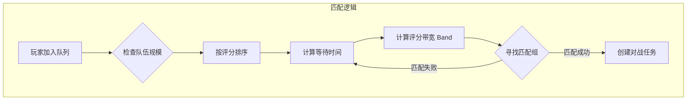
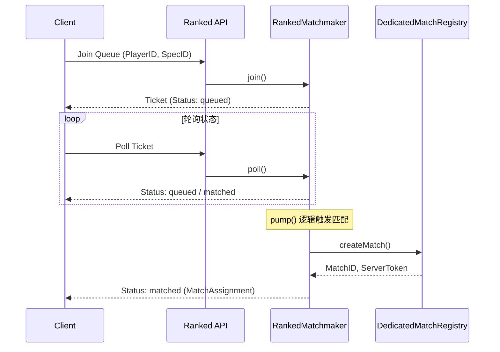
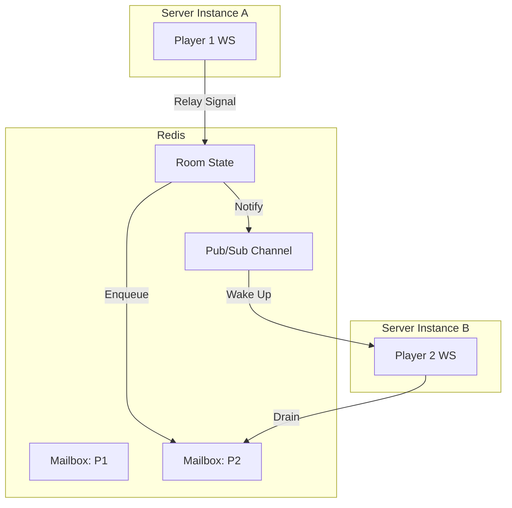
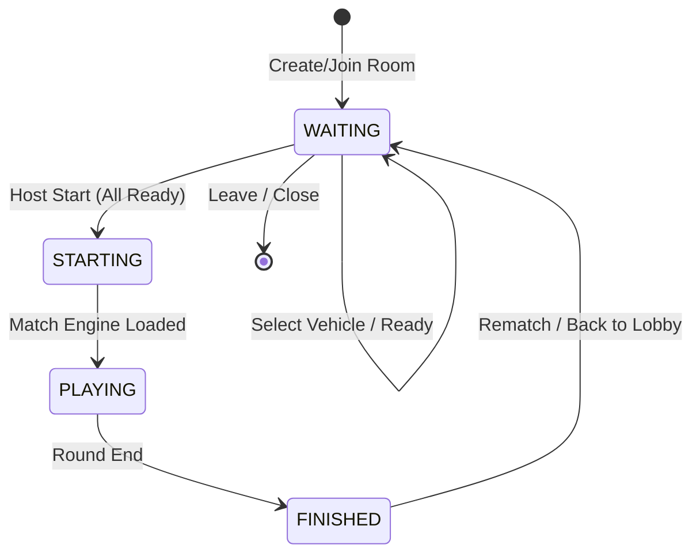
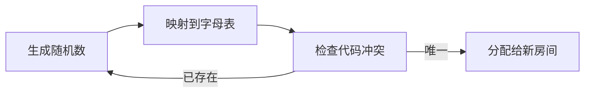
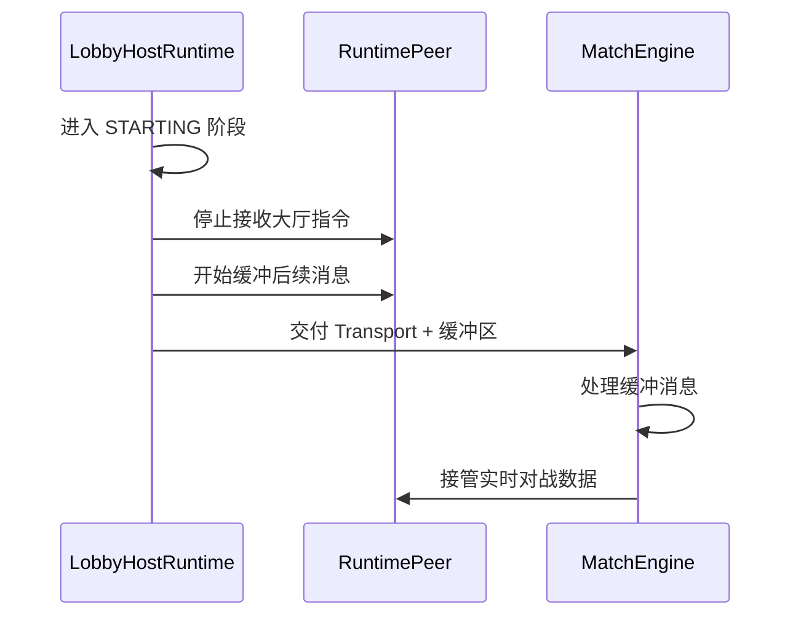

# 匹配系统与房间生命周期

## 目录
1. [模块概览](#模块概览)
2. [匹配系统架构](#匹配系统架构)
   - [ELO 匹配算法与队列管理](#elo-匹配算法与队列管理)
   - [匹配请求生命周期](#匹配请求生命周期)
3. [房间存储与分布式管理](#房间存储与分布式管理)
   - [本地与分布式存储策略](#本地与分布式存储策略)
   - [信令转发与信箱机制](#信令转发与信箱机制)
4. [房间生命周期状态机](#房间生命周期状态机)
   - [Lobby 阶段与玩家准备](#lobby-阶段与玩家准备)
   - [战斗启动与切换逻辑](#战斗启动与切换逻辑)
5. [核心组件分析](#核心组件分析)
   - [RankedMatchmaker](#rankedmatchmaker)
   - [DistributedSignalingRoomStore](#distributedsignalingroomstore)
   - [NetworkRoomCoordinator](#networkroomcoordinator)
6. [房间代码生成与验证](#房间代码生成与验证)
7. [对战交接与数据同步](#对战交接与数据同步)
8. [文件参考](#文件参考)

## 模块概览

匹配系统与房间生命周期模块是 Claude-of-Tanks 联网对战的核心枢纽。它负责将孤立的玩家连接在一起，通过合理的评分算法确保竞技公平性，并管理从大厅准备到激烈战斗再到结算重开的完整流程。

该模块跨越了服务端 (`server/`) 和客户端网络层 (`src/net/`)。在服务端，系统处理高并发的匹配请求、维护分布式的房间状态，并为 WebRTC 提供信令中转；在客户端，协调器负责将网络状态映射到 UI 表现，并处理复杂的重连和重赛逻辑。

**模块统计**：
- **涉及文件总数**：约 45 个源文件。
- **核心子模块**：
  - **匹配器 (Matchmaker)**：负责 ELO 计算、队列调度和对战分配。
  - **房间存储 (Room Store)**：支持单机内存和 Redis 分布式存储，管理房间元数据。
  - **大厅运行时 (Lobby Runtime)**：处理大厅内的指令同步，如选车、准备、换队。
  - **网络协调器 (Network Coordinator)**：管理客户端侧的房间生命周期切换。

## 匹配系统架构

匹配系统的目标是为玩家提供快速且公平的对战体验。它通过 `RankedMatchmaker` 实现了一个基于 ELO 评分的异步匹配机制。

### ELO 匹配算法与队列管理

匹配算法采用了动态带宽机制。当玩家加入队列时，系统会记录其当前的 ELO 评分。随着等待时间的增加，匹配器会逐渐扩大允许的评分差距（Band），以确保玩家不会因为评分过高或过低而永远无法开始游戏。



在匹配成功后，`RankedMatchmaker` 会调用 `matchGroup` 方法，将玩家分配到 Alpha 和 Bravo 两个阵营。分配逻辑不仅考虑了人数平衡，还通过贪心算法尽量平衡两队的总评分，以达到竞技公平。

**匹配算法细节说明**：
- **队伍规模**：支持 1v1, 2v2, 3v3, 5v5, 7v7 等多种模式。
- **评分带宽**：初始带宽较小（如 150 分），随时间每分钟增加（如 50 分），上限受限以防止极端不平衡。
- **阵营平衡**：排序后交替分配，或根据当前队伍总分动态补位。

### 匹配请求生命周期

一个匹配请求从客户端发起，到最终进入房间，经历了一系列状态转换。



当 `RankedMatchmaker` 内部的 `pump()` 方法被触发时，它会扫描所有处于 `queued` 状态的票据。一旦发现满足条件的玩家组，就会通过 `DedicatedMatchRegistry` 申请一个专用的对战实例，并生成带有加密 Token 的分配信息返回给客户端。

**Section sources**:
- [server/rankedMatchmaker.ts](server/rankedMatchmaker.ts)
- [server/ratingStore.ts](server/ratingStore.ts)

## 房间存储与分布式管理

房间存储负责维护所有活跃房间的元数据，包括房间代码、成员列表、主机身份等。

### 本地与分布式存储策略

Claude-of-Tanks 提供了两种存储实现：
1.  **SignalingRoomStore**：纯内存实现，适用于开发环境或单实例部署。
2.  **DistributedSignalingRoomStore**：基于 Redis 的分布式实现，支持水平扩展。

分布式存储利用 Redis 的高性能键值对存储房间状态，并使用 Lua 脚本保证操作的原子性（如 `JOIN_ROOM_SCRIPT`）。这确保了在多台服务器同时处理请求时，房间人数不会超过上限。

### 信令转发与信箱机制

由于 WebRTC 的建立需要玩家之间交换 SDP 和 ICE Candidate，而玩家可能连接在不同的服务器实例上，系统引入了“信箱 (Mailbox)”机制。



当玩家 1 向玩家 2 发送信号时：
1.  服务端将信号存入玩家 2 的 Redis 信箱。
2.  通过 Redis Pub/Sub 发送唤醒通知。
3.  承载玩家 2 连接的服务器实例收到通知后，立即从信箱中提取（Drain）并推送给玩家 2。

这种设计使得信令系统具备极高的可靠性和扩展性，即便 Pub/Sub 消息丢失，玩家在下次轮询时也能从信箱中恢复数据。

**Section sources**:
- [server/roomStore.ts](server/roomStore.ts)
- [server/distributedRoomStore.ts](server/distributedRoomStore.ts)

## 房间生命周期状态机

房间的生命周期由 `LobbyState` 的 `phase` 字段驱动，定义了玩家从聚会到战斗的完整路径。

### Lobby 阶段与玩家准备

在 `WAITING` 阶段，房间是可编辑的。玩家可以更换坦克、调整装备、选择迷彩，并点击“准备”。



**关键规则**：
- **主机权限**：只有主机可以更改地图、模式和踢出玩家。
- **锁定机制**：一旦玩家点击准备，其车辆选择将被锁定，直到取消准备。
- **自动换队**：系统会根据当前阵营人数自动为新加入的玩家分配队伍，但允许主机或特定模式下的玩家手动切换。

### 战斗启动与切换逻辑

当所有玩家准备就绪且主机发起 `start` 命令后，房间进入 `STARTING` 阶段。这是一个关键的过渡期，`LobbyHostRuntime` 会执行“对战交接 (Match Handoff)”。

在这个过程中，原本用于大厅通信的 WebSocket/WebRTC 传输层会被移交给对战引擎。为了防止交接期间的数据丢失，系统会建立一个临时缓冲区，存储所有在切换瞬间到达的网络包。

**Section sources**:
- [src/net/lobby.ts](src/net/lobby.ts)
- [src/net/lobbyRuntime.ts](src/net/lobbyRuntime.ts)

## 核心组件分析

### RankedMatchmaker

匹配器的核心是 `pump()` 循环。它不仅处理匹配，还负责清理过期的票据。

```typescript
// server/rankedMatchmaker.ts
pump(): RankedMatchmakerStats {
  const now = this.now();
  // 1. 清理过期票据 (TTL 检查)
  // ...
  // 2. 按队伍规模分组匹配
  for (const size of TEAM_SIZES) {
    const queued = [...this.entries.values()]
      .filter((entry) => entry.status === 'queued' && entry.teamSize === size)
      .sort((a, b) => a.queuedAtMs - b.queuedAtMs);
    
    // 动态带宽匹配逻辑
    const required = size * 2;
    while (queued.length >= required) {
      const oldest = queued[0];
      const waitMinutes = (now - oldest.queuedAtMs) / 60_000;
      const band = Math.min(600, 150 + waitMinutes * 50); // 带宽随时间扩大
      
      const candidates = queued.filter((e) => Math.abs(e.rating - oldest.rating) <= band);
      if (candidates.length < required) break;
      
      const group = candidates.slice(0, required);
      this.#matchGroup(group); // 执行匹配并创建房间
      // ...
    }
  }
}
```

该组件通过 `matchSequence` 确保地图循环的随机性，并使用 `imul` 算法生成确定性的随机种子，保证所有玩家在同一局比赛中拥有同步的物理环境。

### DistributedSignalingRoomStore

该组件是实现大规模联网的关键。它通过 Lua 脚本实现了复杂的原子操作。例如，加入房间的逻辑：

```lua
-- server/distributedRoomStore.ts (JOIN_ROOM_SCRIPT)
local room = cjson.decode(redis.call('GET', KEYS[1]))
-- ... 检查人数上限 ...
table.insert(room.peers, member)
room.touchedAt = tonumber(ARGV[2])
redis.call('SET', KEYS[1], cjson.encode(room), 'PX', ARGV[3])
return cjson.encode({ room = room })
```

这种“脚本化”的存储访问避免了传统“读取-修改-写入”模式下的竞态条件，确保了分布式环境下的强一致性。

### NetworkRoomCoordinator

在客户端，协调器是房间逻辑的守门人。它负责监听来自服务器的状态更新，并将其分发给 UI 组件（如 `PlayMenu`）和对战引擎。

它还处理了一个非常人性化的功能：**重赛 (Rematch)**。当一局游戏结束进入 `FINISHED` 状态时，协调器会保持网络连接，允许玩家直接在结算界面准备下一局，而无需重新经历匹配过程。

**Section sources**:
- [server/rankedMatchmaker.ts](server/rankedMatchmaker.ts)
- [server/distributedRoomStore.ts](server/distributedRoomStore.ts)
- [src/net/networkRoomCoordinator.ts](src/net/networkRoomCoordinator.ts)

## 房间代码生成与验证

房间代码（Room Code）是玩家私下组队的重要凭证。系统生成 6 位易读的字母数字组合（排除混淆字符如 I, O, 0, 1）。



代码生成器 `createRoomCode` 接受一个 RNG 函数，这使得在测试环境下可以生成预测性的代码。在分布式环境下，`#uniqueRoomCode` 方法会尝试最多 16 次以寻找未被占用的代码，确保了极低的碰撞率。

**Section sources**:
- [server/roomCode.ts](server/roomCode.ts)

## 对战交接与数据同步

从大厅切换到战斗是整个生命周期中最复杂的环节。`LobbyHostRuntime` 的 `releaseTransports` 方法负责这一任务。



这种“缓冲交接”机制解决了网络切换时的时序问题。如果玩家在大厅切换到战斗的瞬间发送了聊天信息或操作指令，这些数据会被安全地存放在 `pendingMessages` 中，直到对战引擎准备好处理它们。

**Section sources**:
- [src/net/lobbyRuntime.ts](src/net/lobbyRuntime.ts)
- [src/net/networkRoundLifecycle.ts](src/net/networkRoundLifecycle.ts)

## 文件参考

以下是本页面涉及的核心源文件：

- [server/rankedMatchmaker.ts](server/rankedMatchmaker.ts): 匹配算法与队列管理核心实现。
- [server/roomStore.ts](server/roomStore.ts): 内存版房间存储。
- [server/distributedRoomStore.ts](server/distributedRoomStore.ts): Redis 分布式房间存储。
- [server/roomCode.ts](server/roomCode.ts): 房间代码生成逻辑。
- [server/ratingStore.ts](server/ratingStore.ts): 玩家 ELO 评分持久化层。
- [src/net/lobby.ts](src/net/lobby.ts): 大厅状态定义与指令校验。
- [src/net/lobbyRuntime.ts](src/net/lobbyRuntime.ts): 大厅网络同步逻辑与交接机制。
- [src/net/networkRoomCoordinator.ts](src/net/networkRoomCoordinator.ts): 客户端侧房间生命周期协调器。
- [src/net/networkRoundLifecycle.ts](src/net/networkRoundLifecycle.ts): 对战回合清理与重置逻辑。
- [src/net/protocol.ts](src/net/protocol.ts): 联网协议定义与信封封装。
