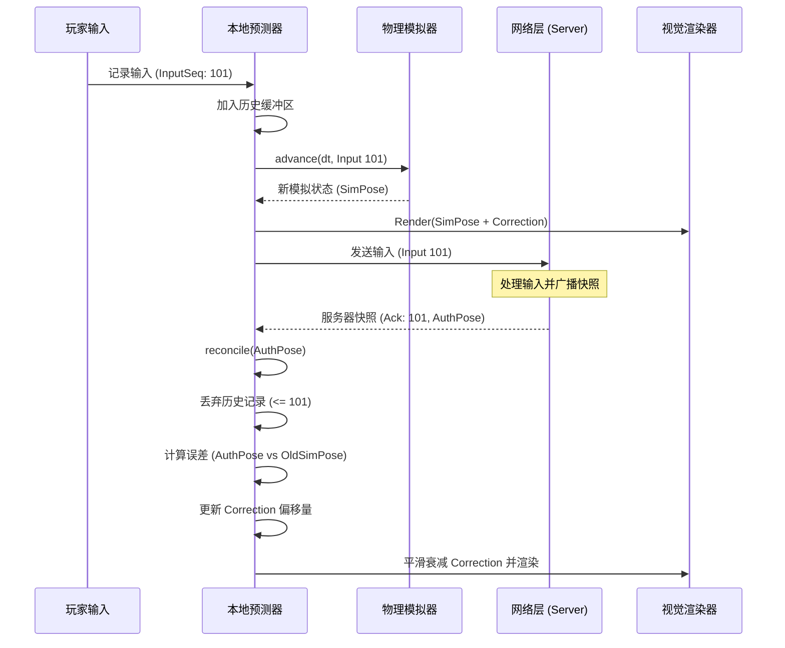
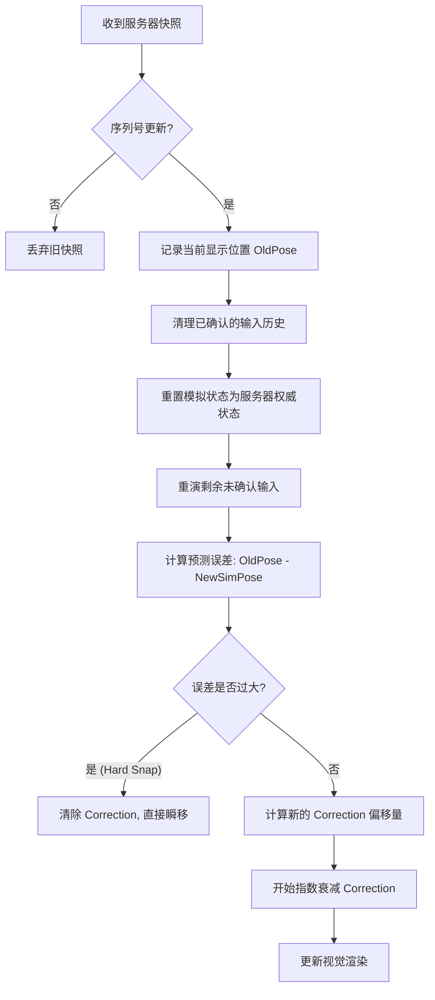
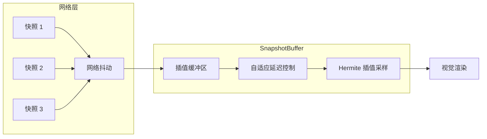

# 客户端预测与延迟补偿

## 目录
1. [模块概览](#模块概览)
2. [引言](#引言)
3. [核心组件](#核心组件)
   - [本地预测器 (LocalTankPredictor)](#本地预测器-localtankpredictor)
   - [预测校正器 (PredictionCorrection)](#预测校正器-predictioncorrection)
   - [输入节奏控制器 (NetworkInputCadence)](#输入节奏控制器-networkinputcadence)
4. [架构设计与数据流](#架构设计与数据流)
   - [预测-验证-校正循环](#预测-验证-校正循环)
   - [本地预测与服务器核对流程](#本地预测与服务器核对流程)
5. [关键算法实现](#关键算法实现)
   - [状态重演 (Replay) 逻辑](#状态重演-replay-逻辑)
   - [视觉平滑与误差衰减](#视觉平滑与误差衰减)
   - [输入缓冲与抖动处理](#输入缓冲与抖动处理)
6. [性能与延迟表现分析](#性能与延迟表现分析)
7. [文件参考](#文件参考)

## 模块概览

本模块负责处理 Claude of Tanks 中的网络同步核心逻辑，特别是针对高延迟网络环境下的操作流畅度优化。通过客户端预测（Client-side Prediction）和延迟补偿（Latency Compensation）技术，确保玩家在操作坦克时能获得即时的反馈，同时保持与服务器状态的最终一致性。

**模块统计信息**：
- **涉及文件总数**：约 12 个核心文件。
- **主要子模块**：
  - **预测核心**：负责本地模拟与状态重演。
  - **校正系统**：负责视觉误差的平滑处理。
  - **输入处理**：负责输入采样、编码与发送频率控制。
  - **快照管理**：负责服务器快照的解析与插值缓冲。

**覆盖范围**：
本文档将深入解析 `src/net` 目录下的核心预测逻辑，重点覆盖 `LocalTankPredictor`、`PredictionCorrection` 和 `NetworkInputCadence` 等关键类。

## 引言

在实时多人对战游戏中，网络延迟（Latency）是影响玩家体验的最大障碍。如果客户端必须等待服务器确认后才更新坦克位置，玩家会感受到明显的“操作粘滞感”。

Claude of Tanks 采用了一套成熟的预测机制：
1. **客户端预测 (Prediction)**：客户端立即根据玩家输入运行物理模拟，更新本地坦克状态。
2. **服务器核对 (Reconciliation)**：当服务器快照到达时，客户端比对本地预测状态与服务器权威状态。
3. **回滚与重演 (Rollback & Replay)**：如果发现偏差，客户端回滚到服务器快照时刻，并重新运行未确认的输入序列。
4. **视觉平滑 (Smoothing)**：通过视觉偏移量衰减，消除因状态修正导致的瞬间跳变（Snapping）。

## 核心组件

### 本地预测器 (LocalTankPredictor)

`LocalTankPredictor` 是预测系统的核心，它维护了一个输入历史缓冲区，并负责在收到服务器快照时执行重演逻辑。

```typescript
// src/net/localTankPrediction.ts

export class LocalTankPredictor {
  readonly history: InputHistoryFrame[] = []; // 存储未确认的输入
  readonly simEntity: PredictionSimEntity;    // 用于模拟的本地实体副本
  readonly correction: PredictionCorrection;  // 视觉修正偏移量

  // 记录本地输入并立即推进模拟
  recordInput(input: PredictionInput | null, elapsedS: number, inputSeq: number) {
    this.history.push({ input: { ...input }, elapsedS, inputSeq });
    advance(this.simEntity, input, elapsedS, this.heightField, this.collisionResolver);
    this.present(elapsedS); // 应用视觉表现
    return true;
  }

  // 服务器核对核心入口
  reconcile(sample: AuthoritySample, elapsedS = 0) {
    // 1. 丢弃已被服务器确认的输入
    acknowledgeInputs(this.history, sample.ackInputSeq);
    // 2. 将模拟状态重置为服务器权威状态
    applyAuthority(this.simEntity.state, sample.entity);
    // 3. 重演所有未确认的输入
    for (const frame of this.history) {
      advance(this.simEntity, frame.input, frame.elapsedS, ...);
    }
    // 4. 计算并阶段化视觉误差
    this.stagePresentationError(oldPose, sample.entity, error);
  }
}
```

`LocalTankPredictor` 巧妙地分离了“模拟状态”和“显示状态”。模拟状态始终追求与服务器同步，而显示状态则通过 `correction` 偏移量来平滑过渡。

### 预测校正器 (PredictionCorrection)

当 `reconcile` 发现预测位置与服务器位置不符时，它不会直接“瞬移”坦克，而是计算一个 `PredictionCorrection` 偏移量。

```typescript
// src/net/predictionCorrection.ts

export function decayPredictionCorrection(
  correction: PredictionCorrection,
  elapsedS: number,
  policy: PredictionCorrectionDecay,
) {
  // 使用指数衰减 (Tau) 逐渐将偏移量归零
  const horizontalDecay = Math.exp(-elapsedS / policy.horizontalTauS);
  correction.x *= horizontalDecay;
  correction.z *= horizontalDecay;
  correction.yaw *= horizontalDecay;
  
  // 垂直方向和炮塔旋转使用不同的衰减率
  const verticalDecay = Math.exp(-elapsedS / policy.verticalTauS);
  correction.y *= verticalDecay;
  // ...
}
```

这种机制确保了即使发生较大的位置修正，玩家看到的也是坦克平滑地滑向正确位置，而不是突兀的闪烁。

### 输入节奏控制器 (NetworkInputCadence)

为了优化带宽并处理网络抖动，`NetworkInputCadence` 控制输入发送的时机。

```typescript
// src/net/inputCadence.ts

export class NetworkInputCadence {
  shouldSend(input: NetworkInputSample): boolean {
    // 1. 离散操作（开火、刹车）必须立即发送
    if (!!input.fire !== !!previous.fire || !!input.brake !== !!previous.brake) return true;
    
    // 2. 模拟量（油门、转向）变化超过阈值时发送
    if (Math.abs(input.throttle - previous.throttle) >= this.analogEdgeThreshold) return true;
    
    // 3. 达到固定频率（默认 60Hz）时发送
    if (this.#accumulatedS >= this.intervalS) return true;
    
    return false;
  }
}
```

## 架构设计与数据流

### 预测-验证-校正循环

预测系统运行在一个闭环中，不断地在本地预测和服务器验证之间切换。

下面的序列图展示了玩家输入如何流经预测器，以及服务器快照如何触发校正逻辑。



该流程确保了玩家能立即看到坦克的移动（通过本地模拟），同时在收到服务器确认后，通过重演机制消除因网络延迟导致的累积误差。

**图表说明**：
- **SimPose**：本地物理模拟的权威位置。
- **Correction**：视觉修正值，初始为 0。
- **Ack**：服务器确认的最后一个输入序列号。

### 本地预测与服务器核对流程

当客户端收到服务器快照时，会触发复杂的核对流程。



这个流程的核心在于 **G (重演)**。即使服务器快照是 100ms 前的状态，通过重演这 100ms 内的本地输入，客户端能重新计算出当前的“正确”位置。

**图表说明**：
- **Hard Snap**：当误差超过阈值（如 7 米）时，放弃平滑校正，直接同步位置。
- **指数衰减**：利用 Tau 参数控制校正的速度，使其在视觉上不可察觉。

## 关键算法实现

### 状态重演 (Replay) 逻辑

状态重演是解决延迟的核心。它假设客户端和服务器运行的是完全相同的确定性物理代码。

```typescript
// 伪代码：重演核心逻辑
function replay(snapshot, history) {
    // 1. 回滚到过去
    this.simState = snapshot.state;
    
    // 2. 穿越回现在
    for (const frame of history) {
        // 使用完全相同的步长和物理逻辑
        physics.update(this.simState, frame.input, frame.dt);
    }
    
    // 3. 现在的 simState 就是预测的最新权威状态
}
```

在 `localTankPrediction.ts` 中，`advance` 函数负责执行这一逻辑，它会根据 `SIM_DT`（固定步长）进行分步更新，以保证模拟的确定性。

### 视觉平滑与误差衰减

为了处理预测误差，系统引入了 `PredictionCorrection`。它包含 `x, y, z, yaw, pitch, roll, turretYaw, gunPitch` 等所有视觉属性。

**衰减策略**：
- **水平位移 (x, z)**：使用 `correctionTauS` (默认 0.11s)，较快。
- **垂直位移 (y)**：使用 `verticalCorrectionTauS` (默认 0.16s)，较慢，以防止坦克在起伏路面剧烈抖动。
- **炮塔瞄准**：使用 `aimCorrectionTauS` (默认 0.075s)，极快，确保玩家瞄准的精确感。

> 💡 **Resting Hull 优化**：
> 当坦克速度极低且误差很小时，系统会启用 `holdRestingHull` 逻辑。此时视觉偏移量会完全锁定，防止因浮点数微小偏差导致的“坦克爬行”现象。

### 输入缓冲与抖动处理

`SnapshotBuffer` 负责处理来自其他玩家的快照。由于网络抖动（Jitter），快照到达的时间是不稳定的。



**自适应延迟 (Adaptive Delay)**：
`SnapshotBuffer` 会观察快照到达的间隔。如果网络抖动增加，它会自动增加 `interpolationDelayMs`，从而提供更大的缓冲空间，避免因缺帧导致的卡顿；当网络恢复稳定时，它会缓慢减小延迟，以提高实时性。

## 性能与延迟表现分析

不同延迟环境下的系统表现：

| 延迟 (Ping) | 表现特征 | 处理机制 |
| :--- | :--- | :--- |
| **< 50ms** | 极其流畅，几乎感知不到校正。 | 标准预测 + 快速衰减。 |
| **50ms - 150ms** | 操作依然即时，偶尔可见轻微的坦克位置微调。 | 重演机制处理大部分偏差，视觉平滑掩盖跳变。 |
| **150ms - 300ms** | 可能会看到坦克在撞墙或碰撞后有明显的“回弹”。 | 碰撞预测可能与服务器不符，触发较大范围的校正。 |
| **> 500ms / 丢包** | 坦克可能出现瞬间位移（Teleport）。 | 触发 Hard Snap，优先保证位置同步而非平滑。 |

**性能考量**：
- **CPU 开销**：重演逻辑在每一帧收到快照时运行。如果延迟很高，历史缓冲区会变长，重演的步数也会增加。`MAX_INPUT_HISTORY` 设置为 240 帧以防止内存溢出。
- **内存**：`InputHistoryFrame` 结构紧凑，长期运行的内存压力较小。

## 文件参考

本页内容基于以下核心文件的分析：

**核心实现**:
- [src/net/localTankPrediction.ts](src/net/localTankPrediction.ts): 本地预测与重演核心逻辑。
- [src/net/predictionCorrection.ts](src/net/predictionCorrection.ts): 视觉误差校正与衰减算法。
- [src/net/inputCadence.ts](src/net/inputCadence.ts): 输入发送节奏控制。

**集成与支撑**:
- [src/net/browserInputRuntime.ts](src/net/browserInputRuntime.ts): 浏览器环境下的输入采样与编码。
- [src/net/browserBattleBridge.ts](src/net/browserBattleBridge.ts): 预测系统与游戏主循环的桥接。
- [src/net/snapshot.ts](src/net/snapshot.ts): 快照数据结构与插值缓冲区实现。
- [src/net/protocol.ts](src/net/protocol.ts): 网络协议定义与序列号处理。
