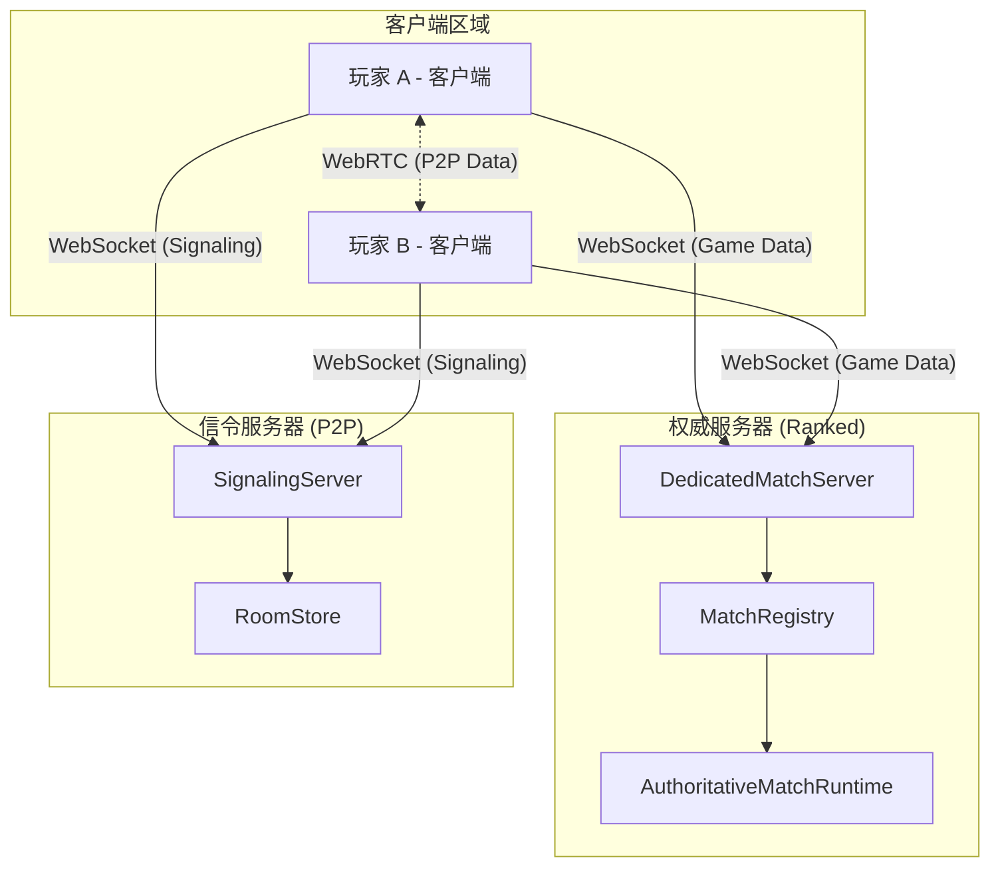
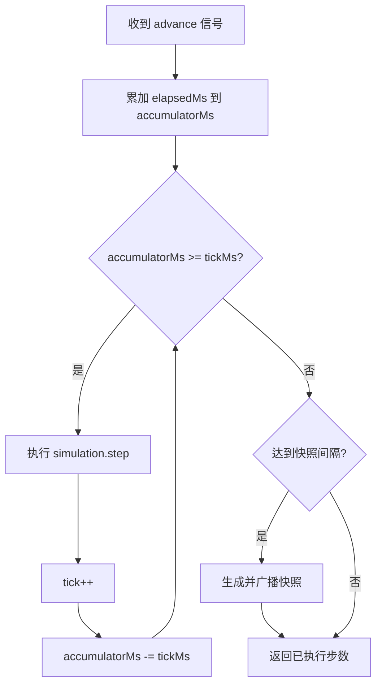
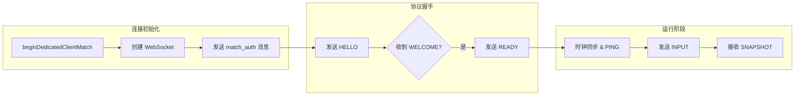

# 权威服务器与 WebSocket 通信

## 目录
1. [模块概览](#模块概览)
2. [引言](#引言)
3. [核心组件](#核心组件)
   - [DedicatedMatchServer (权威服务器)](#dedicatedmatchserver-权威服务器)
   - [SignalingServer (信令服务器)](#signalingserver-信令服务器)
   - [AuthoritativeMatchRuntime (权威运行环境)](#authoritativematchruntime-权威运行环境)
   - [MatchClientRuntime (客户端运行环境)](#matchclientruntime-客户端运行环境)
4. [架构设计与拓扑](#架构设计与拓扑)
   - [系统拓扑图](#系统拓扑图)
   - [权威模式 vs P2P 模式](#权威模式-vs-p2p-模式)
5. [权威仿真机制](#权威仿真机制)
   - [固定步长仿真 (Fixed-Step Simulation)](#固定步长仿真-fixed-step-simulation)
   - [输入验证与处理](#输入验证与处理)
   - [快照生成与增量压缩](#快照生成与增量压缩)
6. [信令机制与 P2P 握手](#信令机制与-p2p-握手)
   - [WebRTC 握手流程](#webrtc-握手流程)
   - [持久化信令信箱 (Durable Mailbox)](#持久化信令信箱-durable-mailbox)
7. [WebSocket 通信协议](#websocket-通信协议)
   - [协议信封结构](#协议信封结构)
   - [消息类型与序列号](#消息类型与序列号)
8. [集成与连接逻辑](#集成与连接逻辑)
   - [DedicatedClient 连接流](#dedicatedclient-连接流)
   - [连接恢复与重连策略](#连接恢复与重连策略)
9. [文件参考](#文件参考)

## 模块概览

本模块涵盖了 Claude of Tanks 的核心网络架构，负责管理游戏状态的同步、玩家间的连接建立以及权威性的仿真逻辑。

- **总文件数**：约 53 个源文件。
- **核心目录**：
  - `server/`：包含权威服务器、信令服务器、匹配器及房间管理逻辑（9 个文件）。
  - `src/net/`：包含客户端网络运行时、传输层抽象、协议定义及快照处理逻辑（44 个文件）。
- **重点覆盖范围**：
  - 权威服务器的 HTTP/WebSocket 混合架构。
  - 基于 WebSocket 的 P2P 信令交换机制。
  - 跨平台的固定步长仿真引擎实现。
  - 针对弱网环境优化的增量快照压缩技术。

## 引言

在多人实时竞技游戏中，确保所有玩家看到一致的游戏状态并防止作弊是核心挑战。Claude of Tanks 采用了双重网络架构：**权威服务器模式 (Authoritative Server)** 用于排位赛等高可靠性场景，而 **P2P 模式 (Peer-to-Peer)** 用于私人房间以降低服务器开销。

本模块的核心目标是提供一套版本化、传输无关的通信协议，使得无论是在 Node.js 环境下的专用服务器，还是在浏览器环境下的玩家主机，都能运行完全相同的仿真逻辑。通过 WebSocket 作为初始连接和信令中继的桥梁，系统能够灵活地在权威仿真和 WebRTC 直连之间切换，同时利用增量快照和输入预测技术为玩家提供流畅的战斗体验。

## 核心组件

### DedicatedMatchServer (权威服务器)

`DedicatedMatchServer` 是专用匹配服务器的入口点。它采用混合架构，通过同一个 TCP 端口同时提供 HTTP API（用于身份验证、排行榜、匹配队列）和 WebSocket 服务（用于实际的游戏匹配）。

```typescript
// server/dedicatedMatchServer.ts
export async function createDedicatedMatchServer({
  host = '127.0.0.1',
  port = 0,
  registry = new DedicatedMatchRegistry(),
  matchmaker = createDefaultMatchmaker(registry),
}: DedicatedMatchServerOptions = {}): Promise<DedicatedMatchServerService> {
  const server = http.createServer(async (request, response) => {
    // 处理 /ranked/* 路由下的匹配请求
    if (request.method === 'POST' && url.pathname === '/ranked/queue') {
      const queued = matchmaker.join({ ...body, identityToken: bearer(request) });
      json(response, 202, queued, headers);
    }
    // ...
  });

  const sockets = new WebSocketServer({ noServer: true });
  server.on('upgrade', (request, socket, head) => {
    // 升级 /match 路径的 WebSocket 连接
    if (path === '/match') {
      sockets.handleUpgrade(request, socket, head, (websocket) => {
        sockets.emit('connection', websocket, request);
      });
    }
  });
  // ...
}
```

**Section sources**:
- [dedicatedMatchServer.ts](server/dedicatedMatchServer.ts)

### SignalingServer (信令服务器)

`SignalingServer` 负责 P2P 模式下的“破冰”工作。它不参与游戏逻辑，仅作为中继站转发客户端之间的 WebRTC SDP（会话描述）和 ICE 候选者。其核心设计包含了一个“持久化信箱”机制，允许客户端在短时间内断线重连后仍能找回未读的信令。

```typescript
// server/signalingServer.ts
case 'room_signal': {
  const notification = await store.relay(connection, {
    roomCode: payload.roomCode,
    toPeerId: payload.toPeerId,
    toSessionId: payload.toSessionId,
    signal: validateSignal(payload.signal),
  });
  await sendNotifications([notification]);
  break;
}
```

**Section sources**:
- [signalingServer.ts](server/signalingServer.ts)
- [roomStore.ts](server/roomStore.ts)

### AuthoritativeMatchRuntime (权威运行环境)

这是服务器端（或 P2P 主机端）的核心循环。它负责以固定的频率（通常为 60Hz）推进游戏世界，并以较低的频率（通常为 20Hz）向所有客户端广播状态快照。它通过 `MatchTransport` 抽象层与底层物理连接（WebSocket 或 WebRTC）解耦。

```typescript
// src/net/matchRuntime.ts
export class AuthoritativeMatchRuntime {
  advance(elapsedMs: number): number {
    // 固定步长累加器逻辑
    while (this.accumulatorMs >= this.tickMs) {
      this.tick++;
      this.simulation.step({ dt: 1 / this.tickHz, tick: this.tick, inputs });
      this.accumulatorMs -= this.tickMs;
      // 达到快照间隔时广播
      if (this.tick % this.snapshotEveryTicks === 0) this.#broadcastSnapshots();
    }
  }
}
```

**Section sources**:
- [matchRuntime.ts](src/net/matchRuntime.ts)

### MatchClientRuntime (客户端运行环境)

客户端运行时负责与服务器握手、收集玩家输入并发送、接收快照并进行插值处理。它维护一个 `SnapshotBuffer`，用于平滑处理网络抖动带来的数据包到达不均匀问题。

**Section sources**:
- [matchRuntime.ts](src/net/matchRuntime.ts)
- [snapshot.ts](src/net/snapshot.ts)

## 架构设计与拓扑

### 系统拓扑图

下面的图表展示了 Claude of Tanks 的整体网络拓扑结构。在权威模式下，所有流量流向专用服务器；在 P2P 模式下，信令服务器仅负责初始握手，后续流量在玩家之间直接交换。



该架构图清晰地描绘了两种模式的共存。`DedicatedMatchServer` 内部通过 `MatchRegistry` 管理多个并发的 `AuthoritativeMatchRuntime` 实例，每个实例代表一场正在进行的排位赛。客户端通过 `DedicatedClient` 与之通信。而在 P2P 场景下，客户端先通过 `SignalingClient` 连接到 `SignalingServer` 进行 SDP/ICE 交换，一旦 WebRTC 通道建立，数据流将不再经过服务器。

**Diagram sources**: 
- [dedicatedMatchServer.ts:L190-L249](server/dedicatedMatchServer.ts#L190-L249)
- [signalingServer.ts:L142-L187](server/signalingServer.ts#L142-L187)

### 权威模式 vs P2P 模式

| 特性 | 权威模式 (Authoritative) | P2P 模式 (Signaling + WebRTC) |
| :--- | :--- | :--- |
| **连接协议** | WebSocket | WebRTC DataChannel |
| **仿真位置** | 专用 Node.js 服务器 | 其中一名玩家 (Host) 的浏览器 |
| **延迟表现** | 取决于玩家到服务器的距离 | 玩家之间直连，通常延迟更低 |
| **安全性** | 高（服务器验证所有操作） | 较低（Host 拥有最终决定权） |
| **适用场景** | 排位赛、大型匹配 | 私人房间、好友对战 |

## 权威仿真机制

### 固定步长仿真 (Fixed-Step Simulation)

为了保证逻辑的一致性，`AuthoritativeMatchRuntime` 强制要求仿真步长 `SIM_DT` 必须为固定值（例如 1/60 秒）。这意味着无论服务器的实际帧率如何波动，游戏逻辑的推进始终是确定性的。



在 `advance()` 方法中，服务器会根据自上一帧以来流逝的时间，决定需要补齐多少个逻辑步。如果服务器负载过高导致卡顿，它会在下一帧尝试通过循环多次执行 `step()` 来“追赶”时间。这种机制确保了子弹轨迹、坦克碰撞等物理计算在所有环境中产生相同的结果。

**Diagram sources**: 
- [matchRuntime.ts:L819-L915](src/net/matchRuntime.ts#L819-L915)

### 输入验证与处理

服务器不会直接接受客户端计算的位置，而是接受客户端的**操作意图**（如：油门大小、转向角度、开火指令）。服务器在每个 Tick 中通过 `applyNetworkInput` 将这些输入应用到仿真实体中。

> **注意**：为了防止网络延迟导致的操作丢失，服务器会对“边沿触发”的指令（如开火、使用修理包）进行锁存，直到被仿真步消耗为止。

### 快照生成与增量压缩

由于完整的世界状态（包含几十辆坦克的位置、血量、炮塔角度等）体积巨大，系统采用了增量压缩技术。

1.  **基准确认**：客户端在发送输入时会附带 `snapshotAckTick`，告知服务器其已收到的最新快照版本。
2.  **差分计算**：服务器查找该基准快照，仅计算当前状态与基准状态之间的差异。
3.  **关键帧**：如果客户端长时间未确认快照，或者超过了 `keyframeIntervalTicks`，服务器会发送一个完整的关键帧以重置同步基准。

**Section sources**:
- [authoritativeMatch.ts](src/sim/authoritativeMatch.ts)
- [snapshot.ts](src/net/snapshot.ts)

## 信令机制与 P2P 握手

### WebRTC 握手流程

在 P2P 模式下，`SignalingServer` 扮演了媒人的角色。由于 WebRTC 无法直接通过 IP 地址发现对方（受限于 NAT 和防火墙），客户端必须通过一个公共的信令通道交换连接信息。

```mermaid
sequenceDiagram
    participant A as 玩家 A (Host)
    participant S as 信令服务器
    participant B as 玩家 B (Guest)

    A->>S: room_create (创建房间)
    S-->>A: room_created (返回 6 位房间码)
    B->>S: room_join (输入房间码加入)
    S-->>B: room_joined (返回 Host 信息)
    S-->>A: peer_joined (通知有新玩家)
    
    Note over A,B: 开始 WebRTC 握手
    A->>S: room_signal (发送 Offer)
    S->>B: room_signal (转发 Offer)
    B->>S: room_signal (发送 Answer)
    S->>A: room_signal (转发 Answer)
    
    Note over A,B: ICE 候选者交换
    A->>S: room_signal (ICE Candidate)
    S->>B: room_signal (转发 ICE)
    B->>S: room_signal (ICE Candidate)
    S->>A: room_signal (转发 ICE)
    
    A<->>B: P2P DataChannel 已建立
```

握手过程分为三个阶段：房间建立、SDP 交换（Offer/Answer）以及 ICE 候选者收集。`SignalingServer` 通过 `SignalingEnvelope` 结构体封装这些消息，并根据 `toPeerId` 进行精准投递。

**Diagram sources**: 
- [signalingServer.ts:L245-L288](server/signalingServer.ts#L245-L288)
- [signalingClient.ts:L667-L736](src/net/signalingClient.ts#L667-L736)

### 持久化信令信箱 (Durable Mailbox)

为了应对移动端网络切换或浏览器标签页休眠导致的短暂 WebSocket 断连，`SignalingServer` 实现了一个基于内存或 Redis 的 `SignalingRoomStore`。即使客户端的 WebSocket 断开，其在房间中的身份仍会保留一段时间。当客户端重新连接并发送 `room_join` 时，服务器会将其积压在信箱中的所有信令一次性投递，从而极大提高了 WebRTC 建立连接的成功率。

**Section sources**:
- [roomStore.ts](server/roomStore.ts)
- [signalingClient.ts](src/net/signalingClient.ts)

## WebSocket 通信协议

### 协议信封结构

所有的网络消息都封装在统一的 `ProtocolEnvelope` 中。这个结构体是版本化的，确保了客户端和服务器在协议不匹配时能立即发现并断开连接。

```typescript
// src/net/protocol.ts
export interface ProtocolEnvelope<TPayload = unknown> {
  v: number;      // 协议版本 (PROTOCOL_VERSION)
  type: string;   // 消息类型 (HELLO, INPUT, SNAPSHOT等)
  seq: number;    // 发送序列号
  ack: number;    // 确认已收到的对方序列号
  tick: number;   // 消息产生时的仿真 Tick
  payload: TPayload | null;
}
```

### 消息类型与序列号

协议定义了多种消息类型以区分不同的业务流：
- **控制流**：`HELLO`, `WELCOME`, `READY`, `LEAVE` 用于建立和拆除连接。
- **状态流**：`SNAPSHOT`, `EVENT`, `ROOM_STATE` 用于同步游戏世界。
- **输入流**：`INPUT` 承载玩家的实时操作。
- **同步流**：`PING`, `PONG` 用于测量 RTT（往返时延）并同步服务器时钟。

序列号（`seq`）用于检测数据包的顺序和丢失情况。由于 WebSocket 保证了有序递交，`seq` 在权威模式下主要用于确认；而在 P2P 模式的 WebRTC 不可靠通道中，`seq` 则对于丢弃迟到的旧包至关重要。

**Section sources**:
- [protocol.ts](src/net/protocol.ts)

## 集成与连接逻辑

### DedicatedClient 连接流

`DedicatedClient` 封装了连接权威服务器的复杂逻辑，包括 WebSocket 握手、身份认证以及与 `MatchClientRuntime` 的绑定。



在 `connectDedicatedMatch` 函数中，系统会先等待 WebSocket 的 `open` 事件，然后立即发送包含 `matchId` 和 `token` 的认证消息。只有在服务器验证通过并返回 `WELCOME` 包后，客户端才认为连接真正建立，并开始同步服务器时钟。

**Diagram sources**: 
- [dedicatedClient.ts:L136-L204](src/net/dedicatedClient.ts#L136-L204)

### 连接恢复与重连策略

网络波动是不可避免的。`DedicatedClient` 实现了一套指数退避重连算法。当 WebSocket 断开时，它会尝试使用相同的 `token` 重新连接。由于 `AuthoritativeMatchRuntime` 在服务器端会保留玩家的实体状态一段时间，重连后的玩家可以无缝地取回其坦克的控制权，而不需要重新加载地图或重新加入匹配。

**Section sources**:
- [dedicatedClient.ts](src/net/dedicatedClient.ts)
- [matchRuntime.ts](src/net/matchRuntime.ts)

## 文件参考

以下是本模块涉及的核心源文件：

- `server/dedicatedMatchServer.ts`: 权威服务器入口，处理 HTTP 和 WebSocket 升级。
- `server/signalingServer.ts`: 信令服务器，负责 P2P 握手中继。
- `server/dedicatedMatchRegistry.ts`: 权威匹配注册表，管理仿真生命周期。
- `server/roomStore.ts`: 信令房间存储，支持分布式信箱。
- `src/net/protocol.ts`: 全局协议定义与数据校验逻辑。
- `src/net/matchRuntime.ts`: 核心网络运行时（权威端与客户端）。
- `src/net/dedicatedClient.ts`: 权威模式客户端连接管理器。
- `src/net/signalingClient.ts`: P2P 模式信令客户端。
- `src/net/channelTransport.ts`: 传输层抽象，支持 WebSocket 和 WebRTC。
- `src/sim/authoritativeMatch.ts`:  headless 权威仿真引擎实现。
