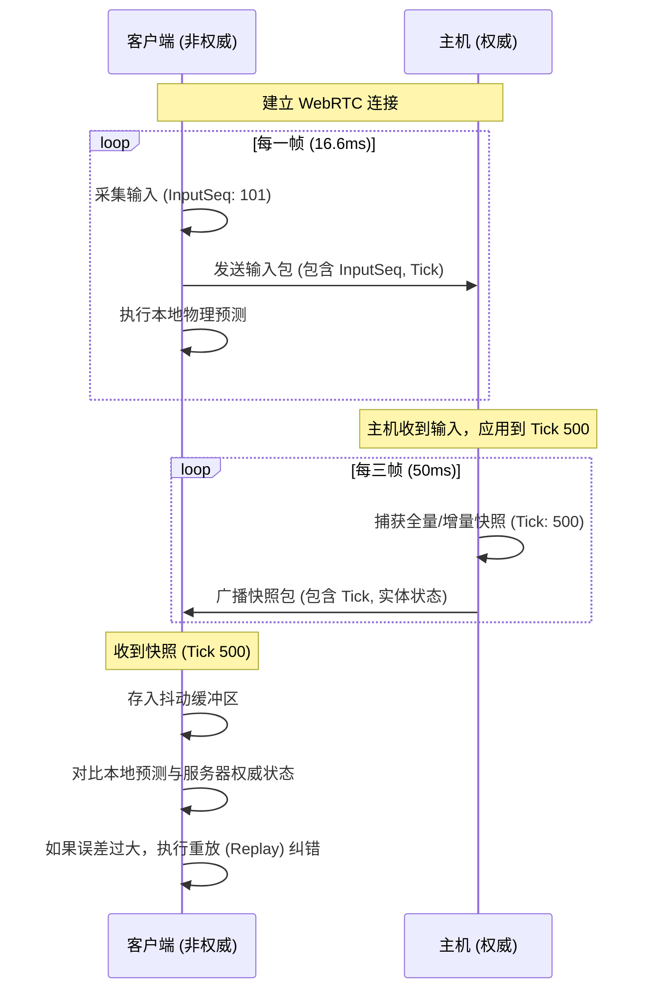
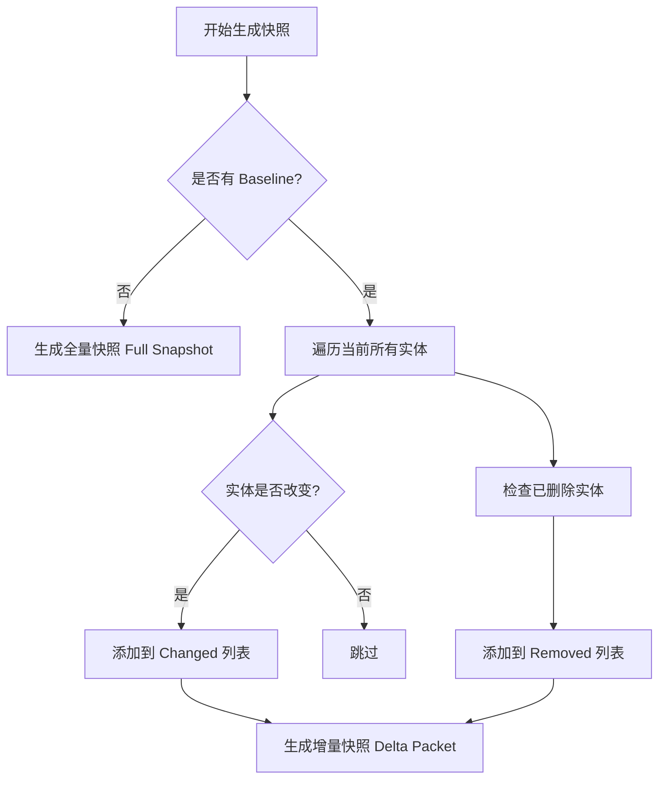
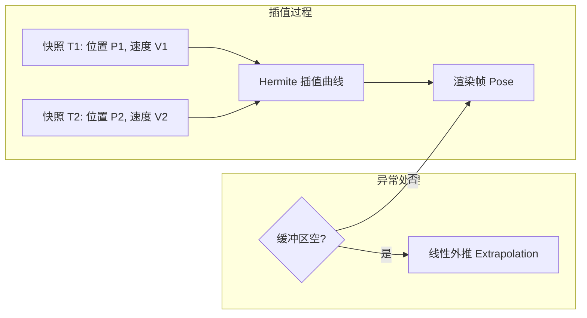

# 状态同步与协议定义

## 目录
1. [模块概览](#模块概览)
2. [网络架构与核心设计](#网络架构与核心设计)
   - [权威主机模型 (Authoritative Host)](#权威主机模型-authoritative-host)
   - [同步频率与时钟同步](#同步频率与时钟同步)
3. [二进制协议定义 (protocol.ts)](#二进制协议定义-protocolts)
   - [消息信封结构 (ProtocolEnvelope)](#消息信封结构-protocolenvelope)
   - [输入标准化与安全校验](#输入标准化与安全校验)
4. [快照系统逻辑 (snapshot.ts)](#快照系统逻辑-snapshotts)
   - [状态捕获与数据量化](#状态捕获与数据量化)
   - [增量更新与 Delta 压缩](#增量更新与-delta-压缩)
5. [二进制编解码与压缩 (snapshotWireCodec.ts)](#二进制编解码与压缩-snapshotwirecodects)
   - [浮点数压缩机制详解](#浮点数压缩机制详解)
   - [紧凑的 JSON-Array 格式](#紧凑的-json-array-格式)
6. [网络帧泵与输入节奏 (networkFramePump.ts)](#网络帧泵与输入节奏-networkframepumpts)
   - [客户端泵循环 (Pump Loop)](#客户端泵循环-pump-loop)
   - [输入节奏控制 (Input Cadence)](#输入节奏控制-input-cadence)
7. [平滑同步与抖动处理](#平滑同步与抖动处理)
   - [抖动缓冲区 (Jitter Buffer)](#抖动缓冲区-jitter-buffer)
   - [高级插值算法 (Hermite Interpolation)](#高级插值算法-hermite-interpolation)
8. [客户端预测与纠错 (Local Prediction)](#客户端预测与纠错-local-prediction)
   - [输入重放与状态对齐](#输入重放与状态对齐)
   - [视觉误差平滑衰减](#视觉误差平滑衰减)
9. [异常网络仿真 (Adverse Network)](#异常网络仿真-adverse-network)
10. [核心组件列表](#核心组件列表)
11. [文件参考](#文件参考)

## 模块概览

`src/net` 模块是 Claude-of-Tanks 的核心通信枢纽，负责处理多人游戏中的状态同步、输入传输以及网络抖动消除。该模块采用了高度优化的**权威主机 (Authoritative Host)** 架构，通过一系列复杂的同步技术（如增量更新、数据量化、客户端预测和 Hermite 插值），确保在延迟高达 200ms 以上或伴随丢包的恶劣网络环境下，依然能提供精确且流畅的坦克对战体验。

**模块统计与范围**：
- **文件总数**：约 44 个 TypeScript 源文件。
- **核心逻辑覆盖**：
  - **协议层**：定义了跨平台的通信协议原语，确保不同环境下的数据一致性。
  - **序列化层**：通过紧凑的二进制编码技术，将游戏状态压缩至最小。
  - **同步层**：实现了基于快照的增量更新机制，大幅降低带宽需求。
  - **平滑层**：利用抖动缓冲区和高级数学插值，消除网络波动带来的视觉卡顿。
  - **预测层**：为本地玩家提供零延迟的操作反馈，同时保持服务器的绝对权威。

本页面将深入解析该模块的设计哲学和实现细节，涵盖从底层的位操作到高层的仿真对齐算法。

## 网络架构与核心设计

Claude-of-Tanks 的网络层设计遵循“仿真驱动通信”的原则。系统并不直接同步视觉对象，而是同步仿真引擎的状态快照。

### 权威主机模型 (Authoritative Host)

在多人对战中，系统指定一个客户端（或专用服务器）作为权威主机。所有关键的物理仿真、碰撞检测、伤害判定和得分逻辑均在主机上运行。非权威客户端（即普通玩家）的职责被精简为：
1. **输入采集**：实时采集玩家的按键和鼠标操作。
2. **状态接收**：被动接收主机广播的状态快照。
3. **本地预测**：为了消除网络往返时间（RTT）带来的延迟感，客户端会根据本地输入预先模拟坦克的移动。
4. **视觉合成**：对接收到的远程坦克数据进行插值，生成平滑的移动轨迹。

### 同步频率与时钟同步

为了在带宽占用和同步精度之间取得平衡，系统采用了双频率模型：
- **逻辑仿真频率 (`MATCH_TICK_HZ = 60`)**：物理引擎和游戏逻辑以 60Hz 运行，确保操作的灵敏度和碰撞的准确性。
- **状态同步频率 (`SNAPSHOT_HZ = 20`)**：主机每秒仅发送 20 个状态快照。这意味着每 50ms 发送一次更新，涵盖了过去 3 个逻辑帧的状态。

这种设计要求客户端必须能够处理快照之间的空隙，通过插值算法补全丢失的视觉帧。



**架构设计来源**:
- [protocol.ts:L9-L11](src/net/protocol.ts#L9-L11)
- [networkFramePump.ts:L150-L195](src/net/networkFramePump.ts#L150-L195)

## 二进制协议定义 (protocol.ts)

`protocol.ts` 定义了网络通信的最小原子单位——**信封 (Envelope)**。所有业务数据（如聊天、输入、快照）都必须包装在信封中。

### 消息信封结构 (ProtocolEnvelope)

每个 `ProtocolEnvelope` 包含以下核心元数据：
- `v`: 协议版本号（当前为 9）。如果客户端与主机版本不匹配，连接将被拒绝。
- `type`: 消息类型，使用字符串枚举（如 `input`, `snapshot`, `event`, `ping`）。
- `seq`: 严格递增的序列号，用于检测丢包和乱序。
- `ack`: 确认号，告知对方本地已收到的对方最新序列号。
- `tick`: 关联的游戏逻辑帧号，是所有时钟同步的基础。

```typescript
export interface ProtocolEnvelope<TPayload = unknown> {
  v: typeof PROTOCOL_VERSION;
  type: MessageType;
  seq: number;
  ack: number;
  tick: number;
  payload: TPayload | null;
}
```

### 输入标准化与安全校验

由于客户端环境不可控，主机在接收到输入后会通过 `normalizePlayerInput` 进行严格的合法性校验：
- **范围限制**：油门 (`throttle`) 和转向 (`steer`) 被强制钳制在 `[-1, 1]` 之间。
- **位操作**：玩家的离散动作（如修理、急救）被编码为 `actionBits`（16 位整数），通过位掩码进行高效传输。
- **极坐标瞄准**：为了防止客户端发送非法的世界坐标，瞄准信息被编码为相对于坦克的极坐标：`aimYaw`（偏航角）、`aimPitch`（俯仰角）和 `aimDistance`（距离）。主机根据这些参数在权威端还原出 3D 瞄准点。

**Section sources**:
- [protocol.ts:L49-L56](src/net/protocol.ts#L49-L56)
- [protocol.ts:L237-L276](src/net/protocol.ts#L237-L276)
- [aimIntent.ts:L33-L59](src/net/aimIntent.ts#L33-L59)

## 快照系统逻辑 (snapshot.ts)

快照系统负责将动态的游戏世界状态转化为可传输的二进制流。

### 状态捕获与数据量化

在主机端，`captureWorldSnapshot` 负责每 50ms 遍历一次所有活跃实体。为了极致压缩带宽，系统使用了**定点数量化 (Quantization)** 技术：
- **位置坐标**：乘以 `POSITION_SCALE = 100`，将米转换为厘米，以整数形式存储。
- **速度分量**：乘以 `VELOCITY_SCALE = 100`。
- **旋转角度**：使用 `ANGLE_SCALE = 32767 / Math.PI`，将弧度映射到 `[-32767, 32767]` 的 16 位有符号整数范围。

这种量化方式在保持足够精度的前提下（厘米级位置精度，0.005 度角度精度），极大地减小了浮点数的存储空间。

### 增量更新与 Delta 压缩

发送全量快照是非常昂贵的。`createSnapshotDelta` 实现了一种基于确认机制的增量压缩：
1. **基准对比**：主机会记住每个客户端已确认收到的最新快照（`baseline`）。
2. **差异提取**：对比当前状态与基准状态。只有当实体的坐标、血量或标志位发生变化时，才会将其包含在增量包中。
3. **显式删除**：如果某个实体在基准快照中存在但在当前不存在，则仅发送其 ID 到 `removedEntityIds` 列表中。



**Section sources**:
- [snapshot.ts:L238-L268](src/net/snapshot.ts#L238-L268)
- [snapshot.ts:L424-L455](src/net/snapshot.ts#L424-L455)

## 二进制编解码与压缩 (snapshotWireCodec.ts)

`snapshotWireCodec.ts` 是协议的物理层实现，它决定了数据如何在网络网线上排列。

### 浮点数压缩机制详解

除了在 `snapshot.ts` 中进行的量化外，编解码器还处理了特殊的浮点数压缩。在 `snapshotWireCodec` 中，量化后的整数被放入一个紧凑的数组中。
- **位打包 (Bit Packing)**：标志位（如是否着火、是否开火、是否被发现）被合并到一个 `flags` 整数中。
- **零值省略**：在 `unpackRows` 时，如果某个字段为 `null` 或默认值，编解码器会利用 JS 对象的稀疏性来减少内存占用。

### 紧凑的 JSON-Array 格式

为了兼顾性能和跨平台兼容性，系统使用了一种“无 Key 数组”的 JSON 格式。传统的 JSON 如下：
`{"id": "tank1", "x": 100, "y": 200}`
而 `snapshotWireCodec` 将其转换为：
`["tank1", 100, 200]`
通过这种方式，去除了所有重复的字段名字符串。最终，这个数组被 `JSON.stringify` 序列化并转换为二进制 `Uint8Array` 发送。在 WebRTC 环境下，这种格式的开销极低。

**Section sources**:
- [snapshotWireCodec.ts:L61-L98](src/net/snapshotWireCodec.ts#L61-L98)
- [snapshotWireCodec.ts:L214-L241](src/net/snapshotWireCodec.ts#L214-L241)

## 网络帧泵与输入节奏 (networkFramePump.ts)

`networkFramePump` 是客户端的“心脏”，它驱动着整个网络同步循环。

### 客户端泵循环 (Pump Loop)

在浏览器的每一帧渲染（通常是 60Hz 或 120Hz）中，`pump` 方法会被调用。它执行以下关键任务：
1. **输入采样**：调用 `inputRuntime.frame()` 获取当前玩家的摇杆或键盘状态。
2. **节奏评估**：通过 `NetworkInputCadence` 判断当前输入是否值得发送。
3. **快照应用**：从网络通道提取最新快照，并将其交给 `bridge.apply()` 进行渲染。
4. **诊断更新**：实时计算当前的延迟、抖动和预测误差，供 UI 显示。

### 输入节奏控制 (Input Cadence)

`NetworkInputCadence` 是一个智能过滤器。它确保：
- **关键动作立即发送**：如开火、使用急救包等动作会无延迟发出。
- **微小模拟变动合并**：如果玩家只是轻微晃动摇杆，系统会将其合并，直到达到 `sendHz`（默认 60Hz）的频率限制，或者模拟量变化超过 `analogEdgeThreshold`。
这种机制有效地平衡了操作响应速度和上行带宽压力。

**Section sources**:
- [networkFramePump.ts:L150-L195](src/net/networkFramePump.ts#L150-L195)
- [inputCadence.ts:L23-L69](src/net/inputCadence.ts#L23-L69)

## 平滑同步与抖动处理

由于互联网的不可预测性，数据包往往不会匀速到达。

### 抖动缓冲区 (Jitter Buffer)

`SnapshotBuffer` 维护了一个有序的快照队列。它引入了一个 **插值延迟 (Interpolation Delay)**（通常为 100ms）。客户端渲染的不是“现在”的状态，而是“100ms 之前”的状态。
- **自适应延迟**：如果网络抖动（Jitter）增加，缓冲区会自动增加延迟时间，以确保有足够的快照用于插值。
- **攻击与释放**：延迟的增加是迅速的（为了应对突发拥塞），而减少是缓慢的（为了保持画面稳定）。

### 高级插值算法 (Hermite Interpolation)

在两个快照之间，系统使用 **Hermite 插值** 来计算位置。与简单的线性插值不同，Hermite 插值考虑了实体的速度矢量，使得运动轨迹更加圆滑。
- **Monotone Hermite**：对于地面移动的坦克，系统使用单调 Hermite 插值。这防止了在物理引擎的起伏地形上，坦克因为插值超调而“钻入地下”或“悬浮”的现象。



**Section sources**:
- [snapshot.ts:L571-L614](src/net/snapshot.ts#L571-L614)
- [snapshot.ts:L785-L855](src/net/snapshot.ts#L785-L855)

## 客户端预测与纠错 (Local Prediction)

这是多人游戏中最复杂的部分，旨在为本地玩家提供“零延迟”体验。

### 输入重放与状态对齐

当本地玩家操作坦克时，`LocalTankPredictor` 会立即在本地运行物理仿真。
1. **历史记录**：所有发出的输入连同时间戳被存入 `history` 队列。
2. **权威对齐**：当主机的权威快照到达时，它可能对应的是 100ms 前的状态。
3. **状态回滚**：预测器将本地坦克回滚到服务器快照的位置。
4. **快速重放 (Replay)**：将 `history` 队列中所有在快照时间点之后的输入，在极短时间内重新模拟一遍。
5. **最终定位**：重放后的结果即为当前时刻的权威预测位置。

### 视觉误差平滑衰减

如果服务器的权威位置与本地预测位置存在微小偏差（例如因为碰撞冲突），系统不会让坦克瞬间跳变。`decayPredictionCorrection` 会计算出一个“误差偏移量”，并在接下来的几帧内，通过指数衰减算法将其逐渐归零。玩家只会看到坦克轨迹的轻微修正，而不会感到突兀的闪现。

**Section sources**:
- [localTankPrediction.ts:L323-L423](src/net/localTankPrediction.ts#L323-L423)
- [predictionCorrection.ts:L27-L68](src/net/predictionCorrection.ts#L27-L68)

## 异常网络仿真 (Adverse Network)

为了保证代码质量，`adverseNetworkTransport.ts` 提供了一套强大的仿真工具。在开发环境下，可以通过 URL 参数（如 `?netLatency=200&netLoss=5`）开启仿真：
- **随机丢包**：模拟 Wi-Fi 干扰导致的包丢失。
- **乱序到达**：测试协议对 `seq` 序列号处理的健壮性。
- **带宽受限**：模拟移动网络下的拥塞。

这套工具使得开发者在本地就能复现并修复复杂的网络同步问题。

**Section sources**:
- [adverseNetworkTransport.ts:L99-L257](src/net/adverseNetworkTransport.ts#L99-L257)

## 核心组件列表

| 组件名称 | 职责描述 | 核心方法 |
| :--- | :--- | :--- |
| `SnapshotAssembler` | 负责处理增量更新，将 Delta 包还原为 Full 快照。 | `accept(packet)` |
| `SnapshotBuffer` | 管理抖动缓冲区，执行 Hermite 插值和外推逻辑。 | `sample(renderTime)` |
| `LocalTankPredictor` | 本地预测引擎，负责输入重放和权威状态对齐。 | `reconcile(snapshot)` |
| `NetworkFramePump` | 客户端主循环调度器，协调输入采样与状态应用。 | `pump(dt, nowMs)` |
| `SnapshotWireCodec` | 二进制编解码器，实现 JSON-Array 压缩协议。 | `encode()`, `decode()` |
| `NetworkInputCadence` | 输入发送节奏控制器，过滤冗余的模拟量变化。 | `shouldSend(input)` |

## 文件参考

本章节涉及的核心源文件如下：

- [src/net/protocol.ts](src/net/protocol.ts): 协议版本、消息类型枚举及基础信封结构定义。
- [src/net/snapshot.ts](src/net/snapshot.ts): 快照捕获逻辑、数据量化算法及增量生成机制。
- [src/net/snapshotWireCodec.ts](src/net/snapshotWireCodec.ts): 紧凑型二进制编解码器的具体实现。
- [src/net/networkFramePump.ts](src/net/networkFramePump.ts): 客户端每帧网络同步逻辑的入口调度器。
- [src/net/aimIntent.ts](src/net/aimIntent.ts): 瞄准意图的极坐标编码与解码工具。
- [src/net/localTankPrediction.ts](src/net/localTankPrediction.ts): 本地预测、输入重放与权威同步的核心引擎。
- [src/net/predictionCorrection.ts](src/net/predictionCorrection.ts): 预测误差的平滑衰减与视觉修正算法。
- [src/net/inputCadence.ts](src/net/inputCadence.ts): 客户端输入发送节奏控制与灵敏度过滤。
- [src/net/adverseNetworkTransport.ts](src/net/adverseNetworkTransport.ts): 用于测试的异常网络环境仿真层。
- [src/net/webrtcPeer.ts](src/net/webrtcPeer.ts): 基于 WebRTC DataChannel 的底层点对点传输实现。
