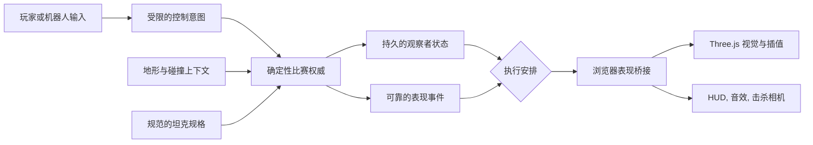
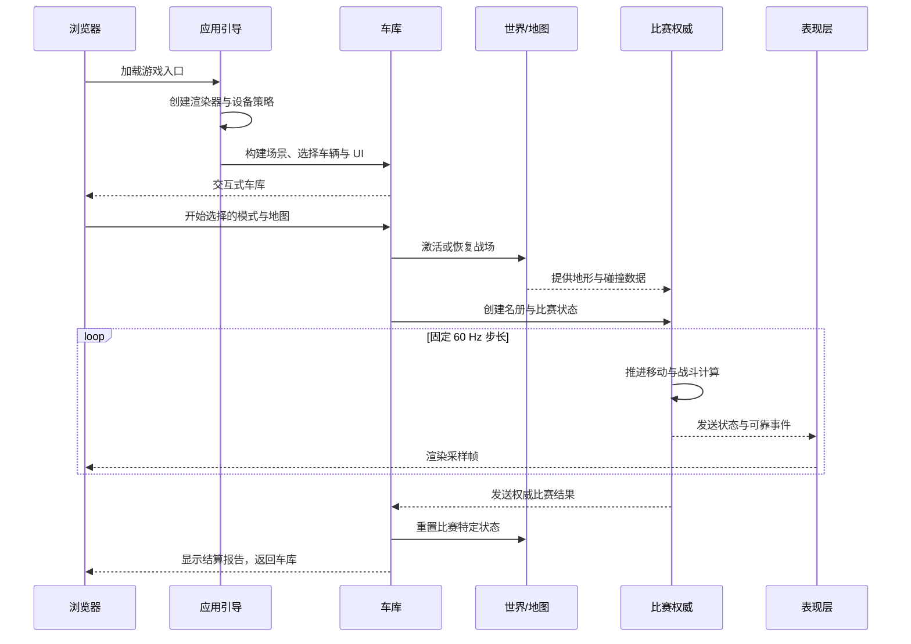
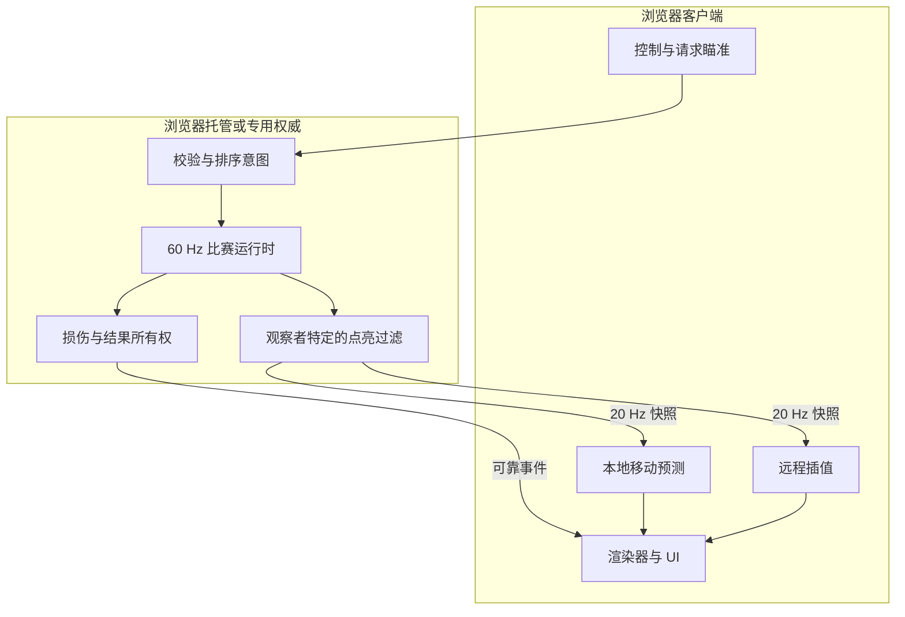
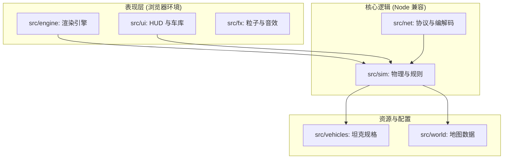

# 项目概览与快速入门

## 目录
1. [模块概览](#模块概览)
2. [项目愿景与核心理念](#项目愿景与核心理念)
   - [愿景目标](#愿景目标)
   - [核心原则](#核心原则)
3. [核心特性对比](#核心特性对比)
4. [技术架构概览](#技术架构概览)
   - [顶层数据流](#顶层数据流)
   - [运行时生命周期](#运行时生命周期)
5. [核心组件分析](#核心组件分析)
   - [确定性仿真引擎 (src/sim)](#确定性仿真引擎-srcsim)
   - [程序化坦克管线 (src/vehicles)](#程序化坦克管线-srcvehicles)
   - [混合联网模式 (src/net & server)](#混合联网模式-srcnet--server)
6. [多人游戏与联网架构](#多人游戏与联网架构)
7. [快速入门指南](#快速入门指南)
   - [环境要求](#环境要求)
   - [安装与启动](#安装与启动)
   - [构建流程](#构建流程)
8. [开发与验证流程](#开发与验证流程)
9. [文件参考列表](#文件参考列表)

## 模块概览

在深入探讨 Claude of Tanks 的技术细节之前，首先对项目的整体规模和结构进行宏观评估。本项目是一个复杂的浏览器原生装甲战斗模拟器，其代码库规模较大且结构严谨。

根据对工作空间的初步扫描，本项目主要包含以下核心区域：
- **源代码 (src/)**: 包含超过 250 个 TypeScript 文件，涵盖了从底层物理仿真到上层 UI 渲染的所有逻辑。
- **服务端 (server/)**: 包含 9 个核心 TypeScript 文件，负责信令交换、房间管理和排位赛匹配。
- **文档 (docs/)**: 拥有丰富的技术文档体系，包含 30 多个 Markdown 文件，详细记录了架构设计、性能优化和开发标准。
- **资源 (public/)**: 包含大量的音频、贴图、模型元数据和预渲染的媒体文件。

本章节作为 Wiki 的入口，将重点介绍项目的宏观架构、核心特性以及开发者的快速启动流程。我们将深入探讨 `src/sim`、`src/net` 和 `src/engine` 等关键模块的作用，并为后续章节的详细分析奠定基础。

## 项目愿景与核心理念

Claude of Tanks (CoT) 不仅仅是一个简单的网页游戏，它是一个高性能、浏览器原生的装甲战斗模拟器。其核心目标是在无需安装任何插件或原生客户端的情况下，在浏览器中提供接近 3A 级游戏的物理精度和视觉表现。

### 愿景目标

项目的核心愿景是建立一个**高性能浏览器原生装甲战斗模拟器**。这意味着所有的物理计算、碰撞检测、装甲解算和渲染逻辑都必须直接运行在 Web 标准之上（WebGL 2, WebRTC, WebSockets）。开发者致力于打破“网页游戏性能低下”的固有印象，通过极致的优化和严谨的工程实践，实现 120 FPS 的流畅渲染和 60 Hz 的高精度仿真。

### 核心原则

在实现这一愿景的过程中，项目遵循了几个关键的架构原则：

1.  **确定性权威 (Deterministic Authority)**：所有的移动、瞄准、弹道和损伤计算都以固定的 60 Hz 步长进行。模拟逻辑不依赖于系统时钟或不确定的随机函数，确保了在不同客户端和服务端之间的一致性。
2.  **渲染与逻辑分离 (Renderer-free Rules)**：核心仿真逻辑（位于 `src/sim/`）是 DOM 无关的，可以在 Node.js 环境中独立运行。这使得服务端可以运行与客户端完全一致的物理规则，实现真正的权威服务器架构。
3.  **信息隐藏 (Hidden Information)**：为了防止作弊，系统在权威端进行点亮（Spotting）过滤。只有被点亮的敌方单位坐标才会被发送给客户端，从根本上杜绝了通过修改前端代码实现的“全图挂”。
4.  **质量策略化妆化 (Cosmetic Quality Policy)**：设备的性能差异只会影响渲染质量（如阴影分辨率、粒子效果、抗锯齿等），而绝不会改变战斗步长、装甲分辨率或任何影响公平性的游戏规则。

**Section sources**:
- [README.md](README.md)
- [docs/TECHNICAL-OVERVIEW.md](docs/TECHNICAL-OVERVIEW.md)

## 核心特性对比

Claude of Tanks 在多个维度上实现了技术突破，以下是其核心特性与传统 Web 游戏的对比：

| 特性 | Claude of Tanks 实现方式 | 传统 Web 游戏常见做法 |
| :--- | :--- | :--- |
| **物理仿真** | 60 Hz 固定步长确定性仿真，支持履带物理与悬挂补偿 | 依赖浏览器 requestAnimationFrame，缺乏物理一致性 |
| **装甲解算** | 板块级装甲解算，考虑入射角、跳弹、转正及复合装甲 | 简单的血量扣减或整体防御数值 |
| **坦克生成** | 126+ 第一方程序化生成车辆，支持实时解剖与模块查看 | 使用预制的低精度 GLB/OBJ 模型 |
| **网络模式** | 支持 WebRTC P2P (LAN/私有房间) 与 WebSocket 权威服务器 (排位) | 简单的 WebSocket 状态同步，易受延迟和作弊影响 |
| **渲染引擎** | 原生 Three.js 深度定制，支持 4 级级联阴影、SMAA/FSR 适配 | 使用成熟引擎的 Web 导出版本，性能开销大 |
| **开发工具** | 内置 Scene Studio (场景工作室) 与 Tank Gallery (坦克陈列馆) | 依赖外部 DCC 工具（如 Blender）进行场景搭建 |

通过这些特性，Claude of Tanks 在浏览器端实现了极高的仿真深度，为玩家提供了真实的现代装甲作战体验。

**Section sources**:
- [docs/FEATURES.md](docs/FEATURES.md)
- [README.md](README.md)

## 技术架构概览

Claude of Tanks 的架构设计高度模块化，确保了系统的可扩展性和高性能。

### 顶层数据流

系统的数据流遵循“控制 -> 权威 -> 状态/事件 -> 表现”的线性逻辑。这种设计确保了逻辑的严密性和可调试性。

下面的流程图展示了从玩家输入到最终画面呈现的完整路径：



**图表解析**：
该流程图揭示了 Claude of Tanks 的核心运作机制。流程始于玩家的输入（键盘、鼠标或触摸），这些输入被转化为“意图”（Intent）。权威端（可能是本地浏览器，也可能是远程服务器）根据当前的地形、碰撞数据和坦克规格，在 60 Hz 的固定步长下计算出下一帧的状态。计算结果分为“持久状态”（如坦克位置、血量）和“可靠事件”（如开火、爆炸）。这些数据通过不同的交付方式（Solo、P2P 或 Server）传递给表现层，最终由 Three.js 渲染出平滑的画面。这种架构确保了即使在网络抖动的情况下，物理仿真依然是连续且一致的。

### 运行时生命周期

了解游戏的生命周期对于开发者调试和扩展功能至关重要。游戏从启动到结束经历了一系列严格定义的阶段。



**图表解析**：
此序列图详细描述了从应用启动到单次比赛结束的完整生命周期。在引导阶段，系统会探测用户的硬件环境并制定相应的渲染策略。进入车库后，用户可以浏览和选择坦克。一旦开始战斗，系统会激活对应的地图资源并初始化权威计算环境。在战斗循环中，权威逻辑以 60 Hz 运行，而表现层则根据权威状态进行插值渲染。战斗结束后，系统会清理战场状态并生成详尽的结算报告。特别值得注意的是，车库和战斗场景之间的状态切换是高度优化的，确保了流畅的用户体验。

**Section sources**:
- [docs/TECHNICAL-OVERVIEW.md](docs/TECHNICAL-OVERVIEW.md)
- [src/engine/bootLifecycle.ts](src/engine/bootLifecycle.ts)

## 核心组件分析

Claude of Tanks 的强大功能归功于其精心设计的核心组件。

### 确定性仿真引擎 (src/sim)

仿真引擎是游戏的心脏，它负责处理所有与物理和规则相关的计算。
- **移动系统 (`movement.ts`)**：处理引擎动力、转向、刹车、坡度响应和地形阻力。它不依赖于 Three.js 的物理引擎，而是使用了专门为坦克设计的运动学求解器。
- **弹道与装甲 (`ballistics.ts`, `armor.ts`)**：实现了极高精度的射击模拟。每一发炮弹都有真实的初速、受重力影响的轨迹以及随距离衰减的穿深。装甲解算则会考虑复杂的几何关系，包括间隙装甲和爆炸反应装甲（ERA）。
- **点亮系统 (`spotting.ts`)**：模拟了战场的视野与隐蔽机制，包括草丛的隐蔽加成、开火后的隐蔽惩罚以及无线电通讯的视野共享。

### 程序化坦克管线 (src/vehicles)

本项目的一大特色是完全抛弃了传统的 GLB 模型，转而使用程序化生成的坦克。
- **规格定义 (`specs.ts`)**：定义了坦克的各种参数，如马力、重量、装甲分布、炮弹类型等。
- **工厂模式 (`tankFactory.ts`)**：根据规格元数据，动态组装坦克的几何体、材质、悬挂系统和内部模块。这种方式极大地减少了资源体积，并允许实时修改坦克的任何物理细节。
- **解剖结构 (`combatAnatomy.ts`)**：定义了坦克内部的乘员、弹药架、发动机等模块的位置和体积，用于精确的损伤模拟。

### 混合联网模式 (src/net & server)

为了适应不同的使用场景，CoT 提供了多种联网方案：
- **WebRTC P2P**：用于私有房间和局域网对战。通过 `webrtcPeer.ts` 实现低延迟的数据交换，其中控制指令通过可靠通道发送，而位置更新则通过不可靠通道以减少延迟。
- **WebSocket 权威服务器**：用于排位赛。`signalingServer.ts` 负责信令交换，而 `dedicatedMatchServer.ts` 则运行完整的仿真逻辑，确保比赛的公平性。
- **本地预测与补偿 (`localTankPrediction.ts`)**：在网络环境下，客户端会先行预测坦克的移动，并在收到服务器更新后进行平滑的纠偏（Reconciliation），从而提供无延迟的操作感。

**Section sources**:
- [src/sim/authoritativeMatch.ts](src/sim/authoritativeMatch.ts)
- [src/vehicles/tankFactory.ts](src/vehicles/tankFactory.ts)
- [src/net/protocol.ts](src/net/protocol.ts)
- [server/signalingServer.ts](server/signalingServer.ts)

## 多人游戏与联网架构

Claude of Tanks 的多人游戏架构旨在平衡低延迟的操作反馈与严格的权威校验。



**图表解析**：
该架构图展示了典型的“客户端预测 + 服务器权威”模式。客户端负责捕获玩家输入并立即进行本地移动预测，以消除视觉上的延迟感。同时，输入意图被发送到权威端（Authority）。权威端在 60 Hz 的频率下运行模拟，并根据点亮规则过滤每个玩家可见的信息。过滤后的快照以 20 Hz 的频率发回客户端，用于纠正预测误差和插值渲染其他玩家。这种设计既保证了响应速度，又通过点亮过滤机制有效地防止了作弊。

此外，系统的模块依赖关系也体现了逻辑与表现的解耦：



**图表解析**：
这个依赖图强调了 `src/sim` 模块的核心地位。它作为整个系统的物理和规则中心，被表现层（渲染引擎、UI 等）所消费，但自身并不依赖于任何浏览器特有的 API。这种“逻辑上游”的设计使得同一套代码可以无缝运行在浏览器客户端和 Node.js 服务端。资源模块（Vehicles 和 World）为仿真引擎提供必要的静态数据，而网络核心模块则负责在不同权威实例之间同步这些逻辑状态。

**Section sources**:
- [docs/MULTIPLAYER-ARCHITECTURE.md](docs/MULTIPLAYER-ARCHITECTURE.md)
- [docs/TECHNICAL-OVERVIEW.md](docs/TECHNICAL-OVERVIEW.md)

## 快速入门指南

本节将引导开发者如何在本地环境搭建并运行 Claude of Tanks。

### 环境要求

在开始之前，请确保您的开发环境满足以下条件：
- **Node.js**: 建议使用最新的 LTS 版本。
- **npm**: 用于管理依赖和运行脚本。
- **现代浏览器**: 支持 WebGL 2 和 WebRTC（如 Chrome, Edge, Firefox）。
- **硬件**: 建议拥有独立显卡以获得最佳的渲染体验（120 FPS 测试路径是在主流独立显卡上认证的）。

### 安装与启动

1.  **克隆仓库并安装依赖**：
    ```bash
    git clone <repository-url>
    cd Claude-of-Tanks
    npm install
    ```

2.  **启动开发服务器**：
    ```bash
    npx vite
    ```
    启动后，您可以在浏览器中访问 `http://localhost:5173`。默认情况下，这会启动单机模式，您可以直接进入车库并开始与 AI 坦克的对战。

3.  **启动联网服务 (可选)**：
    如果您需要测试多人对战功能，需要启动信令服务器和匹配服务器：
    ```bash
    # 启动信令服务器 (默认端口 7777)
    npm run server:signal

    # 启动匹配服务器 (默认端口 8790)
    npm run server:match
    ```

### 构建流程

项目使用 Vite 进行构建，支持多种构建目标：
- **公共构建 (`npm run build`)**：生成用于部署的生产环境包。该流程会自动剔除受版权保护的参考资源（Quarantined assets），确保发布内容的合规性。
- **私有构建 (`npm run build:private`)**：保留所有内部开发工具和参考资源，适用于团队内部测试。

**Section sources**:
- [package.json](package.json)
- [docs/DEVELOPMENT.md](docs/DEVELOPMENT.md)

## 开发与验证流程

Claude of Tanks 拥有一套极其严谨的自动化验证体系，任何核心代码的修改都必须通过相应的“门控”检查。

以下是开发者常用的验证矩阵：

| 变更区域 | 必须运行的检查 |
| :--- | :--- |
| **物理或规则修改** | `npm test` (运行所有 Node.js 自测脚本) |
| **网络协议更新** | `npm run test:net:browser` (启动 Puppeteer 进行双端 WebRTC 模拟测试) |
| **坦克几何体修改** | `npm run tank:assets:check` (验证生成的贴图和指纹是否匹配) |
| **性能优化** | `npm run perf:cold` (测试冷启动加载耗时) |
| **全量验证** | `npm run typecheck` (严格的 TypeScript 类型检查) |

建议开发者在提交代码前，至少运行 `npm test` 和 `npm run typecheck` 以确保没有破坏现有的仿真逻辑和类型安全。此外，对于涉及视觉表现的更改，建议在不同设备（特别是移动端）上进行手动验证，以确保 UI 布局和渲染性能的兼容性。

**Section sources**:
- [docs/DEVELOPMENT.md](docs/DEVELOPMENT.md)
- [package.json](package.json)

## 文件参考列表

以下是本项目中最重要的核心文件，建议开发者优先阅读：

- **项目入口**:
  - [README.md](README.md): 项目总览与愿景。
  - [package.json](package.json): 依赖管理与常用脚本指令。
  - [index.html](index.html): 浏览器端的主入口文件。

- **核心架构文档**:
  - [docs/TECHNICAL-OVERVIEW.md](docs/TECHNICAL-OVERVIEW.md): 详细的系统架构说明。
  - [docs/FEATURES.md](docs/FEATURES.md): 核心特性与技术实现细节。
  - [docs/DEVELOPMENT.md](docs/DEVELOPMENT.md): 开发环境配置与验证流程。

- **关键源代码**:
  - [src/main.ts](src/main.ts): 客户端应用的引导与组合根。
  - [src/sim/authoritativeMatch.ts](src/sim/authoritativeMatch.ts): 确定性比赛逻辑的核心容器。
  - [src/net/protocol.ts](src/net/protocol.ts): 网络通讯协议定义。
  - [src/vehicles/tankFactory.ts](src/vehicles/tankFactory.ts): 程序化坦克生成的工厂类。
  - [server/signalingServer.ts](server/signalingServer.ts): 信令服务器实现。

通过阅读这些文件，您将能够快速建立起对 Claude of Tanks 系统的全面认知。
